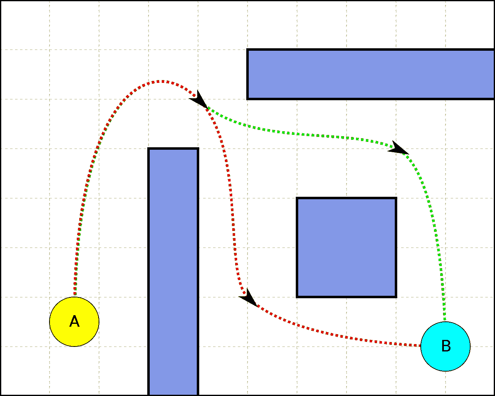
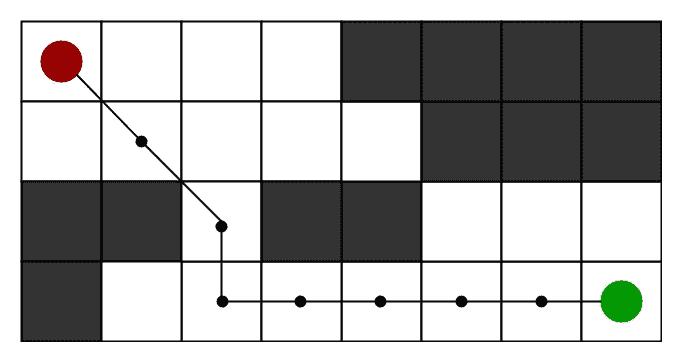
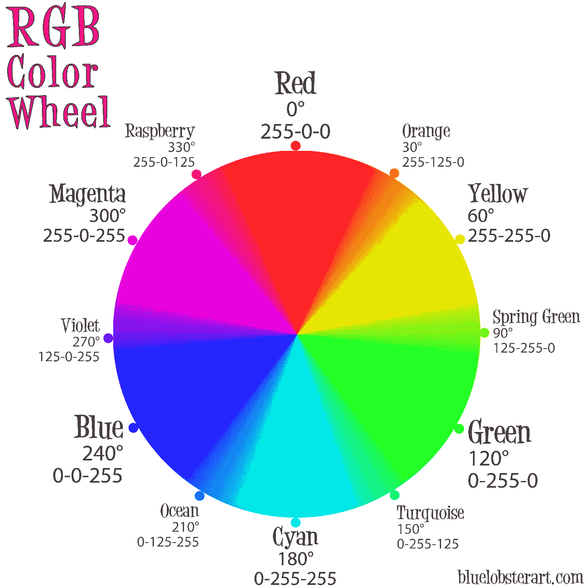
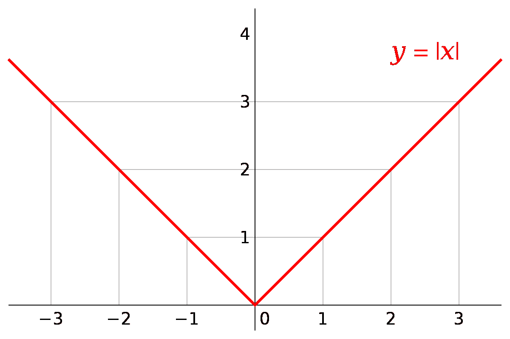
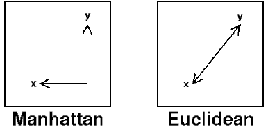

# *路径查找代码

> 原文：<https://medium.com/analytics-vidhya/a-path-finding-code-in-python-30a767353195?source=collection_archive---------2----------------------->

```
import pygame
import math
from queue import PriorityQueue

WIDTH = 800
WIN = pygame.display.set_mode((WIDTH, WIDTH))
pygame.display.set_caption("A* Pathfinding")

RED = (255,0,0)
GREEN = (0,255,0)
YELLOW = (255,255,0)
WHITE = (255, 255, 255)
BLACK = (0, 0, 0)
PURPLE = (128, 0, 128)
ORANGE = (255, 165, 0)
GREY = (128, 128, 128)
TURQUOISE = (64, 224, 208)

class Spot:
    def __init__(self, row, col, width, total_rows):
        self.row = row
        self.col = col
        self.x = row *width
        self.y = col * width
        self.colour =  WHITE
        self.neighbours = []
        self.width = width
        self.total_rows = total_rows

    def get_pos(self):
        return self.row, self.col

    def is_closed(self):
        return self.colour == RED

    def is_open(self):
        return self.colour ==GREEN

    def is_barrier(self):
        return self.colour == BLACK

    def is_start(self):
        return self.colour == ORANGE

    def is_end(self):
        return self.colour == TURQUOISE

    def reset(self):
        self.colour = WHITE

    def make_closed(self):
        self.colour = RED

    def make_open(self):
        self.colour = GREEN

    def make_barrier(self):
        self.colour = BLACK

    def make_end(self):
        self.colour = TURQUOISE

    def make_path(self):
        self.colour = PURPLE

    def draw(self, win):
        pygame.draw.rect(win, self.colour, (self.x, self.y, self.width, self.width))

    def update_neighbours(self, grid):
        self.neighbours = []
        if self.row < self.total_rows - 1 and not grid[self.row +1][self.col].is_barrier():  #DOWN
            self.neighbours.append(grid[self.row +1][self.col])

        if self.row > 0 and not grid[self.row - 1][self.col].is_barrier():   # UP
            self.neighbours.append(grid[self.row -1][self.col])

        if self.col < self.total_rows - 1 and not grid[self.row][self.col+ 1].is_barrier():  #RIGHT
            self.neighbours.append(grid[self.row ][self.col+1])

        if self.col > 0 and not grid[self.row][self.col - 1].is_barrier():  #RIGHT
            self.neighbours.append(grid[self.row][self.col - 1])

    def __lt__(self,other):
        return False

    def make_start(self):
        self.colour = ORANGE
def reconstruct_path(came_from, current, draw):
    while current in came_from:
        current = came_from[current]
        current.make_path()
        draw()
def h(p1, p2):
    x1, y1 = p1
    x2, y2 = p2
    return abs(x1-x2) + abs(y1-y2)

def algorithm(draw, grid, start, end):
    count = 0
    open_set = PriorityQueue()   # returns the smallest value in the list
    open_set.put((0, count, start))
    came_from = {}
    g_score = {spot: float("inf") for row in grid for spot in row}
    g_score[start] = 0
    f_score = {spot: float("inf") for row in grid for spot in row}
    f_score[start] = h(start.get_pos(), end.get_pos())

    open_set_hash = {start}
    while not open_set.empty():
        for event in pygame.event.get():
            if event.type ==pygame.QUIT:
                pygame.quit()
        current = open_set.get()[2]      # returns the best value
        open_set_hash.remove(current)
        if current == end:
            reconstruct_path(came_from, end, draw)
            end.make_end()
            start.make_start()
            return True

        for neighbour in current.neighbours:
            temp_g_score = g_score[current]+1

            if temp_g_score < g_score[neighbour]:
                came_from[neighbour] = current
                g_score[neighbour] = temp_g_score
                f_score[neighbour] = temp_g_score + h(neighbour.get_pos(), end.get_pos())
                if neighbour not in open_set_hash:
                    count += 1
                    open_set.put((f_score[neighbour], count, neighbour))
                    open_set_hash.add(neighbour)
                    neighbour.make_open()
        draw()
        if current != start:
            current.make_closed()

    return False

def make_grid(rows, width):
    grid = []
    gap = width // rows
    for i in range(rows):
        grid.append([])
        for j in range(rows):
            spot = Spot(i, j, gap, rows)
            grid[i].append(spot)

    return grid

def draw_grid(win, rows, width):
    gap = width //rows
    for i in range(rows):
        pygame.draw.line(win, GREY, (0, i*gap),(width, i*gap))
        for j in range(rows):
            pygame.draw.line(win, GREY, (j* gap, 0), (j* gap,width))

def draw(win, grid, rows, width):
    win.fill(WHITE)
    for row in grid:
        for spot in row:
            spot.draw(win)

    draw_grid(win, rows, width)
    pygame.display.update()

def get_clicked_pos(pos, rows, width):
    gap = width //rows
    y,x = pos

    row = y//gap
    col = x//gap
    return row, col

def main(win, width):
    ROWS = 50
    grid = make_grid(ROWS, width)
    start = None
    end = None
    run = True
    started = False
    while run:
        draw(win, grid, ROWS, width)
        for event in pygame.event.get():
            if event.type ==pygame.QUIT:
                run = False
            if started:
                continue
            if pygame.mouse.get_pressed()[0]:  # left mouse button
                pos = pygame.mouse.get_pos()
                row, col = get_clicked_pos(pos, ROWS, width)
                spot = grid[row][col]
                if not start and  spot != end:
                    start = spot
                    start.make_start()

                elif not end and spot != start:
                    end = spot
                    end.make_end()
                elif spot != end and spot != start:
                    spot.make_barrier()

            elif pygame.mouse.get_pressed()[2]:
                pos = pygame.mouse.get_pos()
                row, col = get_clicked_pos(pos, ROWS, width)
                spot = grid[row][col]
                spot.reset()
                if spot ==start:
                    start = None
                elif spot == end:
                    end = None

            if event.type == pygame.KEYDOWN:
                if event.key == pygame.K_SPACE and not started:
                    for row in grid:
                        for spot in row:
                            spot.update_neighbours(grid)
                    algorithm(lambda: draw(win, grid, ROWS, width), grid, start, end)   #having lambda lets you run the function inside the function

                if event.key == pygame.K_c:
                    start = None
                    end = None
                    grid = make_grid(ROWS, width)

    pygame.quit()

main(WIN, WIDTH)
```

在我解释这段代码之前，我承认这不是我的代码。这是从 youtube 上的一个视频中截取的，我跟着这个视频去理解寻路的概念和使时间有效的逻辑。我将在这里链接 youtube 视频:[https://www.youtube.com/watch?v=JtiK0DOeI4A](https://www.youtube.com/watch?v=JtiK0DOeI4A)如果你不明白我的任何解释，我强烈建议你查看视频，因为他对代码做了非常好的解释。

**启发式函数:**

这个程序的工作方式是通过使用一个叫做启发式函数的函数。简而言之，启发式函数:h(n)= f(n)+g(n)，其中 f(n)是路线所用的时间，h(n)是到终点的最近距离。每当我们在节点(你和最终目的地之间的点)之间有任何移动时，你将检查它的每个邻居的启发式函数，以检查哪个将具有最低的值，因此将是最快的选择。最低启发式函数是合乎逻辑的，因为它将最接近最终目的地的效率与时间效率相结合。



这是一个到同一个节点的 2 条路径的例子，如果我们作为一个算法来做，我们将在 2 条路径(红色和绿色)的每一条上有 2 个以上的节点，我们将计算启发式函数来决定哪条路径将是最快的



这是一个类似于我们的例子，每个方块代表一个节点，每个方块都是根据启发式函数来考虑的，但是正如你所看到的，这里的路径具有最低的启发式函数。

```
import pygame
import math
from queue import PriorityQueue

WIDTH = 800
WIN = pygame.display.set_mode((WIDTH, WIDTH))
pygame.display.set_caption("A* Pathfinding")

RED = (255,0,0)
GREEN = (0,255,0)
YELLOW = (255,255,0)
WHITE = (255, 255, 255)
BLACK = (0, 0, 0)
PURPLE = (128, 0, 128)
ORANGE = (255, 165, 0)
GREY = (128, 128, 128)
TURQUOISE = (64, 224, 208)
```

程序的开始将是建立网格。我们导入 pygame，因为这是显示程序可视化的地方。优先级队列是一个自动排序列表，当我们决定要移动到哪个节点时，这个列表非常重要。宽度决定了屏幕上的像素数量，WIN 创建了我们玩游戏的窗口。我们用两倍的宽度做一个正方形面板。我们将尺寸作为参数(width，width)传递，这意味着我们需要两对括号。设置标题功能将命名你创建的窗口(运行程序时看窗口的左上方)。

接下来的几行使用 RGB 颜色系统来创建程序中我们想要的颜色。它的格式为(R，G，B)。



一个简单的谷歌搜索会给你一个调色板选择，如果你输入颜色，它会返回它的 RGB 值在你的程序中使用

```
class Spot:
    def __init__(self, row, col, width, total_rows):
        self.row = row
        self.col = col
        self.x = row *width
        self.y = col * width
        self.colour =  WHITE
        self.neighbours = []
        self.width = width
        self.total_rows = total_rows

    def get_pos(self):
        return self.row, self.col

    def is_closed(self):
        return self.colour == RED

    def is_open(self):
        return self.colour ==GREEN

    def is_barrier(self):
        return self.colour == BLACK

    def is_start(self):
        return self.colour == ORANGE

    def is_end(self):
        return self.colour == TURQUOISE

    def reset(self):
        self.colour = WHITE

    def make_closed(self):
        self.colour = RED

    def make_open(self):
        self.colour = GREEN

    def make_barrier(self):
        self.colour = BLACK

    def make_end(self):
        self.colour = TURQUOISE

    def make_path(self):
        self.colour = PURPLE
```

下一个代码块利用了面向对象的编程，你可能已经从 Java 或类似的编码语言中学到了。最初，我们正在设置我称之为点的节点的主要属性。这些很重要，因为我们要实例化这些点来制作一个网格。实例化意味着在程序中创建它的一个实体。之后的所有方法都用来帮助我们识别它们是什么类型的节点(它们可以是开始块、结束块， 障碍或要移动到的自由点)并且当我们让算法创建路径时，拥有这些是很重要的，这样我们就可以理解我们当前所在的节点周围的对象(这样我们就不会移动到当然不允许的障碍上)之后只有一个“=”的方法用于改变节点的类型(这允许我们在运行代码之前定制过程。 例如，如果我们在一个节点上运行 make_open()，它会将该节点变成绿色。同样的概念适用于所有带有一个“=”的方法。当你使用' == '时，它变成了一个比较语句，所以它将比较两个输入，如果相同则返回 True，否则返回 False。

```
def draw(self, win):
        pygame.draw.rect(win, self.colour, (self.x, self.y, self.width, self.width))

    def update_neighbours(self, grid):
        self.neighbours = []
        if self.row < self.total_rows - 1 and not grid[self.row +1][self.col].is_barrier():  #DOWN
            self.neighbours.append(grid[self.row +1][self.col])

        if self.row > 0 and not grid[self.row - 1][self.col].is_barrier():   # UP
            self.neighbours.append(grid[self.row -1][self.col])

        if self.col < self.total_rows - 1 and not grid[self.row][self.col+ 1].is_barrier():  #RIGHT
            self.neighbours.append(grid[self.row ][self.col+1])

        if self.col > 0 and not grid[self.row][self.col - 1].is_barrier():  #RIGHT
            self.neighbours.append(grid[self.row][self.col - 1])

    def __lt__(self,other):
        return False

    def make_start(self):
        self.colour = ORANGE
def reconstruct_path(came_from, current, draw):
    while current in came_from:
        current = came_from[current]
        current.make_path()
        draw()
```

这些方法有点复杂，涉及到绘图背后的逻辑。

```
def draw(self, win):
        pygame.draw.rect(win, self.colour, (self.x, self.y, self.width, self.width))
```

这一行只是告诉 pygame 在我们指定的点绘制一个矩形。如果我们把最后的路径画回到起点，这是很有用的。

```
def update_neighbours(self, grid):
        self.neighbours = []
        if self.row < self.total_rows - 1 and not grid[self.row +1][self.col].is_barrier():  #DOWN
            self.neighbours.append(grid[self.row +1][self.col])

        if self.row > 0 and not grid[self.row - 1][self.col].is_barrier():   # UP
            self.neighbours.append(grid[self.row -1][self.col])

        if self.col < self.total_rows - 1 and not grid[self.row][self.col+ 1].is_barrier():  #RIGHT
            self.neighbours.append(grid[self.row ][self.col+1])

        if self.col > 0 and not grid[self.row][self.col - 1].is_barrier():  #RIGHT
            self.neighbours.append(grid[self.row][self.col - 1])
```

这个代码简单地用于检查节点可以移动到的四个方向中的每一个方向，方法是检查节点两侧是否有障碍物。如果空间是空闲的，那么它会将相邻节点添加到一个列表中，然后我们可以计算节点的启发式函数，以找出哪一个是最好的。我们还执行第一个 if 语句，以确保我们正在检查的节点确实在我们指定的范围内(如果我们正在检查的节点在屏幕的边缘，我们不希望程序检查不存在的节点)。

```
def __lt__(self,other):
        return False
```

通过比较我们传入的值，它的作用与

```
def reconstruct_path(came_from, current, draw):
    while current in came_from:
        current = came_from[current]
        current.make_path()
        draw()
```

一旦我们找到了最快的路径并重新构建了路径，就可以使用这种方法。当我们决定包的时候，我们将会在一个列表中得到节点的顺序，我们将会把它传递到这个列表中。而 current 将直接遍历列表，并将每个节点实体赋给一个名为 current 的变量。由于我们处理的是前面创建的类中的一个实例，我们可以使用其中的方法，所以我们在 spot 的方法中运行 make_path()函数，它会将节点变成紫色。

```
def h(p1, p2):
    x1, y1 = p1
    x2, y2 = p2
    return abs(x1-x2) + abs(y1-y2)

def algorithm(draw, grid, start, end):
    count = 0
    open_set = PriorityQueue()   # returns the smallest value in the list
    open_set.put((0, count, start))
    came_from = {}
    g_score = {spot: float("inf") for row in grid for spot in row}
    g_score[start] = 0
    f_score = {spot: float("inf") for row in grid for spot in row}
    f_score[start] = h(start.get_pos(), end.get_pos())

    open_set_hash = {start}
    while not open_set.empty():
        for event in pygame.event.get():
            if event.type ==pygame.QUIT:
                pygame.quit()
        current = open_set.get()[2]      # returns the best value
        open_set_hash.remove(current)
        if current == end:
            reconstruct_path(came_from, end, draw)
            end.make_end()
            start.make_start()
            return True

        for neighbour in current.neighbours:
            temp_g_score = g_score[current]+1

            if temp_g_score < g_score[neighbour]:
                came_from[neighbour] = current
                g_score[neighbour] = temp_g_score
                f_score[neighbour] = temp_g_score + h(neighbour.get_pos(), end.get_pos())
                if neighbour not in open_set_hash:
                    count += 1
                    open_set.put((f_score[neighbour], count, neighbour))
                    open_set_hash.add(neighbour)
                    neighbour.make_open()
        draw()
        if current != start:
            current.make_closed()

    return False
```

接下来的两个函数构成了算法中的理论，所以你要做好准备。

```
def h(p1, p2):
    x1, y1 = p1
    x2, y2 = p2
    return abs(x1-x2) + abs(y1-y2)
```

此函数将获取网格中两个节点的坐标，一个是结束节点，另一个是您所在图块的相邻节点的坐标。这个 h 函数将执行我之前提到的启发式函数的 g()部分，因此它将决定邻居和端节点之间的距离，以计算出哪个邻居会将我们带到端节点。我们使用这些值的坐标差来计算。abs()将使函数中的负值变为正值。



绝对值的例子。它只是把任何负值变成正值。

```
def algorithm(draw, grid, start, end):
    count = 0
    open_set = PriorityQueue()   # returns the smallest value in the list
    open_set.put((0, count, start))
    came_from = {}
    g_score = {spot: float("inf") for row in grid for spot in row}
    g_score[start] = 0
    f_score = {spot: float("inf") for row in grid for spot in row}
    f_score[start] = h(start.get_pos(), end.get_pos())
```

这是完成大部分工作的算法。首先，我们设置一个计数来显示我们在路径中的哪个节点上，如果路径很复杂，万一我们需要在程序中回溯。我们在这里也创建了一个优先级队列，这样我们就可以决定哪个邻居最有可能到达正确的路径。我们首先将值 0 表示第一个节点，count 表示第一个节点(它是起始节点)，然后将起始节点本身放入我们将在程序中稍后分配的函数中。你不能跳出优先级队列，所以你需要创建另一个字典，我调用了这个字典来记录我们来的地方。然后我们需要计算之前的 f 和 g 函数。我们首先通过实例化存储这些值的列表开始，我们确实购买了一个字典，它将创建一个字典记录，并最初给它赋一个无穷大的值(这意味着 gscore 方法的返回值不可能大于它之前的值。当然，我们随后在 g_score 字典中将开始节点的值设置为 0，因为这是我们开始的地方。我们使用曼哈顿距离来计算起始节点的 f 函数，如上所示。



既然我们用的是对角线，就不能用欧几里得几何

```
open_set_hash = {start}
    while not open_set.empty():
        for event in pygame.event.get():
            if event.type ==pygame.QUIT:
                pygame.quit()
        current = open_set.get()[2]      # returns the best value
        open_set_hash.remove(current)
        if current == end:
            reconstruct_path(came_from, end, draw)
            end.make_end()
            start.make_start()
            return True

        for neighbour in current.neighbours:
            temp_g_score = g_score[current]+1

            if temp_g_score < g_score[neighbour]:
                came_from[neighbour] = current
                g_score[neighbour] = temp_g_score
                f_score[neighbour] = temp_g_score + h(neighbour.get_pos(), end.get_pos())
                if neighbour not in open_set_hash:
                    count += 1
                    open_set.put((f_score[neighbour], count, neighbour))
                    open_set_hash.add(neighbour)
                    neighbour.make_open()
        draw()
        if current != start:
            current.make_closed()

    return False
```

open_set_hash 将一个值放入优先级队列。我们这样做是为了在下一行运行 while 循环，并且我们可以使用这个优先级队列回溯我们已经走过的地方。

```
for event in pygame.event.get():
            if event.type ==pygame.QUIT:
                pygame.quit()
        current = open_set.get()[2]      # returns the best value
        open_set_hash.remove(current)
        if current == end:
            reconstruct_path(came_from, end, draw)
            end.make_end()
            start.make_start()
            return True
        for neighbour in current.neighbours:
            temp_g_score = g_score[current]+1

            if temp_g_score < g_score[neighbour]:
                came_from[neighbour] = current
                g_score[neighbour] = temp_g_score
                f_score[neighbour] = temp_g_score + h(neighbour.get_pos(), end.get_pos())
                if neighbour not in open_set_hash:
                    count += 1
                    open_set.put((f_score[neighbour], count, neighbour))
                    open_set_hash.add(neighbour)
                    neighbour.make_open()
        draw()
        if current != start:
            current.make_closed()

    return False
```

前两行告诉 pygame 如果你试图关闭窗口该怎么做，这是所有 pygame 例子中使用的标准代码。我们使用 current 取出优先级队列中的最大值，然后将其从列表中删除，因为我们要用新节点替换它，首先我们需要检查它是否在目的节点中，我们可以通过检查它是否与结束节点是同一个节点来轻松完成此操作。如果为 true，它将通过设置输出 True 来退出循环。如果节点不是最后一个节点，我们需要检查我们当前所在节点的邻居，首先我们要跟踪我们所在的节点，我们通过增加之前所在节点的 g 值来实现这一点。当我们在 current . neighbors:命令中使用 for neighbour 时，我们检查每个邻居，该命令将运行 current . neighbors 方法将返回的列表(该列表包含我们可以移动到的所有可能的节点)。

```
if temp_g_score < g_score[neighbour]:
                came_from[neighbour] = current
                g_score[neighbour] = temp_g_score
                f_score[neighbour] = temp_g_score + h(neighbour.get_pos(), end.get_pos())
                if neighbour not in open_set_hash:
                    count += 1
                    open_set.put((f_score[neighbour], count, neighbour))
                    open_set_hash.add(neighbour)
                    neighbour.make_open()
        draw()
        if current != start:
            current.make_closed()

    return False
```

这个 if 语句将检查新的 gscore 是否更好，如果是的话，我们将把它作为下一个使用的节点。这一点很重要，因为我们不想后退，因为后退会增加 gscore。然后，我们将这个值添加到我们用来监控我们所采用的路径的字典中，并添加这个值的 te gscroe 和 fscore。如果该值不在开放集中，这意味着它是一个新的节点，这意味着我们需要增加计数器，这样我们就可以计算一个准确的 g 值。我们最后将这个值放入优先级队列，这样我们就可以在循环的下一次迭代中使用这个值。然后，我们将邻居设为绿色，这意味着它们将在下一次迭代中被检查。最后，我们将所有已经检查的值的边界设置为红色，我们有 if 语句，因为我们仍然希望保持起始节点的颜色不同。

```
def make_grid(rows, width):
    grid = []
    gap = width // rows
    for i in range(rows):
        grid.append([])
        for j in range(rows):
            spot = Spot(i, j, gap, rows)
            grid[i].append(spot)

    return grid
```

这个函数在 spot 类之外，负责对 spot 进行排列，以便生成一个网格。首先，我们制作一个数组来存储所有这些点，这样我们就可以在程序中使用它们，然后使用输入，我们可以通过对宽度和行进行绝对分割来计算网格的尺寸。计算应该是直观的。然后，我们使用循环中的循环来创建每一行和每一列，当到达网格时，I 循环负责 y 轴，而 j 循环负责 x 轴。每次它都会实例化到网格中，然后将其值追加到网格列表中。我们在 spot = spot(…)行中传递 Spot 的属性，然后将我们创建的这个实例添加到网格中。一旦我们创建了网格，我们最终会返回网格，这样程序的其他部分就可以使用它。稍后将在 draw 函数中确定节点的位置。

```
def draw_grid(win, rows, width):
    gap = width //rows
    for i in range(rows):
        pygame.draw.line(win, GREY, (0, i*gap),(width, i*gap))
        for j in range(rows):
            pygame.draw.line(win, GREY, (j* gap, 0), (j* gap,width))
```

我们希望节点对用户来说是容易区分的，因为现在它将作为一个白色的画布开始，所以为了使它更像一个网格，我们使用这个函数。我们再次计算间隙，然后以类似于创建节点网格的方式使用循环，我们将在画布上创建网格线。

```
def draw(win, grid, rows, width):
    win.fill(WHITE)
    for row in grid:
        for spot in row:
            spot.draw(win)

    draw_grid(win, rows, width)
    pygame.display.update()
```

这个 draw 函数在每次屏幕更新的时候都会被调用(和你电脑的帧率是一样的)，它也会负责白色画布，然后把每个点放到网格上正确的位置。

```
def get_clicked_pos(pos, rows, width):
    gap = width //rows
    y,x = pos

    row = y//gap
    col = x//gap
    return row, col
```

当我们点击一个节点时(当我们在代码的开始处改变节点的类型时)，这个函数将获取鼠标的位置，然后转换像素形式的输入，然后通过使用绝对值并除以节点的维度将其转换成节点。

```
def main(win, width):
    ROWS = 50
    grid = make_grid(ROWS, width)
    start = None
    end = None
    run = True
    started = False
    while run:
        draw(win, grid, ROWS, width)
        for event in pygame.event.get():
            if event.type ==pygame.QUIT:
                run = False
            if started:
                continue
            if pygame.mouse.get_pressed()[0]:  # left mouse button
                pos = pygame.mouse.get_pos()
                row, col = get_clicked_pos(pos, ROWS, width)
                spot = grid[row][col]
                if not start and  spot != end:
                    start = spot
                    start.make_start()

                elif not end and spot != start:
                    end = spot
                    end.make_end()
                elif spot != end and spot != start:
                    spot.make_barrier()

            elif pygame.mouse.get_pressed()[2]:
                pos = pygame.mouse.get_pos()
                row, col = get_clicked_pos(pos, ROWS, width)
                spot = grid[row][col]
                spot.reset()
                if spot ==start:
                    start = None
                elif spot == end:
                    end = None

            if event.type == pygame.KEYDOWN:
                if event.key == pygame.K_SPACE and not started:
                    for row in grid:
                        for spot in row:
                            spot.update_neighbours(grid)
                    algorithm(lambda: draw(win, grid, ROWS, width), grid, start, end)   #having lambda lets you run the function inside the function

                if event.key == pygame.K_c:
                    start = None
                    end = None
                    grid = make_grid(ROWS, width)

    pygame.quit()

main(WIN, WIDTH)
```

这个函数是整个程序的控制中枢，让我们以正确的顺序运行所有的东西。我们在这里决定行数，所以如果您想要更多或更少的行，只需更改 rows 变量的值。我们首先要创建网格，因此我们为它运行函数并传入行，这将相应地改变节点和网格的大小，以便所有内容都适合 800x800 像素的窗口。

```
start = None
end = None
run = True
started = False
```

这些行只是布尔值和变量，以确保程序不会启动，直到有一个开始和结束节点。

```
while run:
        draw(win, grid, ROWS, width)
        for event in pygame.event.get():
            if event.type ==pygame.QUIT:
                run = False
            if started:
                continue
            if pygame.mouse.get_pressed()[0]:  # left mouse button
                pos = pygame.mouse.get_pos()
                row, col = get_clicked_pos(pos, ROWS, width)
                spot = grid[row][col]
                if not start and  spot != end:
                    start = spot
                    start.make_start()

                elif not end and spot != start:
                    end = spot
                    end.make_end()
                elif spot != end and spot != start:
                    spot.make_barrier()

            elif pygame.mouse.get_pressed()[2]:
                pos = pygame.mouse.get_pos()
                row, col = get_clicked_pos(pos, ROWS, width)
                spot = grid[row][col]
                spot.reset()
                if spot ==start:
                    start = None
                elif spot == end:
                    end = None
```

在我们实际运行程序的寻路部分之前，这些行都负责创建程序的路线部分。我们画出网格，然后重写相同的退出函数，这样我们就可以在程序运行的时候退出窗口，因为我们现在陷入了 while 循环，这意味着我们不能使用另一个退出命令。然后我们说，如果我们左键单击，程序将确定我们所在的节点，然后检查我们是否选择了开始和结束节点，如果没有，那么我们将设置该节点，如果有开始和结束节点，那么我们将放置一个障碍。

```
elif pygame.mouse.get_pressed()[2]:
                pos = pygame.mouse.get_pos()
                row, col = get_clicked_pos(pos, ROWS, width)
                spot = grid[row][col]
                spot.reset()
                if spot ==start:
                    start = None
                elif spot == end:
                    end = None
```

如果我们右键单击 pygame.mouse.get_pressed()[2]就会发生这种情况，等同于说右键单击。我们必须再次找到我们点击的节点，我们可以很容易地使用网格数组，然后对我们从列表中拉出的实体使用 reset()方法。我们必须确保，如果我们重置起点或终点，我们重置相关变量，否则新的起点将不起作用。

```
if event.type == pygame.KEYDOWN:
                if event.key == pygame.K_SPACE and not started:
                    for row in grid:
                        for spot in row:
                            spot.update_neighbours(grid)
                    algorithm(lambda: draw(win, grid, ROWS, width), grid, start, end)   #having lambda lets you run the function inside the function

                if event.key == pygame.K_c:
                    start = None
                    end = None
                    grid = make_grid(ROWS, width)

    pygame.quit()
```

现在，当代码的寻路部分运行时，这最后一部分代码就发生了，这是在按下空格键之后。每次运行该行时，我们都会更新屏幕，然后运行算法函数，并传入一个 lambda 函数。通过传递一个 lambda 函数，我们可以在算法函数中运行这个函数，这是很常见的。

最后，如果用户在他们的障碍中犯了一个错误，只是想重新开始，我们已经编写了一个将清除整个屏幕的语句，如果 event.key == pygame。K_c 表示如果按下字母 c，然后我们重置开始和结束变量，然后在现有的网格上重新画一个新的网格。

这就是最终完成的代码！