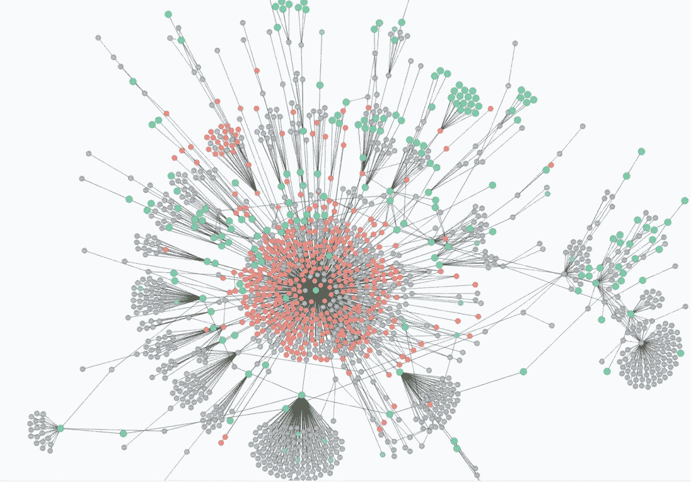
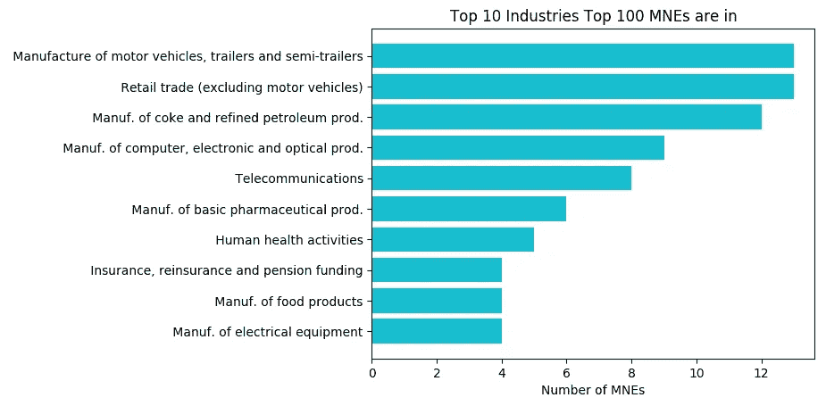
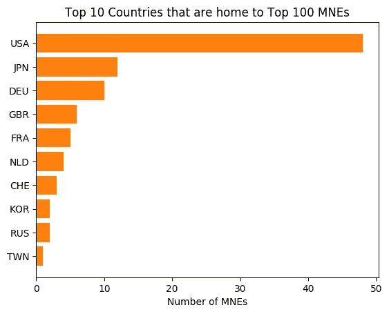
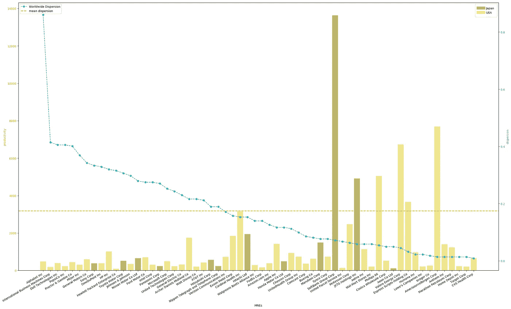
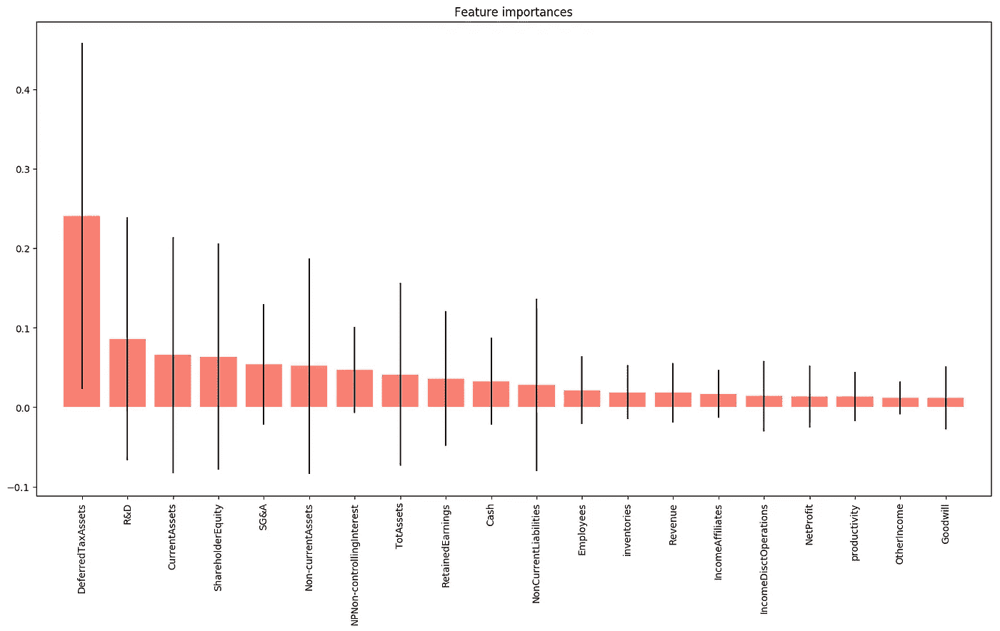

# 巨人一瞥:顶尖跨国企业分析

> 原文：<https://medium.com/analytics-vidhya/a-peek-at-the-giants-f4c7b2aac3b4?source=collection_archive---------13----------------------->

本博客研究了经合组织的单个跨国企业(MNEs)及其关联企业(ADIMA)数据集的分析数据库，以了解当今世界 100 强跨国企业的结构和存在。

## **背景**

尽管跨国企业在我们的日常生活以及公共政策领域中的重要性越来越大，但对跨国企业信息的了解却非常有限。从本质上来说，跨国公司是庞大而复杂的，在许多管辖区都有大量的活动。随着时间的推移，许多公司还建立了一个相当复杂的附属公司、控股公司和特殊目的实体链，其设计出于各种原因，包括财政优化，这使得理解跨国公司全球足迹的结构和存在尤为困难。

为了应对这些挑战，经合组织从 2018 年开始开发单个跨国公司及其子公司的分析数据库(ADIMA)，通过汇编公开可用的统计数据和使用替代微观数据来了解跨国公司国际活动的规模和范围。这篇博客探讨了这个数据集(最新发布于 2019 年 7 月)。

具体来说，我们深入探索数据，并研究影响跨国公司决定其全球存在程度的因素。在经济学中，这是一个属于产业组织研究的课题。

## **数据集**

最新发布的 ADIMA(2019 年 7 月)包括 100 家最大的跨国公司(按销售额计算)，总部设在 17 个国家。它有三个目的:

*   跨国公司子公司和存在的登记；
*   在多国企业和单个国家层面的一系列经济指标；和
*   一个监测工具，旨在提供关于多国企业重组的及时信息流，以帮助国家汇编者的工作。

ADIMA 在结构化框架内利用公开可用的数据。它将年度公司报告等传统数据源与 Thomas Reuters PermID、法律实体标识符(LEI)和公司网站及其 URL 中包含的数据等替代微观数据源相结合。

ADIMA 中包含四组数据，包括:MNE 数字和物理注册信息、MNE 指标和监视器，它们分别显示维基百科上的金融信息和新闻点击量。监测数据集包括对新闻热点的预测，以捕捉跨国公司内部潜在的重组变化，这些变化不一定通过公开声明反映出来。

## **需要解决的问题**

尽管是一个小数据集，ADIMA 提供了一些关于 100 强跨国公司的见解。这篇博客基于上一步准备的数据集回答了三个问题。

1.  哪些部门和国家拥有最多的跨国公司？
2.  企业层面的员工人均生产率会像经济文献(1)中建议的那样影响跨国公司的国际化吗？
3.  影响跨国公司决定其全球存在程度的因素是什么？

## **拥有最多跨国公司的行业和国家**

下图显示了跨国公司运营最多的十大行业是汽车制造、石油和制药、零售贸易和电信。

拥有最多跨国公司的国家是美国，拥有 48 家公司，位居第一，其次是日本和德国，分别拥有 12 家和 10 家跨国公司。

## **企业层面的生产率和国际分散**

经济文献持有一个长期确立的假设，即生产率最高的公司通过国际扩张成长为跨国公司(1)。ADIMA 数据库提供了一个机会来审视企业层面的生产率和这些跨国公司的国际化之间的关系。构建了两个变量来衡量企业层面的生产率(2)和跨国公司国际化(3)。

上图展示了美国和日本跨国企业的企业层面生产率与其国际分布之间的关系。乍一看，似乎没有任何直接的关联模式。有趣的是，不管跨国公司的总部是在美国还是在日本，低生产率(定义为低于所有跨国公司的平均生产率在橙色线)的公司似乎有更高的分散性(按降序排列)。与此同时，高生产率的跨国公司似乎有较低的国际分散。

这里需要注意的是行业差异，例如，直观地看，日本电信和投资公司软银(Softbank)在剔除国际业务水平较低的净资产回报后成为生产率最高的公司并不奇怪。这可能是因为它的大部分商业服务可以远程进行。

像 Alphabet Inc .和 Apple Inc .这样的公司在去除净资产的影响之前，员工人均生产率非常高，但国际分布非常高。这大概是因为大量现金和现金等价物(以净资产计)被从生产率计算中剔除了。

谷歌母公司 Alphabet 的国际离差最高。这是因为 ADIMA 的重点是，通过不仅查看每家跨国企业的年度报告和实体注册，还查看它们的数字存在，找出它们的所有全球存在，这是谷歌的主要商业运营模式。

## **影响跨国公司国际分散的因素**

为了探究是什么因素影响了一家跨国公司在全球范围内的广泛程度，我们使用了几种不同的模型。

信息服务业、印度和美国会计准则、现金、不动产、厂房和设备、工资和薪金以及总部在德国、印度、巴西和瑞士的国家都与跨国公司的国际分散程度有显著的正相关关系。

下图显示了影响跨国公司涉足多少不同国家的前 20 个特征。

## **结论和未来工作**

ADIMA 数据集非常小，只有 100 家跨国公司和一年的企业级财务数据。然而，它提供了一个很好的开端来窥视这些大公司的许多方面。受 G20 委托，经合组织是带头向这些公司提供公共透明度的国际组织之一。

从数据分析的角度来看，除了有限的数据可用性之外，该分析还存在其他一些需要进一步改进的缺点:

1.  更准确地构建国际扩散和生产率；
2.  特征选择上的差异可能是由于数据的非线性和多重共线性。因此需要进一步的特征和模型选择；
3.  公司历史、公众情绪(或品牌价值)等其他特征也被认为有助于探索影响跨国公司全球存在的因素。

注:详细的技术代码可以在 Github [这里](https://github.com/bobbleoxs/data_science/blob/master/Data%20Blog%20ADIMA/ADIMA.ipynb)找到。

参考资料:

(1) Helpman，e .，Melitz，m .和 Yeaple，S. (2004)，“出口与外国直接投资”，《美国经济评论》94，300–316。

(2)生产率的衡量标准被称为索洛剩余，它计算一个经济体的产出增长中不能归因于资本和劳动力积累的部分。由于可用数据有限，该变量是以简化方式构建的，应仅用于指示目的。罗伯特·索洛(1957)。“技术变革和总生产函数”。 [*经济与统计复习*](https://en.wikipedia.org/wiki/Review_of_Economics_and_Statistics) 。39 (3): 312–320

(3)分散程度是通过多国企业在国家总数中所占的比例来衡量的。