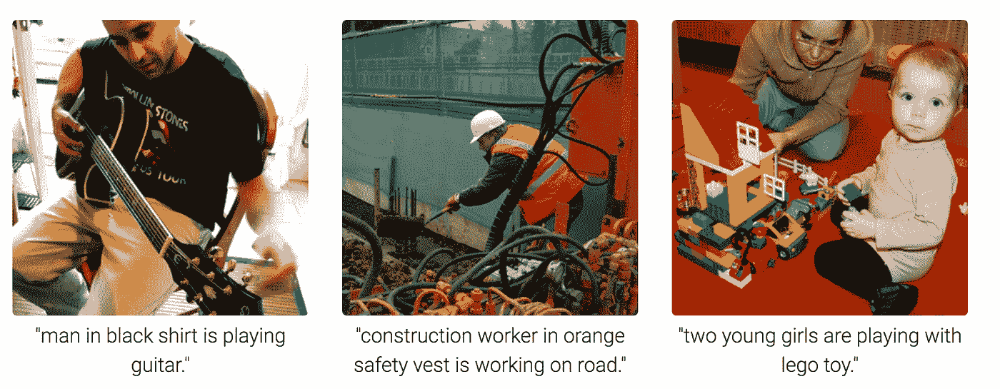
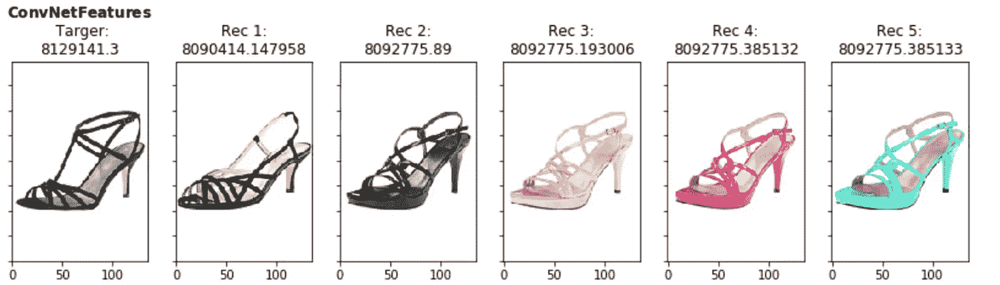
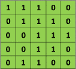
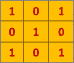
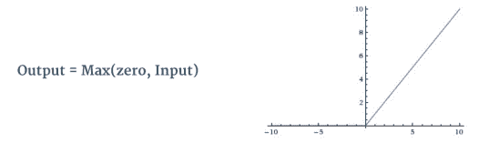
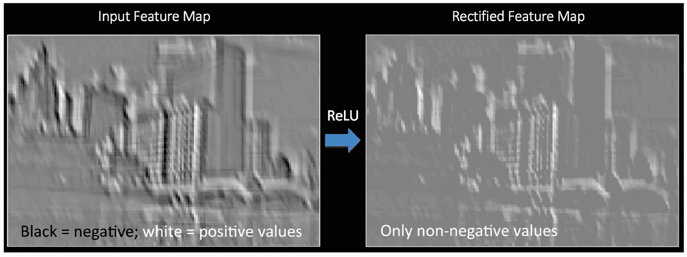
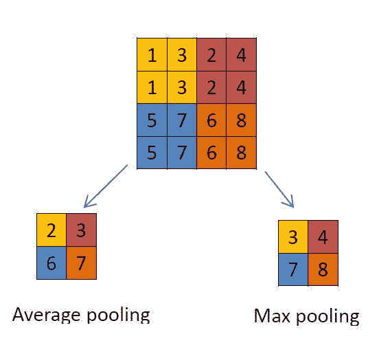

# 一张图片胜过千言万语——让我们找出相关的

> 原文：<https://medium.com/analytics-vidhya/a-picture-is-worth-a-thousand-words-lets-figure-out-the-relevant-ones-15cbb56443ae?source=collection_archive---------2----------------------->

## 教计算机描述图片

图像字幕是指根据图像中的对象和动作从图像生成文本描述的过程。这是一个由 3 部分组成的实现图像字幕的系列，由 Andrej Karapathy 在他的博士论文[中提出。](https://cs.stanford.edu/people/karpathy/main.pdf)



使用神经网络的计算机生成字幕

在这个过程中，我们将学习神经网络的基础知识，在 Keras(tensor flow 包装器)中创建卷积神经网络(CNN)，探索最先进的 NLP 模型(Sequence to Sequence，Glove，BERT 等)，并使用 LSTM 将 CNN 和 NLP 模型堆叠在一起，以生成图像的字幕。

我们将以此为基础，基于预先训练好的图像和字幕向量创建推荐系统，然后使用一个实时 WebApp 作为字幕生成和推荐的测试平台。



基于第一只鞋的样式的建议

目录(第 1 部分):

*   神经网络基础
*   用于图像识别的卷积神经网络
*   设置 Google Colab 笔记本
*   在 Keras 中创建用于图像分类的神经网络

**神经网络基础知识:**

神经网络是一种机器学习类型，它模仿人脑来模拟自身。这通过一种算法创建了一个人工神经网络，允许计算机通过合并新数据进行学习。

它接受几个输入，通过来自多个隐藏层的多个神经元进行处理，并使用输出层返回结果。这个结果估计过程在技术上被称为“**正向传播**”。

接下来，我们将结果与实际输出进行比较。任务是使神经网络的输出尽可能接近实际(期望)输出。这些神经元中的每一个都对最终输出产生一些误差。你如何减少误差？

我们试图最小化对错误贡献更多的神经元的值/权重，这发生在返回神经网络的神经元并找到错误所在的时候。这个过程被称为“**反向传播**”。反向传播(BP)更新权重以最小化每个神经元产生的误差。

为了减少这些迭代次数以最小化误差，神经网络使用一种称为**“梯度下降”**的常见算法，这有助于快速有效地优化任务。更多关于梯度下降[这里](https://www.analyticsvidhya.com/blog/2017/03/introduction-to-gradient-descent-algorithm-along-its-variants/)。

多个**时期**(前向和后向传播)的目的只是优化多个层的权重和偏差，以最小化误差。

各种类别的神经网络:

*   卷积神经网络(CNN)
*   递归神经网络(RNN)
*   LSTM 和格鲁

让我们在这里深入研究 CNN，我将在随后的帖子中涉及其他类别。

卷积神经网络(CNN):它们主要用于图像处理任务(分类、对象检测、定位等)，并构成 4 个主要操作，即卷积、非线性、汇集和分类，如下所述:

1.  **卷积:**卷积的主要目的是从输入图像中提取特征。卷积通过使用输入数据的小方块学习图像特征来保持像素之间的空间关系。正如我们上面所讨论的，每个图像都可以被认为是像素值的矩阵。考虑像素值仅为 0 和 1 的 5×5 图像:



以矩阵形式输入图像

此外，考虑如下所示的另一个 3 x 3 矩阵:



随机初始化的权重矩阵

然后，可以计算 5 x 5 图像和 3 x 3 矩阵的卷积，如下面的动画所示:


图像*权重矩阵=卷积特征

我们将橙色矩阵在原始图像(绿色)上滑动 1 个像素(也称为**‘步幅’**)，对于每个位置，我们计算[元素乘法](https://en.wikipedia.org/wiki/Matrix_multiplication)(两个矩阵之间)，并将乘法输出相加，以获得最终整数，该整数形成输出矩阵(粉色)的单个元素。注意，3×3 矩阵在每一步中只“看到”输入图像的一部分。

在 CNN 术语中，3×3 矩阵被称为“**滤波器**，通过在图像上滑动滤波器并计算点积形成的矩阵被称为“卷积特征”或“激活图”或“**特征图**”。

图像上的卷积运算:


请注意这两种不同的过滤器如何从相同的原始图像生成不同的特征图。在实践中，CNN *在训练过程中自己学习*这些过滤器的值，提取的图像特征越多，我们的网络就越能更好地识别看不见的图像中的模式。

**2。非线性(ReLu):**

ReLu 代表整流线性单元，是一种非线性操作。ReLU 的目的是在我们的 ConvNet 中引入非线性，因为我们希望 ConvNet 学习的大部分真实数据都是非线性的。其输出由下式给出:



Relu 操作

ReLu 将特征图中的所有负像素值替换为零。



**3。池化(减少图像的尺寸):**

空间池(也称为二次采样或下采样)减少了每个要素地图的维度，但保留了最重要的信息。空间池可以有不同的类型:最大池，平均池等。



最大池和平均池

## 4.用于分类的全连接(密集)层:

术语“完全连接”意味着前一层中的每个神经元都连接到下一层中的每个神经元。卷积层和池层的输出代表输入图像的高级特征。全连接图层的目的是使用这些特征根据训练数据集将输入影像分类到不同的类别中。

我们将使用 Softmax 函数进行最终分类**。Softmax 函数**获取任意实值分数的向量，并将其压缩为总和为 1 的介于 0 和 1 之间的值的向量。

## 卷积网络的整个训练过程可以总结如下:

**步骤 1:** 我们用随机值初始化所有过滤器和参数/权重

**第二步:**网络将训练图像作为输入，通过正向传播步骤(卷积、ReLU 和汇集操作以及全连接层中的正向传播)，并找到每一类的输出概率。

**步骤 3:** 计算输出层的总误差(所有 4 类的总和)

*   **总误差= ∑(目标概率-输出概率)**

**步骤 4:** 使用反向传播计算误差相对于网络中所有权重的*梯度*，并使用*梯度下降*更新所有滤波器值/权重和参数值，以最小化输出误差。

**步骤 5:** 对训练集中的所有图像重复步骤 2–4。

上述步骤*训练*ConvNet——这实质上意味着 conv net 的所有权重和参数现在都已经过优化，可以正确地对来自训练集的图像进行分类。

当一个新的(看不见的)图像被输入到 ConvNet 中时，网络将经历正向传播步骤，并输出每个类别的概率(对于一个新的图像，使用已经被优化以正确分类所有先前训练示例的权重来计算输出概率)

设置 Google Colab 笔记本:你只需要一个 Google Drive 账户

Google 研究团队描述的 Colab 是一个免费的 Jupyter 笔记本环境，不需要设置，完全在云中运行。使用 Colab，您可以编写和执行代码，保存和共享您的分析，以及访问强大的计算资源(包括 GPU)，所有这些都可以从您的浏览器中免费获得。

现在让我们基于 **Google Colab** 中的 **Keras** 使用 **GPU** 为**图像分类**创建一个 **CNN 模型**:

1.  转到[https://colab.research.google.com/notebooks/welcome.ipynb](https://colab.research.google.com/notebooks/welcome.ipynb)
2.  点击运行时->更改运行时类型->为 GPU 激活的环境选择 GPU。在我的测试中，我发现在使用类似系统配置的情况下，GPU 至少比 CPU 快 10 倍。


在 GPU 驱动的环境中使用 Google Colab 的新笔记本电脑

**在 Keras 中建立 CNN 模型进行图像分类(好老** [**MNIST 数据库**](http://yann.lecun.com/exdb/mnist/) **):**

```
#Keras Model Creationimport keras
from keras.models import Sequential
from keras.layers import Dense, Conv2D, Flatten
#create model
model = Sequential()
#add model layersmodel.add(Conv2D(64, kernel_size=3, activation='relu', input_shape=(28,28,1)))
model.add(Conv2D(32, kernel_size=3, activation='relu'))

model.add(Dense(10, activation='softmax'))
```

我们将使用的型号类型是**序列**。它允许你一层一层地建立模型。我们使用“add()”函数向模型中添加层。我们的前两层是 Conv2D 层。这些卷积层将处理我们的输入图像，这些图像被视为二维矩阵。“密集”是我们将在输出图层中使用的图层类型。密集是一种标准图层类型，在许多情况下用于神经网络。我们的输出层将有 10 个节点，每个节点对应一个可能的结果(0–9，即 10 位数)。激活是“softmax”。Softmax 使输出总和达到 1，因此输出可以解释为概率。然后，该模型将根据哪个选项的概率最高来进行预测。

```
# Keras Model Compile#compile model *using accuracy to measure model performance*
model.compile(optimizer='adam', loss='categorical_crossentropy', metrics=['accuracy'])
```

编译模型需要三个参数:**优化器、损失和指标**

优化器控制学习速率。我们将使用“adam”作为我们的优化器，因为它可以在整个培训过程中调整学习率。学习率决定了计算模型最佳权重的速度。较高的学习速率意味着快速收敛，因此拟合不足，而较低的学习速率意味着模型拟合需要较长的时间。


学习率与损失

我们将使用‘分类交叉熵’作为我们的损失函数。这是最常见的分类选择。分数越低，表示模型的性能越好。**准确性’**度量用于在我们训练模型时查看验证集的准确性分数。

```
#train the model
model.fit(X_train, y_train, validation_data=(X_test, y_test), epochs=3)#Make Predictions in the test set
model.predict(X_test[:4]) 
```

基于此，我们能够在测试数据集上看到 97%的准确率。我的代码 Colab 笔记本:

[](https://colab.research.google.com/drive/1QI_VDLYS_d5fS1QTXqicTxmLs2HkWDs-) [## 谷歌联合实验室

### 编辑描述

colab.research.google.com](https://colab.research.google.com/drive/1QI_VDLYS_d5fS1QTXqicTxmLs2HkWDs-) 

在下一部分，我们将在 Flickr 30K 数据集[http://bryanplummer.com/](http://bryanplummer.com/)上工作，它有 5 个与每张图片相关的标题。我们将建立一个编码器-解码器网络，然后根据字幕进行监督训练，以根据我们的图像输入生成自定义字幕。

非常感谢你的阅读。快乐学习！！！

参考资料:

*   https://github.com/karpathy/neuraltalk2
*   [https://towards data science . com/a-deeper-understand-of-nnets-part-1-CNNs-263 a6 E3 AC 61](https://towardsdatascience.com/a-deeper-understanding-of-nnets-part-1-cnns-263a6e3ac61)
*   [https://www . analyticsvidhya . com/blog/2017/05/neural-network-from-scratch-in-python-and-r/](https://www.analyticsvidhya.com/blog/2017/05/neural-network-from-scratch-in-python-and-r/)
*   [https://towards data science . com/image-captioning-in-deep-learning-9cd 23 FB 4d 8d 2](https://towardsdatascience.com/image-captioning-in-deep-learning-9cd23fb4d8d2)
*   [https://ujjwalkarn . me/2016/08/11/直观-解释-convnets/](https://ujjwalkarn.me/2016/08/11/intuitive-explanation-convnets/)
*   [https://medium . com/ny bles/create-your-first-image-recognition-classifier-using-CNN-keras-and-tensor flow-back end-6 eaab 98d 14 DD](/nybles/create-your-first-image-recognition-classifier-using-cnn-keras-and-tensorflow-backend-6eaab98d14dd)
*   [https://towards data science . com/image-captioning-with-keras-teaching-computers-to-description-pictures-c 88 a 46 a 311 b 8](https://towardsdatascience.com/image-captioning-with-keras-teaching-computers-to-describe-pictures-c88a46a311b8)
*   [https://towards data science . com/building-a-convolutionary-neural-network-CNN-in-keras-329 fbbadc5 F5](https://towardsdatascience.com/building-a-convolutional-neural-network-cnn-in-keras-329fbbadc5f5)
*   [https://towards data science . com/creating-a-movie-recommender-using-convolutionary-neural-networks-be93e 66464 a 7](https://towardsdatascience.com/creating-a-movie-recommender-using-convolutional-neural-networks-be93e66464a7)
*   [https://towards data science . com/getting-started-with-Google-cola b-F2 fff 97 f 594 c](https://towardsdatascience.com/getting-started-with-google-colab-f2fff97f594c)