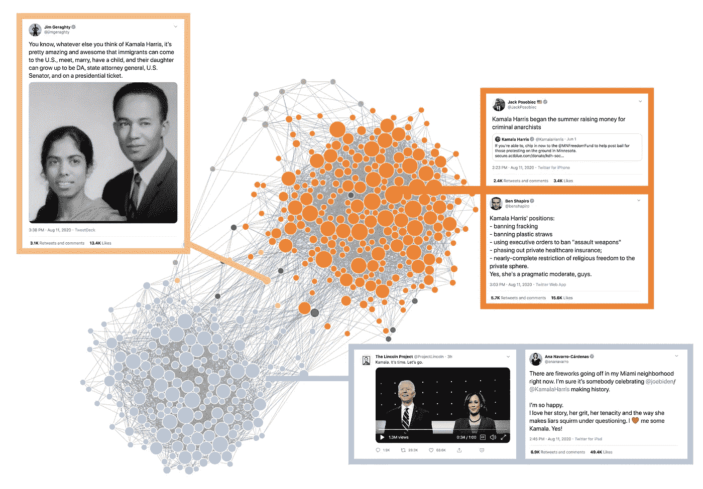

# 两极分化的写照:对卡玛拉·哈里斯成为副总统候选人的即时反应

> 原文：<https://medium.com/analytics-vidhya/a-portrait-of-polarization-immediate-reactions-to-kamala-harris-as-vp-candidate-4a6c9ed68571?source=collection_archive---------14----------------------->

史蒂夫·赫登和戴夫·波尔

在她今天被宣布为民主党副总统候选人后，我们就开始在 Twitter 上发布所有带有“卡玛拉”和/或“拜登哈里斯”字样的推文。在收集了两个多小时的推文后(从大约 3:30 MT 到大约 5:45 MT)，我们创建了一个网络分析…