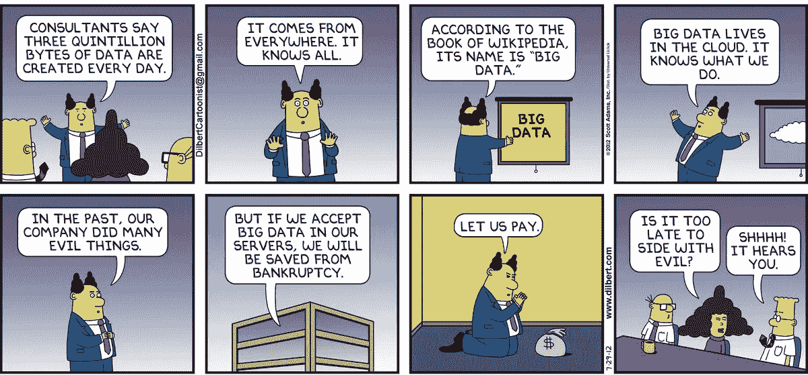
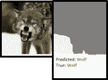

# 数据伦理的实用方法

> 原文：<https://medium.com/analytics-vidhya/a-practical-approach-to-data-ethics-c13a0fc0f0dc?source=collection_archive---------1----------------------->

原始来源:[斯科特·亚当斯的《呆伯特》](http://dilbert.com/strip/2012-07-29)

生活中有一条黄金法则:这是一条以各种形式出现在世界各地的格言:

> 一个人永远不应该对另一个人做那种他认为对自己有害的事。

作为一名数据科学家，我发现这个互惠原则非常有吸引力！

*像你希望别人对待你的数据一样对待别人的数据。*

最近假新闻的激增以及在选举期间针对摇摆选民的定性和定位事件使数据隐私成为人们关注的焦点。我们关注数据伦理的以下三个方面:

1.  失败和清单
2.  多元化和赋权
3.  数据伦理的 5C

# **故障&清单**

灾难性的失败往往是因为从业者相信他们没有造成伤害！直到 19 世纪晚期，医生都不认为他们应该在手术前洗手。这导致无数人因感染而死亡。即使它被科学证明是真的；他们花了几十年才接受它作为他们标准操作程序(SOP)的一部分。

数据科学家(或任何科技企业家)都不想造成任何伤害。我们真诚地相信，我们正在构建的(数据)产品将改善我们用户的生活。然而，失败确实会发生。

那么，数据科学家如何避免这种情况呢？使用清单就是这样一种方法。

清单确保数据的使用符合道德规范。过程的回顾(使用检查表)可以发生在 1)项目的概念化过程中；2)在项目执行过程中，最后 3)项目完成后。

下面给出了一个清单示例:

1.  需要什么样的用户同意？

2.我们是否清楚地解释了用户同意什么？

3.我们测试过不同用户群中不同的错误率吗？

4.我们是否有保护用户数据的计划？

5.我们是否测试了我们的培训数据以确保其公正性和代表性？

6.团队是否反映了观点、背景和想法的多样性？

7.该算法在做出预测之前是否查看了正确的伪影/特征？

这个列表并不详尽，但在本质上是不断发展的……但它迫使我们在计划项目时提出*困难的问题*。

举例来说，为了确保算法确实在做它应该做的事情，数据科学团队可以使用像 [SHAP](https://github.com/slundberg/shap) & [莱姆](https://github.com/marcotcr/lime)这样的工具。这些工具帮助我们识别机器学习算法用来进行预测的特征。

这使我们避免了使用错误训练算法的尴尬场景。一个臭名昭著的例子是使用图像背景中的雪来预测图像中狼的存在的算法。

原文出处:[我为什么要相信你？](https://arxiv.org/abs/1602.04938)

# **多元化&赋权**

新时代公司的格言是快速发展&打破常规。

快速而廉价地失败！

我们希望在不了解后果的情况下构建最低限度的可行产品。年轻的工程师将他们的产品投入生产，但是如果他们对产品有所保留，我们不会授权他们从市场上撤回产品或功能。

在《T4 伦理与数据科学》一书中，作者谈到了在数据科学团队中为异议创造一个安全的空间。一个团队成员可能会反对一种方法，但是如果在一个组织中没有对道德思维的支持。他们很容易被边缘化。因此，从组织的角度来看，为数据科学团队中最年轻的成员授权非常重要。

另一个避免盲点的方法是在团队中建立多样性。不同背景和专业知识的开发人员为团队的生产力增加了显著的价值。

我强烈建议观看乔伊·波伦维尼的演讲。当她意识到人脸检测算法无法识别她的脸时，她还是一名研究生！就好像没有这个算法，她就不存在一样！

她发现算法无法识别她的脸，因为训练数据集没有任何肤色较暗的样本。这不是由于任何蓄意的种族主义行为。但仅仅是因为没有一个算法开发者意识到他们的训练数据是不完整的。他们都是白种人(*)。*

*这强调了一个事实，即数据科学团队的多样性和授权确保了盲点被覆盖。这也允许我们在团队中进行有意义的对话。*

# ***数据伦理的 5c***

*为确保有一种促进对话的机制，建议在构建数据产品时遵循以下准则:*

*1.同意*

*2.清楚*

*3.一致性*

*4.控制(和透明度)*

*5.后果(和伤害)*

*同意并不意味着什么…除非用户清楚合同的条款和条件。通常合同是一系列的谈判，但在我们所有的网上交易中，它总是一个二元条件。用户要么接受条款，要么拒绝。数据产品的开发者不仅应该确保他们得到用户的同意。但是用户也应该清楚 1)他们正在提供什么数据；2)他们的数据将如何被使用，以及 3)使用数据的下游结果是什么。*

**

*原文出处:[GDPRToons.com](http://www.gdprtoons.com/2018/05/there-are-many-people-with-skeletons-in.html)*

*记住“*我已经阅读并同意条款和条件*”是网络上最大的谎言之一。服务协议的条款通常太长，外行人很难理解。因此，让用户知道他们同意什么是很重要的。这应该是最简单的术语。*

*一致性对于获得用户的信任非常重要。通常，那些有着良好意愿的人会以奇怪且不可预测的方式来解释契约条款。控件应该存在，以便如果用户改变主意，他可以简单地删除数据。*

*谷歌最近给了用户对他们的[搜索历史数据](https://timesofindia.indiatimes.com/business/international-business/deleting-google-search-data-gets-easier/articleshow/66356069.cms)更多的控制权。用户现在可以在谷歌搜索中查看和删除你的搜索活动。它还允许用户禁用广告个性化。*

*用户也应该意识到分享他们的数据的后果。一个主要的例子是，用户知道他们的 Twitter feeds 是公开的。然而，很少有人知道这些推文可以被研究人员或分析公司使用。这可能会产生意想不到的后果。*

# ***未知的未知***

*我们经常听到项目经理谈论“未知的未知”——这些是不可预见的后果，是无法消除的风险。然而，这些风险往往是未知的，因为我们不想知道它们。当机器学习模型根据有偏见的数据进行训练时，它们可能会将歧视行为制度化。一个很好的例子就是亚马逊歧视女性的[招聘算法](https://slate.com/business/2018/10/amazon-artificial-intelligence-hiring-discrimination-women.html)。*

*同样，用户也不再信任新闻机构和消费者网络公司。这种缺乏信任是因为他们觉得被虐待了。(阅读假新闻和[剑桥分析](https://www.cnbc.com/2018/04/10/facebook-cambridge-analytica-a-timeline-of-the-data-hijacking-scandal.html))*【3】&【4】**

*数据科学是一个不断发展的领域。它是建立在过去几十年发展起来的思想基础上的。人类在他们的原则被编纂之前就建造了建筑物和桥梁。他们现在正在建立涉及社会的大规模预测系统。就像早期的建筑和桥梁以不可预见的方式倒塌一样。同样，这些预测系统也会失败&暴露出严重的概念缺陷。*

**而且失败也是好事！因为失败会激励你去构建更健壮的系统。**

****参考文献:****

1.  **《伦理与数据科学》，作者:Mike Loukides，Hilary Mason&DJ Patil——这本书应该是任何对数据科学认真的人的必读之作**
2.  **[亚马逊利用人工智能创造了一个招聘工具。它立即开始歧视女性](https://slate.com/business/2018/10/amazon-artificial-intelligence-hiring-discrimination-women.html)——乔丹·魏斯曼**
3.  **[脸书-剑桥分析公司丑闻](https://en.wikipedia.org/wiki/Facebook%E2%80%93Cambridge_Analytica_data_scandal) —维基词条**
4.  **[脸书剑桥分析:数据劫持丑闻的时间表](https://www.cnbc.com/2018/04/10/facebook-cambridge-analytica-a-timeline-of-the-data-hijacking-scandal.html) —美国消费者新闻与商业频道**
5.  **[人工智能革命尚未发生](/@mijordan3/artificial-intelligence-the-revolution-hasnt-happened-yet-5e1d5812e1e7)——@ mijordan 3**
6.  **人工智能核心的黑暗秘密——麻省理工学院评论的威尔·奈特**

****免责声明:****

**这些是我个人的观点，并不代表我的雇主雪绒花的观点/策略**