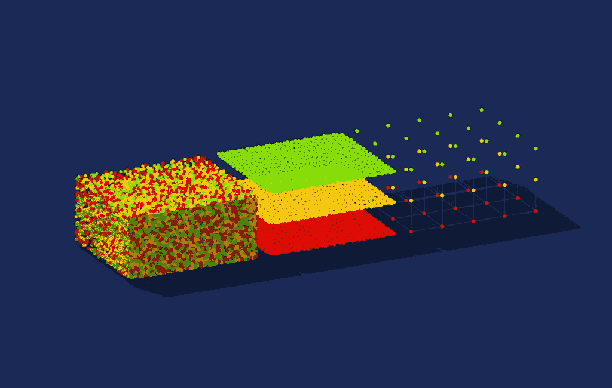

# 人工智能项目开发实用指南

> 原文：<https://medium.com/analytics-vidhya/a-practical-guide-to-ai-project-development-part-1-problem-definition-8834823e0bbc?source=collection_archive---------12----------------------->

## 第 1 部分:问题定义

如果你对使用机器学习(ML)来增强现实世界中的现有产品感兴趣，那么理解 AI 开发如何在软件开发项目的生命周期和上下文中发挥作用是很重要的。根据 Gartner 最近的一项调查[，行业领先的组织在其开发管道中平均**有四个**人工智能项目，预计这一数字将在明年翻一番。人工智能可能是当今最具变革性的技术。](https://www.gartner.com/en/newsroom/press-releases/2019-07-15-gartner-survey-reveals-leading-organizations-expect-t)

在高层次上，每个人工智能开发项目都遵循以下六个步骤:

1) **问题定义**

2) **数据采集**

3) **特征定义**

4) **人工智能模型构建**

5) **评估&细化**

6) **部署**

在本文中，我将分享第一步的最佳实践:*定义问题*。

人工智能可寻址问题的正确定义和表征通常比算法本身的选择更重要。它可以为你节省大量的下游工作，防止你解决错误的问题。

> 人工智能做出预测不一定要让数据中的模式立即被人类感知，但确实需要有一个模式。

# 对 AI 还是不对 AI？

通过问自己这个简单却至关重要的初始问题，开始系统化你的问题:*有模式吗*？所有机器学习学科的前提是，需要有一个模式。如果没有模式，那么问题就无法用 AI 技术解决。在决定开始人工智能开发之旅之前问这个问题是很重要的。

从表面上看，ML 的功能很像人脑。我们每天每分钟所做的决定都是基于一生的模式识别。当我们遇到一个与我们以前经历过的场景不一样的场景时——比如说，在开车时在十字路口遇到一个独特的道路配置——我们能够毫不费力地推断出理想的反应应该是什么。这是由于大脑已经开发了一个心理模型*,并继续开发——给定十万个数据点，并通过我们在潜意识层面识别模式的固有能力进行处理。*

*ML 是这种策略的数学近似，适用于数字世界。*

*人工智能做出预测并不需要数据中的模式能被人类立即感知——但是*需要有一个模式。**

**

*如果认为数据中存在某种模式，那么可以采用人工智能开发技术。*

# *是什么类型的 AI 问题？*

*如果认为数据中存在某种模式，那么可以采用人工智能开发技术。*

*这些技术的应用通常是为了回答五种类型的问题，所有这些问题都属于预测分析的范畴:*

*①**哪一类？**(分类)*

*2) **多少或多少？**(回归)*

*3) **哪一组？**(聚类)*

*4) **这不寻常吗？**(异常检测)*

*5) **应该采取哪个选项？**(推荐)*

*确定*你在问这些问题中的哪些*，以及回答这些问题如何实现你的商业目标，这一点很重要。*

# *简化你的问题*

*有时，您想要预测的目标度量可能无法直接量化。例如，假设您想预测客户在与您的网站互动过程中的享受程度。享受很难定义和建模，所以我们需要挖掘数据来确定是否有更简单的任务可以作为很好的代理。换句话说:什么任务与快乐相关？通常，一个好的方法是尝试寻找影响预期最终结果的中间事件——但是使用定义更明确的事件，因此更容易建模。在*享受*的例子中，我们可能希望使用“客户每周花在网站上的总时间”作为享受的代表。*

*仔细想想你的人工智能开发项目的正确机器学习任务实际上是什么。这似乎是显而易见的，但实际上可能会令人惊讶地混乱。没有正确定义你的问题可能会花费你大量的时间和金钱。*

# *参考*

* [## 机器学习领域指南，第 1 课:问题定义

### 脸书机器学习现场指南，第 1 课。在本课中，我们将分享定义问题的最佳实践…

research.fb.com](https://research.fb.com/videos/field-guide-to-machine-learning-lesson-1-problem-definition/)  [## 面向初学者的数据科学— Azure 机器学习工作室

### 从一个顶级数据的五个短视频中快速了解数据科学的初学者

docs.microsoft.com](https://docs.microsoft.com/en-us/azure/machine-learning/studio/data-science-for-beginners-the-5-questions-data-science-answers)*