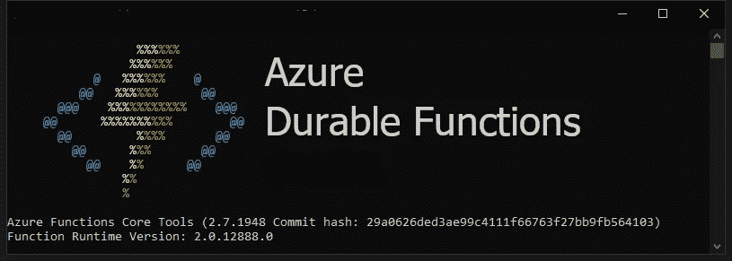
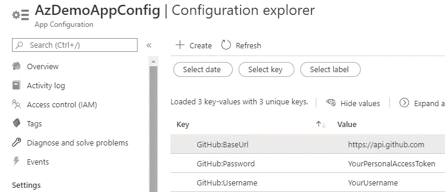
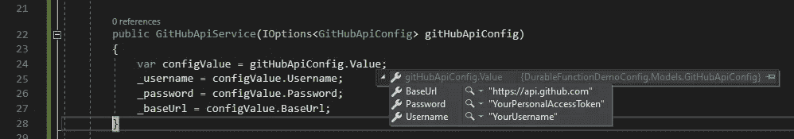
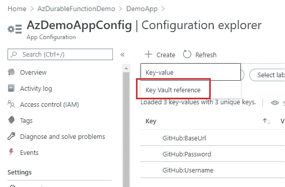
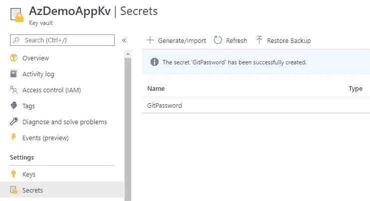
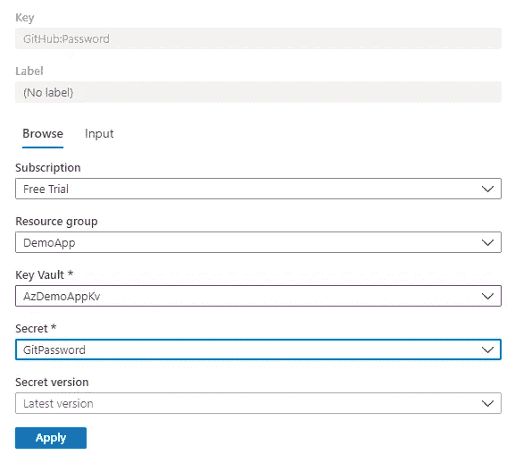

# Azure 持久功能实用指南——第 3 部分:配置

> 原文：<https://medium.com/analytics-vidhya/a-practical-guide-to-azure-durable-functions-part-3-configurations-6baa1b49f532?source=collection_archive---------2----------------------->



## 通过 Azure Durable Functions 创建生产就绪功能应用程序所需的一切。

如果你不熟悉 Azure，或者你想探索 Azure 持久函数的 DI 选项，你可能想先阅读该系列的前一个故事。

[](/@allen.zhang1983713/a-practical-guide-to-azure-durable-functions-part-2-dependency-injection-facadc8238af) [## Azure 持久函数实用指南—第 2 部分:依赖注入

### 通过 Azure Durable Functions 创建生产就绪功能应用程序所需的一切。

medium.com](/@allen.zhang1983713/a-practical-guide-to-azure-durable-functions-part-2-dependency-injection-facadc8238af) 

在这个故事中，我们将逐步改进我们的应用程序，以演示设置 Azure Function 应用程序配置的各种方法。

最后，我们的目标是配置我们的功能应用程序，以便从完全托管的配置存储中检索应用程序设置，并保护所有敏感信息。

# 配置管理器

首先，我想将配置管理器添加到项目中，以便它不再直接从环境变量中读取配置。这个想法是配置消费者类不需要知道配置值来自哪里。

在前面的故事中，我们已经将自己的 Startup.cs 文件添加到 Azure Function 项目中，以注册依赖注入。现在我们也可以在启动类中设置配置。

重要的一行是 AddEnvironmentVariables()。它添加一个环境变量配置提供程序。我们现在可以将 IConfiguration 的一个实例注入到任何类中，并轻松地获得配置项。

这也为我们提供了一个坚实的基础。随着应用的发展，我们可能会引入其他配置提供者。

# 强类型配置

我真正想解决的另一个小问题是硬编码的基本 URL。让我们把它也移到配置中。但是三行“GitHubXXX”就是看起来很可怕。

那很好。我们只需要将 GitHub API 相关的配置组合在一起。这应该很容易，因为 C#支持强类型配置对象。

## 配置文件

在. NET 核心 web 应用程序中，有 appsettings。{环境}。json 文件。从 json 对象加载强类型配置部分非常容易。我能在 local.settings.json 文件中做同样的事情吗？

我们甚至不必试一试——如果你愿意，你可以试一试。我们知道这是行不通的，因为 local.settings.json 文件中的“Values”部分模拟了环境变量。它真的应该只包含键值对。

我不是很想带 appsettings。{环境}。json 文件到函数应用程序中(尽管这是可能的)。因为 local.settings.json 涵盖了本地开发。管道的工作是为不同的环境设置正确的应用程序设置。我不想在配置文件中管理它。

我还有其他选择吗？

## Azure 应用配置服务

微软在 2020 年初推出了云完全托管配置存储**应用配置**服务。

有了这项服务，您可以轻松地在所有云服务之间配置和共享配置项目。它支持在函数应用程序中使用强类型配置对象。

> 一石二鸟。

在浏览器选项卡上打开 Azure 门户，创建一个新的**应用配置**资源。按照用户界面上的步骤操作。唯一需要注意的是，你可能想要选择**免费**价格等级。

创建好服务后，直接转到服务。点击**访问键**并将**连接字符串**值保存在某处。然后点击**配置浏览器**并创建一些键值配置项。您需要为**您的用户名**和**您的个人访问令牌**输入您的真实值。

*   " GitHub:base URL ":" https://API . GitHub . com "
*   " GitHub:用户名":"您的用户名"
*   " GitHub:密码":"您的个人访问令牌"



这是扁平化的 json 格式。复杂 json 对象格式中的上述设置如下所示:

```
{
  "GitHub": {
    "BaseUrl": "https://api.github.com",
    "Username": "YourUsername",
    "Password": "YourPersonalAccessToken"
  }
}
```

更新 local.settings.json 文件。我们现在需要的唯一配置是应用配置服务连接字符串。如果您想在本地运行应用程序，请使用您之前保存的实际值。

添加**微软。extensions . configuration . azureappconfiguration**将包获取到项目中。我们将在启动类中添加应用配置服务作为配置提供程序。

*对启动类中现有配置提供程序的额外处理并不理想。但它可以让你在本地运行功能应用程序。你不需要在一个普通的。NET 核心项目。*

*目前(2020 年 6 月 5 日),对 ConfigurationBuilder 的任何更改都会导致已部署功能应用程序出现运行时问题。但是微软正在解决这个问题(跟踪投票请求* [*这里*](https://github.com/Azure/azure-functions-host/pull/5991) *)。一旦补丁发布，我将再次讨论这个问题。*

通过 options 模式更新服务类的构造函数以使用强类型配置。

有了正确的应用程序配置服务连接字符串，当我在本地运行这个函数应用程序时，GitHub API 相关的配置值被填充了我之前在 Azure 门户上设置的值。



现在我们可以更新管道，只将**AppConfigurationConnectionString**变量传递给 Azure Function App。不要忘记更新 AzureFunctionApp 任务。

```
**Note**: in a real app, you want to make sure an appropriate connection string value is set in the pipeline for different environments: dev, test, prod, etc. But it beyonds the scope of this story.
```

# 保护敏感配置

功能 app 的配置解决方案改进了很多。但是还有一个问题。将所有敏感数据(包括所有密码、证书和数据库连接字符串)存储在秘密存储中以保护它们是一种良好的安全做法。

Azure **Key Vault** 服务是一个完全托管的基于云的秘密存储服务。

我知道。NET Core 有一个密钥库配置提供程序。事实上，如果你不想使用托管应用配置服务，因为它不是免费的。直接在项目中添加密钥库配置提供程序是一个不错的选择。

但是，当我们之前在应用配置服务上创建配置时，您可能已经注意到有一个添加密钥存储库引用的选项。



让我们试一试。

首先，在 Azure 门户上创建一个**密钥库**服务。标准价格层就足够了。

创建资源后，转到该资源并点击**访问策略**。应该只有一个访问策略显示您的 Azure 用户拥有对所有机密的完全访问权限。

点击**秘密**并生成一个新的秘密 **GitPassword** 。你可以在这里输入你的真实价值。您的个人访问令牌在密钥库中是安全的。



导航到应用程序配置服务并点击**配置浏览器**。删除之前创建的 **GitHub:Password** 配置项，并将其重新创建为密钥库引用。把它和之前在密钥库中创建的秘密联系起来。



我们还需要修改代码来连接到密钥库。安装 **Azure。identity**n 将包获取到项目中。在撰写本文时，1.2.0-preview.3 是一个不错的选择，因为它支持通过 Visual Studio 登录用户进行身份验证。并在我们配置 App 配置服务时，在启动类中添加几行代码。

如果我们在本地运行代码，它应该还能工作。现在密码来自 Azure key vault。

但是等等，这怎么安全？和只在 App 配置服务中设置密码有什么不同？

别担心。应用程序配置服务**没有**访问您的密钥库的权限。它在本地工作，因为 **DefaultAzureCredential** 使用您的 Visual Studio 的 **Azure 服务验证**帐户来验证密钥库服务(您可以通过在 Visual Studio 中转至 Tools = > Azure 服务验证= >帐户选择来查看)。如果该帐户与您的 Azure 登录用户帐户相同，则该帐户有权获取机密。

要验证这一点，请从您的用户的密钥库访问策略中删除**列表**和**获取**权限，然后重试。

或者使用管道将代码更改部署到 Azure。部署的功能应用程序将无法工作，因为我们尚未配置其访问策略。让我们现在就做吧。

在 Azure 门户上找到功能 app。点击**识别**并打开**系统分配的**身份，然后保存更改。

创建身份后，找到密钥库服务，并为功能应用程序的系统分配身份添加访问策略。您可以通过功能应用程序的名称或对象 id 找到它。给它**列表**和**获取**权限的秘密。

现在再试试部署的功能 app。现在应该可以了。

# 摘要

在这个故事的开始，我们的函数应用程序只能从环境变量中读取配置。我们必须在 local.settings.json 文件和具有明文的管道中将它们都设置为键值对。

现在，它演变为在函数 app 本身中只有一个配置项，即 app 配置服务连接字符串。所有其他配置都存储在完全托管的配置存储中，敏感配置由 Azure key vault 保护。

最重要的是，它不需要存储任何凭证来访问密钥库，无论是在本地还是部署。nuget 包隐藏了复杂性。

> 这太棒了。向微软致敬。

这个故事的代码可以在我的 [GitHub repo](https://github.com/allenzhang83/DurableFunctionDemoConfig) 中找到。

在接下来的故事中，我将谈论 Azure 持久功能的三种不同的重试机制。其中两个是持久功能专用的。敬请期待！

第 4 部分在此发布。

[](https://levelup.gitconnected.com/a-practical-guide-to-azure-durable-functions-part-4-retry-3b60c46067fa) [## Azure 持久功能实用指南—第 4 部分:重试

### 通过 Azure Durable Functions 创建生产就绪功能应用程序所需的一切。

levelup.gitconnected.com](https://levelup.gitconnected.com/a-practical-guide-to-azure-durable-functions-part-4-retry-3b60c46067fa)