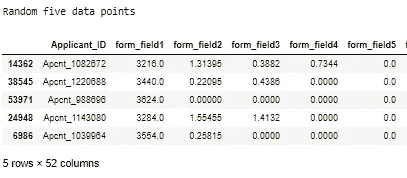
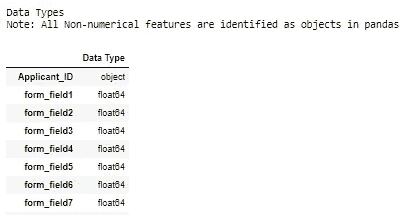
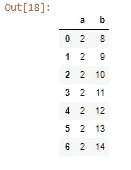
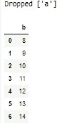
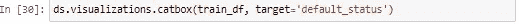

# Python 数据列表实用指南

> 原文：<https://medium.com/analytics-vidhya/a-practical-guide-to-datasist-in-python-e96a331a6b51?source=collection_archive---------10----------------------->

用于数据分析和可视化的 Datasist。

Datasist 是一个开源 python 库，它提供了用于简单数据分析、可视化以及有效构建和管理数据科学项目的函数和方法。

在本文中，我将向您介绍使用名为“Datasist”的 python 库进行数据分析、数据可视化和解释的世界。

# **目录**

1.  安装数据表
2.  使用 Datasist structdata
3.  使用数据列表的特征工程
4.  使用 Datasist 实现数据可视化

不要浪费太多时间，让我们开始学习 Datasist 实用指南。

**安装数据表**

Datasist 是一个适用于 linux、MacOS 和 Windows 的 python 包，可以像任何其他 python 包一样安装。

如果激活了现有的 Python 环境，可以使用以下命令安装 datasist:

要在虚拟环境中安装 datasist，可以使用 Anaconda 包。

注意:你必须安装[巨蟒](http://www.anaconda.com)。

确认您已经安装了 Anaconda。您需要使用以下命令:

现在开始创建一个新的虚拟环境，并安装最新版本的 Python。再说 Python 3.5 及以上。您将使用以下命令:

下一步是你的环境。您将使用以下命令:

现在，使用以下命令安装 datasist:

下一步是使用以下命令测试您的安装:

现在我们已经完成了安装。让我们进行单子上的下一项议程。

**使用数据表结构数据**

你想象过吗？什么是数据列表？。嗯，我会说:Datasist 是一个 python 库，它使数据分析、可视化、清理变得容易，为数据科学家在原型开发期间做准备。

注意:我们将使用 Jupyter 笔记本，我们将使用尼日利亚数据科学 2020 hackhaton 数据集。准备好这一切后。让我们开始行动吧。

最后，打开 jupyter 笔记本，导入库和数据集，如下所示。

structdata 模块有许多功能可以处理 Pandas DataFrame 格式的结构化数据。因此，您可以轻松地操作和分析数据帧。让我们深入研究一下可用的功能。

1.  描述:我们都知道熊猫也有描述的功能。让我们来看看 Datasist 描述方法。

Lol，datastruct 模块显示以下输出:

(a)前五个数据点。

(b)随机五个数据点。

(c)最后五个数据点

(d)数据集的形状、数据集的大小

(e)数据类型

(f)数据集中的数字特征

(g)数据集中的分类特征

(h)栏目的统计说明

(一)分类特征描述

(j)分类特征的唯一类别计数

(k)数据中缺少数值

是不是很神奇？。让我们来看看 datastruct 模块功能的另一个方面。

2.check_train_test_set:要使用这个函数，必须通过()train_df 和 test_df)函数。公共索引(申请者 ID)和两个数据集中可用的任何特征。让我们看一看。

现在，让我们看看我们的输出:

3.display_missing values:可以检查数据集中缺少的值。我们去看看。

让我们看看输出给了我们什么:

很神奇吧？

4.get_cats_feats 和 get_num_feats:这个函数用于检索分类和数字特征，并以列表的形式给出它们的输出。

让我们使用这个函数，看看它是什么样子的:

你看到了，对吧？。让我们检查数字特征。

这看起来很有趣，似乎很容易。

5.get_unique_counts:在一个分类特性中，你可以使用函数来获得唯一的类。下面我们来看看。

你看到这是怎么回事了吗？啊？非常简单明了。

6.join_train_test:您可以使用 function(join_train_and_test)函数来连接训练集和测试集。让我们做一些事情:

datasist 中的 structdata 模块也有更多的功能。您可以阅读 datasist API 文档来了解更多信息。

**使用数据表的特征工程**

特征工程是使用数据的领域知识来创建使机器学习算法工作的特征的过程。它是从原始数据中提取重要特征并将其转换为适合机器学习的格式的行为。

现在，让我们探索一下 datasist 的一些特性工程模块。

1.  drop_missing:函数删除缺少值的要素。下面我们来看看:

让我们看看输出结果如何:

2.drop_redundant:这个函数删除没有变化的特征。让我们创建一个新的数据集。让我们来看看:

让我们看看输出是什么样的:

现在，检查数据集。你会发现它是多余的，这意味着它从头到尾都有相同的类。我们将使用该函数删除该列。检查以下内容:

输出是这样的:

不对不对，酷。你看到了吗？

3.convert_dtypes:该函数自动获取 DataFrame 中没有在其正确类型上表示的特性。让我们来看看:

输出给出:

现在，让我们看看数据类型。

注:年龄特征假设为整数。通过使用 convert_dtype 函数。它会自动修复。让我们来看看:

4.fill_missing_cats:这个函数自动填充缺失的值。让我们检查一下:

5.fill_missing_values:此函数适用于数字特征，您可以指定填充策略(平均值、中值和众数)。让我们检查一下:

酷，你看到了吗？很简单。让我们深入研究下一个问题，即使用 datasist 实现可视化。

## **使用 datasist 进行可视化**

在开始行动之前，让我们重新导入之前使用的数据集。

输出是这样的:

现在，我们将把我们的可视化分成两部分，即:

分类特征的可视化

(b)数字特征可视化

**类别特征的可视化**

分类特征的可视化包括:紫线图、计数图、箱线图等。现在，让我们开始一个接一个地接触它们。

*   countplot:这制作了一个所有分类特征的柱状图，以显示它们的类别计数。让我们检查一下:

输出是这样的:

*   boxplot:针对分类目标列绘制所有数字特征的盒状图。看一看:

*   catbox:用于针对分类目标绘制数据集中所有分类特征的并排条形图。让我们检查一下:

让我们看看输出:

**数字特征可视化**

数字特征的可视化包括散点图、直方图、kde 图等。让我们开始行动吧:

*   plot_missing:该函数可用于可视化数据集中缺失的值。让我们来看看:

现在，让我们看看输出:

现在，我们完成了教程。现在，您将能够使用 datasist 解决数据分析和数据可视化的问题，例如(pandas、seaborn、matplotlib 和许多其他工具)。

注:本教程的笔记本可在[这里](https://github.com/AdesinaA/Introduction-to-datasist)获得。

感谢阅读。请随时在以下社交媒体上联系我: [Twitter](https://www.twitter.com/AdesinaAbdulra9) 、 [Linkedin](https://www.linkedin.com/in/adesinaabdulrahman\) 、 [Gmail](https://adesinaabdulrahman16@gmail.com) 、[脸书](https://www.facebook.com/adesinaabdulrahman16)。