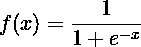
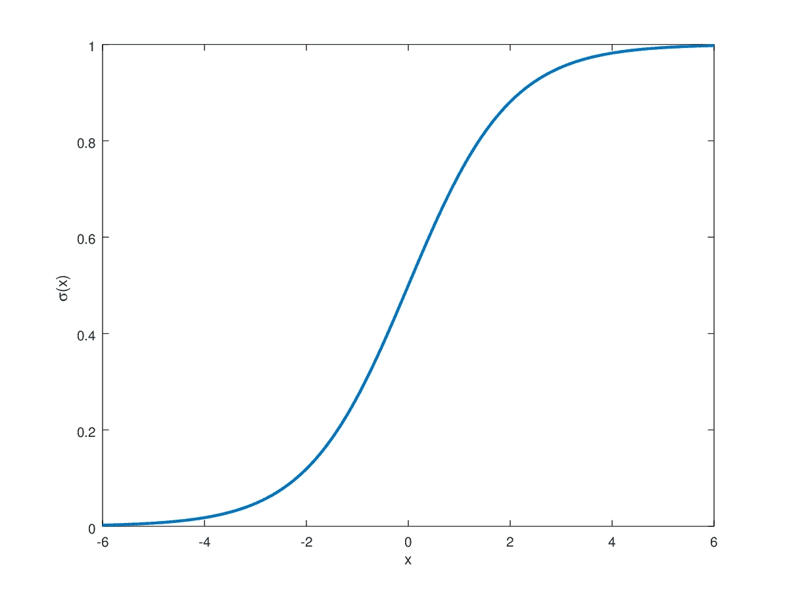
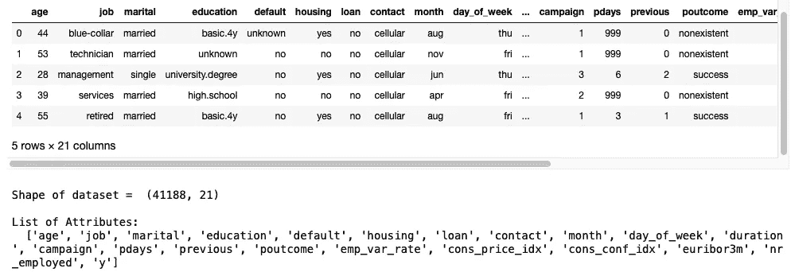
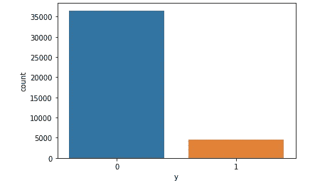
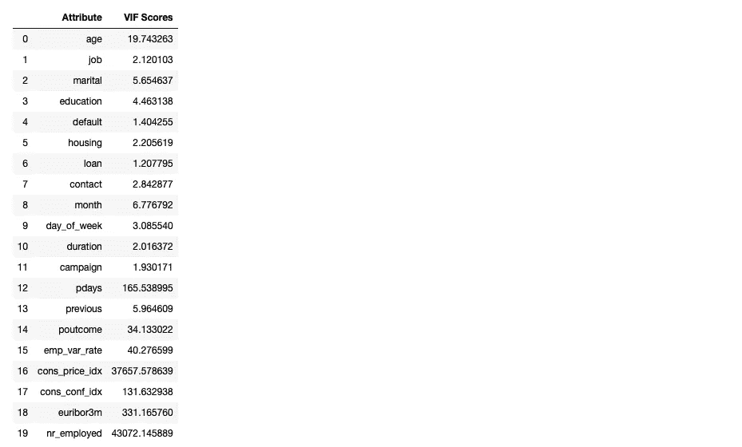
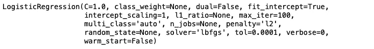
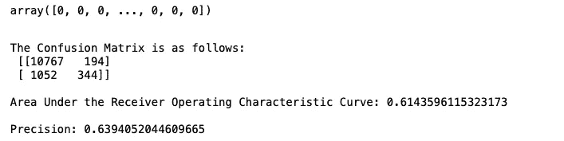

# 面向初学者的 Python 逻辑回归实用指南

> 原文：<https://medium.com/analytics-vidhya/a-practical-guide-to-logistic-regression-in-python-for-beginners-f04cf6b63d33?source=collection_archive---------2----------------------->

逻辑回归的根源可以追溯到 19 世纪，当时比利时数学家[](https://en.wikipedia.org/wiki/Pierre_François_Verhulst)**在为人口增长建模的一系列三篇论文中提出了*逻辑函数/逻辑增长*。后来在 1883 年，威廉·奥斯特瓦尔德[](https://en.wikipedia.org/wiki/Wilhelm_Ostwald)****将它应用于化学中的自动催化模型。大约 200 年后，逻辑回归现在是各个领域中使用最广泛的统计模型之一，包括机器学习、经济学、医学等。******

# ********1.0。天啊。一些数学定义😞********

******简而言之，逻辑回归模型使用逻辑函数:******

************

******将线性方程的输出压缩到 0 到 1 之间。逻辑曲线是一种常见的 S 形曲线，如下所示:******

************

******来源: [hvidberrrg](https://hvidberrrg.github.io/deep_learning/activation_functions/sigmoid_function_and_derivative.html)******

# ******2.0.重要假设🧐******

******在使用逻辑回归建模之前，有 4 个主要假设需要考虑。这些是:******

1.  ********因变量/响应变量/目标变量必须是二元或二分变量**:一个数据点必须只适合两个类别中的一个。例如，预测一个人是否有肿瘤——是(1)，否(0)。******
2.  ******缺乏多重共线性**:独立/预测变量之间必须很少或没有共线性，这意味着它们应该相互独立。方差膨胀因子(VIF)是可用于检查多重共线性的简单测试之一。如果一个因子的 VIF 分数高于 5，最好是删除一个相关的独立变量以减少冗余。****
3.  ****大样本量:和任何统计模型一样，过去的数据是稳健模型的关键。同样，样本量越大，逻辑回归分析的结果越好，越可靠。****
4.  ******对数优势关系**:自变量必须与对数优势呈线性相关。****

# ******3.0。Python 代码分步指南🤓******

****本节作为逻辑回归[银行营销](https://archive.ics.uci.edu/ml/datasets/bank+marketing)数据集实施的完整指南/教程。这个机器学习任务的目标是预测客户是否会订阅定期存款。本文使用的数据集和代码可以在这个 [GitHub 资源库](https://github.com/akbarhusnoo/Logistic-Regression-Portuguese-Bank-Marketing)中找到。****

## ****I .导入库****

```
**import pandas as pd
import seaborn as sns
import matplotlib.pyplot as plt
import statsmodels
import sklearn**
```

## ****二。了解数据集****

```
**#access dataset from GitHub link
url_link = '[https://raw.githubusercontent.com/akbarhusnoo/Logistic-Regression-Portuguese-Bank-Marketing/main/Portuguese%20Bank%20Marketing%20Dataset.csv'](https://raw.githubusercontent.com/akbarhusnoo/Logistic-Regression-Portuguese-Bank-Marketing/main/Portuguese%20Bank%20Marketing%20Dataset.csv')#read file
df_bank = pd.read_csv(url_link)#display top 5 rows
display(df_bank.head())#display number of rows and columns
print('\nShape of dataset = ', df_bank.shape)#display list of attributes present in dataset
print('\nList of Attributes:\n ', list(df_bank.columns))**
```

********

****产出 3(二)——按作者分类的图像****

****这个数据集由 21 个属性/列和 41188 条记录/行组成。年龄、工作等变量。是特性列表，而变量是 y —客户是否已预订定期存款？是目标变量，1 表示“是”，0 表示“否”。****

## ****三。目标变量可以用于逻辑回归吗？****

****是的。这是因为目标变量是**二元/二元**。****

## ****四。检查缺少的值****

****有几种方法可以处理数据集中缺失值造成的麻烦。在这种情况下，由于样本量足够大，如果存在缺失值，可以丢弃这些值。****

```
**#check if there are missing values in dataset
print(df_bank.isnull().values.any())**
```

********

****产出 3㈣——按作者分类的图像****

****在我们的例子中，数据集不包含任何缺失值。****

## ******五、数据探索******

```
**#visualise the target variable
sns.countplot(x ='y', data = df_bank)
plt.show()**
```

********

****输出 3(V) —按作者分类的图像****

****0 级和 1 级极不平衡。因此，对于这个场景，准确性不是一个好的性能评估指标。****

## ******六。编码分类变量******

****使用[标签编码器](https://scikit-learn.org/stable/modules/generated/sklearn.preprocessing.LabelEncoder.html)对数据集中出现的分类变量进行编码。****

```
**#label encoding for all categorical variables in dataset
from sklearn.preprocessing import LabelEncoderlabel_encoder = LabelEncoder()
df_bank['job'] = label_encoder.fit_transform(df_bank['job'])
df_bank['marital'] = label_encoder.fit_transform(df_bank['marital'])
df_bank['education'] = label_encoder.fit_transform(df_bank['education'])
df_bank['default'] = label_encoder.fit_transform(df_bank['default'])
df_bank['housing'] = label_encoder.fit_transform(df_bank['housing'])
df_bank['loan'] = label_encoder.fit_transform(df_bank['loan'])
df_bank['contact'] = label_encoder.fit_transform(df_bank['contact'])
df_bank['month'] = label_encoder.fit_transform(df_bank['month'])
df_bank['day_of_week'] = label_encoder.fit_transform(df_bank['day_of_week'])
df_bank['poutcome'] = label_encoder.fit_transform(df_bank['poutcome'])**
```

## ****七。特征工程****

******A .从整个数据集分割特征集******

```
**#segment dataset into features set
X = df_bank.loc[:, list(df_bank.columns)[0:20]]**
```

******B .检查多重共线性******

****为了检查自变量中的多重共线性，使用了 [*方差膨胀因子(VIF)*](https://en.wikipedia.org/wiki/Variance_inflation_factor) 技术。VIF 得分为> 10 的变量意味着它们非常强相关。因此，它们在逻辑回归模型中被丢弃和排除。****

```
**#calculate Variance Inflation Factor
from statsmodels.stats.outliers_influence import variance_inflation_factor
vif_scores = pd.DataFrame() 
vif_scores["Attribute"] = X.columns 

# calculating VIF for each feature 
vif_scores["VIF Scores"] = [variance_inflation_factor(X.values, i) for i in range(len(X.columns))] 

display(vif_scores)**
```

********

****产出 3(七。B) —作者提供的图片****

## ****八。将数据分为训练和测试****

****建议将数据分成 70-30 份，其中训练数据集占 70%，测试数据集占 30%。****

```
**#segment dataset into significant features and target
X = df_bank.loc[:, ['job', 'marital', 'education', 'default', 'housing', 'loan', 'contact', 'month', 'day_of_week', 'duration', 'campaign', 'previous']]
y = df_bank['y']#split dataset into training and testing features and targets
from sklearn.model_selection import train_test_split
X_train, X_test, y_train, y_test = train_test_split(X, y, train_size = 0.7, test_size = 0.3)**
```

## ****九。用逻辑回归模型拟合数据****

****训练数据被馈送到逻辑回归模型，用于训练后者。****

```
**#fit logistic regression model to data
from sklearn.linear_model import LogisticRegressionlogistic_regression_model = LogisticRegression()
logistic_regression_model.fit(X_train, y_train)**
```

********

****产出 3(IX)——按作者分类的图像****

## ******十、评价 Logistic 回归模型******

****然后将测试特征输入到逻辑回归模型中。然后，性能指标和混淆矩阵计算如下:****

```
**#evaluate model using test data
y_predicted = logistic_regression_model.predict(X_test)
display(y_predicted)#compute confusion matrix
from sklearn.metrics import confusion_matrix
confusion_matrix = confusion_matrix(y_test, y_predicted)
print('\nThe Confusion Matrix is as follows:\n', confusion_matrix)#compute performance metrices
from sklearn.metrics import precision_score
from sklearn.metrics import roc_auc_score
print('\nArea Under the Receiver Operating Characteristic Curve:', roc_auc_score(y_test, y_predicted))
print('\nPrecision:', precision_score(y_test, y_predicted))**
```

********

****产出 3(IX)——按作者分类的图像****

****因此，模型正确预测了 **11111** (10767+344)数据**，错误预测了 **1246** (194+1052)数据。******

# ****4.0.参考****

****[1]统计解决方案。(2013).*什么是逻辑回归？—统计解决方案*。[在线]请访问:[https://www . statistics solutions . com/what-is-logistic-regression/。](https://www.statisticssolutions.com/what-is-logistic-regression/.)****

****[2]杰森·布朗利(2016)。*用于机器学习的逻辑回归*。[在线]机器学习掌握。可从以下网址获得:[https://machine learning mastery . com/logistic-regression-for-machine-learning/。](https://machinelearningmastery.com/logistic-regression-for-machine-learning/.)****

****[3]罗杰尔-萨拉扎，J. (2017)。*使用 Python 进行数据科学和分析*。佛罗里达州博卡拉顿:Crc 出版社，泰勒&弗朗西斯集团。****

****‌[4]Miller，T.W. (2015)。*营销数据科学:使用 R 和 Python 的预测分析建模技术*。上马鞍河:金融时报/Prentice Hall。****