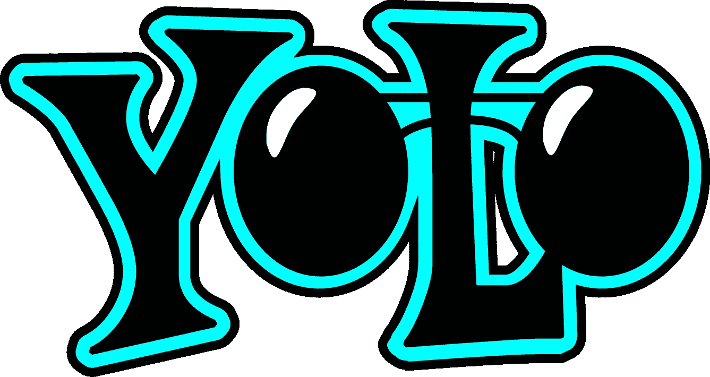

# 使用流行的 YOLO 框架进行目标检测的实用指南——第三部分(带 Python 代码)

> 原文：<https://medium.com/analytics-vidhya/a-practical-guide-to-object-detection-using-the-popular-yolo-framework-part-iii-with-python-67b4cdaf1e2?source=collection_archive---------1----------------------->

如果我们简单地采用一个已经设计好的框架，执行它，并得到想要的结果，我们的生活会有多简单？最小的努力，最大的回报。这不正是我们在任何职业中努力追求的吗？

我感到非常幸运，能够成为我们机器学习社区的一员，在这里，即使是顶尖的科技巨头也拥抱开源技术。当然，在实施概念之前理解和掌握它们是很重要的，但是当顶级行业数据科学家和研究人员为您打下基础时，这总是很有帮助的。

对于像计算机视觉这样的深度学习领域来说尤其如此。不是每个人都有从零开始构建 DL 模型的计算资源。这就是预定义框架和预训练模型派上用场的地方。在本文中，我们将研究一个这样的对象检测框架——YOLO。这是一个非常快速和准确的框架，我们很快就会看到。



到目前为止，在我们详细介绍对象检测的系列文章(下面的链接)中，我们已经看到了所使用的各种算法，以及我们如何使用 R-CNN 家族的算法检测图像中的对象并预测边界框。我们还研究了用 Python 实现 Faster-RCNN。

在第 3 部分中，我们将学习 YOLO 的工作原理，为什么你应该使用它而不是其他的物体检测算法，以及 YOLO 使用的不同技术。一旦我们彻底理解了这个概念，我们将会用 Python 来实现它。这是获得宝贵知识，然后以实际动手的方式应用它的理想指南。

*我强烈建议在开始阅读本指南之前先阅读前两部分:*

*   [*基本物体检测算法分步介绍(上)*](https://www.analyticsvidhya.com/blog/2018/10/a-step-by-step-introduction-to-the-basic-object-detection-algorithms-part-1/)
*   [*快速 R-CNN 算法在目标检测中的实际应用(下)*](https://www.analyticsvidhya.com/blog/2018/11/implementation-faster-r-cnn-python-object-detection/)

# 目录

1.  什么是 YOLO，为什么有用？
2.  YOLO 框架是如何运作的？
3.  如何对包围盒进行编码？
4.  并集上的交集和非最大抑制
5.  锚箱
6.  结合以上所有的想法
7.  用 Python 实现 YOLO

# 什么是 YOLO，为什么有用？

我们在第 1 部分中看到的 R-CNN 系列技术主要使用区域来定位图像中的对象。该网络不查看整个图像，只查看图像中包含物体的可能性较高的部分。

另一方面，YOLO 框架(你只看一次)以不同的方式处理对象检测。它在单个实例中获取整个图像，并预测这些框的边界框坐标和类别概率。使用 YOLO 的最大优势是其超强的速度——速度快得令人难以置信，每秒可以处理 45 帧。YOLO 也理解广义对象表示。

这是用于对象检测的最佳算法之一，并且已经显示出与 R-CNN 算法相当类似的性能。在接下来的章节中，我们将学习 YOLO 算法中使用的不同技术。下面的解释是受 [Andrew NG 的目标探测课程](https://www.coursera.org/learn/convolutional-neural-networks)的启发，该课程对我理解 YOLO 的工作有很大帮助。

# YOLO 框架是如何运作的？

既然我们已经理解了为什么 YOLO 是一个如此有用的框架，让我们进入它实际上是如何工作的。在这一节中，我已经提到了 YOLO 在给定图像中检测物体所遵循的步骤。

*   YOLO 首先拍摄一张输入图像:


*   然后，该框架将输入图像划分成网格(比如 3×3 网格):


*   在每个网格上应用图像分类和定位。然后，YOLO 预测物体的边界框及其相应的类别概率(当然，如果找到的话)。

很简单，不是吗？让我们分解每一个步骤，以便更好地理解我们刚刚学到的内容。

我们需要将标记的数据传递给模型，以便对其进行训练。假设我们已经将图像划分成大小为 3×3 的网格，并且总共有 3 个类别，我们希望将对象分类到这些类别中。假设这些类分别是行人、汽车和摩托车。因此，对于每个网格单元，标签 y 将是一个八维向量:


这里，

*   pc 定义一个对象是否出现在网格中(它是概率)
*   如果有对象，bx，by，bh，bw 指定边界框
*   c1、c2、c3 代表类别。因此，如果对象是汽车，c2 将是 1，c1 & c3 将是 0，依此类推

假设我们从上面的示例中选择了第一个网格:


由于此网格中没有对象，pc 将为零，此网格的 y 标签将为:


这里，'？'意味着 bx、by、bh、bw、c1、c2 和 c3 包含什么并不重要，因为网格中没有对象。让我们取另一个网格，其中有一辆汽车(c2 = 1):


在我们为这个网格写 y 标签之前，重要的是先理解 YOLO 是如何决定网格中是否真的有一个物体的。在上面的图像中，有两个对象(两辆汽车)，所以 YOLO 将采取这两个对象的中点，这些对象将被分配到包含这些对象的中点的网格。汽车左中网格的 y 标签将是:


由于这个网格中有一个对象，pc 将等于 1。bx，by，bh，bw 将相对于我们正在处理的特定网格单元进行计算。由于 car 是第二类，c2 = 1，c1 和 c3 = 0。因此，对于 9 个网格中的每一个，我们都有一个 8 维的输出向量。该输出将具有 3 X 3 X 8 的形状。

现在我们有了一个输入图像和它对应的目标向量。使用上面的例子(输入图像 100 X 100 X 3，输出 3 X 3 X 8)，我们的模型将被训练如下:


我们将运行前向和后向传播来训练我们的模型。在测试阶段，我们将图像传递给模型，并向前传播，直到我们获得输出 y。为了保持简单，我在这里使用 3 X 3 网格解释了这一点，但通常在现实世界中，我们采用更大的网格(可能是 19 X 19)。

即使一个对象跨越多个网格，它也只会被指定给其中点所在的单个网格。我们可以通过增加网格的数量(例如 19 X 19)来减少多个对象出现在同一个网格单元中的机会。

# 如何对包围盒进行编码？

正如我前面提到的，bx、by、bh 和 bw 是相对于我们正在处理的网格单元计算的。让我们用一个例子来理解这个概念。考虑包含汽车的中右网格:


因此，bx、by、bh 和 bw 将仅相对于该网格进行计算。此网格的 y 标签将为:


pc = 1，因为在这个网格中有一个对象，并且它是一辆汽车，所以 c2 = 1。现在，让我们看看如何决定 bx，by，bh 和 bw。在 YOLO，分配给所有网格的坐标是:


bx，by 是对象中点相对于该网格的 x 和 y 坐标。在这种情况下，它将(大约)bx = 0.4，by = 0.3:


bh 是边界框(上例中的红框)的高度与相应网格单元的高度之比，在我们的例子中大约是 0.9。所以，bh = 0.9。bw 是边界框的宽度与网格单元的宽度之比。所以，bw = 0.5(近似值)。此网格的 y 标签将为:


请注意，bx 和 by 的范围始终在 0 和 1 之间，因为中点始终位于网格内。而在边界框的尺寸大于网格尺寸的情况下，bh 和 bw 可以大于 1。

在下一节中，我们将看到更多的想法，这些想法有可能帮助我们使这个算法的性能更好。

# 并集上的交集和非最大抑制

这里有一些值得思考的东西——我们如何决定预测的边界框给我们的是好结果(还是坏结果)?这就是交集超过并集的地方。它计算实际边界框和预测结合框的交集。考虑汽车的实际和预测边界框，如下所示:


这里，红框是实际的边界框，蓝框是预测的边界框。我们如何决定它是否是一个好的预测？IoU，或交集除以并集，将计算这两个盒子的交集除以并集的面积。该区域将是:


IoU =交点面积/并集面积，即

IoU =黄框面积/绿框面积

如果 IoU 大于 0.5，我们可以说预测足够好。0.5 是我们这里任意取的一个阈值，但是可以根据你的具体问题来改变。直觉上，阈值越大，预测就越好。

还有一种技术可以显著提高 YOLO 的输出，即非最大值抑制。

对象检测算法最常见的问题之一是，它们可能会多次检测一个对象，而不是只检测一次。考虑下图:


在这里，车辆被识别了不止一次。非最大值抑制技术消除了这一点，因此我们只能对每个对象进行一次检测。让我们看看这种方法是如何工作的。

1.它首先查看与每个检测相关联的概率，并取最大的一个。在上图中，0.9 是概率最高的，所以将首先选择概率为 0.9 的框:


2.现在，它会查看图像中的所有其他框。与当前框具有高 IoU 的框被抑制。因此，在我们的示例中，概率为 0.6 和 0.7 的框将被抑制:


3.在框被抑制后，它从所有框中选择下一个概率最高的框，在我们的例子中是 0.8:


4.同样，它将查看该框与其余框的 IoU，并压缩具有高 IoU 的框:


5.我们重复这些步骤，直到所有的框都被选择或压缩，并且我们得到最终的边界框:


这就是非最大抑制的意义所在。我们选择具有最大概率的盒子，并抑制附近具有非最大概率的盒子。让我们快速总结一下我们在本节中看到的关于非最大值抑制算法的要点:

1.  丢弃所有概率小于或等于预定义阈值(比如 0.5)的盒子
2.  其余盒子:
    1。挑选概率最高的盒子，并将其作为输出预测
    2。将 IoU 大于阈值的任何其他框与上述步骤中的输出框一起丢弃
3.  重复步骤 2，直到所有的盒子要么被作为输出预测，要么被丢弃

我们可以使用另一种方法来提高 YOLO 算法的性能——让我们来看看吧！

# 锚箱

我们已经看到，每个网格只能识别一个对象。但是如果一个网格中有多个对象呢？现实中经常会出现这种情况。这就引出了锚盒的概念。考虑下面的图像，分成 3 X 3 的网格:


还记得我们是如何将一个对象分配给网格的吗？我们取了对象的中点，并根据它的位置，将对象分配到相应的网格中。在上面的例子中，两个对象的中点位于同一网格中。对象的实际边界框将是这样的:


我们只能得到两个箱子中的一个，要么是车的，要么是人的。但是如果我们使用锚盒，我们也许能输出两个盒子！我们如何着手做这件事？首先，我们预定义两种不同的形状，称为锚盒或锚盒形状。现在，对于每个网格，我们将有两个输出，而不是一个输出。我们也可以增加锚箱的数量。为了让这个概念更容易理解，我在这里举了两个例子:


这是没有锚定框的 YOLO 的 y 标签的样子:


如果我们有 2 个锚盒，你认为 y 标签会是什么？我希望你在进一步阅读之前花点时间思考一下这个问题。明白了吗？y 标签将是:


前 8 行属于锚盒 1，其余 8 行属于锚盒 2。基于边界框和锚定框形状的相似性，将对象分配给锚定框。因为锚定框 1 的形状类似于人的边界框，所以后者将被指定给锚定框 1，而汽车将被指定给锚定框 2。这种情况下的输出不是 3 X 3 X 8(使用 3 X 3 的网格和 3 个类)，而是 3 X 3 X 16(因为我们使用了 2 个锚点)。

因此，对于每个网格，我们可以根据锚点的数量来检测两个或更多的对象。让我们把我们到目前为止讨论过的所有观点结合起来，并把它们整合到 YOLO 框架中。

# 结合这些想法

在这一节中，我们将首先看到一个 YOLO 模型是如何被训练的，然后是如何对一个新的和以前看不到的图像进行预测。

***训练***

训练我们的模型的输入显然是图像和它们相应的 y 标签。让我们看一个图像，并制作它的 y 标签:


考虑这样一个场景，我们使用一个 3 X 3 的网格，每个网格有两个锚点，有 3 个不同的对象类。因此相应的 y 标签将具有 3×3×16 的形状。现在，假设我们每个网格使用 5 个锚盒，并且类的数量已经增加到 5 个。所以目标将是 3 X 3 X 5 X 5 = 3 X 3 X 25。这就是训练过程是如何完成的——拍摄特定形状的图像，并用 3 X 3 X 16 的目标对其进行映射(这可能会根据网格大小、锚框数量和类别数量而变化)。

***测试***

新的图像将被分成与我们在训练期间选择的相同数量的网格。对于每个网格，模型将预测形状为 3 X 3 X 16 的输出(假设这是目标在训练期间的形状)。该预测中的 16 个值将与训练标签的格式相同。前 8 个值将对应于锚定框 1，其中第一个值将是该网格中对象的概率。值 2–5 将是该对象的边界框坐标，最后三个值将告诉我们该对象属于哪个类。接下来的 8 个值将用于锚框 2，并且采用相同的格式，即，首先是概率，然后是边界框坐标，最后是类。

最后，非最大值抑制技术将被应用到预测的盒子上，以获得每个对象的单个预测。

这让我们结束了理解 YOLO 算法如何工作的理论方面，从训练模型开始，然后为对象生成预测框。以下是 YOLO 算法遵循的确切维度和步骤:

*   获取形状(608，608，3)的输入图像
*   将该图像传递给卷积神经网络(CNN ),后者返回(19，19，5，85)维输出
*   将上述输出的最后两个维度扁平化得到的输出体积为(19，19，425):
    a .这里，一个 19 X 19 的网格的每个单元格返回 425 个数字
    b. 425 = 5 * 85，其中 5 是每个网格的锚盒数
    c. 85 = 5 + 80，其中 5 是(pc，bx，by，bh，bw)80 是我们要检测的类数
*   最后，我们进行 IoU 和非最大值抑制，以避免选择重叠的框

# 用 Python 实现 YOLO

是时候启动我们的 Jupyter 笔记本(或您喜欢的 IDE)并最终以代码的形式实现我们的学习了！这就是我们到目前为止所做的，所以让我们开始吧。

我们将在本节中看到的实现 YOLO 的代码摘自 [Andrew NG 的 GitHub 知识库](https://github.com/enggen/Deep-Learning-Coursera)中关于深度学习的内容。您还需要下载这个 [zip 文件](https://drive.google.com/file/d/1X79ZtIBp-Q70THZapcTeLqffxIqbLx_I/view?usp=sharing)，其中包含运行这个代码所需的预训练权重。

让我们首先定义一些函数，这些函数将帮助我们选择高于某个阈值的框，找到 IoU，并对它们应用非最大抑制。然而，在做任何事情之前，我们将首先导入所需的库:

```
import os
import matplotlib.pyplot as plt
from matplotlib.pyplot import imshow
import scipy.io
import scipy.misc
import numpy as np
import pandas as pd
import PIL
import tensorflow as tf
from skimage.transform import resize
from keras import backend as K
from keras.layers import Input, Lambda, Conv2D
from keras.models import load_model, Model
from yolo_utils import read_classes, read_anchors, generate_colors, preprocess_image, draw_boxes, scale_boxes
from yad2k.models.keras_yolo import yolo_head, yolo_boxes_to_corners, preprocess_true_boxes, yolo_loss, yolo_body

%matplotlib inline
```

现在，让我们创建一个基于概率和阈值过滤盒子的函数:

```
def yolo_filter_boxes(box_confidence, boxes, box_class_probs, threshold = .6):
    box_scores = box_confidence*box_class_probs
    box_classes = K.argmax(box_scores,-1)
    box_class_scores = K.max(box_scores,-1)
    filtering_mask = box_class_scores>threshold
    scores = tf.boolean_mask(box_class_scores,filtering_mask)
    boxes = tf.boolean_mask(boxes,filtering_mask)
    classes = tf.boolean_mask(box_classes,filtering_mask)

    return scores, boxes, classes
```

接下来，我们将定义一个函数来计算两个盒子之间的 IoU:

```
def iou(box1, box2):
    xi1 = max(box1[0],box2[0])
    yi1 = max(box1[1],box2[1])
    xi2 = min(box1[2],box2[2])
    yi2 = min(box1[3],box2[3])
    inter_area = (yi2-yi1)*(xi2-xi1)
    box1_area = (box1[3]-box1[1])*(box1[2]-box1[0])
    box2_area = (box2[3]-box2[1])*(box2[2]-box2[0])
    union_area = box1_area+box2_area-inter_area
    iou = inter_area/union_area

    return iou
```

让我们为非最大值抑制定义一个函数:

```
def yolo_non_max_suppression(scores, boxes, classes, max_boxes = 10, iou_threshold = 0.5):
    max_boxes_tensor = K.variable(max_boxes, dtype='int32')
    K.get_session().run(tf.variables_initializer([max_boxes_tensor]))
    nms_indices = tf.image.non_max_suppression(boxes,scores,max_boxes,iou_threshold)
    scores = K.gather(scores,nms_indices)
    boxes = K.gather(boxes,nms_indices)
    classes = K.gather(classes,nms_indices)

    return scores, boxes, classes
```

我们现在有了计算 IoU 和执行非最大值抑制的函数。我们从形状(19，19，5，85)的 CNN 得到输出。因此，我们将创建一个形状为(19，19，5，85)的随机体积，然后预测边界框:

```
yolo_outputs = (tf.random_normal([19, 19, 5, 1], mean=1, stddev=4, seed = 1),
                   tf.random_normal([19, 19, 5, 2], mean=1, stddev=4, seed = 1),
                   tf.random_normal([19, 19, 5, 2], mean=1, stddev=4, seed = 1),
                   tf.random_normal([19, 19, 5, 80], mean=1, stddev=4, seed = 1))
```

最后，我们将定义一个函数，该函数将 CNN 的输出作为输入，并返回被抑制的框:

```
def yolo_eval(yolo_outputs, image_shape = (720., 1280.), max_boxes=10, score_threshold=.6, iou_threshold=.5):
    box_confidence, box_xy, box_wh, box_class_probs = yolo_outputs
    boxes = yolo_boxes_to_corners(box_xy, box_wh)
    scores, boxes, classes = yolo_filter_boxes(box_confidence, boxes, box_class_probs, threshold = score_threshold)
    boxes = scale_boxes(boxes, image_shape)
    scores, boxes, classes = yolo_non_max_suppression(scores, boxes, classes, max_boxes, iou_threshold)

    return scores, boxes, classes
```

让我们看看如何使用 *yolo_eval* 函数来预测我们上面创建的随机体积:

```
scores, boxes, classes = yolo_eval(yolo_outputs)
```

前景如何？

```
with tf.Session() as test_b:
    print("scores[2] = " + str(scores[2].eval()))
    print("boxes[2] = " + str(boxes[2].eval()))
    print("classes[2] = " + str(classes[2].eval()))
```


“分数”表示对象出现在体积中的可能性。“box”返回检测到的对象的(x1，y1，x2，y2)坐标。“类”是已识别对象的类。

现在，让我们对新图像使用预训练的 YOLO 算法，看看它是如何工作的:

```
sess = K.get_session()
class_names = read_classes("model_data/coco_classes.txt")
anchors = read_anchors("model_data/yolo_anchors.txt")

yolo_model = load_model("model_data/yolo.h5")
```

在加载了类和预训练模型之后，让我们使用上面定义的函数来获得 *yolo_outputs* 。

```
yolo_outputs = yolo_head(yolo_model.output, anchors, len(class_names))
```

现在，我们将定义一个函数来预测边界框并保存包含这些边界框的图像:

```
def predict(sess, image_file):
    image, image_data = preprocess_image("images/" + image_file, model_image_size = (608, 608))
    out_scores, out_boxes, out_classes = sess.run([scores, boxes, classes], feed_dict={yolo_model.input: image_data, K.learning_phase(): 0})

    print('Found {} boxes for {}'.format(len(out_boxes), image_file))

    # Generate colors for drawing bounding boxes.
    colors = generate_colors(class_names)

    # Draw bounding boxes on the image file
    draw_boxes(image, out_scores, out_boxes, out_classes, class_names, colors)

    # Save the predicted bounding box on the image
    image.save(os.path.join("out", image_file), quality=90)

    # Display the results in the notebook
    output_image = scipy.misc.imread(os.path.join("out", image_file))

    plt.figure(figsize=(12,12))
    imshow(output_image)

    return out_scores, out_boxes, out_classes
```

接下来，我们将读取一幅图像，并使用*预测*功能进行预测:

```
img = plt.imread('images/img.jpg')
image_shape = float(img.shape[0]), float(img.shape[1])
scores, boxes, classes = yolo_eval(yolo_outputs, image_shape)
```

最后，让我们绘制预测图:

```
out_scores, out_boxes, out_classes = predict(sess, "img.jpg")
```


还不错！我尤其喜欢的是，模型正确地搭载了微型面包车中的人。

# 结束注释

以下是我们在本指南中涵盖和实施的内容的简要总结:

*   YOLO 是一种最先进的对象检测算法，它的速度和准确性令人难以置信
*   我们将输入图像发送到 CNN，它输出一个 19×19×5×85 维度的体积。
*   这里，网格大小为 19×19，每个网格包含 5 个盒子
*   我们使用非最大值抑制过滤所有的框，只保留精确的框，并消除重叠的框

YOLO 是我一直以来最喜欢的框架之一，我相信一旦你在自己的机器上实现了代码，你就会明白为什么了。这是一个用流行的计算机视觉算法弄脏手的好方法。如果您对本指南有任何问题或反馈，请在下面的评论区联系我。

*原载于 2018 年 12 月 6 日*[*www.analyticsvidhya.com*](https://www.analyticsvidhya.com/blog/2018/12/practical-guide-object-detection-yolo-framewor-python/)*。*