# 用于目标检测的快速 R-CNN 算法的实际实现(第 2 部分 Python 代码)

> 原文：<https://medium.com/analytics-vidhya/a-practical-implementation-of-the-faster-r-cnn-algorithm-for-object-detection-part-2-with-cac45dada619?source=collection_archive---------0----------------------->

您使用哪种算法来执行对象检测任务？为了在最少的时间内构建最精确的模型，我已经尝试了相当多的方法。这个旅程跨越了多个黑客马拉松和真实世界的数据集，通常会将我引向 R-CNN 算法家族。

它对我来说是一个非常有用的框架，这就是为什么我决定以一系列文章的形式写下我的学习成果。这个系列的目的是展示不同类型的 R-CNN 算法是多么有用。第一部分从我们的社区获得了压倒性的积极回应，我很高兴能够呈现第二部分！

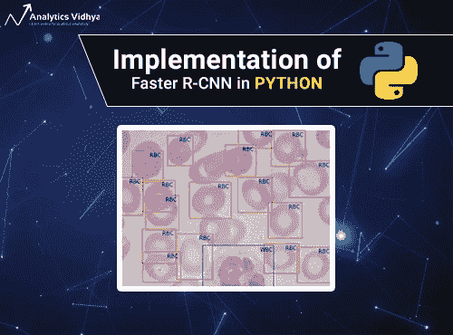

在本文中，我们将首先简要总结我们在第 1 部分中学到的内容，然后深入研究 R-CNN 家族中速度最快的成员—更快的 R-CNN 的实现。如果您需要首先更新您的对象检测概念，我强烈推荐您通读这篇文章:[基本对象检测算法的逐步介绍(第 1 部分)](https://www.analyticsvidhya.com/blog/2018/10/a-step-by-step-introduction-to-the-basic-object-detection-algorithms-part-1/)。

我们将在这里处理一个非常有趣的数据集，所以让我们开始吧！

# 目录

1.  目标检测的不同 R-CNN 算法概述
2.  理解问题陈述
3.  设置系统
4.  数据探索
5.  实现更快的 R-CNN

# 目标检测的不同 R-CNN 算法概述

让我们快速总结一下我们在第一篇文章中看到的 R-CNN 家族中的不同算法(R-CNN、快速 R-CNN、更快速 R-CNN)。这将有助于为我们稍后的实现部分打下基础，那时我们将预测出现在以前看不见的图像(新数据)中的边界框。

R-CNN 使用选择性搜索从给定图像中提取一系列区域，然后检查这些框中是否包含物体。我们首先提取这些区域，对于每个区域，使用 CNN 提取特定的特征。最后，这些特征然后被用于检测物体。不幸的是，R-CNN 变得相当慢，因为这一过程涉及多个步骤。


R-CNN

另一方面，快速 R-CNN 将整个图像传递给生成感兴趣区域的 ConvNet(而不是传递从图像中提取的区域)。此外，它不是使用三个不同的模型(如我们在 R-CNN 中看到的)，而是使用一个模型，该模型从区域中提取特征，将它们分类到不同的类中，并返回边界框。

所有这些步骤都是同时进行的，因此与 R-CNN 相比，它的执行速度更快。然而，快速 R-CNN 在应用于大型数据集时不够快，因为它还使用选择性搜索来提取区域。

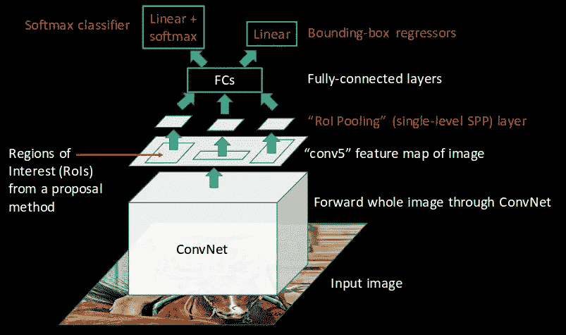

快速 R-CNN

更快的 R-CNN 通过用区域提议网络(RPN)代替它来解决选择性搜索的问题。我们首先使用 ConvNet 从输入图像中提取特征映射，然后将这些映射传递给 RPN，RPN 返回对象建议。最后，对这些图进行分类并预测包围盒。


更快的 R-CNN

我在下面总结了快速 R-CNN 算法检测图像中的对象所遵循的步骤:

1.  获取一个输入图像，并将其传递给 ConvNet，后者返回该图像的特征映射
2.  在这些特征地图上应用区域提议网络(RPN)并获得对象提议
3.  应用投资回报池层，将所有提案缩小到相同的大小
4.  最后，将这些建议传递给完全连接的层，以便对图像的任何预测边界框进行分类

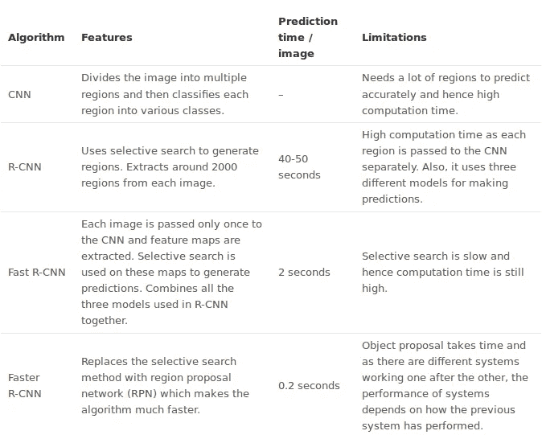

有什么比用表格形式更好的方法来比较这些不同的算法呢？所以给你！

既然我们已经掌握了这个话题，是时候从理论跳到文章的实践部分了。让我们使用一个非常酷(而且相当有用)的数据集实现更快的 R-CNN，它具有潜在的现实生活应用！

# 理解问题陈述

我们将研究医疗保健相关的数据集，目的是解决血细胞检测问题。我们的任务是通过显微图像读数检测每幅图像中的所有红细胞(RBCs)、白细胞(WBCs)和血小板。下面是我们最终预测的样本:

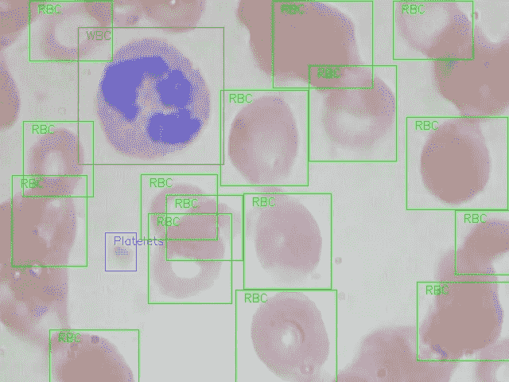

选择这个数据集的原因是，我们血流中的红细胞、白细胞和血小板的密度提供了许多关于免疫系统和血红蛋白的信息。这可以帮助我们潜在地确定一个人是否健康，如果在他们的血液中发现任何差异，可以迅速采取行动进行诊断。

通过显微镜手动观察样品是一个繁琐的过程。这就是深度学习模型发挥如此重要作用的地方。他们可以从显微图像中以令人印象深刻的精度对血细胞进行分类和检测。

**我们挑战的全血细胞检测数据集可以从这里**[](https://github.com/Shenggan/BCCD_Dataset)****下载。**针对本文的范围，我对数据做了一点小小的修改:**

*   **边界框已从给定的。xml 格式转换为. csv 格式**
*   **我还在整个数据集上创建了训练集和测试集分割，方法是随机挑选图像进行分割**

***请注意，我们将使用流行的 Keras 框架和 Python 中的 TensorFlow 后端来训练和构建我们的模型。***

# **设置系统**

**在我们真正进入模型构建阶段之前，我们需要确保已经安装了正确的库和框架。运行此项目需要以下库:**

*   **熊猫**
*   **matplotlib**
*   **张量流**
*   **keras — 2.0.3**
*   **numpy**
*   **opencv-python**
*   **sklearn**
*   **h5py**

**如果您安装了 Anaconda 和 Jupyter 笔记本，上面提到的大多数库都已经在您的机器上了。另外，我建议**从** [**这个链接**](https://drive.google.com/file/d/1R4O0stMW9Wjksg-o7c54svntDiyask1B/view?usp=sharing) 下载 requirement.txt 文件，并使用它来安装其余的库。为此，请在终端中键入以下命令:**

```
pip install -r requirement.txt
```

**好了，我们的系统现在设置好了，我们可以继续处理数据了！**

# **数据探索**

**首先探索我们拥有的数据总是一个好主意(坦白地说，是一个强制性的步骤)。这不仅有助于我们发掘隐藏的模式，而且有助于我们对正在处理的东西有一个有价值的全面的了解。我从整个数据集创建的三个文件是:**

1.  ****train_images:** 我们将用来训练模型的图像。我们在这个文件夹中有类和每个类的实际边界框。**
2.  ****test_images:** 该文件夹中的图像将用于使用训练好的模型进行预测。该集合缺少类和这些类的边界框。**
3.  ****train.csv:** 包含每个图像的名称、类别和边界框坐标。一个图像可以有多行，因为一个图像可以有多个对象。**

**让我们读一下。csv 文件(您可以创建自己的。csv 文件)并打印出前几行。为此，我们需要首先导入以下库:**

```
# importing required libraries
import pandas as pd
import matplotlib.pyplot as plt
%matplotlib inline
from matplotlib import patches# read the csv file using read_csv function of pandas
train = pd.read_csv(‘train.csv’)
train.head()
```

**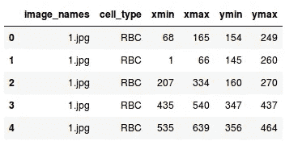**

**在训练文件中有 6 列。让我们了解一下每一列代表什么:**

1.  ****图像名称:**包含图像的名称**
2.  ****单元格类型:**表示单元格的类型**
3.  ****xmin:** 图像左下部分的 x 坐标**
4.  ****xmax:** 图像右上部分的 x 坐标**
5.  ****ymin:** 图像左下部分的 y 坐标**
6.  ****ymax:** 图像右上部分的 y 坐标**

**现在，让我们打印一张图像来直观显示我们正在处理的内容:**

```
# reading single image using imread function of matplotlib
image = plt.imread('images/1.jpg')
plt.imshow(image)
```

**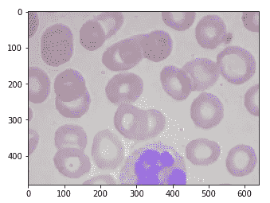**

**这是血细胞图像的样子。这里，蓝色部分代表白细胞，略带红色的部分代表红细胞。让我们看看在我们的训练集中有多少图像和不同类型的类。**

```
# Number of unique training images
train['image_names'].nunique()
```

**所以，我们有 254 张训练图像。**

```
# Number of classes
train['cell_type'].value_counts()
```

**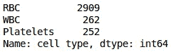**

**我们有三种不同的细胞，即红细胞、白细胞和血小板。最后，让我们看看带有检测到的对象的图像是什么样子的:**

```
fig = plt.figure()

#add axes to the image
ax = fig.add_axes([0,0,1,1])

# read and plot the image
image = plt.imread('images/1.jpg')
plt.imshow(image)

# iterating over the image for different objects
for _,row in train[train.image_names == "1.jpg"].iterrows():
    xmin = row.xmin
    xmax = row.xmax
    ymin = row.ymin
    ymax = row.ymax

    width = xmax - xmin
    height = ymax - ymin

    # assign different color to different classes of objects
    if row.cell_type == 'RBC':
        edgecolor = 'r'
        ax.annotate('RBC', xy=(xmax-40,ymin+20))
    elif row.cell_type == 'WBC':
        edgecolor = 'b'
        ax.annotate('WBC', xy=(xmax-40,ymin+20))
    elif row.cell_type == 'Platelets':
        edgecolor = 'g'
        ax.annotate('Platelets', xy=(xmax-40,ymin+20))

    # add bounding boxes to the image
    rect = patches.Rectangle((xmin,ymin), width, height, edgecolor = edgecolor, facecolor = 'none')

    ax.add_patch(rect)
```

**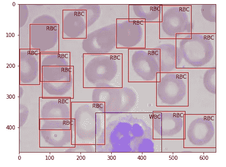**

**这是一个培训示例的样子。我们有不同的类和它们相应的边界框。现在让我们在这些图像上训练我们的模型。我们将使用 *keras_frcnn* 库来训练我们的模型，并对测试图像进行预测。**

# **实现更快的 R-CNN**

**为了实现更快的 R-CNN 算法，我们将遵循 Github 库中提到的步骤。因此，作为第一步，确保您克隆了这个存储库。打开一个新的终端窗口，键入以下命令:**

```
git clone [https://github.com/kbardool/keras-frcnn.git](https://github.com/kbardool/keras-frcnn.git)
```

**将 *train_images* 和 *test_images* 文件夹以及 *train.csv* 文件移动到克隆的存储库中。为了在新数据集上训练模型，输入的格式应该是:**

```
filepath,x1,y1,x2,y2,class_name
```

**在哪里，**

*   ***文件路径*是训练图像的路径**
*   ***x1* 是包围盒的 xmin 坐标**
*   ***y1* 是包围盒的 ymin 坐标**
*   ***x2* 是包围盒的 xmax 坐标**
*   ***y2* 是包围盒的 ymax 坐标**
*   ***class_name* 是该边界框中的类的名称**

**我们需要将。csv 格式转换为. txt 文件，该文件将具有与上述相同的格式。创建一个新的数据帧，按照格式将所有值填入该数据帧，然后保存为. txt 文件。**

```
data = pd.DataFrame()
data['format'] = train['image_names']

# as the images are in train_images folder, add train_images before the image name
for i in range(data.shape[0]):
    data['format'][i] = 'train_images/' + data['format'][i]

# add xmin, ymin, xmax, ymax and class as per the format required
for i in range(data.shape[0]):
    data['format'][i] = data['format'][i] + ',' + str(train['xmin'][i]) + ',' + str(train['ymin'][i]) + ',' + str(train['xmax'][i]) + ',' + str(train['ymax'][i]) + ',' + train['cell_type'][i]

data.to_csv('annotate.txt', header=None, index=None, sep=' ')
```

**下一步是什么？**

**训练我们的模特！我们将使用 *train_frcnn.py* 文件来训练模型。**

```
cd keras-frcnn
python train_frcnn.py -o simple -p annotate.txt
```

**由于数据的大小，需要一段时间来训练模型。如果可能的话，你可以使用 GPU 来加快训练的速度。作为一种替代选择，您也可以尝试减少历元的数量。要更改时期数，请转到克隆存储库中的 *train_frcnn.py* 文件，并相应地更改 *num_epochs* 参数。**

**每当模型看到改进时，该特定时期的权重将保存在与“ *model_frcnn.hdf5* ”相同的目录中。当我们对测试集进行预测时，将使用这些权重。**

**训练模型和获取权重可能需要很长时间，这取决于您的机器配置。我建议使用我在训练模型大约 500 个时期后得到的权重。**你可以从这里** 下载这些权重 [**。确保将这些权重保存在克隆的存储库中。**](https://drive.google.com/file/d/1OmCKlUEYmTjg_jaaN-IQm81eHROU-Gyl/view?usp=sharing)**

**所以我们的模型已经训练好了，权重也设定好了。预测时间到了！ *Keras_frcnn* 对新图像进行预测，并将其保存在新文件夹中。我们只需在 *test_frcnn.py* 文件中做两处修改来保存图像:**

1.  **删除这个文件最后一行的注释:
    *cv2.imwrite('。/results_imgs/{}。巴布亚新几内亚。格式(idx)，img)***
2.  **在这个文件的倒数第二行和倒数第三行添加注释:
    # *cv2.imshow('img '，img)
    # cv2.waitKey(0)***

**让我们对新图像进行预测:**

```
python test_frcnn.py -p test_images
```

**最后，带有检测对象的图像将保存在“results_imgs”文件夹中。下面是我在实现更快的 R-CNN 后得到的几个预测的例子:**

**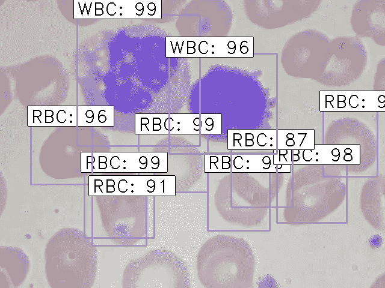**

***结果 1***

**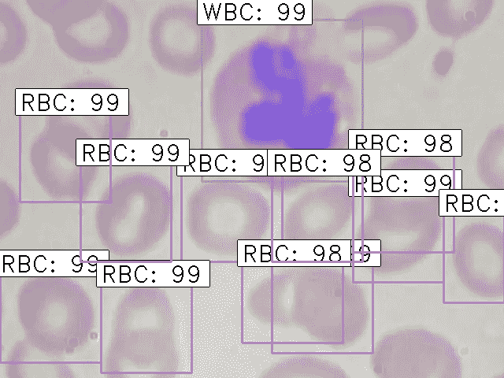**

***结果二***

**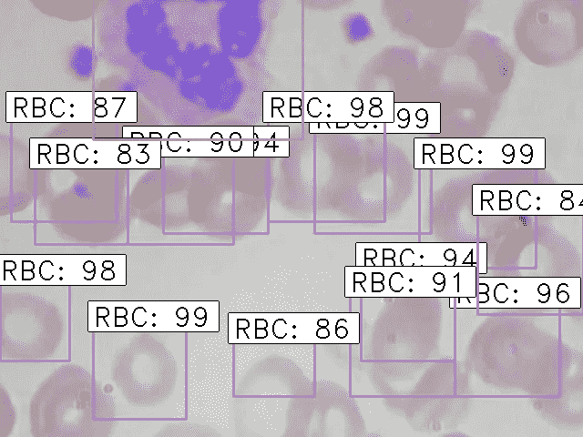**

***结果 3***

**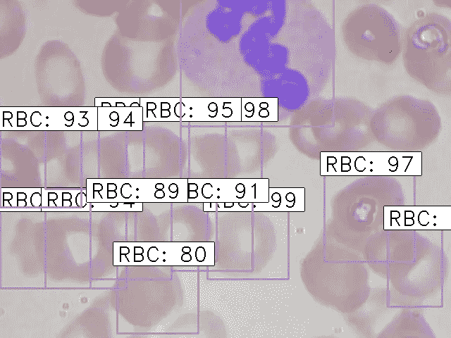**

***结果 4***

# **结束注释**

**R-CNN 算法已经真正成为物体探测任务的游戏规则改变者。近年来，计算机视觉应用程序的数量突然激增，R-CNN 是其中大多数的核心。**

***Keras_frcnn* 被证明是一个优秀的对象检测库，在本系列的下一篇文章中，我们将关注更高级的技术，如 YOLO、SSD 等。**

**如果你对我们这里的内容有任何疑问或建议，请在下面的评论区发表，我很乐意与你联系！**

***原载于 2018 年 11 月 4 日*[*www.analyticsvidhya.com*](https://www.analyticsvidhya.com/blog/2018/11/implementation-faster-r-cnn-python-object-detection/)*。***