# 回归的 K-最近邻算法实用介绍(带 Python 代码)

> 原文：<https://medium.com/analytics-vidhya/a-practical-introduction-to-k-nearest-neighbors-algorithm-for-regression-with-python-code-a81223eb6ad?source=collection_archive---------3----------------------->

在我遇到的所有机器学习算法中，KNN 无疑是最容易上手的。尽管它很简单，但它被证明在某些任务中非常有效(正如您将在本文中看到的)。

甚至更好？分类和回归问题都可以用！然而，它更常用于分类问题。我很少在任何回归任务中看到 KNN 的实现。我在这里的目的是说明并强调当目标变量本质上是连续的时，KNN 是如何同样有效的。

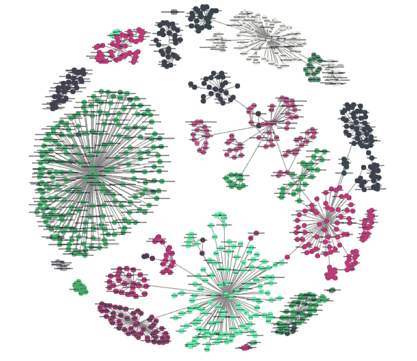

在本文中，我们将首先了解 KNN 算法背后的直觉，看看计算点之间距离的不同方法，然后最终在 Big Mart 销售数据集上用 Python 实现该算法。我们走吧！

# 目录

1.  一个简单的例子来理解 KNN 背后的直觉
2.  KNN 算法是如何工作的？
3.  计算两点间距离的方法
4.  k 因子怎么选？
5.  处理数据集
6.  额外资源

# 1.一个简单的例子来理解 KNN 背后的直觉

让我们从一个简单的例子开始。考虑下表—它包含 10 个人的身高、年龄和体重(目标)值。如你所见，ID11 的重量值丢失了。我们需要根据身高和年龄来预测这个人的体重。

*注:本表数据不代表实际值。这仅仅是作为一个例子来解释这个概念。*

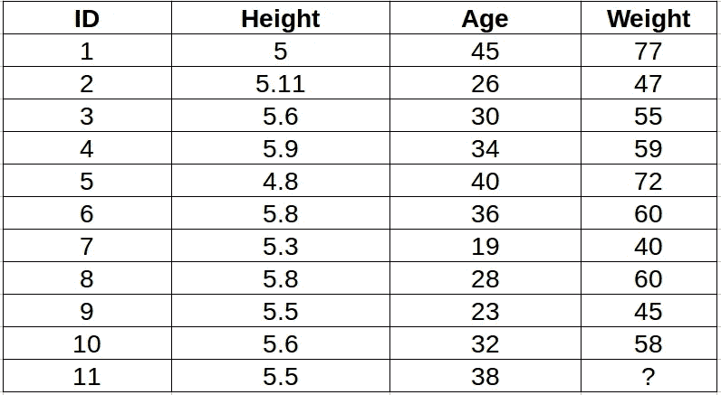

为了更清楚地理解这一点，下面是上表中身高与年龄的关系图:

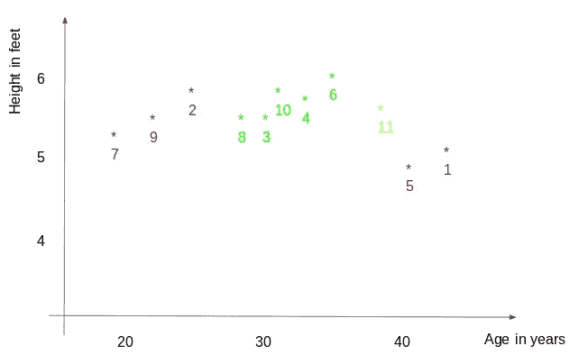

在上图中，y 轴代表人的身高(以英尺为单位)，x 轴代表年龄(以岁为单位)。这些点根据 ID 值进行编号。黄点(ID 11)是我们的测试点。

如果我让你根据剧情来确定 ID11 的重量，你会怎么回答？你可能会说，因为 ID11 的**更靠近点 5 和 1 的**，所以它的重量必须与这些 ID 相似，可能在 72-77 千克之间(表中 ID1 和 ID5 的重量)。这实际上是有道理的，但是你认为算法如何预测这些值呢？我们将在本文中找到答案。

# 2.KNN 算法是如何工作的？

正如我们在上面看到的，KNN 可以用于分类和回归问题。该算法使用“**特征相似度**来预测任何新数据点的值。这意味着根据新点与训练集中的点的相似程度为其赋值。从我们的示例中，我们知道 ID11 的身高和年龄与 ID1 和 ID5 相似，因此体重也大致相同。

如果这是一个分类问题，我们会把模式作为最终的预测。在这种情况下，我们有两个权重值— 72 和 77。任何猜测最终值将如何计算？取这些值的平均值作为最终预测值。

下面是该算法的逐步解释:

1.  首先，计算新点和每个训练点之间的距离。

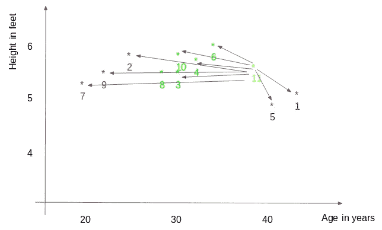

2.选择最近的 k 个数据点(基于距离)。在本例中，如果 k 值为 3，将选择点 1、5、6。在本文的后面，我们将进一步探讨选择正确的 k 值的方法。

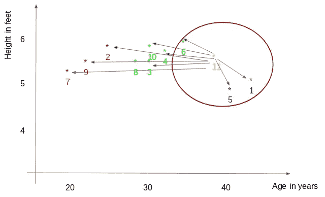

3.这些数据点的平均值是新点的最终预测值。在这里，我们的重量为 ID11 = (77+72+60)/3 = 69.66 千克。

在接下来的几节中，我们将详细讨论这三个步骤。

# 3.计算两点间距离的方法

**第一步**是计算新点和每个训练点之间的距离。计算这种距离有各种方法，其中最常见的方法是欧几里德距离、曼哈顿距离(用于连续)和汉明距离(用于分类)。

1.  **欧几里德距离:**欧几里德距离的计算方法是新点(x)和现有点(y)的平方差之和的平方根。
2.  **曼哈顿距离**:这是使用绝对差之和的真实向量之间的距离。

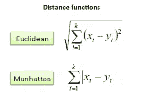

**3。汉明距离**:用于分类变量。如果预测值(x)和实际值(y)相同，距离 D 将等于 0。否则 D=1。

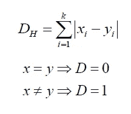

一旦一个新的观察距离我们的训练集中的点的距离已经被测量，下一步是挑选最近的点。要考虑的点数由 k 值确定。

# 4.k 因子怎么选？

**第二步**是选择 k 值。这决定了我们在为任何新观察值赋值时要查看的相邻要素的数量。

在我们的例子中，对于 k = 3 的值，最接近的点是 ID1、ID5 和 ID6。

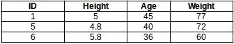

ID11 的重量预测为:

```
ID11 = (77+72+60)/3 ID11 = 69.66 kg
```

对于 k=5 的值，最接近的点将是 ID1、ID4、ID5、ID6、ID10。

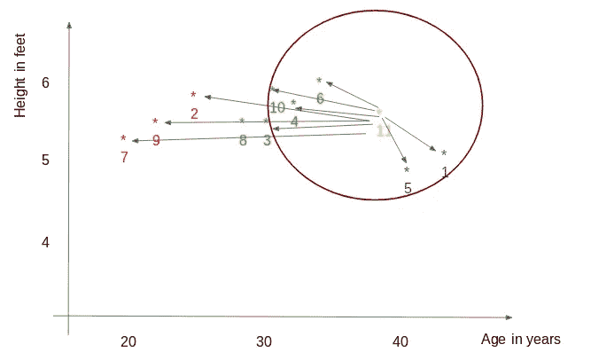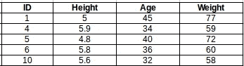

对 ID11 的预测是:

```
ID 11 =  (77+59+72+60+58)/5 ID 11 = 65.2 kg
```

我们注意到，基于 k 值，最终结果往往会发生变化。那怎么才能算出 k 的最优值呢？让我们基于我们的训练和验证集的误差计算来决定它(毕竟，最小化误差是我们的最终目标！).

看看下面不同 k 值的训练误差和验证误差的图表。

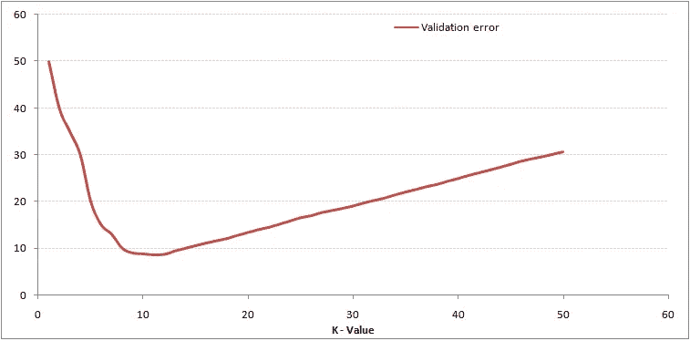

对于非常低的 k 值(假设 k=1)，模型过拟合训练数据，这导致验证集的错误率很高。另一方面，对于较高的 k 值，模型在训练集和验证集上都表现不佳。如果你仔细观察，验证误差曲线在 k = 9 时达到最小值。这个 k 值是模型的最佳值(它将因不同的数据集而异)。这条曲线被称为“**肘形曲线**”(因为它的形状像肘)，通常用于确定 k 值。

您还可以使用网格搜索技术来查找最佳 k 值。我们将在下一节中实现这一点。

# 5.处理数据集(Python 代码)

到目前为止，您必须对算法有一个清晰的理解。如果你对此有任何问题，请在下面的评论区留言，我很乐意回答。我们现在将继续在数据集上实现该算法。我已经使用了 Big Mart 销售数据集来展示这个实现，你可以从[这个链接](https://datahack.analyticsvidhya.com/contest/practice-problem-big-mart-sales-iii/)下载。

**1。读取文件**

```
import pandas as pd 
df = pd.read_csv('train.csv') 
df.head()
```

**2。估算缺失值**

```
df.isnull().sum() 
#missing values in Item_weight and Outlet_size needs to be imputedmean = df['Item_Weight'].mean() #imputing item_weight with mean df['Item_Weight'].fillna(mean, inplace =True) 
mode = df['Outlet_Size'].mode() #imputing outlet size with mode 
df['Outlet_Size'].fillna(mode[0], inplace =True)
```

**3。处理分类变量并删除 id 列**

```
df.drop(['Item_Identifier', 'Outlet_Identifier'], axis=1, inplace=True) df = pd.get_dummies(df)
```

**4。创建训练和测试集**

```
from sklearn.model_selection import train_test_split 
train , test = train_test_split(df, test_size = 0.3) x_train = train.drop('Item_Outlet_Sales', axis=1) 
y_train = train['Item_Outlet_Sales'] x_test = test.drop('Item_Outlet_Sales', axis = 1) 
y_test = test['Item_Outlet_Sales']
```

**5。预处理——缩放特征**

```
from sklearn.preprocessing import MinMaxScaler
scaler = MinMaxScaler(feature_range=(0, 1))

x_train_scaled = scaler.fit_transform(x_train)
x_train = pd.DataFrame(x_train_scaled)

x_test_scaled = scaler.fit_transform(x_test)
x_test = pd.DataFrame(x_test_scaled)
```

**6。让我们看看不同 k 值的错误率**

```
#import required packages
from sklearn import neighbors
from sklearn.metrics import mean_squared_error 
from math import sqrt
import matplotlib.pyplot as plt
%matplotlib inlinermse_val = [] #to store rmse values for different k
for K in range(20):
    K = K+1
    model = neighbors.KNeighborsRegressor(n_neighbors = K)

    model.fit(x_train, y_train)  #fit the model
    pred=model.predict(x_test) #make prediction on test set
    error = sqrt(mean_squared_error(y_test,pred)) #calculate rmse
    rmse_val.append(error) #store rmse values
    print('RMSE value for k= ' , K , 'is:', error)
```

输出:

```
RMSE value for k = 1 is: 1579.8352322344945
RMSE value for k = 2 is: 1362.7748806138618
RMSE value for k = 3 is: 1278.868577489459
RMSE value for k = 4 is: 1249.338516122638
RMSE value for k = 5 is: 1235.4514224035129
RMSE value for k = 6 is: 1233.2711649472913
RMSE value for k = 7 is: 1219.0633086651026
RMSE value for k = 8 is: 1222.244674933665
RMSE value for k = 9 is: 1219.5895059285074
RMSE value for k = 10 is: 1225.106137547365
RMSE value for k = 11 is: 1229.540283771085
RMSE value for k = 12 is: 1239.1504407152086
RMSE value for k = 13 is: 1242.3726040709887
RMSE value for k = 14 is: 1251.505810196545
RMSE value for k = 15 is: 1253.190119191363
RMSE value for k = 16 is: 1258.802262564038
RMSE value for k = 17 is: 1260.884931441893
RMSE value for k = 18 is: 1265.5133661294733
RMSE value for k = 19 is: 1269.619416217394
RMSE value for k = 20 is: 1272.10881411344#plotting the rmse values against k values 
curve = pd.DataFrame(rmse_val) #elbow curve 
curve.plot()
```

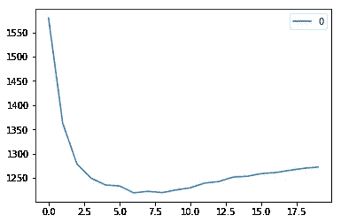

正如我们所讨论的，当我们取 k=1 时，我们得到一个非常高的 RMSE 值。随着 k 值的增加，RMSE 值减小。在 k= 7 时，RMSE 大约为 1219.06，并且随着 k 值的进一步增加而迅速上升。我们可以有把握地说，在这种情况下，k=7 将给出最佳结果。

这些是使用我们的训练数据集的预测。现在让我们预测测试数据集的值并提交。

**7。测试数据集上的预测**

```
#reading test and submission files
test = pd.read_csv('test.csv')
submission = pd.read_csv('SampleSubmission.csv')
submission['Item_Identifier'] = test['Item_Identifier']
submission['Outlet_Identifier'] = test['Outlet_Identifier']

#preprocessing test dataset
test.drop(['Item_Identifier', 'Outlet_Identifier'], axis=1, inplace=True)
test['Item_Weight'].fillna(mean, inplace =True)
test = pd.get_dummies(test)
test_scaled = scaler.fit_transform(test)
test = pd.DataFrame(test_scaled)

#predicting on the test set and creating submission file
predict = model.predict(test)
submission['Item_Outlet_Sales'] = predict
submission.to_csv('submit_file.csv',index=False)
```

提交这份文件时，我得到了一个 RMSE。18960 . 688688868617

8。实现 GridsearchCV

为了确定 k 值，每次绘制肘形曲线都是一个繁琐而乏味的过程。您可以简单地使用 gridsearch 来查找最佳值。

```
from sklearn.model_selection import GridSearchCV
params = {'n_neighbors':[2,3,4,5,6,7,8,9]}

knn = neighbors.KNeighborsRegressor()

model = GridSearchCV(knn, params, cv=5)
model.fit(x_train,y_train)
model.best_params_
```

输出:

```
{'n_neighbors': 7}
```

# 6.结尾注释和附加资源

在本文中，我们介绍了 KNN 算法的工作原理及其在 Python 中的实现。这是最基本的，但也是最有效的机器学习技术之一。对于 KNN 在 R 中的实现，可以通读这篇文章:[使用 R 的 kNN 算法](https://www.analyticsvidhya.com/blog/2015/08/learning-concept-knn-algorithms-programming/)。

在本文中，我们直接从 *sklearn* 库中使用了 KNN 模型。你也可以从零开始实现 KNN(我推荐这个！)，也就是本文所涉及的: [KNN 简体](https://www.analyticsvidhya.com/blog/2018/03/introduction-k-neighbours-algorithm-clustering/)。

如果你认为你很了解 KNN，并且对这种技术有很好的掌握，那么在这个 MCQ 的测验中测试你的技能:[关于 kNN 算法的 30 个问题](https://www.analyticsvidhya.com/blog/2017/09/30-questions-test-k-nearest-neighbors-algorithm/)。祝你好运！

*原载于 2018 年 8 月 22 日*[*www.analyticsvidhya.com*](https://www.analyticsvidhya.com/blog/2018/08/k-nearest-neighbor-introduction-regression-python/)*。*