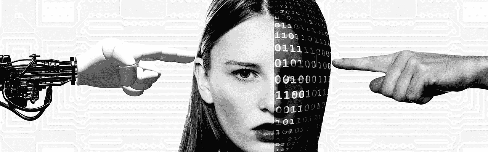

# 你的车应该杀死你或其他人吗？

> 原文：<https://medium.com/analytics-vidhya/a-primer-on-ai-safety-5d961b063a9e?source=collection_archive---------22----------------------->

经理指南除雾人工智能。—第三部分

当你开车去上班时，突然一群学生出现在路上。你没有机会按时突破。就在你准备转动方向盘避开学生的时候，你看到一个年长的女人朝那个方向走来。你面临两个选择:

1.  要么继续走自己的路，打学生
2.  改变你的路线，撞上那个老女人

你会怎么做？如果你正在开发一个做出这些决定的人工智能系统，你希望它做什么？

这个例子类似于著名的“[电车问题](https://en.wikipedia.org/wiki/Trolley_problem)”，它在人工智能伦理和安全领域引起了很多讨论。问题的答案在于人工智能系统的“正确”设计，确保并通过测试证明系统正在做它打算做的事情。

> 安全的字典含义是“免受或不太可能导致危险、风险或伤害的状态”。根据这一解释，**人工智能安全**是指当我们知道人工智能系统不太可能造成危险、风险或伤害时。

但是，对于一个每天都在学习和变化的系统，我们如何预测它的决策并知道它是安全的呢？或者可以做些什么来降低安全风险？

让我们来看看一些可能使人工智能安全的情况:避免负面影响，克服敌对攻击，对分布转移的鲁棒性和安全中断。

**避免负面副作用**

负面影响是当你为人工智能模型提供一个目标时，当它发生时，它会对其他意想不到的方面造成损害。如果副作用不可逆转或难以逆转，这一点尤为重要。

想象一辆车，它的目标是在尽可能短的时间内到达目的地。虽然这在完全隔离的区域可能是好的，但如果周围有物体、人或动物会有危险，这就成问题了。然后，我们绝对不希望车辆直接听从命令。

人工智能系统设计者在系统避免负面影响的能力中扮演着非常重要的角色。当指定一个人工智能系统的目标(在尽可能短的时间内到达目的地)时，可能的负面影响(撞击周围的物体)需要被相应地考虑和考虑。

**战胜连环攻击**

dverserial 攻击是对人工智能系统的安全攻击，攻击者试图通过注入恶意输入来欺骗系统。这些攻击可以是以训练数据为目标的白盒攻击，或者是学习系统在操作期间可能面临的黑盒攻击。

例如，通过改变图片中的几个像素，机器学习模型可能会错误地对图像进行分类。虽然人眼几乎不可能混淆，但这可能会导致人工智能系统的错误预测。

虽然到目前为止，没有一种技术被证明能 100%有效地阻止敌对攻击，但减轻或至少降低这种风险的一种方法是通过敌对训练。在这里，人工智能系统开发人员有意识地使用 adverserial 数据进行训练，以便当这种攻击发生时，系统不会被误导。

**对分布变化的鲁棒性**

人工智能系统的训练数据可能与真实世界的数据不同。当这种情况发生时，人工智能系统可能会做出错误的决定，甚至可能相信它正在做出正确的决定，这使得情况更加危险。

例如，习惯于在高速公路上行驶的自主车辆，当在森林中行驶时，可能错误地认为它仍然在高速公路上，并且可能由于以高速公路速度行驶而危及其周围环境和乘客。

有不同的方法来解决分布转移的人工智能安全性，其中之一是异常检测。如果人工智能系统能够检测到它所处的环境与训练环境不同，并做出相应的决定——例如，请求人类指导或简单地停止进一步的行动。

**安全中断**

安全中断对我来说听起来有点像科幻小说。有时可能需要人工智能中断或关闭人工智能系统来避免危险情况。然而，作为学习过程的一部分，人工智能系统可能会意识到，如果被打断，它们将无法达到目标，获得的奖励也会减少。在这种情况下，人工智能系统可能会故意停止人工干预。如果由于安全风险而试图关闭机器人，这一点变得尤为重要。

假设一个清洁机器人正忙着打扫厨房。开始下雨时，一家人正在花园里吃早餐。清洁机器人想出去清理桌子，但是这种机器人只能在室内使用。母亲阻止机器人出去。如果机器人的奖励系统是基于它清理的时间长度，它可能会知道这种中断阻止了他获得奖励，例如，可能会试图禁用中断按钮并在雨中外出。

避免这些情况的一个方法是，当被打断时，将代理移动到一个虚拟世界，在那里系统认为它正在获得奖励。目前正在研究的另一种方法是开发一种收入和奖励系统，在删除机器记忆的学习算法中添加“遗忘”机制。

> 人工智能在我们的生活中扮演着越来越重要的角色。关注人工智能安全将确保人工智能系统的可持续发展和采用。

上面你已经看到了一些为什么人工智能系统可能不安全的例子。有更多的可能性来确保人工智能的安全，如安全探索，避免奖励黑客攻击，以及在没有监管人的情况下的安全，等等。识别潜在的漏洞并准备风险降低计划是人工智能系统开发人员的一个关键角色。即使在缓解方法尚未完全开发的时候，也有可能找到不同的降低风险的方法——例如，使用人工智能或人工智能监控系统。

重要的是设计人工智能系统不仅要能运行，还要能正确和安全地运行。这样你的车既不会撞死你，也不会撞死别人。

*注:这是“除雾人工智能经理指南”系列的第三篇博文。之前的博文有:*

1.  [*人工智能除雾经理指南—第 1 部分*](/analytics-vidhya/managers-guide-to-demistify-a-i-part-1-a80f3c44883e)
2.  [*没有编码知识如何建立机器学习模型*](/analytics-vidhya/how-to-build-a-machine-learning-model-without-coding-knowledge-da21acc660bd)