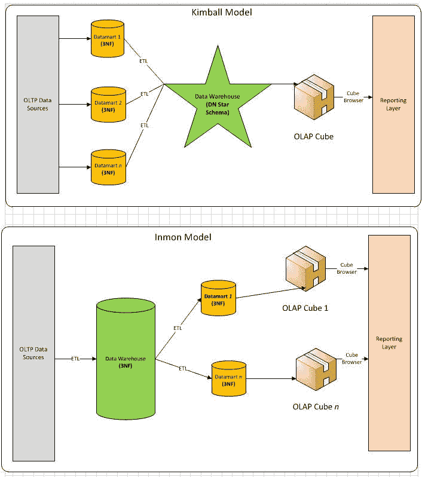

# 数据工程入门

> 原文：<https://medium.com/analytics-vidhya/a-primer-to-data-engineering-40badaee4b1d?source=collection_archive---------10----------------------->

数据工程对于那些想进入这个领域的人来说是一个真正令人生畏的领域。无论您是数据分析师、数据科学家、软件开发人员，还是像我一样的产品经理，了解一点数据是如何存储的，以及帮助我们设计数据流向何处以及如何存储的人员在日常工作中实际做了哪些工作，总是很有用的。这是对数据工程迷人世界的一个相对(简短)的介绍，通过我从新加坡理工学院和普华永道举办的一个非常有用的课程*有效数据分析的数据工程*中获得的笔记。

**谁是数据工程师？**

数据工程师主要专注于设计、开发和维护数据管道(不同系统之间)和数据流，尤其关注完整性和质量。相比之下，数据分析师使用统计技术来发现趋势和模式，而业务分析师识别问题和解决方案来实现业务目标。这些是由非常不同的需求驱动的非常不同的工作。

**数据工程的生命周期**

与软件开发类似，数据工程项目的生命周期包括:

1.  需求收集(业务目标、KPI、数据源、项目时间表)
2.  设计(ETL、工具、技术栈)
3.  开发(数据管道、工作流程)
4.  测试(SIT，UAT)
5.  部署(自动化/开发运维，通过 API 公开)
6.  支持和维护(供应商支持、升级矩阵、变更管理、支持级别)

**数据库**

数据库是有组织的数据集合，通常通过计算机系统以电子方式存储和访问。用于创建存储和检索数据的结构的应用程序称为数据库管理系统(DBMS)。

数据仓库是包含来自多个操作系统的数据的数据库，这些数据已经过集成、聚合和结构化。它们通常用于支持组织内部的分析，作为事实的单一来源，包含历史数据以及时间序列分析。在将数据加载到数据仓库之前，临时区域通常用于保存、清理和合并数据。

有 3 种类型的数据仓库:

1.  集中式数据仓库(企业 DWH) →一个中央存储库
2.  联合数据仓库→数据在逻辑上整合，但在物理上分离
3.  多层/混合仓库→结合集中式和联合式

数据集市是面向主题的数据库，它实际上是数据仓库的一个分区部分。它们的目的是方便只需要特定区域全部数据的用户进行快速、简单、低成本和方便的数据访问。

操作数据存储(ODS)是来自不同异构数据源系统的集成数据库。它们不同于数据仓库，因为它们不包含历史数据，通常用作活动快照(没有数据持久性)。它们可用于实时操作报告。

数据库可以通过 API 公开，以支持一些下游应用程序，例如:

*   自助仪表盘/报告
*   实时监控和警报
*   机器学习和分析

**OLTP 与 OLAP**

在线事务处理(OLTP)用于高效地处理和存储事务。主要用于方便业务交易，也就是说经常更新。

在线分析处理(OLAP)利用多维分析数据库来简化复杂的计算和预测分析。OLAP 查询可以包括:

*   累计:增加汇总级别
*   向下钻取:降低汇总级别
*   切片和切块:选择/过滤
*   透视:重定向多维数据视图

**数据库类型**

有两种类型，即关系/SQL 数据库和分布式/NoSQL 数据库。

***SQL 数据库***

SQL 数据库的结构允许用户识别和访问与数据库中另一部分数据相关的数据。它们被组织成表格、行和列。这些都易于使用，可移植，标准化(ANSI 标准)，并有一个直观的查询语言。不幸的是，它们不太适合横向扩展(使用更多服务器来提升性能)，也不适合物联网和大数据等现代应用。常见的 SQL 数据库有 MySQL、Oracle 数据库、PostgreSQL、MariaDB、微软 SQL Server 等。

一些常用术语:

*   数据文件:磁盘上包含数据的物理文件
*   架构:对象的集合
*   表:SQL 数据库中数据存储的基本单位
*   视图:数据的显示(没有存储，只是从表中检索)
*   索引:用于快速有效访问的对象

使用结构化查询语言(SQL)查询 SQL 数据库。使用了 4 种类型的语句:

*   数据定义语言(DDL) —创建、删除、重命名、截断
*   数据操作语言(DML) —选择、插入、更新、删除
*   数据控制语言(DCL) —授权、撤销
*   事务控制语言(TCL) —提交、回滚

SQL 中的 CRUD 操作指的是创建、读取、更新和删除。这是 4 个基本命令。你可以很容易地在网上找到关于 SQL 语句语法的资料(它们真的没有那么难学！).

最后，SQL 数据库强调 ACID(原子性、一致性、隔离性和持久性)。

***NoSQL 数据库***

这些数据库具有特定的数据模型、灵活的模式并允许水平扩展。其中很多都是开源的，通常缺乏像 SQL 那样的标准化。熟悉的名字有 MongoDB、Cassandra、Redis、Neo4j、ArangoDB。

在分布式架构中设计应用程序时，我们使用 CAP 定理:

c——一致性(即使在执行操作之后的数据)

A —可用性(无停机时间)

P —分区(分成多个组，即使其中一个组关闭，系统仍然可以运行)

从理论上讲，这 3 个要求是不可能全部遵循的，每种类型都会有自己的长处。

有 4 种类型的 NoSQL 数据库:

1.  键值(键值对表示为称为哈希值的任意字符串)→ Oracle Berkeley DB、Redis、Couchbase、Riak
2.  图形(使用具有定义其属性和边的属性的顶点/对象来映射关系。关系可以是单向的，也可以是双向的。)→ JanusGraph，Titan，Neo4j
3.  柱状(存储块包含来自一列的数据，其中每列分别存储在磁盘位置)→ DynamoDB、Cassandra、Apache HBase
4.  文档(由以 Javascript 对象符号[JSON]或 JSON 对象的二进制编码[BSON]形式存储的标记元素组成)→ ArangoDB、MongoDB

在课程中，我们有机会使用 MongoDB 进行一些实际操作。下面显示了 MongoDB 的基本架构，包括:

*   驱动程序(用于连接 mongodb 实例的客户端库程序)
*   Mongos(用于查询路由的 mongodb shard 实用程序。分片意味着将数据分割成离散的部分。)
*   Mongod(处理请求、访问和数据管理的主守护进程)
*   碎片(数据的分区)

MongoDB 支持 CRUD 操作、ACID 事务，存储在 BSON(灵活的无模式模型)中。然而，查询语言与 SQL 有很大的不同，但是在互联网上也有大量关于这方面的资源，所以我在这里就不再赘述了！

**数据建模**

在数据库中，表存储以某种方式相关的数据。这些表可以与我们通常所说的主键和外键引用相关联。关系可以是一对一的、自引用的、一对多的和多对多的(需要我们称之为连接表作为两个主表的引用)。

这些关系有时需要数据分析师在数据库中创建连接。下面显示了不同类型连接的摘要。

当数据工程师执行数据建模时，他们描述数据，提供数据语义，并确定关系。他们回答:

*   系统包含什么(概念数据模型)
*   不管 DBMS(逻辑数据模型)如何实现系统
*   如何在特定的数据库管理系统(物理数据模型)中实现系统

有两种类型的技术用于数据建模:

1.  实体关系模型(E-R 模型)-由实体类型组成，并指定实体之间可能存在的关系
2.  统一建模语言(UML)——标准化、构造、记录和设计软件的专用语言

还有两种类型的数据模型:

1.  交易数据建模—每笔交易都有一条记录
2.  分析数据建模—存储为事实和维度的数据，以提供事务的上下文(更多用于分析，而不仅仅是跟踪)

交易系统可能非常庞大。因此，有时数据工程师可能会执行标准化以减少数据冗余。规范化主要涉及将数据组织到多个相关的表中，以便我们能够减少重复数据的出现。此外，通过拆分成更小的表，我们可以避免由插入、删除和更新异常所带来的不一致(例如，在只有一行用于特定维度的更小的表中删除)。归一化通常可以通过第一范式(1 NF)、第二范式(2 NF)、第三范式(3 NF)等来执行。在 1NF 中，每个列只保存一个值(不需要拆分)，而在 2NF 中，所有非键列都非部分依赖于主键(拆分出另一个表)，在 3NF 中，所有属性都非传递依赖于主键(拆分出 2 个表)。这通常在 OLTP 系统中完成，在那里数据 CRUD 更快。

反规范化与规范化相反，它以在现有表中添加额外属性、创建新表和创建现有表的实例的形式添加数据冗余。这样做主要是为了通过减少对多个连接的需求来提高查询的运行速度。这通常在 OLAP 系统中完成，在那里数据搜索可以快速完成。

分析系统通常采用 3 种类型的建模技术:

1.  Inmon —自顶向下的方法(易于更新，但是需要更多的 ETL 工作，并且 DWH 的初始设置非常耗时)
2.  Kimball —自下而上的方法(对最终用户来说很容易，设置也很快，但会导致数据异常)
3.  独立—用于一次性案例，如报告表

**尺寸建模**

这是一种为业务分析定义数据仓库的数据结构的技术。数据以非规范化的形式存储，并用事实和维度表示。

事实是业务环境中使用的度量/指标，通常是数值。事实表将包含用于定量分析的所有测量和事实。它还将包含将事实表连接到维度表的外键(维度表存储描述业务事件的时间、地点和内容的数据的详细**上下文**)。

一种常用的模式是星型模式，它包含 1 个事实表到 n 维表。另一个是雪花模式，其中一些维度表被规范化以减少冗余。

事实可以是可加性的(可以跨所有维度求和)、半可加性的(可以跨一些但不是所有维度求和)和非可加性的(不能跨任何维度求和)。

事实表也有三种类型:

1.  事务→每个事件存储一次
2.  定期快照→同一事件存储多次(整个源系统定期复制到事实表中，日期戳指示副本的创建)
3.  累积快照→在事件的整个生命周期内存储一行(更新记录)

关于尺寸，主要有 4 种类型:

1.  符合→用于多个事实(事实之间的一致含义)
2.  垃圾→不同且不相关属性的组合
3.  退化→事实表中没有自己的维度表的维度键
4.  角色扮演→具有事实表的多个外键关系

还有一组称为渐变维度(SCD ),它随时间而变化，而不是定期变化。这些存储和管理当前和历史数据，以帮助业务分析。

1.  类型 0 →维度属性保留原始值
2.  类型 1 →用新属性值覆盖现有数据
3.  类型 2 →添加记录以获取新属性值+将原始记录标记为非活动状态
4.  类型 3 →添加新列以存储更改的数据
5.  类型 6 →结合类型 1、2 和 3

**数据整合**

作为数据建模之后的下一步，数据工程师通常需要考虑集成分散在不同系统中的数据。他们通常通过提取、转换、加载(ETL)或提取、加载、转换(ELT)的过程来完成这项工作。

*   提取→从一个或多个数据库中读取数据的过程
*   转换→将数据从源格式转换为所需的目标格式(可以从重复数据删除、格式化等基本转换到派生、过滤、连接、拆分、聚合等高级转换不等。)
*   加载→将数据写入目标文件和数据库(完全加载或增量加载)

ELT 通常用于大型数据集，与 ETL 相比，它的加载时间更短。但是，它需要足够的处理来为最终用户按需执行转换。因此，根据最终用户的要求，数据工程师可以选择任何一种方法。

ETL 之后是流程编排和异常/错误处理。协调包括将两个或更多的任务集成在一起以自动化工作流，并使工程师能够满足最终用户的 SLA。异常/错误处理支持通过警报、日志和其他方法快速修复问题，同时维护 SLA。

**变更数据采集(CDC)**

可以使用 CDC 来确定和跟踪更改的数据，而不是转储整个数据库，从而实现更高的可扩展性和速度。有 4 种方法可以做到这一点:

1.  修改日期(过滤日期修改列)
2.  差异(将当前状态与以前的状态进行比较，但需要大量资源)
3.  触发器(使用影子表，在记录变更时会产生开销)
4.  基于日志的 CDC(按表配置的日志/提交日志，但需要一个日志接口)

市场上有太多的 ETL 工具，我们设法用一个叫做 Alteryx 的工具进行了一些实践，它实际上是基于 GUI(拖放)的，使用起来非常直观。同样，我不会在这里做太多的描述，我会给你一个建议，让你自己去尝试一下(不需要太多的指导！).

**大数据**

随着物联网等现代应用程序生成的数据量呈指数级增长，大数据技能是现代数据工程师的必备技能。虽然我们在这里不会涉及太多细节，但大数据本质上是指高容量、高速度和高多样性的数据。有了这些属性，就需要寻找性价比高、创新的加工方法。

Hadoop 生态系统传统上用于处理大数据。Hadoop 有两个核心组件，即 Hadoop 分布式文件系统和 Map Reduce，这是一个分布式编程框架。大数据管道由 6 个阶段组成:

1.  数据源
2.  数据摄取(工具:Flume)
3.  非结构化数据(流/批处理数据。工具:Kafka、Hadoop HDFS)
4.  数据处理(工具:Spark Streaming、Storm、MapReduce、Apache Spark)
5.  结构化数据(工具:Apache HBase、Hadoop HDFS)
6.  分析(工具:Hive、Spark MLib、Mahout)

**数据湖**

您可能以前听说过数据湖。它是一个集中式存储库，允许您存储任何规模的结构化和非结构化数据的*。存储以原始格式制作，可以在其上运行不同的分析。数据科学家通常会比最终业务用户更多地使用这些工具。此外，与数据仓库的*写模式*(即在写入数据库时引入结构)相比，数据湖的*读模式*。*

**总之……**

这就是对数据工程师工具包各个方面的快速介绍。要成为一名真正有能力的数据工程师，一个人不仅必须真正拥有学习所有技术堆栈的巨大毅力，更重要的是对新工具和技术的永不满足的好奇心，这些新工具和技术不断涌现，使所有数据工程师的工作变得更简单、更高效！在这两天之后，对于无数的数据工程师来说，这无疑是一种更加坚定的尊重，他们确保产品经理能够顺利地运行他们的软件产品，并且总是从为分析和迭代开发生成的数据中获得巨大的反馈循环。