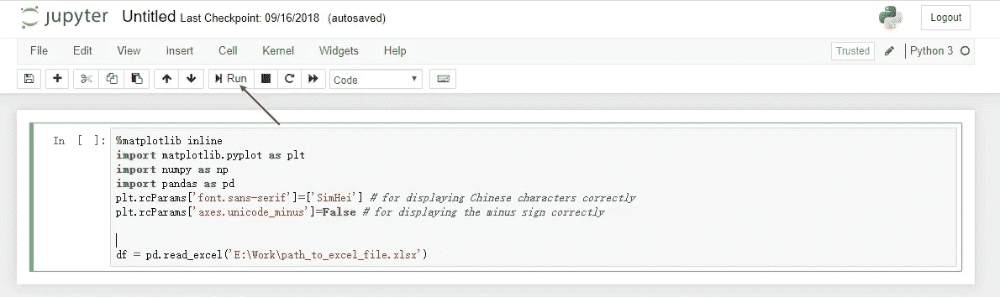

# 产品经理对熊猫/Python 的备忘单

> 原文：<https://medium.com/analytics-vidhya/a-product-managers-cheatsheet-to-pandas-python-81fd020d5caa?source=collection_archive---------10----------------------->

在我担任产品经理期间，我不时需要处理 Excel 中的数据。有些情况下，我需要比 Excel 更好的工具，尤其是在以下情况下:

*   我需要在一个超过 40 万行的表中查找，这会降低我办公室笔记本电脑的速度
*   我需要在复杂的逻辑中处理列，通常包括在特定条件下查找多个表或在一个组中选取行
*   当我浏览数据时，我想保存我的工作过程，这样我就可以在其他电子表格中快速应用它
*   我想用简洁的风格快速绘制直方图、散点图和其他类型的可视化效果
*   我想从一个文件夹中的多个文件中读取并混合数据
*   偶尔想做一些聚类之类的数据挖掘。

在这些情况下，数据分析库 Python with Pandas 完全符合我的需求。在这里，我将在每次从 Onenote 笔记本复制时共享我的备忘单，但我将从设置工具开始，因为读者没有 Python 环境。

# 设置工具

最简单的方法是[下载一个 Anaconda 包](https://www.anaconda.com/distribution/#windows)，点击“下一步”、“下一步”，直到完成(对于 Mac 用户来说过程类似)。

就是这样。


下载时一定要选择 Python 3.7

# 开始工作

在开始菜单中启动 Anaconda Navigator，点击“Jupyter 笔记本”下的“启动”，这是我用于数据分析的主要工具。


这将在您的浏览器中创建一个新的选项卡，界面如下。您可以在这里创建文件夹和组织文件。当你准备开始一个新项目时，点击“新建”按钮，选择“Python 3”。


在新的笔记本中，我总是从将以下代码粘贴到代码框中开始。这些代码支持绘图和导入特定的库，并且对于每个任务来说都是一样的。

最后一行指向我想要使用的 excel 文件的路径。我相应地更改了文件名和路径。

一定要运行代码。在 Jupyter Notebook 中，代码是通过点击“运行”按钮来运行的，或者更常见的是，点击 Ctrl+Enter。



然后单击加号为一些新代码添加一个块。这就是通常用笔记本完成工作的方式。

# 使用行和列

在最后一步中，我将 excel 文件加载到一个名为 df 的“DataFrame”(相当于 Excel 中的一个工作表)中。我可以用它做很多事情:

创建一个名为 df2 的新数据框架，带有“name”列(列名在 Excel 文件的第一行):

```
df2 = df['name']
```

或者有两列，“名称”和“价格”

```
df2 = df[['name', 'price']]
```

或者创建一个在“城市”列中只有“纽约”的行:

```
df2 = df.loc[df['city'] == 'New York']
```

或者具有多个条件和一个范围(括号是必需的):

```
df2 = df.loc[(df['city'] == 'New York') & (df['price'] < 50)]
```

# 转换数据

创建新列也很容易(python 有广泛的数学函数):

```
df2['amount'] = df2['price'] * df2['qty']
```

或者使用 Python 函数:

```
level_map = {'One': 1, 'Two': 2, 'Three': 3}
df2['level_number'] = df2['level'].map(lambda x: level_map[x])
```

这类似于 Excel 中的公式，但它更灵活，因为有一整套编程语言可供使用。

# 绘制图表

我最常用的图表是直方图、折线图、散点图、条形图和箱线图。

作为一名产品经理，有时我希望看到一些列的分布情况，而不是平均值这样的总数，然后我会绘制一个直方图:

```
df['price'].plot.hist()
```


为了比较变量，我用了一个线图:

```
df[['cost', 'revenue']].plot()
```


散点图允许我直观地观察两个变量之间的关系:

```
df.plot.scatter(x='cost', y='revenue')
```


我不经常在熊猫中使用条形图，部分原因是我可以在 Excel 中相当容易地做到这一点。但这是一种直观显示数字的便捷方式:

```
df.plot(kind='bar')
```


箱线图允许我同时比较平均值、四分位数和异常值:

```
df.boxplot(column=['cost', revenue'])
```


# 连接表格

熊猫的 VLOOKUP 是这样的:

```
df_cost.merge(df_revenue, how='left')
```

这将两个数据帧连接在一起，使用相同的列名作为索引。(如果没有相同列名，可以使用“left_on”和“right_on”参数)

这件事的奇妙之处在于，你可以用“how”参数决定如何合并表:“left”保留左边数据帧的所有行，并选择右边的一行；‘右’则相反；“outer”保留所有行；而“inner”只保留两边都存在的行。

# 分组行

通常的任务是按标签列对行进行分组，并为每个组生成一个汇总结果。例如，计算每个地区的总利润:

```
df.groupby('region', as_index=False).sum()
```

我总是将 as_index 设置为 false，因为在默认情况下，Pandas 会为分组结果创建索引，这常常会给后面的分析带来麻烦(除非你非常清楚如何处理这些)。

使用“groupby”可以完成一些用 Excel 很难甚至不可能完成的任务，例如选出每个地区利润最高的商店:

```
df.groupby('region', as_index=False)
       .apply(lambda g: g.sort_values('profit').head(1))
```

# 导出回 Excel

当我完成工作时，我只需使用:

```
df.to_excel('e:\works\path_to_file.xlsx')
```

把我的数据框放回 excel 文件。

# 结论

即使我的工作不需要我执行繁重的数据科学，了解 Pandas 和 Python 确实让我的生活变得容易得多，因为它的表达简短、灵活且优雅。