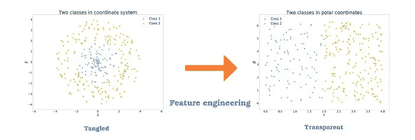
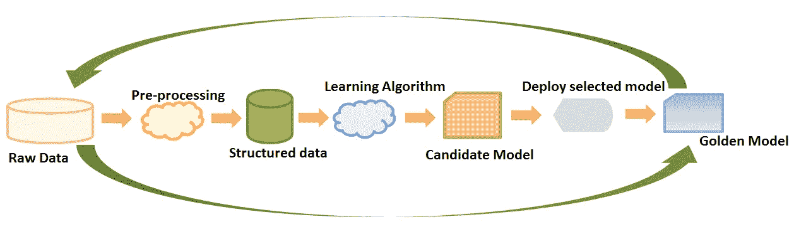
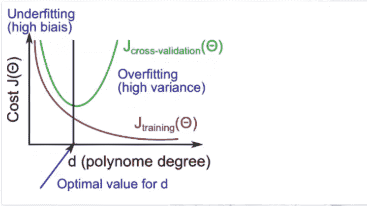

# 在生产环境中构建模型之前，您应该知道的 15 件事情。

> 原文：<https://medium.com/analytics-vidhya/a-productive-data-scientist-63794daa2c2?source=collection_archive---------0----------------------->

生产环境中的数据科学家

# 简介:

构建机器学习模型的世界可能是如此令人无法抗拒——破解问题、分析数据和拟合模型，以及需要妥善管理以充分利用的端到端过程，因此最终，您将拥有可用于生产的产品。

本文重点介绍了每个数据科学家在生产环境中构建模型时需要牢记的 15 个关键方面。

## **1 —这完全是关于概括:**

建立任何预测模型的目标都是为了在生产环境中使用它，在生产环境中，新数据由秒生成，并且您的模型预计会在那些**看不见的数据的新样本上表现良好。**

所以要意识到过度拟合的诅咒。记住这一点将有助于您构建一个完美的交叉验证方案，以便衡量您的模型的真实性能。没有人愿意花 2 个月的时间来构建一个最终会在生产时失败的模型，所以在开始拟合之前，花一些时间来准备一个良好的验证环境，以评估模型的性能。

## 2-3 名法官:

每一个拟合的模型都需要评判。一般来说，当我们谈到衡量模型的性能时，我们会谈到三件事:

*   **交叉验证分数**:这是你拟合你的模型时报告的分数，所以一定要有一个好的交叉验证方案。
*   **生产分数**:这是我们将模型投入生产(beta)后计算的分数，并根据实时数据对其进行评分。
*   可解释性:解释模型预测的能力在某些领域非常重要，比如银行、保险和其他领域。因此，如果模型对于这样的解释来说过于复杂，可能会导致您的模型退出生产。

这是评估一个模型是否能在生产环境中生存的 3 个分数(取决于业务，有时可解释性可以被超越)

## **3 —特征工程是关键:**

最终，一些机器学习项目成功了，一些失败了。有什么区别？很容易，最重要的因素是所使用的特性。

如果你有许多独立的特性，并且每一个都和这个类有很好的关联，那么学习就很容易。另一方面，如果**类是一个非常复杂的功能特性，**你可能学不会。通常，原始数据不是一种易于学习的形式，但是您可以从中构建出易于学习的特征。

这通常是机器学习项目中大部分努力的方向。这通常也是最有趣的部分之一，直觉、创造力和“黑色艺术”与技术一样重要。

## **4 —机器学习不是一蹴而就的过程:**

机器学习不是一次性收集数据、清理数据、处理数据、分析数据并在此基础上运行模型的过程。相反，它是**拟合模型、获得结果、分析结果、修改数据(或获得更多数据)、修改模型的迭代过程**，并再次重复整个过程。

拟合模型通常是最快也是最容易的部分，但那是因为我们已经很好地掌握了它！获取数据、准备数据以及在此基础上的特征工程通常更加困难，因为它是特定领域的，而拟合模型在很大程度上是通用的(你点击同一个按钮，这是**拟合**)。

## **5—存在过拟合，但也存在欠拟合:**

简单来说:

*   **过度拟合**意味着您的模型开始从训练数据中的噪声中学习(提高训练分数，但不提高/损害验证分数)
*   **欠拟合**意味着你的模型不能学习/近似/模拟你的输入特征和目标特征(如果有的话)之间的关系。

很容易将过度拟合可视化(只需将您的训练分数与验证分数进行比较)，但对于欠拟合也是如此吗？简而言之，欠拟合是指你的模型没有学习，其背后的原因有两个:

*   你的模型太简单了，你需要增加复杂性(增加更多的功能，在 NNs 的情况下增加层数，在 Xgboost 的情况下增加最大深度…)(如果以上任何一项有效，那么恭喜你哪里不合适)
*   在您拥有的数据中没有什么可以学习的，所以您的解决方案是改变您的数据(保留目标，但是改变特征)

## **6 —为您的模型寻找最佳参数/架构？秘诀是过度拟合加上正则化:**

拟合模型时，找到模型的最佳参数/架构可能会很耗时(有时甚至很棘手)。

根据我的个人经验，一种方法是:为了加快这个大多数时候都有效的过程，让你的训练数据过拟合(增加复杂性)。在那之后，你可以开始调整你的模型。示例— (L1、L2、辍学、最小儿童体重、拉姆达、伽马……，减少一点层数，减少一点最大深度…).

## 7 —目标函数只是一个代理:

这是在对目标特征建模时要记住的另一件事，您的模型学习的函数只是对真实目标的估计，因此我们可能不需要为了将完美的模型投入生产而完全优化它。

## 8 —总是从有一个基准开始:

直截了当地说:假设你已经收集了你需要的所有数据，并且你已经完成了第一阶段的 EDA(极端数据分析)。现在你如此兴奋地去适应第一个模型，它总是让人不知所措。你开始构思你认为会起作用的功能和想法，并最终在你的训练集中增加了 20 个新功能。然后，您将第一个模型放在这些特征之上，并进行交叉验证以获得分数。现在，我想问你一个问题:

> 这 20 项新功能的附加价值是什么？
> 
> 简单的答案是，你不知道，因为你没有基准。

总是在你拥有的原始数据上安装一个基本模型(没有特征工程),并确保优化它。在这一点上，您对添加到训练集中的所有新内容给模型带来的价值和收益有了一个概念。

## 9 —了解你的噪音:

给定一个数据集，我们总是期望相似的例子应该有相似的类。任何不尊重这一点的东西，我们都将其标记为噪声，基于这一假设，我们继续定义数据中的噪声。

理解您的噪声意味着理解是什么导致这两个相似的数据点具有两个不同的类别，因此，意味着理解为什么您的模型表现不佳。

一般来说，检测到的噪音可能是以下两种原因之一造成的:

*   您的特性空间不足以定义相似的点:这意味着这两点实际上是不同的，但是当您包含更多的特性(不是特性工程，而是新特性)时，差异就会出现
*   第二个原因是我们总是假设的，数据中有错误，应该被清除。

所以四处问问，了解你的业务和你面临的情况，正确处理你的数据，不要指望你的模型为你做所有的工作(尽管有时确实如此)。

## 10 —了解您的衡量标准:

我们适合的每个模型都是旨在解决业务问题的业务模型。为了了解我们的模型在解决业务问题方面有多好，可以根据业务问题指标来衡量它，它可以是准确性，可以是 AUC，可以是 RMSE，也可以是其他东西，我们需要自己构建的自定义指标。

理解和了解你的指标很重要——一个简单的例子是，如果你的业务指标是 AUC，你就不会用你的模型来优化准确性。因此，在开始将数据放入模型之前，请确保定义并理解您的业务指标。

## 11—在工作中精益求精:

在生产世界中，没有什么比试图重新发明轮子并被卡住更糟糕的了。

一个健康的建设策略是从简单开始，在你的发展中要准确，并且只关注结果。在生产环境中，创造力随后而来，首先尝试显而易见的简单解决方案，对它们进行基准测试，部署它们，测量它们，解释它们，然后专注于改进这些结果来发挥创造力。这就是精益，不要重新发明轮子。

## 12 —做好被拒绝的准备:

并不是您将要构建的每个模型都意味着有一个生产阶段并产生影响，即使如此，也不是每个部署的模型都被实际使用。

机器学习是一门艺术，数据科学家构建模型就像艺术家构建一件艺术品。因此，对这件艺术品有这些好印象是正常的，它拥有良好的价值，以及它对外面的世界(业务)有多大的影响。然而，这种影响的验证不仅仅是在数据科学家方面，它还包括将与该艺术品进行交互的业务人员，因此它可能会出错并被拒绝。拒绝背后的一些原因可能是:

*   你的模型没有通过生产测试(可能是因为结果(过度拟合)，或规模等)
*   您的模型过于复杂(可解释性是一些企业中成功部署模型的关键因素)
*   您的模型已经部署，但从未使用过(取决于业务，但这种情况可能会发生)

## 13 —验证分数很重要，培训分数也很重要:

*   训练分数是我们通过评估模型的训练数据得到的分数。
*   验证分数是我们通过在验证集(维持集)上评估模型得到的分数

检查训练分数和验证分数是很重要的，它给出了关于过度拟合和欠拟合以及何时提前停止模型的信号。

*   具有 99%准确度训练分数和 71%验证分数的模型比训练集上的 80%准确度分数和 70%验证分数更差。这意味着该模型为了获得 1%的泛化精度，很可能损失了 18%的噪声精度)
*   您可以通过检查培训分数与验证分数来判断您是否过度适应
*   你可以通过观察训练分数和验证分数来判断你是否不合格。

## 14 —有 EDA(极端数据分析)，有浪费时间 EDA:

作为一名数据科学家，在生产过程中，你将被要求(或者你正在做)准备报告，这些报告讲述了业务的健康状况，目标是带来**洞察力**，真正的洞察力。

> **那么，什么是洞察力？**
> 
> 用简单的英语来说，洞察是一个图形、图表或统计信息，它有两个属性:
> 
> 1 —它带来了新的东西。
> 
> 2 —了解它是有价值的。

在完成你的报告时记住这两个属性，你会注意到大多数时候你会删除你为报告准备的 50%的东西。记住，太多的信息会扼杀信息，所以保持准确，专注于能带来价值的东西。

## 15 —始终扩展您的部署:

将模型投入生产是每个数据科学家都应该掌握的一个阶段，在这个阶段中有扩展。您部署的系统需要在业务级别进行伸缩，如果您的模型每秒将接收 1000 个预测请求，您部署的系统需要有能力处理它，因此伸缩非常重要。

这些是我认为的一个高效数据科学家的 15 个关键方面；如果你觉得它很有见地，请务必在 Medium 上 [**关注我**](/@errabia.oussama) 以了解更多。

# 关于我

我是首席数据科学家@ Clever Ecommerce Inc，我们利用基于人工智能的强大技术，帮助企业创建和管理谷歌广告活动。

你可以通过链接的[或 Gmail:errabia.oussama@gmail.com 联系我。](https://www.linkedin.com/in/oussama-errabia-0b1a14b3/)

# 参考

关于机器学习需要知道的一些有用的事情，佩德罗·多明戈斯[https://homes.cs.washington.edu/~pedrod/papers/cacm12.pdf](https://homes.cs.washington.edu/~pedrod/papers/cacm12.pdf)