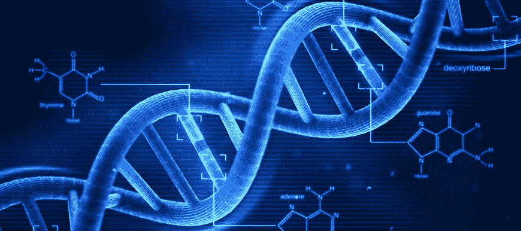
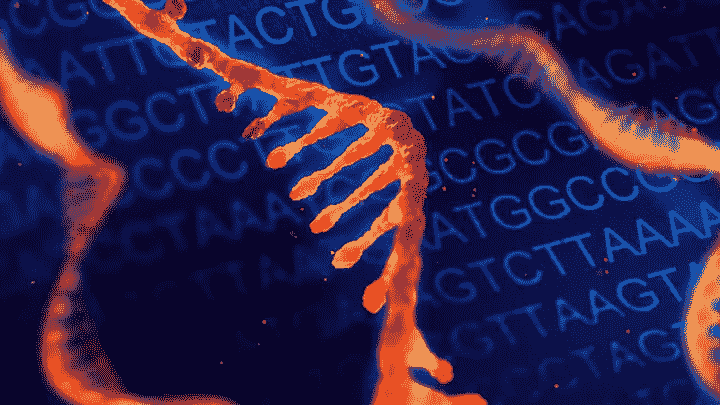
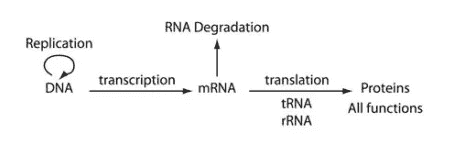
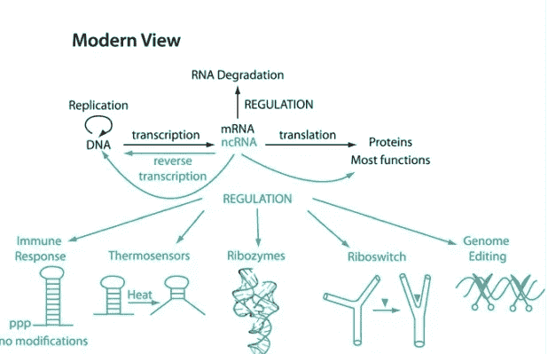
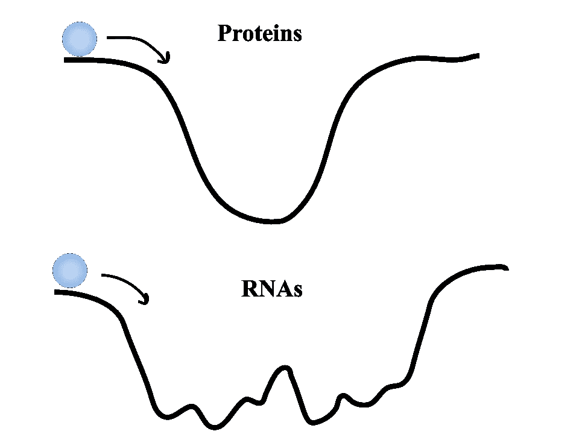
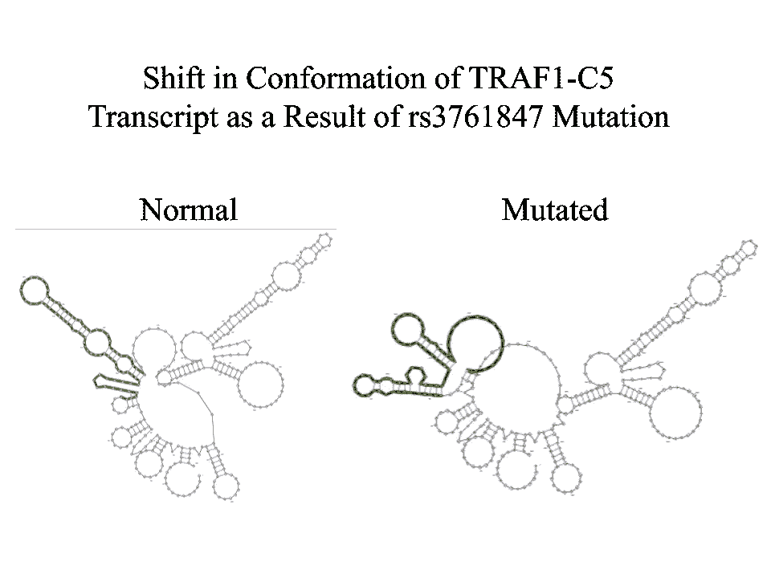
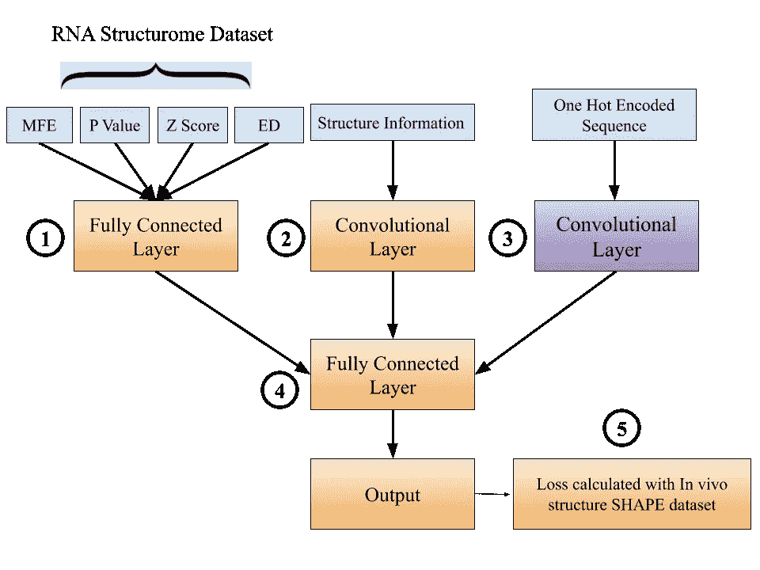
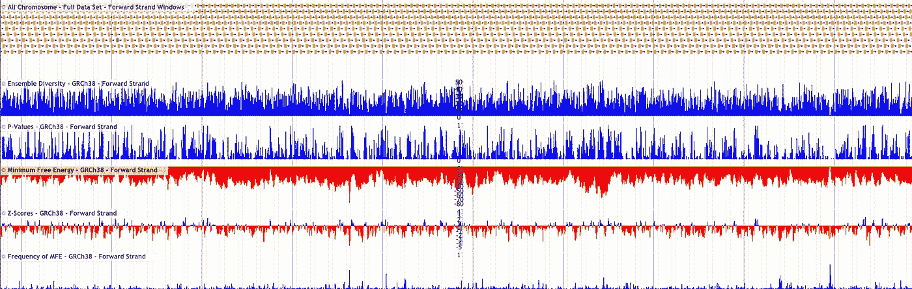

# 一种利用机器学习发现新 RNA 靶点的模型

> 原文：<https://medium.com/analytics-vidhya/a-proposed-model-for-using-machine-learning-to-find-novel-rna-targets-63c7ee48f721?source=collection_archive---------9----------------------->

我相信你已经听说过 DNA，或脱氧核糖核酸，这本“食谱”，它编码了所有的蛋白质，这些大分子完成你所有的细胞杂务，并使你成为独一无二的自己。

脱氧核糖核酸有四个含氮碱基 A、G、C 和 T，它们选择性地相互配对。([图像来源](https://factslegend.org/25-interesting-dna-facts/)

但是你可能也知道，如果我给你一本食谱，书中的食谱不会神奇地变成你晚餐想要的千层面。取而代之的是，必须有一个中间人，厨师，他将把书上的说明转化为实际的产品。事实上，我认为，如果没有厨师将所有有价值的信息转化为美味的食物，食谱完全是**无用的**。

我们细胞中把 DNA 转化成蛋白质的中介是什么？没错就是 RNA(或者核糖核酸)。这是必不可少的细胞烹饪，没有它，我们的 DNA 将完全无用。

RNA 分子是单链的，由四个碱基 A、G、C 和 u 组成。**这些碱基也可以相互配对，形成复杂的三维结构。** ( [图像来源](https://www.sciencemag.org/custom-publishing/webinars/power-rna-broad-application-rna-based-sequencing-transcriptome-and-genome))

到目前为止，我们已经有了这个基本的模型，也就是所谓的中心教条(你们大多数学过高中生物学的人都知道)。

大多数学生被教导的生物学的中心教条。DNA → RNA →蛋白质

但是自然不可能那么简单吧？大自然从来没有那么简单。所以经过几十年的研究，我们已经…

一个更详细、更准确的中心教条版本。(不熟悉的话不用太在意生物学术语)([图片来源](https://www.ncbi.nlm.nih.gov/pubmed/27658939))

中心教条从来没有错。它只是忽略了许多有用的信息，忽略了许多非常重要的基因调控元件。我甚至认为上面的图表是对我们细胞中实际机制的简化，但它应该足以满足我们的目的:)

好了，不用太担心信息图上的条款。让我们回到厨师/食谱的类比。最初，我们有一个直链:食谱→烹饪→菜肴。现在，相反，我们知道在现实中，厨师不仅仅扮演一个角色(将食谱转化为一顿饭)。此外，厨师必须根据场合和可用的食材编辑食谱，购买食材，决定在什么时间制作什么食谱，并最终决定一批美食的最终目的地。这正是我们新的 RNA 模型所解释的！它根据时间段和细胞位置选择转录哪些基因！它进行亚细胞定位并与 miRNAs 结合，决定 RNA 何时何地被翻译成蛋白质。

这就是为什么在非常精确的细节水平上理解 RNA 是非常重要的！总的来说，理解大多数在细胞功能中扮演复杂角色的大分子的三维结构是有益的，而且在大多数时间里，我们一直主要关注蛋白质。如果我们把细胞活动想象成一场戏剧演出，蛋白质将是主要演员，而 RNA 将做所有的后台工作。但是想象一下如果你去掉了照明人员。你甚至看不到这出戏！这就是为什么至少将部分注意力放在 RNA 分子的三维结构上是如此重要。

到目前为止，在药物开发中，我们已经确定了受疾病困扰的个体中因突变或 SNPs(单核苷酸多态性)而改变的蛋白质。然后，我们将蛋白质视为一把锁，然后确定一种小分子药物或钥匙，它可以打开这把锁，有效地治疗那些患有特定疾病的人。许多指数级技术正在与这种传统的锁和钥匙方法(如量子计算和人工智能)相结合，并正在彻底改变我们对药物发现的思考方式，但我们的方法是不完整的，我们没有解决所有可能被偶然突变改变的潜在分子/途径。是的，没错。我们没有探索 RNA 分子的巨大多样性作为难以治愈疾病的潜在目标。

好的…现在下一个可能出现的问题是为什么？如果对接小分子配体和蛋白质靶如此容易，为什么不能对 RNA 靶采取同样的方法。

我想用球滚下山的比喻来解释这个问题。想象一下，球的高度代表大分子(无论是 RNA 还是蛋白质)的自由能。

这是蛋白质(当然本质上无结构的蛋白质是这一规则的例外，但大多数不被用作药物靶标)和 RNA 分子的自由能图景。请注意，无论我用很小的力还是很大的力推动蛋白质自由能球，它似乎总是会回滚到单一最小自由能(MFE)谷的最底部点。另一方面，RNA 自由能量景观有许多局部山谷。因此，如果推球时所施加的力的大小变化很小，球将会落在不同的谷中，而不是所有的 MFE 位置。

每个谷代表大分子的低能或稳定构象。蛋白质通常决定一个单一的稳定构象，而 RNA 则根据外部条件的微小变化(如金属阳离子的量，附近是否存在 RNA 结合蛋白等)而陷入多个局部低谷。).这就是问题所在。

让我们坚持用锁和钥匙的类比来理解这个问题。想象一下，试图用一把不断变化的锁打开一扇门。每十亿分之一秒，形成锁的签名的脊和突起都在波动，没有一个稳定的时期。这有点像科学家在试图开发针对 RNA 靶点的小分子药物时所面临的情况。在涉及生物系统的问题中，不确定性是不可避免的。然而，如果不根据细胞环境条件和其他个人和生物因素分离出单个靶结构，科学家永远无法确定某种 RNA 靶向药物的疗效。研究人员经常试图从一个叫做玻尔兹曼分布的统计模型中抽取可行构象的样本。然后将这些聚类放在一个二维图上，称为主成分分析图(PCA)。问题是，这些 PCA 图仅帮助可视化结构整体的多样性，而不是精确定位特定的 3d 结构。

**新的案例研究:评估 TRAF-C5 转录物作为药物靶标的可行性**

为了识别潜在的 RNA 药物靶点，我搜索了 2000 个核糖基(改变 RNA 分子构象的突变)和 PharmGKB 数据库(包含特定变体如何影响药物反应的信息的 pharmagenomic 数据库)上的突变。然后，我鉴定了两个数据库中包含的突变(因此，它们充当了核糖探子，一个突变影响了病理/药物反应)。其中一个突变是 rs3761847，这种突变可能导致类风湿性关节炎的严重程度。

然后，我通过[RNA 结构数据库](https://structurome.bb.iastate.edu/)确定了突变两侧约 180 个碱基对的窗口，并将整个序列与所需的 rs3761847 突变一起输入到 [RNAsnp](https://rth.dk/resources/rnasnp/) 网络服务器。

RNAsnp 网络服务器显示 TRAF1-C5 转录物中的构象变化。朝向转录物结构左侧的主要环和茎的位置在两种结构之间移动。

基于输出视觉特征的构象的明显变化，我假设这种突变一定与类风湿性关节炎相关风险/严重性的增加相关。

然而，在我搜索了 Pubmed 文献后，我发现与我预期的完全相反。rs3761847 突变似乎几乎与类风湿性关节炎无关(在某些病例中观察到非常低的皮尔逊相关系数)。

尽管根据碱基配对概率算法计算的 MFE 结构观察到了构象的明显变化，但当研究人员试图将突变的影响推广到更大的人群时，他们的尝试似乎不起作用。

这种结果最可能的原因如下:

**在计算机上(基于计算机的)折叠算法经常偏离在活体内(在细胞条件下)观察到的结构。**

那么，我们如何才能弥合*电子*和*体内*结构之间的巨大差距，以提高基于 RNA 的治疗方法的精确度，并通过抗击癌症和类风湿性关节炎等多因素疾病来拯救数百万人的生命呢？

**这就是机器学习的用武之地。**

如果在未来，医生可以几乎瞬间对你的转录组进行测序，并识别出导致你独特疾病症状的基于 RNA 的错误，会怎么样？

这可能成为现实。我们所需要的是一种 ML 算法，它可以在*电子*和*体内*结构之间架起一座桥梁，这也是我打算解决的问题。

**提议的架构**

为了弥合计算机和体内结构之间的差距，我计划让我的机器学习算法通过序列基序、二级结构基序和其 MFE 结构的特征来表征未加工的 RNA 转录物。

提出了一种基于 CNN 的体系结构，用于生成更精确的 RNA 结构(与体内结构更相似)

1.  **具有来自 RNA 结构组的 MFE 数据的全连接层**

RNA structurome 是爱荷华州立大学的一个数据库，它包含了我们基因组中 30 亿个核苷酸的 RNA 转录物的所有结构数据。

30 亿个核苷酸序列被分解成 120 个核苷酸(nt)重叠片段，然后使用 RNA 折叠算法(如来自 ViennaRNA package 的 RNAfold)折叠成二维结构。

除了这 120 个核苷酸序列中每一个的 MFE 值之外，RNA structurome 数据库还包含用于 MFE 结构比较的各种指标，包括**p 值、z 值和总体多样性。**

**P 值:**

它根据比实际基因组序列更稳定的 30 个随机序列的分数来评估特定 z 得分的可能性。

> (# 𝑜𝑓 𝑀𝐹𝐸(30 𝑠𝑐𝑟𝑎𝑚𝑏𝑙𝑒𝑑 𝑣𝑒𝑟𝑠𝑖𝑜𝑛𝑠) < 𝑀𝐹𝐸(𝑔𝑒𝑛𝑜𝑚𝑒 𝑠𝑒𝑞𝑢𝑒𝑛𝑐𝑒))/30

**Z 值:**

它向我们展示了一个特定的 120 nt 序列与 30 个随机排列的序列相比有多稳定。

> 𝒛 − 𝒔𝒄𝒐𝒓𝒆 = (𝑀𝐹𝐸(𝑔𝑒𝑛𝑜𝑚𝑒 𝑠𝑒𝑞𝑢𝑒𝑛𝑐𝑒) − 𝑀𝐹𝐸(30 𝑠𝑐𝑟𝑎𝑚𝑏𝑙𝑒𝑑 𝑣𝑒𝑟𝑠𝑖𝑜𝑛𝑠))/𝜎

**集合分集:**

正如我在本文前面解释的，一个 RNA 分子可以有多个稳定的结构。这个稳定构象的范围被称为“T8”系综。“整体多样性(或 ED)衡量这种构象空间的多样性。

上面解释的所有指标都可以在 RNA 结构数据库中看到。图像顶部的每个黄色窗口代表 RNA 折叠的 120nt 转录窗口。

**2。用于结构基序检测的卷积过滤层**

这里，卷积过滤器内核将用于检测各种二级结构基序，如循环、茎和[假结](https://en.wikipedia.org/wiki/Pseudoknot)。

**3。用于序列基序检测的卷积过滤层**

与第二个想法相似。卷积核将用于检测序列本身的特征共性。

**4。不同模式信息合成的最终全连接层**

**5。计算训练损失(使用均方误差函数)**

这是奇迹发生的地方。我将使用从各种数据库收集的体内形状数据，而不是使用 MFE 的稳定性作为结构生成成功的主要指标，以评估生成的 RNA 结构的真实准确性。

目标是随着模型在具有互补[形状](https://en.wikipedia.org/wiki/Nucleic_acid_structure_determination#SHAPE)数据的各种 RNA 结构上训练，损失减少，以便模型在预测实际体内 RNA 结构时变得更加准确！！！

**关键要点和总结:**

*   RNA 是细胞生物学中的关键角色。中心法则是对 RNA 结构和功能复杂性的过度简化。
*   药物发现通常采用传统的锁匙方法。这个模型工作得很好，但是现在我们把自己限制在蛋白质“锁”或目标上。
*   为了提高 RNA 分子作为小分子药物靶点的可行性，我们需要在体内分离出单一固定结构的 RNA 分子(以进行精确的小分子对接)
*   大量 RNA 折叠在线服务器和在线软件包所显示的 RNA 构象变化与文献中的临床研究不匹配(如 rs3761847 所示)
*   机器学习(CNN)可以用来创建模型，更准确地预测*体内*结构。

**我为本文引用的论文:**

 [## RNAStructuromeDB:用于 RNA 结构推断的全基因组数据库

### RNA 几乎在生物学的每个方面都起着重要的作用，并且 RNA 生物学的每个方面都受其自身结构的影响。

www.nature.com](https://www.nature.com/articles/s41598-017-17510-y)  [## TRAF1 多态性与亚洲人和中国人类风湿性关节炎易感性相关。

### 目的:最近欧洲人群的全基因组关联扫描和复制研究揭示了几个…

www.ncbi.nlm.nih.gov](https://www.ncbi.nlm.nih.gov/pubmed/19714643) 

*感谢阅读！随时查看我在 Medium 上的* [*其他文章*](/@mukundh.murthy) *并在*[*LinkedIn*](https://www.linkedin.com/in/mukundhmurthy/)*上与我联系！*

如果你想讨论以上任何话题，我很乐意与你联系！(在 mukundh.murthy@icloud.com 给我发邮件或者在[*LinkedIn*](https://www.linkedin.com/in/mukundhmurthy/)*)*

如果你有兴趣关注我的进展，请在这里 *注册我的每月简讯*