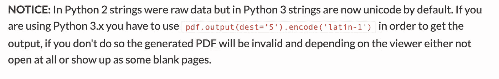
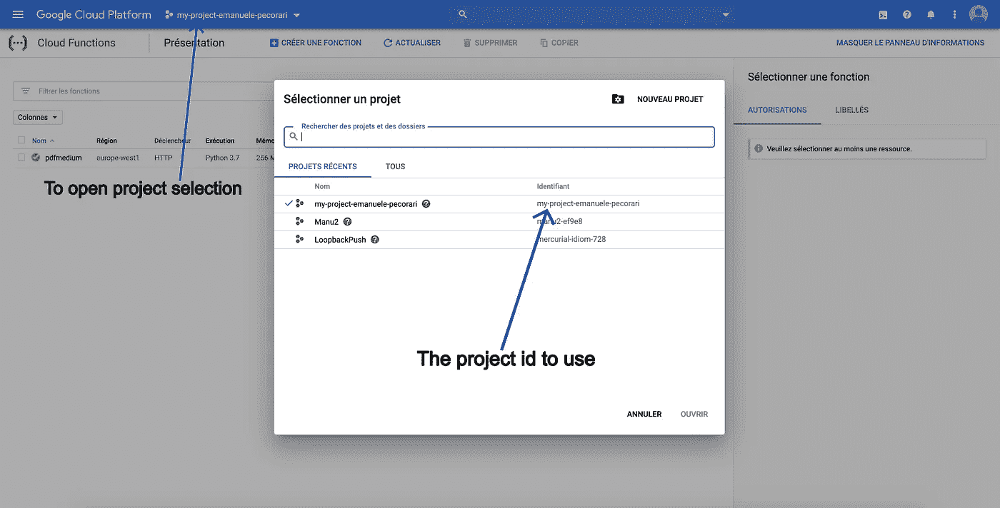
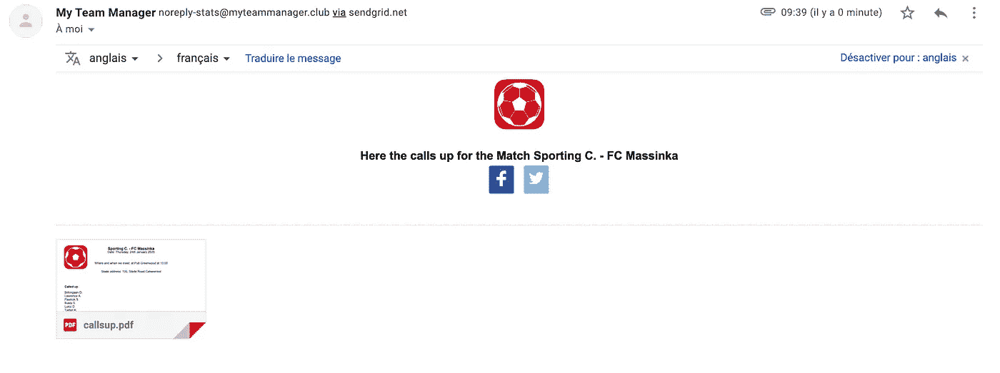
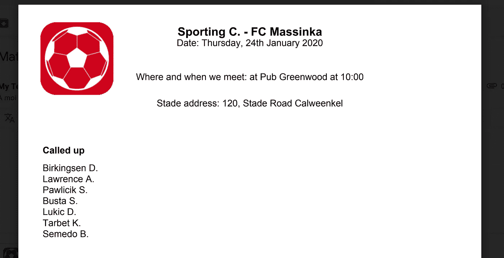

# 一个 Python 云函数，用于通过电子邮件撰写和发送 PDF

> 原文：<https://medium.com/analytics-vidhya/a-python-cloud-function-to-compose-and-send-a-pdf-via-e-mail-89e63b7c0ff0?source=collection_archive---------7----------------------->


埃菲社在 [Unsplash](https://unsplash.com?utm_source=medium&utm_medium=referral) 上拍摄的照片

在我的一个项目中，我决定创建一个服务来获取一些输入信息，组成一个 PDF，然后通过电子邮件发送。

首先，我编写了一个 Flask 应用程序来测试本地的一切，然后，我修改了我的 *main.py* 中的几行代码，使它可以作为 Google Cloud 函数导出(它是在 Flask 的基础上构建的)

要使用我们需要的服务:

*   一个 [Google Cloud](https://cloud.google.com/) 帐户来创建我们的功能(帐户上的账单需要激活才能创建它)。
*   发送电子邮件的 [Sendgrid](https://sendgrid.com/) 帐户

我们假设安装了 Google 命令行界面，因为我们将使用它来部署我们的功能(更多信息，请参见这里的)。

# 背景

该服务将允许创建一个 PDF 文件，其中包含一场足球比赛的征召球员名单，以及一些其他信息，如比赛日期，所有球队聚集的地方，体育场地址和球队标志。

我们会用这样的身体做一个帖子；

```
{
   "match": "Sporting C. - FC Massinka",
   "to": "[sporting@sportingmedium.com](mailto:sporting@sportingmedium.com)",
   "subject": "Match Sporting C. - FC Massinka",
   "html": "<b>Here the calls up for the Match Sporting C. - FC Massinka</b>",
   "text": "Here the calls up for the Match Sporting C. - FC Massinka",
   "appointmentAndDate": "Where and when we meet: at Pub Greenwood at 10:00",
   "date": "Date: Thursday, 24th January 2020",
   "stadeAddress": "Stade address: 120, Stade Road Calweenkel",
   "callsupTitle": "Called up",
   "callsup": "Birkingsen D., Lawrence A., Pawlicik S., Busta S., Lukic D., Tarbet K., Semedo B.",
   "logoUrl": "https://cdn.website-editor.net/6038919f8d094b12bf47f483121670f1/dms3rep/multi/thumbnail/iTunesArtwork256x256-transp.png["](https://cdn.website-editor.net/6038919f8d094b12bf47f483121670f1/dms3rep/multi/thumbnail/iTunesArtwork256x256-transp.png)
}
```

# 在 Google Cloud 函数中使用库:requirements.txt 文件

我们在项目中使用了两个外部库:

*   [FPDF](http://www.fpdf.org/) 创建 PDF 文件
*   [Sendgrid](https://github.com/sendgrid/sendgrid-python) 发送电子邮件

为了从 Google Cloud 上的功能中使用它们，我们需要在项目的根目录下添加一个 *requirements.txt* 文件，其内容如下:

```
fpdf==1.7.2
sendgrid==6.1.0
```

# 创建 PDF 文件

PDF 文件的创建得益于一个扩展 FPDF 的类(文件 *callsupPDF.py* )

该类在构造函数中接收请求数据:

```
def __init__(self, req_data):
   self.req_data = req_data
   super(CallsUpPDF, self).__init__()
```

要构建的第一个部分是标题，我们在这里放置球队的徽标(在左上角)、比赛(在文档顶部居中)和比赛日期。

下载 logoUrl 并创建一个临时本地文件(文件名是当前时间戳)。与 FPDF 的方法 *image()* 相比，我们在左上角添加图片( *x* : 10， *y* : 8，*宽度* : 33):

```
logoUrl = getStringParameter(self.req_data,’logoUrl’)
if logoUrl:
   millis = int(round(time.time() * 1000))
   filePath = “/tmp/%s.png” % str(millis)
   f = open(filePath,’wb’)
   f.write(urllib.request.urlopen(logoUrl).read())
   f.close()
   self.image(filePath, 10, 8, 33)
```

其他使用的 FPDF 方法有:

*   *cell()* :在我们的例子中用来写文本，比如:

```
cell(0, 5, match, ln=1, align=’C’)
```

使用 *x* :0， *y* :5， *match* 是包含文本的变量， *ln* : 1 表示一旦文本被写入就转到下一行的开头，*align:【C’*表示文本在单元格中居中

*   *ln()* :允许向下移动光标，向文件添加新内容

```
ln(2)
```

在这种情况下，向下移动 2，并将光标放在左侧(行首)

我们通过 *CallsUpPDF* 类的 *composeDoc* 方法，一个接一个地添加约会日期和地点、体育场地址、球员名单前的标题和球员名单的末尾( *callsUpBlock()* ):

```
def composeDoc(self):
   self.add_page()
   self.set_font(‘Arial’, ‘B’, 16)
   self.__addAppointmentAndPlace()
   self.__addStadeAddress()
   self.ln(6)
   self.__callsUpBlock()
```

方法前面的 __ 前缀表示该方法是私有的。

从 HTTP POST 接收的参数通过文件 *requestUtil.py* 及其方法 *getStringParameter* 从 *callsupPDF.py* 中读取，默认情况下返回一个空字符串:

```
def getStringParameter(requestData, parameterName):
   return requestData.get(parameterName, ‘’)
```

# 服务逻辑

该服务在文件 *callsupUseCase.py 中管理。*它实例化类 *CallsUpPDF* 并调用上面看到的 *composeDoc* 方法。

完成后，它创建 Sendgrid API 发送 PDF 文件所需的 Base64 编码字符串(稍后我们将看到 Sendgrid 有效负载)，然后为发送电子邮件的函数创建一个 JSON 对象。

注意到:

*   使用 Python3，我们需要使用“latin-1”来执行 PDF 文件的编码(由于方法 *output()* 和参数 *dest='S '，我们以字符串的形式获得该文件)。*见另一种出口可能性[此处](http://www.fpdf.org/en/doc/output.htm)



*   我们指定了一个 templateId，它标识了一个可以在 Sendgrid 上创建并填充数据 HTML 模板
*   我们添加了一个 html 和一个文本消息来支持不能显示 html 的电子邮件客户端

代码如下:

这个类还负责创建 http 响应，它将是:

*   如果一切顺利，简单的“Ok”
*   如果发生错误，则返回 500 错误(为了简单起见，我们不考虑其他错误代码)

```
try:
   sendMailWithPdf(emailObject)
   return “Ok”
except Exception as e:
   print(str(e))
   return str(e), 500
```

# 将电子邮件发送到 Sendgrid

在文件*sendmail . py*中，我们读取了包含调用 Sendgrid API 的键的环境变量(我们将看到如何从命令行界面在部署中设置它):

```
mailApiKey = os.environ[‘MAIL_API_KEY’]
```

随后，我们使用由*email obj*类中的 *callsupUseCase.py* 传递的数据构建邮件对象。

完成后，我们简单地调用 SendGrid 库的 *send()* 方法。

我们已经准备好将我们的代码部署为 Google Cloud 函数。

# 部署

我们使用 Google Cloud 命令行界面来部署我们的功能。我们用下面的命令创建一个可执行的 bash 脚本( *deploy.sh* ):

```
gcloud functions deploy pdfmedium --runtime python37 --trigger-http --set-env-vars MAIL_API_KEY=<YOUR_SENDGRID_API_KEY> --project <YOUR_GOOGLE_PROJECT_ID> --region europe-west1
```

*   *pdfmedium:* 是 main.py 中包含的函数的名称
*   *python37:* 指定我们正在为 python 运行时版本 3.7 进行部署
*   *— trigger-http:* 指定通过 http 调用函数
*   *— set-env-vars* :允许为函数配置环境变量
*   —项目:我们要在其中安装函数的项目 id
*   — region:将部署该功能的 Google Cloud 区域。[点击此处](https://cloud.google.com/about/locations/?region=europe#region)了解更多地区信息

项目 id 可以在您的 Google Cloud 控制台中找到:



# 执行

现在用 curl 或 postman 我们可以调用我们的函数。这里，我们可以使用 curl 命令:

```
curl -X POST \
 [https://europe-west1-my-project-emanuele-pecorari.cloudfunctions.net/pdfmedium](https://europe-west1-my-project-emanuele-pecorari.cloudfunctions.net/pdfmedium) \
 -H ‘Content-Type: application/json’ \
 -H ‘Postman-Token: 055822de-a90c-4798-a239–91afb80c3565’ \
 -H ‘cache-control: no-cache’ \
 -d ‘{
 “match”: “Sporting C. — FC Massinka”,
 “to”: “[m](mailto:emanuele.pecorari@gmail.com)yemail@mydomain.com”,
 “subject”: “Match Sporting C. — FC Massinka”,
 “html”: “<b>Here the calls up for the Match Sporting C. — FC Massinka</b>”,
 “text”: “Here the calls up for the Match Sporting C. — FC Massinka”,
 “appointmentAndDate”: “Where and when we meet: at Pub Greenwood at 10:00”,
 “date”: “Date: Thursday, 24th January 2020”,
 “stadeAddress”: “Stade address: 120, Stade Road Calweenkel”,
 “callsupTitle”: “Called up”,
 “callsup”: “Birkingsen D., Lawrence A., Pawlicik S., Busta S., Lukic D., Tarbet K., Semedo B.”,
 “logoUrl”: “[https://cdn.website-editor.net/6038919f8d094b12bf47f483121670f1/dms3rep/multi/thumbnail/iTunesArtwork256x256-transp.png](https://cdn.website-editor.net/6038919f8d094b12bf47f483121670f1/dms3rep/multi/thumbnail/iTunesArtwork256x256-transp.png)"
}’
```

在我们的收件箱中，我们会收到电子邮件:



和 PDF 文件:



# 结论

这个简单的项目展示了 Python 库 FPDF 如何帮助从您的数据创建简单的 PDF 文件。您可以使用它轻松地创建想要共享账单或简短文档。

该代码可以很容易地发展，以管理其他数据和创建不同的 PDF 布局。

另一个需要强调的简单步骤是如何通过 Google Cloud 函数上的 HTTP 来公开您的可伸缩服务。

使服务更加安全的下一步是使用令牌或 api 密钥添加某种身份验证，在服务执行之前对其进行检查。

完整的项目可以在 GitHub 上找到:[https://github.com/manupeco/MediumPythonExercise](https://github.com/manupeco/MediumPythonExercise)