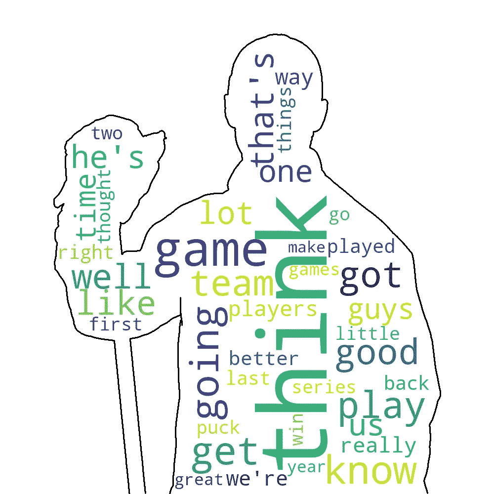

# 非霍奇金淋巴瘤采访的定量研究

> 原文：<https://medium.com/analytics-vidhya/a-quantitative-study-of-nhl-interviews-25b28821364b?source=collection_archive---------14----------------------->


萨曼莎·加德斯在 [Unsplash](https://unsplash.com?utm_source=medium&utm_medium=referral) 上的照片

*请在* [*GitHub*](https://github.com/danitamm/InterviewAnalysis) *上找到这项研究的代码。*

*TL；博士:对 NHL 球员的采访沿着两个轴进行分析:情绪和自私。正如人们所料，希尼·克罗斯比得分，球员和他们的教练形成对比。*

# 介绍

精心排练和滑稽重复，对职业运动员的采访导致更多的眼球转动，而不是真正的兴趣，即使是最忠实的球迷。然而，如果在足够大的数据集上用正确的方法进行研究，我们也许能够从这些契约义务仪式中提取一些有趣的见解。

我们将使用 [Beautiful Soup](https://pypi.org/project/beautifulsoup4/) 和 HTML 标记来收集和组织数据，使用开源(也是真正由您设计的)文本分类方法，使用 [matplotlib](https://matplotlib.org/) 来展示结果。

我们从 ASAP Sports 收集数据，这是一个向记者提供运动员采访记录的网站。我们在斯坦利杯决赛期间对球员和教练进行了练习日采访，从 1997 年开始，到 2019 年结束。马修·布雷(Mathieu Bray)对教练迈克·苏利文(Mike Sullivan)和彼得·德布尔(Peter DeBoer)的比较启发了这篇博客文章的大部分内容，最引人注目的是对 ASAP Sports 的使用。

# 网页抓取

让我们先来看看 ASAP Sports 的曲棍球部分的布局。包含采访的网页以被采访者的名字命名，包含正斜杠的网页对我们有用，只是因为它们允许我们导航到采访网页。

```
2019/
 Stanley Cup Final/
  June 10/
   Jaden Schwartz
   Alex Pietrangelo
   Colton Parayko
   ...
  June 7/
   Alexander Steen
   Alex Pietrangelo
   Joakim Nordstrom
   ...
  ...
 <Other Event>
 ...
2018/
 Stanley Cup Final/
  June 7/
   Barry Trotz
   Alex Ovechkin
   ...
  ...
 <Other Event>
 ...
...
```

除了 2005 年和 2008 年，网站上有从 1997 年开始的斯坦利杯决赛记录。我们将不得不从每年的许多网页中抓取数据，并且我们可以在组织和标记数据时利用这些标记良好的超链接。

导航这些网页的代码由每个页面级别的函数组成，不包括采访页面本身。这些函数找到所需的超链接，记下其用于数据标记的锚文本，将 URL 传递给下一个适当的函数，并接收其结果。

抓取面试网页的功能是根据这种页面类型最常见的 HTML 布局编写的。根据需要添加了额外的逻辑来处理大约 25%的不完全遵循这种布局的访谈网页。图 1 显示了一个采访网页的例子。


图 1:一个示例面试网页。

# 数据清理

每个采访的文本由下面的函数清理。它删除除撇号以外的所有数字和标点符号。

```
def clean_string(s):
 '''
 Parameter: string
 Returns: string lowercase, punctuation replaced with spaces
 '''
 to_remove = string.digits + ''.join([punc for punc in string.punctuation if punc != '\''])
 trans = str.maketrans(to_remove, len(to_remove)*' ')
 s = s.translate(trans).strip('\r\n\t ').lower()
 s = re.sub(' +', ' ', s)
 return s
```

# 数据格式编排

我们将收集的数据写入文本文件，并使用 HTML 标记进行组织。我们用<entry>标记每个面试网页，内容如下图。有许多小组面试，所以我们创建一个包含<name>和<text>孩子标签的<answer>标签，用于个人在面试中的每次发言。</answer></text></name></entry>

```
<entry>
 <team1> </team1>
 <team2> </team2>
 <date> </date>
 <answer>
  <name> </name>
  <text> </text>
 </answer>
 <answer>
  <name> </name>
  <text> </text>
 </answer>
 ...
 ...
</entry>
```

# 数据池

对教练的采访被标上三种姓名格式中的任何一种:

1.  <first name=""><last name=""></last></first>

2.教练<last name=""></last>

3.教练<first name=""><last name=""></last></first>

我们通过用户输入辅助脚本将前两种类型的标签转换为第三种。该脚本搜索所有姓名的列表，找到类型 2 和 3 的姓名。对于这些名称中的每一个，它都会找到相似的名称，并要求用户批准名称更改。如果没有类型 3 的标签(因此无法推断教练的名字)，它会要求用户输入。图 2 显示了一个用户与这个过程交互的例子。


图 2:数据清理命令行界面

# 单词云

在接下来的章节中，我们将更详细地分析教练和球员说话方式的差异，但我们首先会展示双方最常用的词语。图 3 中的单词云是使用 320 次采访创建的，其中 8 次采访来自 20 名最受采访的教练和球员。

当构建这些词云时，我们使用自然语言工具包( [NLTK](https://www.nltk.org/) ) python 包来忽略停用词。停用词是通常包含少量信息的常用词(例如“a”、“the”)。



图 3:教练和球员分别说出的 40 个最常见单词(不包括停用词)的单词云表示。

# 情感分析

我们使用 AFINN 词典来分析采访中的情感。AFINN 有一个超过 3000 个关键字的列表，每个关键字都有一个介于-5 和+5 之间的相关极性。它通过对文本中关键词的极性求和来对文本的极性进行评分。为了避免基于访谈长度的偏差，我们将 AFINN 分数除以访谈记录中的字数。


图 4:10 位被采访最多的教练每次采访的情绪的箱线图表示。


图 5:10 个被采访最多的球员的每次采访的情绪的箱线图表示。

在图 4 和图 5 中，采访情绪的均值和方差都与个人的斯坦利杯获奖数没有明显的相关性。假设自律表现在较少的采访情绪变化，我们可以得出结论，希尼·克罗斯比的专业和克制的声誉是当之无愧的。更重要的是，他的图有最小的四分位数范围，没有异常值。斯科特·斯蒂文斯作为一名强硬的球员，拥有“[暴躁的举止](https://www.twincities.com/2016/09/29/mn-wild-scott-stevens-fiery-halts-practice-for-teaching-moment/)”⁴的名声并没有被数据所反驳。即使不考虑两个异常值，他的箱线图也有最大的范围。


图 6:对 20 位受访最多的教练和 20 位受访最多的球员的 8 次采访的情绪直方图。

图 6 允许我们在整体上比较球员和教练。为了限制由于某一个人引起的差异，我们从 20 名教练和 20 名球员中取样，对每个人进行了 8 次采访。请注意，教练的面试情绪不太积极，也不太多变。任何看过球员(欢呼的堆积)和教练(微笑的握手)对一个制胜进球的反应的人都会发现这并不奇怪。

# 自私与面向团队的语言

接下来我们将分析球员和教练的自我吸收。我们无法找到合适的词典或模型来沿着这个轴对文本进行分类，所以我们创建了自己的词典或模型。我们将第一人称单数代词和第一人称复数代词分别标记为+1 和-1。请注意，所有其他单词都被认为是中性的，标记为 0。我们还检查了 500 个最常见的单词，以确保我们包括了代词的常见缩写:

```
Selfish (+1): i my me i'm i've i'll myself
Team-oriented (-1): we our us we're we've we'll ourselves
```


图 7:对 20 个被采访最多的教练和 20 个被采访最多的球员的 8 次采访的自私得分直方图。

图 7 对于自私，就像图 6 对于感情一样。类似于情绪，当计算自私分数时除以字数。值得注意的是，教练的自私和球员的自私几乎一样。没有冰球迷会感到惊讶，这两个群体的大多数采访更侧重于团队而不是自私——自 NHL 成立以来，自我庆祝一直是禁忌。因此，无论记者的问题是什么，球员和教练都应该将话题带回球队，但教练通常更擅长应对记者。这可能解释了两者之间可变性的显著差异。

# 可能的后续步骤

我希望从三个方面入手:

*   分析受访者的信心
*   将曲棍球面试与另一项团队运动相比较，比如棒球
*   对比团队和个人运动

不要犹豫，提出其他想法。你可能也会对我用这些拼凑的文本作为训练数据构建的曲棍球采访聊天机器人感兴趣。给它发送一个典型的面试回答的开头(例如“你知道的”)，它会用五句话来回答。它目前是使用 Heroku 服务器部署的，该服务器在长时间不活动后会“休眠”，所以请原谅最初的 10 秒响应时间。请继续关注一篇解释聊天机器人后端以及可能的改进方法的帖子。你可以在这里找到它的命令行界面和训练代码[。](https://github.com/danitamm/HockeyBot)

*作者注:这篇文章最初是用第一人称单数写的，但是这篇文章的自私程度具有讽刺意味，所以我(我们)使用了第一人称复数。*

# 参考

[1]:马蒂厄·布雷(2017 年 2 月 11 日)。*NHL 曲棍球教练访谈文本分析*[https://www . mathieubray . com/2017/02/11/Text-analysis-hockey-coaches/](https://www.mathieubray.com/2017/02/11/text-analysis-hockey-coaches/)

[2]: Bird，Steven，Ewan Klein 和 Edward Loper (2009)，用 Python 处理自然语言
，O'Reilly Media。

[3]:弗·尼尔森(2011 年 3 月)，阿芬恩，[https://pypi.org/project/afinn/](https://pypi.org/project/afinn/)

[4]:戴恩·水谷隼。(2016 年 9 月 19 日)。*狂野选手一瞥火热风范斯科特·史蒂文斯因*[https://www . twin cities . com/2016/09/29/Mn-Wild-Scott-Stevens-fiery-halts-practice-for-teaching-moment/](https://www.twincities.com/2016/09/29/mn-wild-scott-stevens-fiery-halts-practice-for-teaching-moment/)