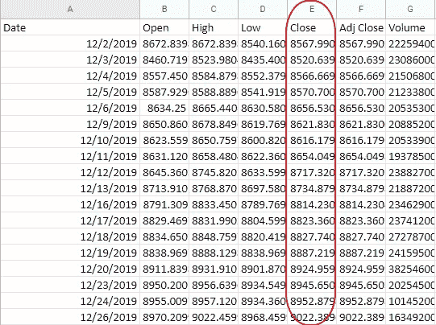
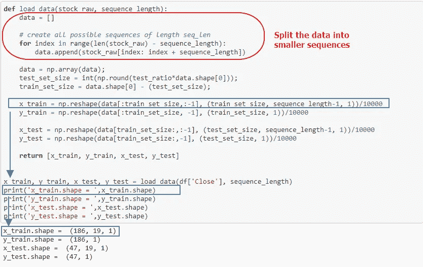
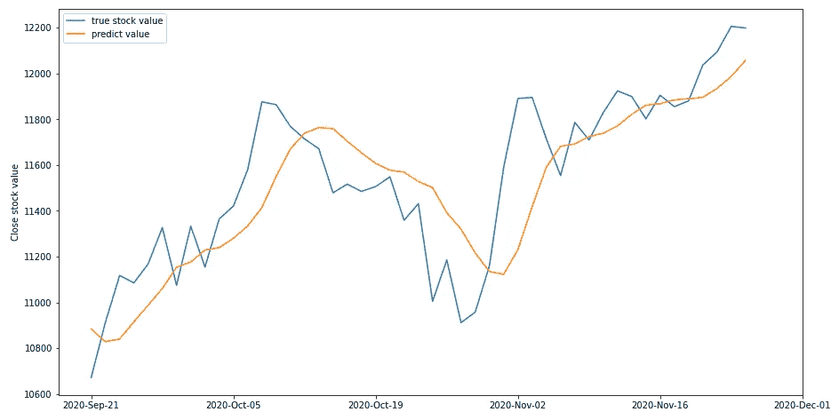

# 用 LSTM 预测股市的一个简单例子

> 原文：<https://medium.com/analytics-vidhya/a-quick-example-using-pytorch-lstm-in-stock-market-prediction-98afe1aeafe5?source=collection_archive---------19----------------------->

图片来源:[https://pxhere.com/en/photo/970962](https://pxhere.com/en/photo/970962)

LSTM 是进行时间序列预测的一个非常方便的工具，所以它可以用于股票市场估计也就不足为奇了。在这里，我们给出一个快速演示，为纳斯达克指数预测构建一个 2 层无状态 LSTM，它改编自[这个 Kaggle 版本](https://www.kaggle.com/taronzakaryan/stock-prediction-lstm-using-pytorch)，做了一些小的调整。Jupyter 笔记本代码在这里提供[，而用过的股票数据可以在这里](https://gist.github.com/adoskk/c3d96e4c7ae15a48c2a9ea8bc835ca39)找到[(感谢我的朋友 Will 拿出股票数据)。](https://drive.google.com/file/d/1Ab9DLNSSxhxEnZAJj177PALusithMlD6/view?usp=sharing)

首先，让我们讨论如何解决这个问题。

对 LSTM 来说，最重要的事情是将数据重新格式化成序列，并决定相应的输入和输出大小。在给定的例子中，我们只有一个 253 个值的长序列(假设我们只是使用‘Close’列), LSTM 不能有效地学习这个。因此，第一项任务是将这些数据分解成更小的部分。

我们使用的数据是由 253 个标量值组成的单列

因为我们想做预测，一个自然的思考方式是，用一个比给定的 253 天更短的时间段来预测。在这个 [Kaggle 版本](https://www.kaggle.com/taronzakaryan/stock-prediction-lstm-using-pytorch)中，我们使用之前的 19 天来预测第 20 天，但是用户可以将这个数字更改为任何序列长度，并查看这是否会改善结果。

序列长度=20。这里的输入 X 是前 19 天的序列，而输出 Y 是单个标量，是第 20 天的预测值。

请注意，我们通过除以 10000(如果您使用不同的标度，请更改数字)来标准化所有股票值，以避免神经元饱和现象，否则，[预测可能会变成常数](https://datascience.stackexchange.com/questions/22047/time-series-forecasting-with-rnnstateful-lstm-produces-constant-values)。

然后，LSTM 的建筑简单地遵循标准的建设。由于它是无状态的 LSTM，我们在每次训练时将隐藏状态重置为 0。

这是一个原始的结果，我们可以看到预测几乎代表了真实指数值的趋势。所以我们的模式是成功的！

