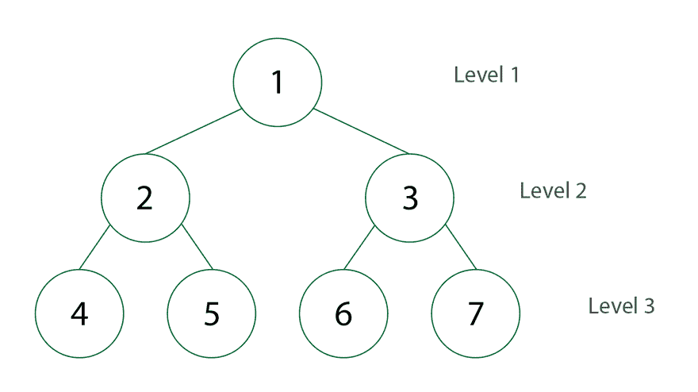

# DFS 和 BFS(深度优先搜索和广度优先搜索)的快速解释

> 原文：<https://medium.com/analytics-vidhya/a-quick-explanation-of-dfs-bfs-depth-first-search-breadth-first-search-b9ef4caf952c?source=collection_archive---------24----------------------->

## **简介**

因此，进入数据结构领域，我们会遇到两个概念:深度优先搜索和广度优先搜索。这两个概念的目的是探索数据集，它们都有不同的方法来处理数据集，我将在这篇博客中尝试讨论它们。

这些算法在所有情况下基本上有两个步骤:访问漩涡和探索漩涡，漩涡只是指数据集中的任何元素或节点。访问旋涡指的是当前正在被观察的元素，而探索旋涡指的是观察当前被访问的旋涡是否具有附加到它的其他节点。

## BFS(广度优先搜索)

因此，为了更好地理解这些算法，我们将使用下面的数据树作为例子。

在 BFS 和 DFS 中，第一步是选择一个节点或漩涡来开始我们的搜索，在这种情况下，我将选择顶部的数字 2。BFS 非常坦率。

我们首先访问我们选择的漩涡(2 ),我们检查 2 是否有孩子，我们发现 2 有 7 和 5 作为孩子。所以我们目前的顺序是:2，7，5。然后，我们继续探索发现的第一个子漩涡，即 7。我们可以看到 7 有 3 个孩子:2、10 和 6，所以现在我们的列表应该是这样的:2、7、5、2、10 和 6。现在，我们检查第二个孩子(5)是否有孩子，我们可以看到 5 有 9 个孩子，因此我们将向列表中添加 9 个孩子:2、7、5、2、10、6 和 9。我们现在对第一个找到的 7 的孩子重复相同的过程，从 2 开始，它没有孩子，所以我们移动到 10，它也没有孩子，所以我们移动到 6，我们发现 6 有 5 和 11 作为孩子，所以我们将它们添加到列表中:7，5，2，10，6，9，5 和 11。现在我们回过头来检查 5 的孩子，也就是 9。我们看到 9 有一个孩子，4，所以我们把它添加到列表中:7，5，2，10，6，9，5，11 和 4。现在，下一步是返回到数字 6，检查它的子节点是否有更多的子节点，我们看到他们没有子节点，所以我们转到数字 4，也没有子节点，这样我们就完成了。

所以 BFS 很简单，对吗？！在最简单的情况下，这就像从左到右阅读任何文本，但在任何给定的树或数据集内，过程都是相同的。

## 深度优先搜索

为了理解这个算法，我将使用相同的数据树作为例子。

作为 BFS，我们也必须选择一个初始漩涡来开始我们的搜索，所以我也会选择顶部的数字 2。BFS 和 DFS 的区别在于，DFS 是一条直线，直到找到漩涡的最深处才会停止，因此得名“深度优先搜索”。让我们来看一下 DFS 完成搜索的每个步骤。

我选择数字 2 作为起点，所以第一步是检查 2 是否有孩子，我们可以看到它有 7 个孩子。这是 DFS 与 BFS 不同的地方，我们不是检查 2 是否有更多的孩子，而是停下来继续 7，我们探索 7，发现 7 有 2，所以我们停止探索 7，我们开始探索 2，2 什么也没有，所以我们回到 7，我们看到 7 有 10，10 什么也没有，所以我们回到 7，7 也有 6。到目前为止，我们的列表是这样的:2、7、2、10 和 6。接下来，我们将探索 6，发现 6 有 5，我们停止探索 6，探索 5，我们发现 5 没有任何东西，所以我们回到 6，发现 6 有 11，所以我们探索 11，我们什么也没有发现，所以现在我们再次回到前 2，我们的列表现在看起来像这样:2，7，2，10，6，5，和 11。

我们现在再次浏览 2，看到它有另一个孩子，5，所以我们停止浏览 2，我们浏览 5，我们发现 5 有 9，所以我们浏览 9，9 有 4，我们浏览 4，发现 4 没有任何东西，所以我们回到 2，因为没有更多的孩子。我们再次探索 2，发现 2 没有更多的孩子，所以我们完成了，我们的最终列表看起来像这样:2，7，2，10，6，5，11，5，9 和 4。

## 结论

所以我们在这篇博客中看到了什么是 BFS 和 DFS 以及它们的区别，谢谢你的阅读，我希望这篇博客能帮助你更好地理解这两个概念。