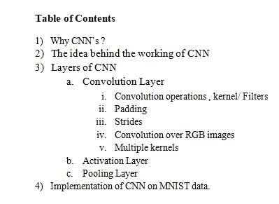

# 快速掌握卷积神经网络及其在 MNIST 数据集上的实现

> 原文：<https://medium.com/analytics-vidhya/a-quick-grasp-of-convolution-neural-networks-cnn-7a258bc9bfe6?source=collection_archive---------21----------------------->

目录

卷积神经网络(CNN)是一种流行的深度人工神经网络。CNN 由可学习的权重和偏见组成。CNN 与普通的神经网络非常相似，但又不完全相同。

CNN 主要用于图像识别、图像聚类和分类、目标检测等..

## 为什么是 CNN 的？

CNN 的是权重共享，不太复杂，占用内存也少。

让我们来看一个 MNIST 数据集图像，它被传递给 CNN 和 NN。

假设在 CNN 层，10 个 5x5 大小的过滤器，那么我们有 5x5x10 +10(偏差)=260 个参数。

假设图像尺寸为 784，神经网络层有 250 个神经元，那么在神经网络(NN)中，我们有 784×260+1 = 19601 个参数

因此，在传统的图像识别任务和许多其他任务上，CNN 的表现优于 NNs。

## CNN 运作背后的理念

计算机视觉中的卷积运算在生物学上受到大脑视觉皮层的启发。CNN 的连接模式类似于动物视觉皮层的结构。

如果图像被传递到视觉皮层，那么皮层通过片段/层处理该信息。大脑从每个片段/层提取信息。第一层学习诸如边缘或颜色之类的表示，而中间层学习诸如对象部分之类的中间抽象表示，最后，高级层学习诸如猫的脸之类的完整对象。随着抽象层次的增加，推论变得更加清晰。因此，大脑根据它通过所有层次学习到的信息做出决策。

## CNN 的几层

Cnn 由不同的层组成。它们是输入层和输出层。在这些层之间，有多个隐藏层，如“*卷积层*”、“*激活层*”、“*最大汇集层”、“全连接层】*。对于网络中存在的隐藏层没有限制。输入层接受输入并进行专门训练，然后从输出层给出一个输出。在 CNN 的帮助下，我们可以更有效、更准确地使用大量数据。

在**卷积层中，**我们有

这一层主要有助于边缘检测。详细解释请参考[索贝尔边缘检测器](https://en.wikipedia.org/wiki/Sobel_operator)。

**卷积运算**

在数学中，卷积是对两个函数的数学运算，产生第三个函数，表示一个函数的形状如何被另一个函数修改。

卷积层对输入应用卷积运算，以便将结果传递给下一层。每个卷积只处理其各自字段的数据。

这里，在卷积中，我们对图像矩阵、核/滤波器矩阵执行逐元素乘法和加法运算，产生输出矩阵。

内核/滤波器矩阵包含随机分配的权重，并在反向传播期间得到更新。

卷积运算

## 填充和步幅

很明显，在执行卷积之后，我们正在获得一个降维的卷积特征/矩阵。为了保持输入中输出的维数，我们使用填充。

填充过程将 0 对称地添加到输入矩阵的边界，因此在卷积后，我们会丢失填充的维度，因此我们可以在输出中保留原始维度。

填充前的尺寸:

填充后的尺寸:在图像的两侧添加填充

## 进展

内核/过滤器在图像矩阵上从左到右、从上到下移动，在水平移动时改变一个像素的列，然后在垂直移动时改变一个像素的行。

图像上的核矩的量被称为“步幅”。

对于步幅 S，填充 P

这些内核值在每次迭代中都会更新。

## RGB 图像上的卷积

我们观察到灰度图像的卷积值在 0-255 之间。

RGB 图像有额外的 3 个通道，因此尺寸看起来像(n x n x c)

其中 c =通道数 RGB 中的 3]

无论如何，通道尺寸在输出中变得中立，因为使用 C-dim 核在 C-dim 图像上进行元素方式的乘法和加法操作。

**与多个内核的卷积:**

让我们考虑一下，我们有 m 个内核

假设，如果对具有多于一个核的图像执行卷积，那么输出的维度(即卷积特征)也增加了“m”个维度。

多核卷积

**激活层**

激活函数将非线性引入模型，使得复杂度增加，并且模型学习更多。

它用于确定神经网络的输出(如是/否)。它也可以连接在两个不同的神经网络之间。在使用内核对元素进行乘法和加法之后，我们对该值应用类似“Relu”、“Sigmoid”、“Tanh”、“Leaky Relu”、“Softmax”的激活。

因此，在复杂功能中，每个值都是激活层的输出。

> 激活(a*w1 + b*w2 + e*w3 + f*w4)

其中，a，b，e，f 是图像中元素的聚类。

w1、w2、w3、w4 是核的权重。

**汇集层**

它负责减小复杂要素的空间大小。池化将一层的元素集群的输出合并到下一层的单个元素中。

池层跨度=2，内核=(2，2)

*"Max pooling"* 使用前一层每个元素簇的最大值。

*"Mean/Average pooling"* 使用前一层元素簇的平均值。

**完全连接**

网络中的最后几层是完全连接的，这意味着前面几层的元素与后面几层中的每个元素都是连接的。这模仿了高级推理，其中考虑了从输入到输出的所有可能路径。

CNN 的所有层

## 履行

模型架构

## 参考资料:

[https://en.wikipedia.org/wiki/Convolutional_neural_network](https://en.wikipedia.org/wiki/Convolutional_neural_network)

[https://www . quora . com/什么是卷积神经网络](https://www.quora.com/What-is-a-convolutional-neural-network)

[https://www . quora . com/从理论和实践的角度来看，卷积神经网络与简单神经网络相比有何优势](https://www.quora.com/What-are-the-advantages-of-a-convolutional-neural-network-CNN-compared-to-a-simple-neural-network-from-the-theoretical-and-practical-perspective)

[https://medium . com/intuitive-deep-learning/intuitive-deep-learning-part-1a-神经网络导论-d7b16ebf6b99](/intuitive-deep-learning/intuitive-deep-learning-part-1a-introduction-to-neural-networks-d7b16ebf6b99)

[https://www . quora . com/Does-the-visual-cortex-explicitly-perform-segmentation](https://www.quora.com/Does-the-visual-cortex-explicitly-perform-segmentation)

# 快速掌握卷积神经网络