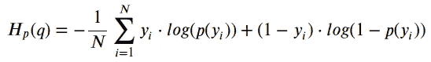

# 损失函数快速指南

> 原文：<https://medium.com/analytics-vidhya/a-quick-guide-to-loss-functions-60d78547fecb?source=collection_archive---------13----------------------->

卢克·切瑟在 [Unsplash](https://unsplash.com?utm_source=medium&utm_medium=referral) 上的照片

我想通过这个博客分享的议程是，在机器学习中，在我们训练过程的每一次迭代中，我们都会比较我们的预测和实际输出。该比较产生误差值，并且该误差是我们在使用优化策略梯度下降的学习过程中最小化的。

我们实际计算误差值的方法是使用 ***损失函数*** 。它量化了当正确的输出是 **Y(相关值)**时，如果我们使用当前的模型对 **X(独立值)**进行预测，我们会错得有多离谱。我们的主要目标是尽可能地将其降至零。

**在机器学习的背景下，我们将损失函数大致分为两种类型:**

1.  分类损失
2.  回归损失

## ***1 —分类损失:***

它有两种类型:**交叉熵**和**铰链损失。**

*   **交叉熵损失** —也称为对数损失。它由所有预测概率/输出的负值之和乘以(实际输出)来确定，因为有许多 as 类，这将给出我们的误差。

交叉熵损失函数

这里，*为实际输出， ***p(yi)*** 为第***第**个位置的预测输出概率，N 为训练样本数**

*   ****铰链损失—** 通常在 **SVM(支持向量机)中用于分类的另一种损失函数，**它不仅在预测不正确时而且在预测不可信时惩罚预测。它惩罚了那些真正意义上的预测。但是自信正确的预测不会受到任何惩罚。**

****

**铰链损失函数**

**其中 ***【易】***为实际输出***【hθ(Xi)***为我们在 ***与*** 训练示例的假设/预测输出概率。**

**因此，由此我们可以形式化我们的标签可以是 1 或-1，因此当符号匹配并且 ***hθ(xi)*** 大于或等于 1 时，损耗为零。**

**与交叉熵损失相比，铰链损失更容易计算。用梯度下降训练更快，因为大部分时间梯度为零。所以，我们不需要更新权重。如果我们想以较低的精度进行实时预测，总是依赖于铰链损失超过交叉熵损失。但是如果精度比速度重要，那么我们应该总是用交叉熵损失。**

## *****2。回归损失—*****

***它有三种类型* ***均方、绝对*** *和* ***胡贝尔损失。*****

*   ****均方损失或 L2 损失** —它计算或测量模型预测与正确值的平均偏差量。**

****

**均方误差损失函数**

**这里*为实际输出， ***p(yi)*** 为第 *i* **th** 位置的预测输出概率， **n** 为训练样本数。***

**因此，在 MSE 中，我们可以计算预测输出和实际输出之间的差异，求平方，我们将对每个训练示例或数据点进行计算，将它们相加，然后除以训练示例的总数。平方的原因是让我们的结果是二次的，所以当我们绘图时，它将只有一个全局最小值。因此，使用像梯度下降这样的优化策略，我们不会陷入局部最小值，这将最终帮助我们找到理想的参数值来优化目标函数。**

****

*   ****平均绝对误差或 L1 损失** —它计算一组预测中误差的平均大小，而不考虑它们的方向。我们对预测输出和实际输出之间的绝对差异的测试样本取平均值，其中所有个体差异具有相同的权重。在平方误差中，我们通过平方它们来惩罚较大的偏差，这使得异常值更大。因此，平方后，平均绝对误差比均方误差对异常值更稳健。MAE( **平均绝对误差)**给数据分配相等的权重，而 MSE **(均方误差)**强调极端值**。****

****

**平均绝对损失函数**

*   **胡贝尔 **损失**——这是一个与梅非常相似的损失。与 MSE 相比，它对异常值也不太敏感。对大值是二次的，对小值是线性的。**

****

**所以，根据你的问题是回归问题还是分类问题，我们可以使用几个损失函数，然后，我们可以选择一个损失函数来优化精度或速度。所以，希望你喜欢看我的博客。如果您有任何疑问，请在下面评论。在那之前，学习、理解、实施和重复。**

*****演员表—你管视频(Siraj Raval，损失函数讲解)*****