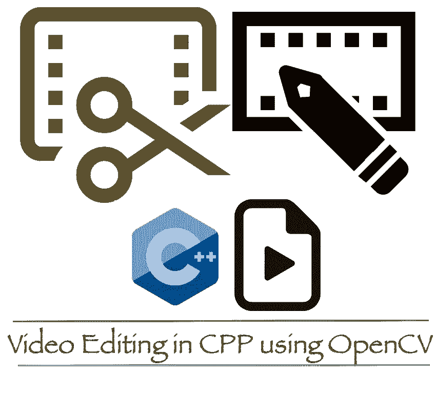
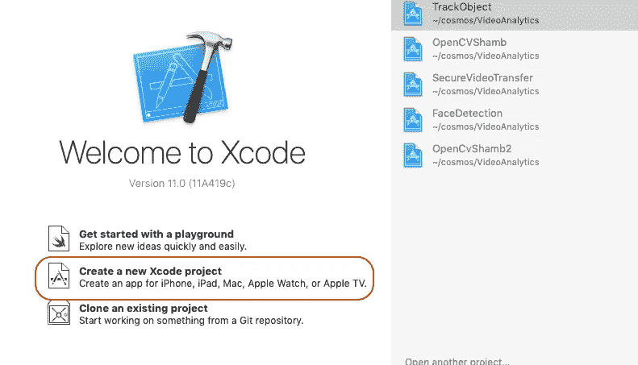
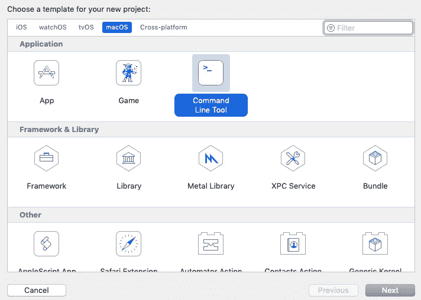
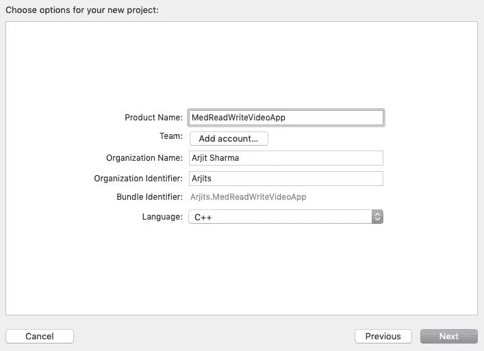
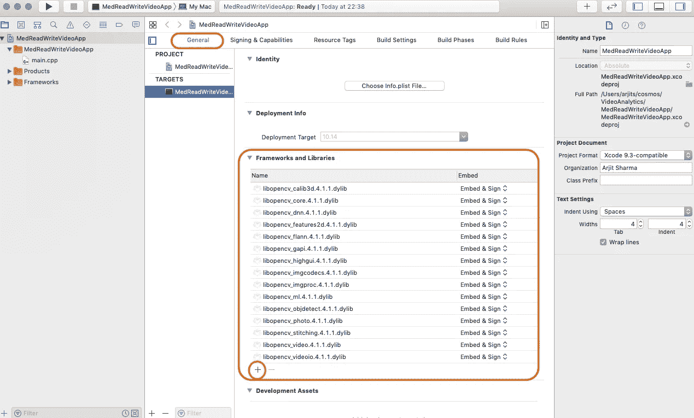
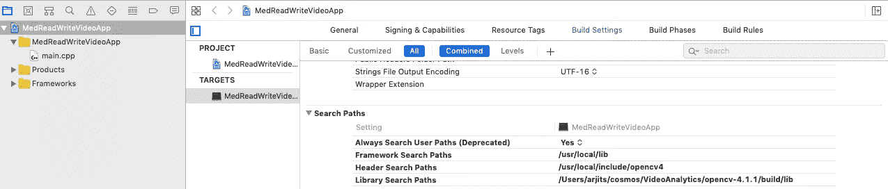

# OpenCV 快速指南:读写视频文件

> 原文：<https://medium.com/analytics-vidhya/a-quick-guide-to-opencv-read-and-write-video-files-78f2dca1c0e4?source=collection_archive---------21----------------------->

## 第 2 部分:读写视频文件并模糊 ROI

到目前为止，基于第一部分的[，](/@arjitss/a-quick-guide-opencv-6f791f1c014d)我们已经完成了所有的配置和安装，现在我们的 MacBook 已经准备好运行这个神奇的库 **OpenCV** 。
下一步是编写并执行 Cpp 程序[[Github Repo link](https://github.com/arjitss/SecureVideoTransfer)]来读写视频文件。让我们一步一步开始:



# 第一步:

打开 Xcode，点击创建新项目。



# 第二步:

点击 macOS，选择应用程序类型作为命令行工具。



然后根据您的选择写下您的应用程序的名称



最后选择创建项目的位置。就这样..！步骤 2 已完成。去喝杯茶吧。

# 第三步:

您将看到的下一个屏幕是您的应用程序**项目设置**屏幕。在“常规”选项卡上，在“框架和库”下添加 OpenCV 库。点击小的“ **+** ”符号，添加我们在第 1 部分下载的所有库文件。位置是**opencv-4 . 1 . 1**→**build**→**lib**→All "** . 4 . 1 . 1 . dylib "*文件。



# 第四步:

接下来，根据您的安装，转到构建设置并更新以下三个路径:

1.  框架搜索路径
2.  标题搜索路径
3.  库搜索路径



伙计们，你们已经准备好发射了。所有设置部分都已完成。现在，点击 main.cpp 文件，尝试编译和构建代码，进行感觉检查，确认一切正常。下一步将开始探索 OpenCV 库(类和函数)。

# 第五步:

所以现在一切都准备好了，你可以开始编码了。
在这一步，我将分享关键的 OpenCV 库类及其函数的细节，以及我从 Github 库获得的[代码库](https://github.com/arjitss/SecureVideoTransfer)，你可以下载并在你的机器上执行。

1.  最重要的类是 *VideoCapture* 。我们可以使用这个类的 open() & read()函数来打开和读取任何视频文件。
2.  第二个是视频作者。我们可以用 open() & write()来打开和写入一个视频文件
3.  最后用 imshow()函数来显示视频。

我在这里展示了我的 Git 回购的一些关键部分。

```
*//------- Initial setup ----------*
**VideoCapture** cap;    
**cap.open**("SampleIn.mp4");    
if(!cap.isOpened()){      
   cout << "Error opening video stream or file" << endl;      
   return -1;    
}    

frameWidth = cap.get(CAP_PROP_FRAME_WIDTH);    
frameHeight = cap.get(CAP_PROP_FRAME_HEIGHT);**VideoWriter** video;
*// Define the codec and create VideoWriter object. *   **video.open**("SampleOut.mp4",cv::VideoWriter::fourcc('M','J','P','G'),70, Size(frameWidth,frameHeight));*// ---- Reading & Writing the Video --------*
while(1){        
**cap >> frame**; *// Read frames*
if (frame.empty())         
   break;
**video.write**(frame); *// Write file frame by frame*    
**imshow**( "Frame", frame );              
*// Press  ESC on keyboard to exit* 
char c=(char) waitKey(25);       
if(c==27)         
   break;
}// ---- Gracefully End -----
**cap.release**();    
destroyAllWindows();
```

[库](https://github.com/arjitss/SecureVideoTransfer)还有很多其他功能，比如模糊 ROI，使用 HaarC 模糊面部，拍摄视频截图，播放和暂停视频。如果您逐个提交回购协议，您可以在其中获得所有详细信息。

我希望你发现这些文章和[代码库](https://github.com/arjitss/SecureVideoTransfer)，足以让你亲手使用 OpenCV。如果你有任何关于代码库的问题，请告诉我，我会尽我所能做出回应。如果你觉得这个文章系列有用，就鼓掌告诉我:-)。