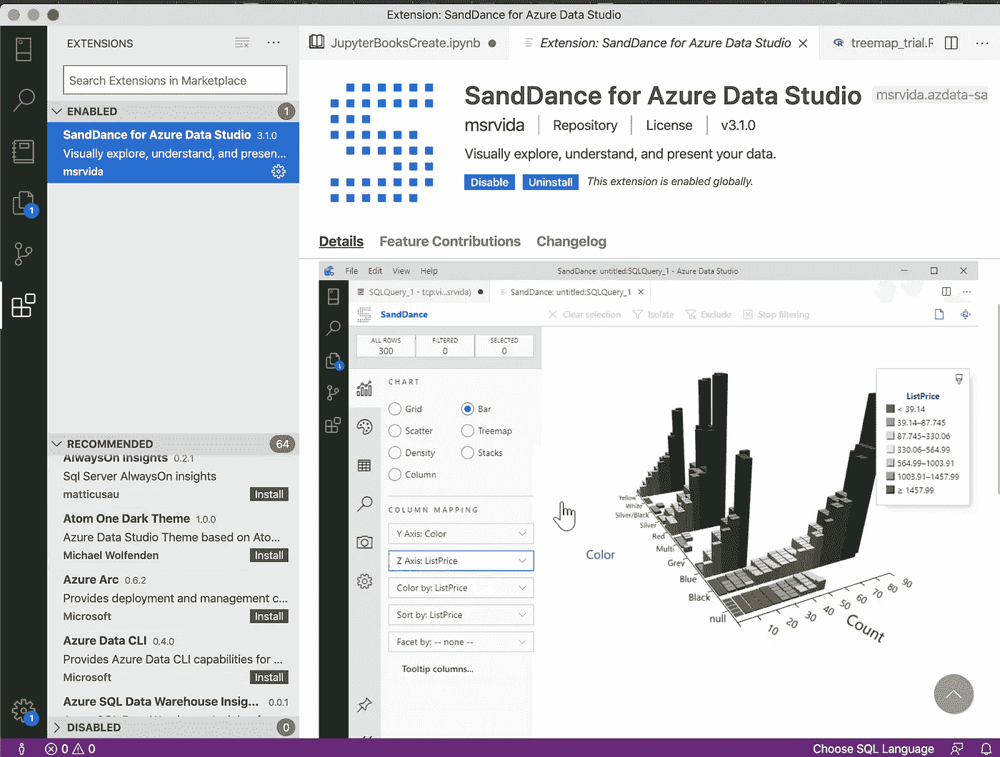

# 快速浏览 Azure Data Studio

> 原文：<https://medium.com/analytics-vidhya/a-quick-look-at-azure-data-studio-7b34783c7b8a?source=collection_archive---------10----------------------->

## 微软的 Azure 云服务提供了一个数据管理平台，将业务分析师提升到了期望的下一个水平。

Sundance 是一个数据可视化库，是扩展 Azure Data Studio 功能的众多扩展之一。

在过去的几年里，微软一直在稳步推出云服务。这家科技巨头已经从其作为典型办公生产力软件的标志性地位转变为…