# Mac 上 Google Colab、Github 和 Jupyter 笔记本的快速工作流程。

> 原文：<https://medium.com/analytics-vidhya/a-quick-workflow-for-google-colab-github-and-jupyter-notebooks-on-mac-ff5d004e01f?source=collection_archive---------5----------------------->

照片由 [Pexels](https://www.pexels.com/photo/code-coding-computer-data-574071/?utm_content=attributionCopyText&utm_medium=referral&utm_source=pexels) 的 [Lukas](https://www.pexels.com/@goumbik?utm_content=attributionCopyText&utm_medium=referral&utm_source=pexels) 拍摄

我有一台旧的 09 款 Macbook Pro，在尝试运行最新的 Keras 以用于我最新的熨斗学校神经网络项目时遇到了问题。旧的 Mac 只更新到 El Capitan，所以它无法在 Jupyter 笔记本上运行最新版本的 Keras。为了解决这个问题，我一直试图将 Google Colab 的使用与我的工作流程相结合。Colab 是一款基于云的笔记本，拥有运行 Keras 所需的更新，已经派上了用场。试图了解 Jupyter 笔记本和 Colab 之间的细微差别，以保持一切顺利进行，并同步我所有的更改，这一直是一个挑战。这里有一个小工作流程，我发现它对管理我的笔记本和 Github 库很有用。它不是最优雅的，但我发现它很有用，目前它已经完成了工作，同时我继续学习更多关于使用 Colab 及其与 Github 的所有连接。

# 1.在 Github 中创建一个资源库。

如果您已经有了一个想要使用的存储库，那么转到这个过程的第二步来创建或打开一个 Colab 笔记本。如果你需要创建一个全新的库，去 Github 创建一个新的。单击“存储库”部分下的绿色“新建”按钮。

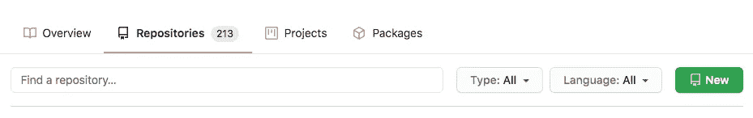

点击绿色按钮创建新的回购协议。

在下一个屏幕上为存储库添加一个名称，然后单击该框来初始化一个自述文件。您可以选择向存储库添加一个许可证，尽管我还在学习所有不同的类型，在本文中不会详细介绍。这里有一个很好的链接，我发现了其中一些之间的差异，你可以看看。[https://www . fast company . com/3014553/what-coders-should-know-on-copyright-licensing](https://www.fastcompany.com/3014553/what-coders-should-know-about-copyright-licensing)。然后单击“创建存储库”。

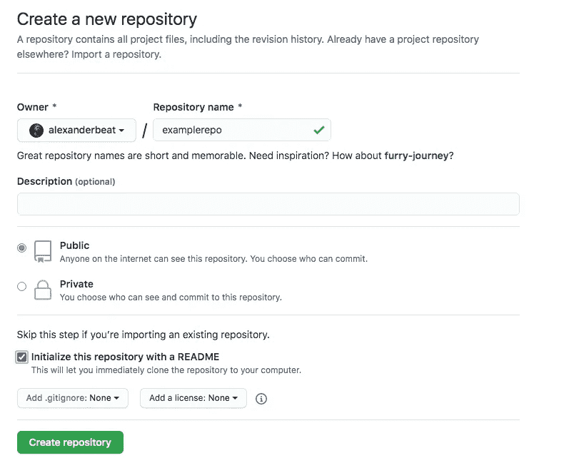

下一个屏幕将是一种空白的存储库，显示你的自述文件，你可以暂时不去管它，直接进入 Google Drive。

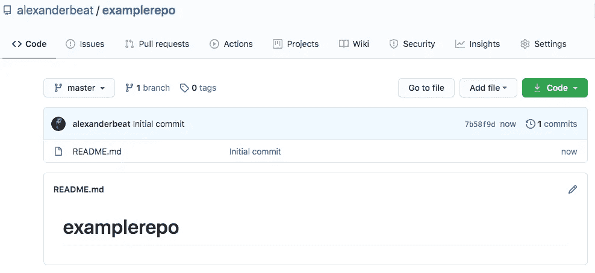

# 2.在 Google Drive 中创建或打开一个 Colab 笔记本。

在 Google Drive 中，点击“新建”按钮，转到“更多”并选择“Google 协同实验室”。如果 Colab 没有出现在这个下拉列表中，你应该可以通过点击“连接更多应用”找到它。

单击新建。

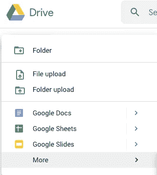

转到更多。

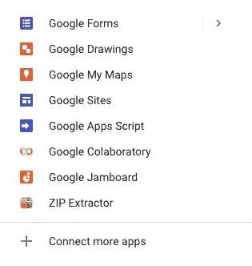

点击谷歌合作实验室。

将会打开一个新的 Colab 笔记本标签。这将作为您的新笔记本使用，并最终保存到您的 Github repo。如果您已经有一个现有的回购和笔记本，并希望在 Colab 中打开它，请在顶部菜单栏中单击“文件”，“打开笔记本”。

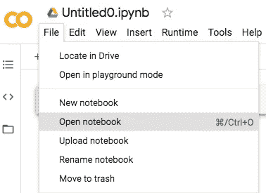

单击打开笔记本。

将出现一个新的弹出窗口。点击顶部的“Github”。如果您以前没有这样做过，您可能需要在这里输入您的 Github 凭证来连接到 Colab。如果连接上了，你应该会看到这样的屏幕，在搜索栏显示你的 Github 用户名。确保您选中了“包括私人回购”复选框，以防您现有的回购不是公开的。您的存储库的下拉菜单将位于下方，您可以选择您创建的存储库。一旦选中，如果你在 Github 存储库中有一个现有的笔记本，它应该显示在下面，你可以点击它在一个新的 Colab 标签中打开它并继续工作。

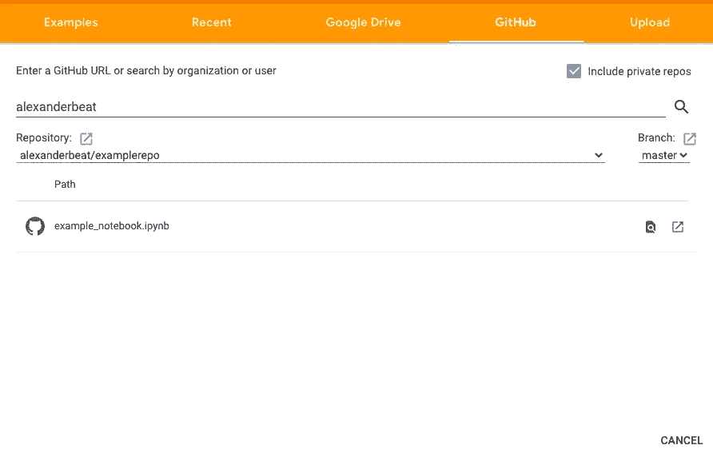

现有笔记本显示在下拉列表下方。

# 3.将笔记本保存到 Github。

对您的 Colab 笔记本进行更改和编辑。请随意在顶栏上给它一个标题。接下来，要将它保存到您的存储库中，请转到“文件”菜单。点击“在 Github 中保存副本”。

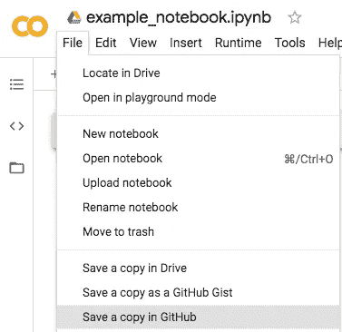

将出现一个弹出窗口。从下拉列表中选择您的回购，并为推送添加提交消息。选中“包含到协作室的链接”框，这将在您的笔记本顶部添加一个快捷按钮，以便快速访问。

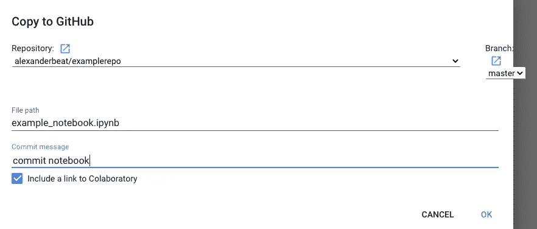

点击“确定”,一个新的标签页将会打开。你会看到笔记本顶部有“在 Colab 中打开”的快捷按钮。现在，只要你想在 Colab 中快速打开它并进行修改，你就可以点击它。然后只需重复保存过程推回到 Github。您也可以选择直接从 Google Drive 打开 Colab 笔记本。

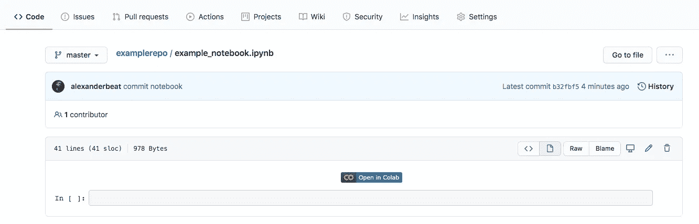

## 旁注:

如果将 Colab 笔记本保存到 Github，然后使用快捷按钮在 Colab 中重新打开，它将不会自动保存更改，需要从 Colab 文件菜单保存到 Github，以便像上面的第三步一样将更改推送到 Github。如果你试着从文件菜单中点击保存，你会得到一个类似这样的弹出框。

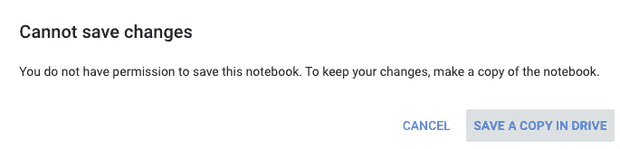

如果你更喜欢让 Colab 笔记本自动保存，那么你可以通过从 Google Drive 打开它，而不是用快捷按钮从 Github 打开它，来独立地在 Colab 笔记本上工作。

无论您是从 Google Drive 还是从 Github 打开文件，您仍然应该将它保存到 Github，就像前面第三步中所示的那样，以便将您的更改推送到 Github 存储库。

# 4.与桌面上的本地回购同步

一旦笔记本被保存在 Github 上，如果你想在你的本地机器上备份它或者在本地使用它，使用终端或者 [Github 桌面](https://desktop.github.com/)并且克隆它到你的计算机上。如果你需要知道如何克隆它，我可以帮你。就留个评论吧，不然我可以单独编个故事讲讲。

如果对笔记本的修改是在本地机器上进行的，你可以把这些修改推回到 Github。想在科拉布重新开张吗？转到 Github repo 上的笔记本，单击笔记本顶部的 Colab 按钮。它将在一个新的 Colab 选项卡中打开，您将看到之前在本地计算机上所做的所有新更改。

当然还有更好的方法，但这只是一种快速简单的方法，我发现这种方法在遇到障碍时很有用，比如无法在我的本地机器上运行 Jupyter 笔记本电脑中的 Keras，Colab 已被证明是一种很好的变通方法，在经济困难时期不必花钱购买新的笔记本电脑。希望这能帮助那些刚刚熟悉 Github、Colab 和 Jupyter 的人。