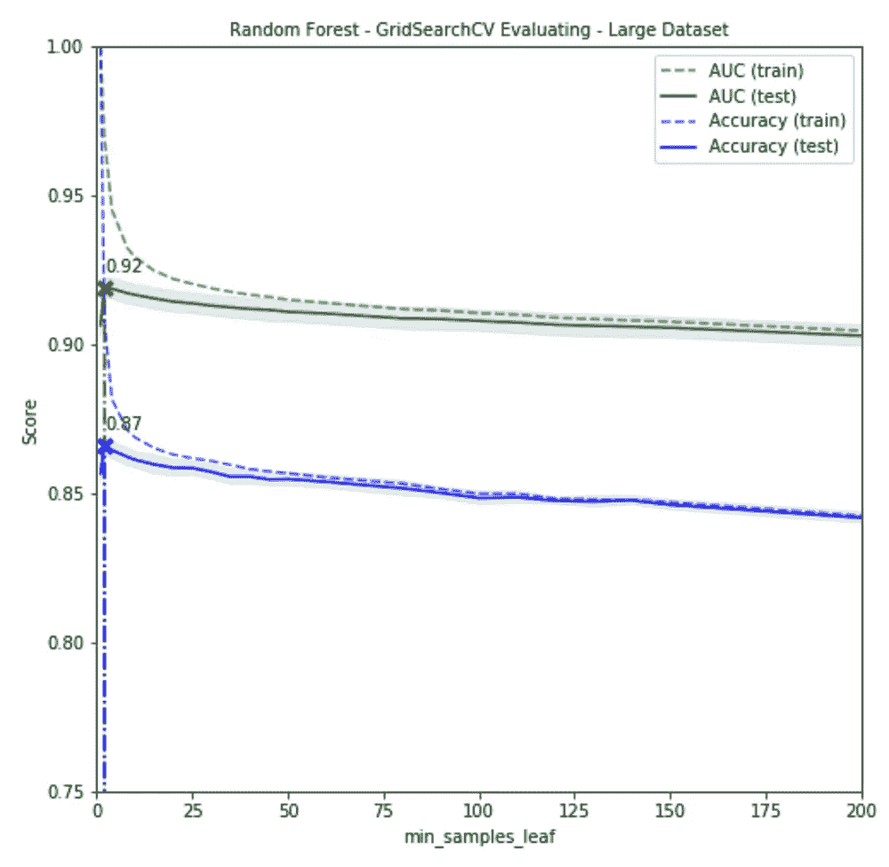

# 森林中的漫步

> 原文：<https://medium.com/analytics-vidhya/a-random-walk-in-forest-2017659f7f86?source=collection_archive---------3----------------------->

# 用超参数调整随机森林算法

# 数据科学之旅—第 4 章

R **andom Forest** 是基于**决策树**的最佳机器学习算法之一。除了从包括自举和打包在内的集成方法中获益之外，随机森林还通过随机选择树特征(不使用所有特征)对树进行去相关来进一步降低方差。当正确使用时，该模型在减少方差方面取得了显著的改进，同时偏差的增加最小。

然而，当使用**管道**和**grid search**调整随机森林模型的超参数时，我们将模型变成了黑盒。事实上，对于数据科学家来说，理解超参数以及如何使用它们非常重要。在本周的帖子中，我们将研究随机森林算法的一些最常用的超参数，包括 *min_samples_leaf、min_samples_split、max_leaf_node、max _ featues、min _ infinity _ decrease、*和 *n_estimators* 。

请注意，调整超参数的最终目的是找到一个平衡偏差和方差的模型，使总误差最小(记住总误差=偏差+方差+不可约误差)。

Scott Fortmann-Roe 2012:了解偏差-方差权衡

**数据**

为了获得更多的见解，我使用两个不同大小的数据集进行调查。这两个数据集来自我的两个机器学习项目，它们已经被清理和预处理。

1.  小数据集:来自 Kaggle 竞赛的著名的 Titanic 训练数据集( **889 行 x 9 列**)。
2.  大型数据集:来自我的 401k 资格分类项目的匿名个人财务数据( **32，561 行 x 81 列**)。

**法**

为了试验超参数，我通过使用 GridSearchCV 和 5 重交叉验证来拟合数据集，从而简化了建模过程。我使用平均训练和测试精度，GridSearchCV 输出的 AUC 分数(即 cv_results_ attribute)是用于评估模型的偏倚、方差和整体质量的指标。通过保持所有其他超参数不变，一次评估一个超参数。下面是 GridSearchCV 设置的示例代码:

随机森林的 GridSearchCV

下面讨论了用于评估每个超参数的 6 个模型(即，2 个数据集的 6 个参数)。对于模型 1-5， *n_estimators* 被设置为 200。

# **模型#1: min_samples_leaf**

*min_samples_leaf* 是用于通过在叶节点中设置最小样本数以避免过拟合来正则化模型的参数。但是，模型默认值为 1，这很可能会使您的模型过拟合，因此不推荐使用。

对于小数据集，超参数的测试范围是 1-300。对于大型数据集，测试范围是 1–3，000。请参见下面的 ROC AUC 和准确性得分。为了获得更好的比较结果，我在相同的尺度上绘制了两个数据集的分数。图中有 4 条线，由 2 种颜色(即绿色和蓝色)和 2 种图案(即虚线和实线)区分。实线周围的晕圈代表测试分数的标准差。

左:小数据集|右:大数据集

**1 号模型观察**:

1.  当样本数量较低时(即训练分数远高于测试分数)，这两个模型都过拟合，这是有意义的。叶子越小(样本越少)，树就越深(分区越多)，因此更有可能过度拟合。
2.  对于小数据集，当 min_samples_leaf 介于 35(当精度破折号和实线变得更近时)和 150(在精度得分下降之前)之间时，模型的性能最佳。
3.  对于大型数据集，总体方差要低得多(也有意义)，尤其是当 min_samples_leaf 设置为 50 以上时。下面的缩小图显示，准确度分数在 400 之后开始下降得更快。

**模型#1 结论:**

min_samples_leaf 是我最喜欢的超参数之一，因为它更直观，也更容易使用。如果您不知道从哪里开始，设置一个从 **40** 到 **150** 的范围是一个相当好的起点。根据实际数据集的大小和质量进一步调整。

# **模型#2: min_samples_split**

分割内部节点所需的最小样本数。模型默认值为 2，这通常会导致过度拟合。

*min_samples_split* 的测试范围:

1.  小数据集:2 - 440
2.  大型数据集:2 - 3，000

左:小数据集|右:大数据集

**2 号模型观察结果**:

1.  当 *min_samples_split 的值较小时，两个模型都过拟合。*
2.  对于小数据集，图中显示了一个有趣的模式。当 *min_samples_split* 在 50 和 250 之间时，精度缓慢下降，然后回升并在 400 处达到峰值(约为数据的 50%)。方差随着 *min_samples_split 值的增加而减小。*
3.  对于大型数据集，最好的平衡是 1，000 或总样本的 3%。

**2 号模型结论**:

与 *min_samples_leaf* 相比， *min_samples_split* 对我来说不够人性化。它不适合我的小数据集。当 *min_samples_split* 设置为 400 时，每棵树都是一个**弱学习器**(只分裂一次)。**随机森林**(或随机树桩)字面上变成了 **Adaboost** ，不过，没有“boost”部分。我找不到一个好的理由来设定这么高的数字。

对于大型数据集，我建议将“3%”包括在您的调整范围内(即，您可以为该超参数输入整数或分数)。

# **模型#3:最大叶节点数**

*max_leaf_nodes* 限制模型中叶节点的数量。模型默认是无限制的，这显然会导致过拟合。

*max_leaf_nodes* 的测试范围:

1.  小数据集:2-200，
2.  大型数据集:2–3，000

左:小数据集|右:大数据集

**3 号模型观察**:

1.  当 *min_samples_split 的值变大时，两个模型变得更加过度拟合。*
2.  对于小数据集，方差和偏差很难平衡。
3.  对于大型数据集，这个超参数在 10 到 100 之间工作得很好(取决于训练和测试分数之间的差距的容差)。

**3 号模型结论**:

基于以上结果，当数据集很小时，我会谨慎地调整这个超参数。对于大型数据集，10 到 100 可能是一个合理的起点。

# **型号#4: max_features**

寻找最佳分割时要考虑的特征数量。默认为 **sqrt(特性数)**。还有一个经验法则指导:

1.  对于回归:最大特征数=特征数/ 3
2.  对于分类:max_features = sqrt(要素数)

max_features 的输入范围设置为特征总数的 0.01 到 1(即 1%到 100%)。注意，这个超参数并没有调整树的深度。为了避免自动过度拟合，我将两个模型的 min_samples_leaf 设置为 50。

左:小数据集|右:大数据集

**4 号模型观察**:

1.  对于小数据集，偏差和变化在测试范围内保持不变。
2.  对于大数据集，准确性和 AUC 分数保持在 0.1 和 0.9 之间。在此范围内，方差略有增加。在 0–0.1 和 0.9–1 之间，分数急剧下降。

**模型#4 结论**:

由于测试范围内的分数变化很小，我认为只要遵循这个超参数的经验法则就可以了。

# 模型#5:最小杂质减少

如果该分裂导致杂质减少大于或等于该值，则该节点将被分裂。模型默认值为 0。

两个模型都在 0.00005 到 0.04 的范围内进行测试。

左:小数据集|右:大数据集

**5 号模型观察结果**:

大数据集模型的精度分数对这个超参数更加敏感。

**5 号模型结论**:

基于上述结果，我将细化较小步骤的杂质减少范围，尤其是对于较大的数据集。对于少于 1，000 个条目的数据集，0.02 可能是一个好的起点。

# 模型# 6:n _ 估计量

树的数量。我最初没有评估这个超参数，因为经验法则是，它取决于你的计算能力。更多的树带来更好的结果。我在另一个论坛上看到一个讨论，说你应该使用 sqrt(行数*列数)CPUs 数)。

两种型号的测试范围都是 50 到 500。同样，n_estimators 没有调整树的深度，所以我使用了 *min_features_leaf* = 50 的模型。

**6 号模型观察**:

这个超参数对两个模型的分数没有什么影响。

**6 号模型结论**:

除非你有额外的计算能力，否则我不会过多强调这个超参数。

# 总体结论

在我的模型中，大数据集比小数据集得分更高。没有万能的解决方案。每个超参数的实际影响也取决于数据的数量和质量。还有一些我不常使用的超参数，所以我不在这篇文章中讨论。希望下面的推荐能给你一个有价值的起点。和往常一样，请在评论区分享你的经验和建议。

旁注:我的朋友帕特里克对 NBA 球员相对于选秀身份的价值进行了一次非常有趣的分析。如果你是一个篮球迷(并且玩梦幻游戏)，这将是一个无价的 7 分钟阅读([https://towardsdatascience.com/when-to-give-up-117e2e2acdc9](https://towardsdatascience.com/when-to-give-up-117e2e2acdc9))。