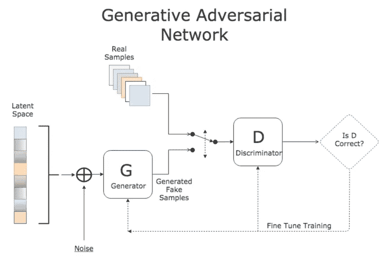
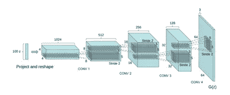
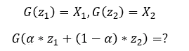
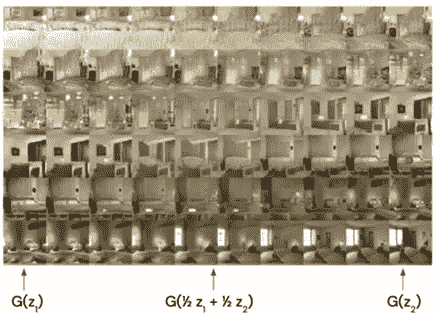
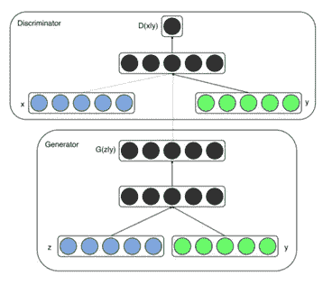
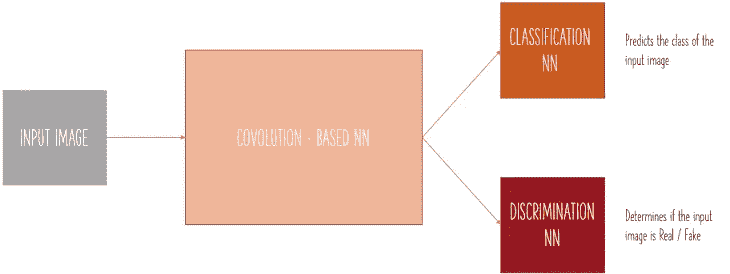

# 生成性对抗网络综述(一)

> 原文：<https://medium.com/analytics-vidhya/a-review-of-generative-adversarial-networks-part-1-a3e5757a3dc2?source=collection_archive---------23----------------------->

通用 GAN 架构

近年来，围绕生成性对抗网络(GANs)的炒作越来越多。自从 Ian Goodfellow 等人介绍了第一个 GAN 以来，已经有 500 多个(！！！)GAN 架构被建议和实现。这一领域的进展非常快，新的架构定期设计出来。

在这篇文章中，我将介绍最重要的基本 GANs 架构及其主要贡献。我将介绍并研究 DCGAN、CGAN 和 ACGAN。

# **DCGAN —**

论文:[深度卷积生成对抗网络的无监督表示学习](https://arxiv.org/pdf/1511.06434.pdf)

深度卷积生成对抗网络 GAN 是一种架构，其中生成器和鉴别器都基于深度卷积神经网络。生成器基于转置卷积，鉴别器基于规则卷积。

DCGAN 发电机

**主要贡献:** 在这篇论文中，作者提出了几条设计稳定 DCGANs 的准则:

*   避免合并层，用交错层代替它们。鉴别器中的步进卷积为发生器提供了更好的梯度。
*   在生成器中使用转置卷积(分数步长卷积)。
*   在生成器和鉴别器中使用批处理规范化。
*   为更深层次的架构移除完全连接的隐藏层。
*   在生成器中，在隐藏层中使用 ReLU 激活，在输出中使用 Tanh。
*   在鉴别器中，对所有层使用 LeakyReLU。

除了指导方针之外，他们还在论文中展示了潜在空间插值的概念:

潜在空间插值

也就是说，如果两个不同的潜在向量被生成器映射到两个不同的图像，生成器如何映射这些向量的线性组合？下图摘自最初的 DCGAN 论文，很好地展示了这一概念:

我们可以从上面的图像中看到，两个潜在向量之间的“中间点”被映射到相应生成图像之间的感知“中间点”。

# cGAN —

论文:[条件生成对抗网](https://arxiv.org/pdf/1411.1784.pdf)

条件生成对抗网络是一种结构，其中生成器和鉴别器使用附加信息。例如，他们可以使用标签。

该架构的概述如下:

cGAN

实施细节:

*   生成器接收潜在向量和附加信息向量。它将最后一个嵌入到潜在向量的形状中，并执行逐元素乘法。产品被输送到发电机。
*   鉴别器接收图像和附加信息向量。它将最后一个嵌入到图像的形状中，并执行逐元素乘法，然后将乘积提供给鉴别器。

**主要贡献:**本文介绍了一个框架，使 GAN 架构能够受益于额外的信息。

# ACGAN —

论文:[用辅助分类器 GANs 进行条件图像合成](https://arxiv.org/pdf/1610.09585.pdf)

辅助分类器生成对抗网络是用于条件图像合成的架构，其中鉴别器具有两个目标:

1.  辨别真假图像
2.  对输入图像进行分类

鉴别器的架构:

阿甘鉴别器

鉴别器执行多任务学习——网络有一个共享的卷积基础模型和两个不同的模型来生成不同任务的输出:分类和鉴别。

实施细节:

*   鉴别器接收一个图像(生成的/真实的)作为输入，并对其进行如下训练:如果图像是真实的，则对其进行训练以预测它是真实的，并对其进行正确分类。如果输入图像是假的，鉴别器被训练来预测它是假的。
*   生成器接收潜在向量和目标标签向量作为输入。它的任务是从目标标签分布中生成看起来真实的样本。例如，如果目标标签是“狗”，输入潜在向量是 z，那么对于鉴别器来说，G(z)应该看起来像一只狗。生成器被训练来“愚弄”鉴别器——使它“认为”它的样本是真实的并且来自目标类。

**主要贡献:**本文展示了如何利用辅助分类形式的多任务学习来改进条件图像合成。

在本系列的下一篇文章中，我将介绍一些先进的 GAN 架构和技术。