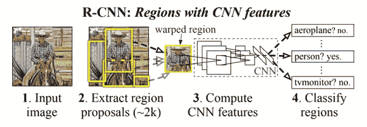
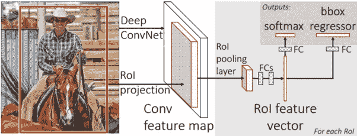
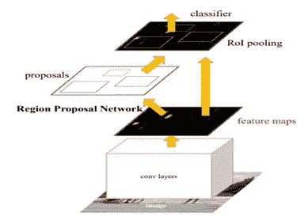
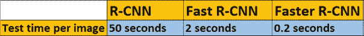
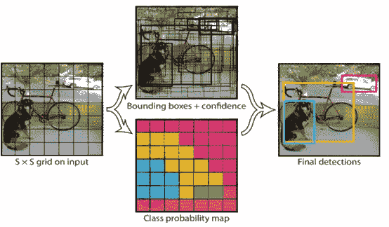
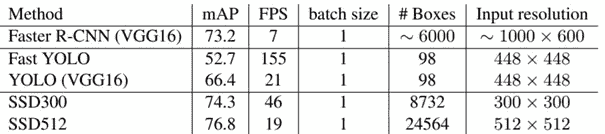
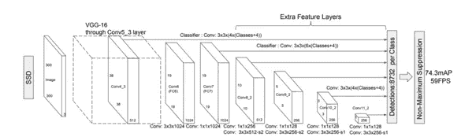
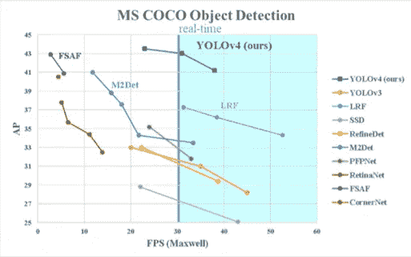

# 目标检测模型综述

> 原文：<https://medium.com/analytics-vidhya/a-review-of-object-detection-models-f575c515655c?source=collection_archive---------3----------------------->

[亚历山大·奈特](https://unsplash.com/@agk42?utm_source=unsplash&utm_medium=referral&utm_content=creditCopyText)在 [Unsplash](https://unsplash.com/s/photos/ai-eye?utm_source=unsplash&utm_medium=referral&utm_content=creditCopyText) 上拍照

目标检测广泛应用于计算机视觉任务中。有许多基于对象检测的应用，例如自动驾驶汽车或对象跟踪。在这篇文章中，我将解释各种算法；R-CNN，快速 R-CNN，更快 R-CNN，SSD 和 YOLO。

## R-CNN

R-CNN [1]之前使用了一些算法，如穷举搜索，但它们需要高计算性能和长时间才能找到图像上的最佳对象位置。为了解决这个问题，R-CNN 提出了一种方法，我们使用选择性搜索从图像中提取大约 2000 个区域，称为区域建议。选择性搜索减少了考虑的地点数量。它解决了 CNN 的本地化问题，但还是太慢了。每张图像需要 50 秒的测试时间。

**【1】**

## 快速 R-CNN

快速 R-CNN [2]被引入以解决 R-CNN 的缺点。不是将区域提议馈送给 CNN，而是将整个输入图像馈送给 CNN 以生成特征图。从特征图中，我们识别区域提议，并将它们馈送到完全连接的层中。然后，我们使用 Softmax 层来预测类别和对象边界框的偏移值。Fast -RCNN 比 R-CNN 快，因为每个图像只进行一次卷积运算。

**【2】**

## 更快的 R-CNN

快速 R-CNN [3]由提出区域的深度 CNN 和使用提出区域的快速 R-CNN 组成。更快的 R-CNN 比其他的要快得多，因为它使用了一种新的方法区域提议网络(RPN)来代替选择性搜索。RPN 主要告诉快速 R-CNN 去哪里找。类似于快速 R-CNN，单个 CNN 将整个图像作为输入，并产生特征图。在特征图上，RPN 生成一组矩形对象提议，并以对象性分数作为输出。然后，使用 RoI 池对这些值进行整形，以预测边界框的类和偏移值。

**【3】**

R-CNN 家族的比较

## YOLO

第一版 YOLO [4]是由约瑟夫·雷德蒙在 2015 年推出的。YOLO 有一个单一的神经网络，在一次评估中直接从整个图像预测边界框和类别概率。R-CNN 家族拥有复杂的管道，速度比 YOLO 慢。在这个模型中，“你只看一次”图像就可以预测物体的类别和它们的位置。YOLO 将图像分成网格，每个网格单元预测边界框和这些框的置信度得分。

[4]

Yolo 的第一个版本非常快，但也有缺点。网络与小对象斗争，这在后来的版本中得到了解决；约洛夫 2，约洛夫 3，约洛夫 4。

## 单次发射探测器

SSD [5]于 2015 年推出了单次多盒检测器。它比以前的对象检测模型(如 YOLO)更快。

**【5】**

将图像输入 VGG-16，以提取不同比例的特征地图。此外，它通过使用卷积过滤器来预测对象类别和边界框位置的偏移。SSD 为对象类实例的存在产生固定大小的边界框和分数的集合。则应用非最大抑制并产生最终检测。

## **YOLOv4**

**yolov 4[6]是最先进的物体检测技术。它在实时检测应用中速度极快。Yolov4 使用 CSPDARKNET53 型号作为主干。它是一个训练 YOLO 的框架，有 29 个卷积层和 2760 万个参数。此外，Yolov4 由 SPP 和 PAN 作为颈部组成，YOLOv3 作为头部。您可以使用预训练的 Yolov4 来训练您的自定义对象检测模型。访问[暗网回购](https://github.com/AlexeyAB/darknet)了解更多信息。**

****

****【6】****

# **参考资料:**

****【1】**用于精确对象检测和语义分割的丰富特征层次:[https://arxiv.org/pdf/1311.2524.pdf](https://arxiv.org/pdf/1311.2524.pdf)**

****【2】**快速 R-CNN:[https://arxiv.org/pdf/1504.08083.pdf](https://arxiv.org/pdf/1504.08083.pdf)**

****【3】**更快的 R-CNN:利用区域提议网络实现实时目标检测:[https://arxiv.org/pdf/1506.01497.pdf](https://arxiv.org/pdf/1506.01497.pdf)**

****【4】【https://arxiv.org/pdf/1506.02640.pdf】你只看一次:统一、实时的物体检测:****

****【5】**SSD:单次多盒探测器:[https://arxiv.org/pdf/1506.02640.pdf](https://arxiv.org/pdf/1512.02325.pdf)**

****【6】**yolov 4:物体检测的最佳速度和精度:[https://arxiv.org/pdf/2004.10934.pdf](https://arxiv.org/pdf/2004.10934.pdf)**