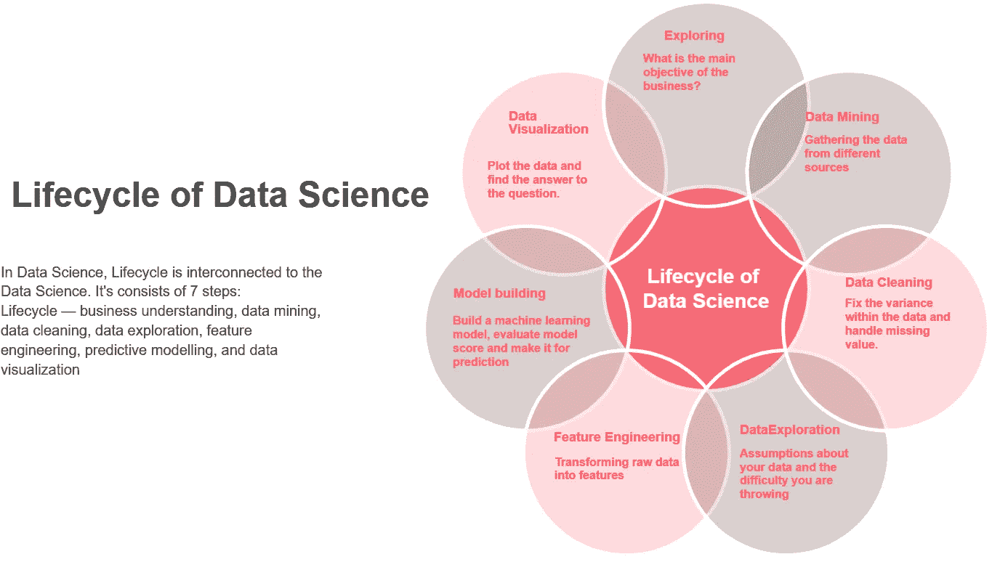
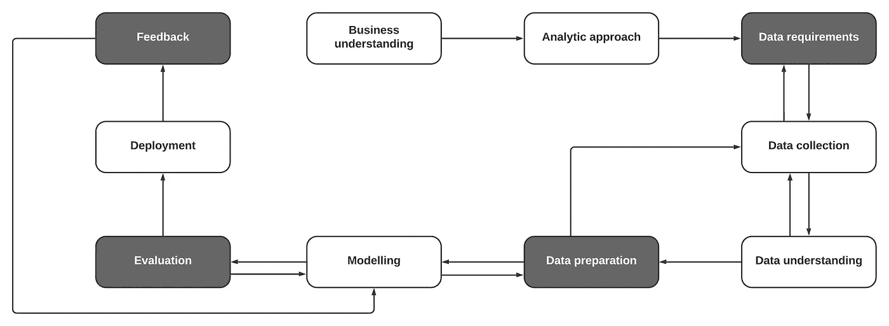

# 数据科学的生命周期和方法论述评

> 原文：<https://medium.com/analytics-vidhya/a-review-of-the-life-cycle-and-methodology-of-data-science-4ba41680f3c6?source=collection_archive---------17----------------------->

毫无疑问，数据科学是一种巨大的技术力量。为了与数据科学打交道，一个人应该熟悉生命周期和其他东西，而如果没有基本的概念，在许多情况下会出现问题。根据工作列表数据，“数据科学家”是 2019 年最热门的职业。据《哈佛商业评论》报道，数据科学家的职位在 2012 年被定义为“21 世纪最性感的工作”。我想写的是数据科学的生命周期和原则概念。

在这篇文章中，你会知道:

*   数据科学的生命周期
*   数据科学的方法论
*   如何提高预测模型的准确性？

1.  ***数据科学的生命周期***

在数据科学中，生命周期与数据科学相互关联，因为每个领域都有生命周期，这也不例外。通常，可以找到 7 个最关键的步骤。举例来说，探索、数据挖掘、数据清理、数据探索、模型构建和数据可视化。仔细看看图 1，其中描述了数据科学的生命周期。

> **探索→数据挖掘→数据清洗→数据探索→特征工程→建模→数据可视化**

**图 1:数据科学的生命周期**

**探究:**比如它有几点，你创业的主要目的是什么？你想解决什么问题？你的生意有什么结果？你需要很好地理解你的业务来使用分析方法。在这一步中，您必须定义它们，并为下一步做好准备。

**数据挖掘:**数据挖掘是探索的下一步。在实现业务目标和结果后，必须收集数据。通常，数据挖掘是从各种参考资料中收集数据的过程。从准确的来源收集数据将花费大量时间，例如，如果您的数据包含一个数据库，那么您可以简单地执行 SQL 查询来检索数据或通过不同的工具(如 Pandas Data Frame)操作您的数据。另一方面，如果你习惯了 python 中的一些库，比如“Beautiful soup ”,那么当你的数据集似乎不存在时，你可以从任何网页中删除数据。

**数据清洗:**数据清洗是数据科学领域中最复杂的任务之一。互联网或任何其他地方的数据不是结构化格式，并且存在许多缺失值。如果存在缺失值，它在预测模型构建期间不会给出准确的分数，因此需要数据清理，以使其适合于通过缺失值句柄来构建预测机器学习模型。

**数据探索:**在这一步中，您可能已经完成了数据清理和准备工作，因此现在是时候进行数据分析了。数据探索是探索数据以找到某些问题的答案或看到趋势的过程。例如，您可以通过各种绘图或通过创建交互式可视化图形来浏览公司前一年的数据，因为它允许您对前一年进行一些观察。

**特征工程:**特征工程是利用领域知识通过数据挖掘程序从原始数据中提取特征的过程。这些特征可用于开发机器学习算法的性能。特征工程本身可以被认为是应用机器学习。总之，特征工程用来衡量机器学习模型的性能。特征工程将信息转换成算法可以识别的东西。

**模型构建:**预测建模是机器学习，最终会归结到你的数据科学项目。在完成数据探索、数据清洗、特征工程步骤之后，数据科学最重要的工作就在这里完成了。预测模型的准确性证明了模型的性能。这是通过将训练测试分割中的数据拟合到机器学习算法中来完成的。

**数据可视化:**数据可视化是数据的交互式图形说明。它包括生成与图像中呈现的数据相关的图像。这种交流是通过可视化创建中图形符号和数据值之间的系统映射来实现的。数据可视化可以通过各种基本上非常有用的可视化技术来实现。通过 python 中的 Seaborn 库可以创建许多漂亮的图形图表，这些图表很好地展示了数据。

***2。数据科学的方法论***

至此我们已经讨论了数据科学的生命周期。在本节中，我们将讨论数据科学的方法论。首先，我们将学习到底什么是方法论？。嗯，方法论通常是对应用于某一研究领域的过程进行组织良好的逻辑分析。每个工作都有一个技术或工作步骤。比如我说的软件工程，行业内有一个循序渐进的过程，比如收集需求、分析、设计、编码、测试、发布。数据科学有一个特性，在任何方法下都适用。所以，一句话，方法是在方法论中讨论的。图 2 显示了数据科学的方法。

> **业务理解→分析方法→数据需求→数据收集→数据理解→数据准备→建模→评估→部署→反馈**

**图二:数据科学的方法论**

由于文章篇幅越来越大，我就尽量长话短说，简单解释一下。在图 2 中，您已经展示了数据科学的方法论，它由 10 个相互关联的步骤组成。我们已经在生命周期部分解释了一些东西。我将尝试简要介绍数据科学方法论的组成部分。

**第一阶段:业务理解:**

业务理解在数据科学方法论中极其重要。你需要知道你做生意的目的，以及这里的问题是什么。例如，你的业务目标是什么，你想做什么？

**第二阶段:分析方法:**

一旦清楚地确定了业务问题，数据科学家就可以定义解决问题的分析方法。例如，如果目的是预测接下来的数值，那么分析过程可以被描述为执行、测试和实现回归机器学习模型。

**第三阶段:数据要求:**

首选的分析方法定义了数据规格。数据规范是我们识别基本数据内容、格式和开始数据收集的参考的阶段，并且我们在我们偏好的过程的算法中实践这些数据。

**第四阶段:数据收集:**

在开始的数据收集步骤中，数据科学家分类并找到与困难领域相关的可能的数据源——结构化、非结构化和半结构化。数据收集是一种以既定方法评估信息、信息和任何感兴趣的变量的发现的方法，使收集者能够预测答案或测试或评估特定收集的结果。

**第五阶段:数据理解:**

在开始的数据理解步骤中，数据科学家必须正确理解数据和数据模式。为了建立预测模型，需要识别数据的类型或者每个数据的相互关系。

**第六阶段:数据准备:**

数据准备练习包括处理缺失或无效值的数据清理、减少重复、准确格式化、合并来自各种参考资料的数据以及将数据修改为更有益的变量。在这个被称为特征工程管道的转换过程中。

**第七阶段:建模:**

数据科学最重要的工作就是在这里完成的。这一步是在前面的步骤之后进行的，这里是预测模型，它基本上定义了业务模型的所有问题。通过测量模型的精确度来解决的问题有多精确？这是通过各种机器学习算法来完成的。

**第八阶段:评估:**

在模型开发和部署之前，数据科学家评估模型以了解其质量，并确保它准确和全面地呈现业务困难。

**第九阶段:部署:**

一旦一个合适的模型被产生并被业务支持者推荐，它就被部署到可比较的分析环境中。但是，在对其效率进行全面评估之前，它的部署受到限制。

**第十阶段:反馈:**

一旦部署了模型并收集了反馈，就可以确认模型的性能。如果反馈是负面的，那么数据科学家可以再次尝试提高模型的准确性。

**总之，**本文详细讨论了数据科学的生命周期。本文还阐释了数据科学的方法，并展示了每个步骤的工作。希望这篇文章能对那些热衷于学习数据科学的人有所帮助。

**参考文献:**

1.  [http://su deep . co/Data-Science/Understanding-the-Data-Science-life cycle/](http://sudeep.co/data-science/Understanding-the-Data-Science-Lifecycle/)
2.  [https://tdwi.org/~/media/64511A895D86457E964174EDC5C4C7B1.PDF](https://tdwi.org/~/media/64511A895D86457E964174EDC5C4C7B1.PDF)
3.  [https://101 . data science . community/2014/03/13/the-data-science-methology/](https://101.datascience.community/2014/03/13/the-data-science-methology/)

请关注我:

**研究门:**[https://www.researchgate.net/profile/Elias_Hossain7](https://www.researchgate.net/profile/Elias_Hossain7)

**领英:**https://www.linkedin.com/in/elias-hossain-b70678160/