# 一份杂乱无章的网飞六大头衔分析

> 原文：<https://medium.com/analytics-vidhya/a-scrappy-top-6-netflix-titles-analysis-part-1-56c8f51de906?source=collection_archive---------19----------------------->

```
**Disclaimer:** The following is not a peer reviewed academic publication.
The purpose of this article is to make the reader consider why the visual treatment of these materials came to be, not to provide a concrete answer or suggestion.
```

这是不计后果的一周。但我阻止了自己去做一些更具破坏性的事情，相反，在本周早些时候我向某人指出这种影响后，我从很多人那里获得了这张截图:


截至 2020 年 10 月 23 日，网飞今日美国前 10 名中 1-6 名的截图

像网飞、Hulu、迪士尼、亚马逊等公司都在他们的流媒体平台上使用宣传材料来吸引你点击。上周，我写了一篇关于一个出了问题的人的文章。但是我得到了很多关于更一般情况下的推广材料。

所以我做了这篇文章。它基本上是对 10 月 23 日 38 个人的“今日美国十大趋势”的一些(半)简要分析，以及我是如何做到的。

**另外——如果你有贡献，谢谢！！**

*总之…* 走到这一步…疯狂。

1.  决定不要给前任发短信，而是写一篇文章和分析
2.  选择一个类别/一个小的子集(在这种情况下，美国十大)
3.  征求/收集数据
4.  整理/组织/准备数据
5.  挑选一些分析指标(KPI，如果你喜欢 lol)
6.  做一些 OpenCV
7.  分析你的发现
8.  思考上下文，并将其放在上下文和外卖中

步骤 1-2 已经完成。所以…

# 步骤 3:请求/收集数据

我通过 Twitter、Messenger 和 Slack 收集。并发现了马萨诸塞州(n = 7)空气和地球迹象的阴谋，但这是不同的文章。


被称为群聊和推特的最先进的数据收集方法

不管怎样，我最终从 40 个人中选出了“今日美国十大名人”的前 6 名。如果你参与了——非常感谢！没有你，这篇文章不可能完成。

# 步骤 4:清理/组织/准备数据

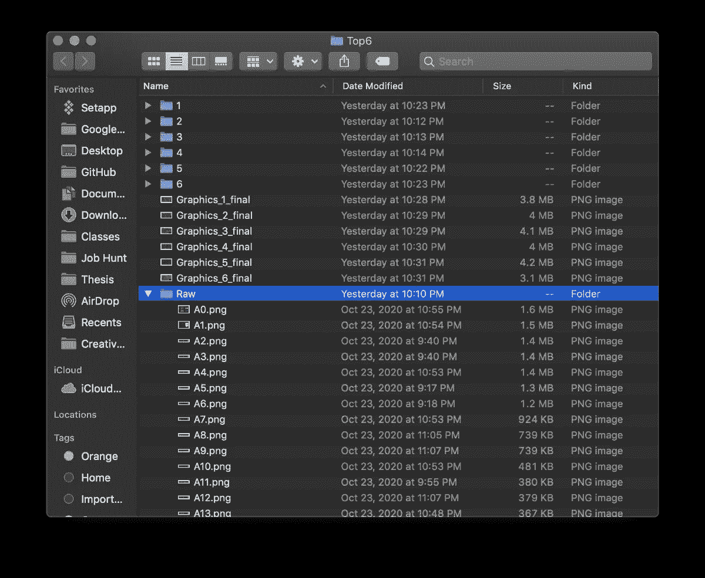

看一下我的这篇文章的项目文件夹——我有一个“原始”文件夹，里面有人们发来的所有图片，然后 6 个标题中的每一个都有一个文件夹，里面有他们的缩略图。

我把所有的图片重新命名，使它们更容易解析，并把它们保存在一个名为“Raw”的文件夹中，然后我浏览了所有的图片，裁剪出 1-6 个标题的缩略图，并把它们放在单独的文件夹中。

有更简单的方法可以做到这一点。这花了大约 2 个小时，但我也在这段时间里啜饮葡萄酒和朋友交谈，所以我相信它可以在更短的时间内完成。这正是我选择要做的。

我要说的是，众包数据的弊端在于它是不一致的。举个例子，我有第一个标题的 38 个，而第三个由于裁剪问题只有 30 个。我个人并不介意这些目的，但是为其他项目考虑这些很重要。

我个人也喜欢看别人的数据选择。我认为数据管理和收集很有趣，我喜欢看到人们提交的东西。

当然，数据本身非常有趣。正如你在下面看到的，在人们的收藏中有很多不同的品种。


在我有了这些收藏后，这些是 6 本书的缩略图。

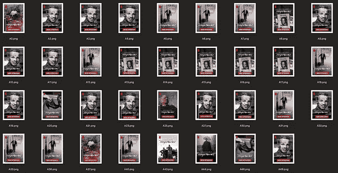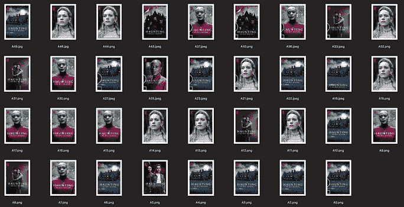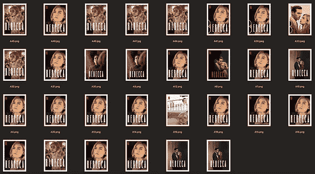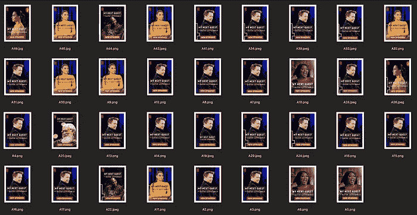

前 6 个缩略图被适当地裁剪和命名。正如你所看到的，一些缩略图比其他的有更多不同的选择。

以下是六个游戏*各自独特的宣传作品。*很明显，正如我们在上面看到的，在这个样本集中，一些标题比其他标题有更多的种类/选项。

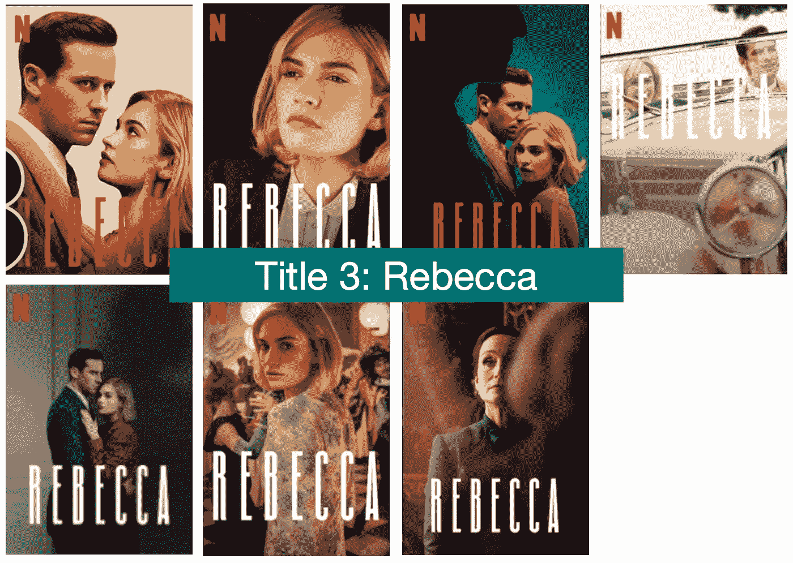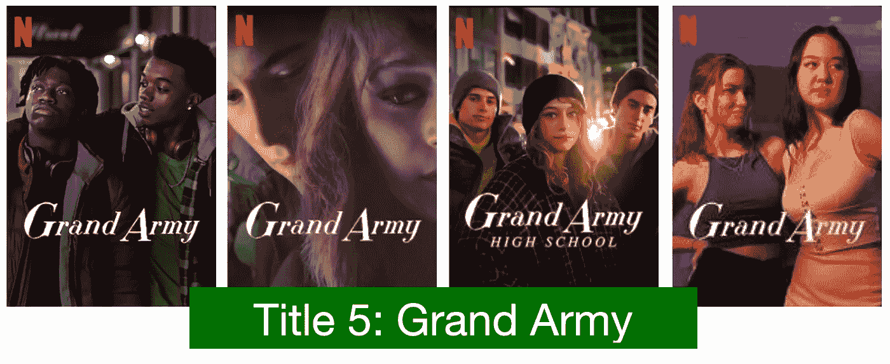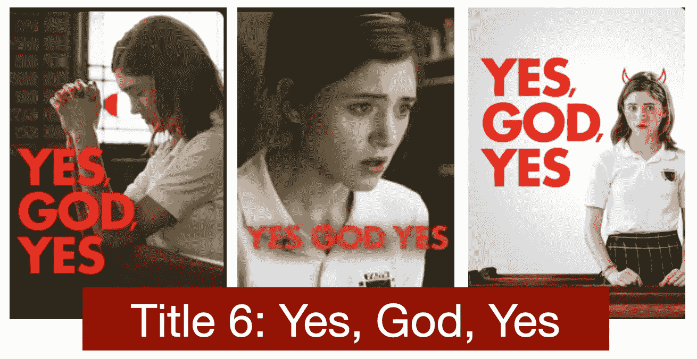

# 第五步:选择一些分析指标(如果你喜欢 KPI)

这些是我选择分析/研究的内容:

*   标题集合中的调色板
*   查看器收藏中的调色板
*   标题集合的边缘

这里的*观众收藏*是指一个账号的一系列标题。像下面的图片将是我们的目的观众收集。


查看器集合示例

同时，一个*标题集合*将是同一标题的所有促销艺术品的图像，如下图所示。


标题集合示例

在数值模拟中，我们可以称之为分割或识别样本总体。统计是标题集合中的单个标题。但是现在术语可能很傻，所以我们不会为了我们的目的而让自己负担太重。

您还会注意到，我在标题集合中使用了*边的度量。*如果你是计算机视觉的新手，“边缘”指的是我们对图像进行各种类型的“边缘检测”时获得的一些元素。

它被定义为:“**边缘检测**包括各种数学方法，旨在识别[数字图像](https://en.wikipedia.org/wiki/Digital_image)中的点，在这些点处[图像亮度](https://en.wikipedia.org/wiki/Luminous_intensity)急剧变化，或者更正式地说，具有不连续性。”(维基百科)

基本上，*边缘检测*是理解照片中正在发生的事情的超级有用的方法，因为它基本上给了我们轮廓。有几种不同的算法可以用来从图像中获得不同类型的边缘。

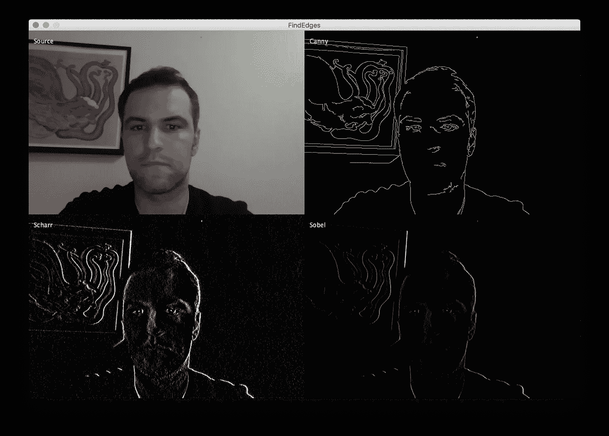

OpenCV 加工库的 Canddy、Scharr 和 Sobel 边缘示例。代码在这里:[https://github . com/atduskgreg/opencv-processing/blob/master/examples/find edges/find edges . PDE](https://github.com/atduskgreg/opencv-processing/blob/master/examples/FindEdges/FindEdges.pde)这要归功于 [Greg Borenstein](http://gregborenstein.com/#work) ，他是许多很酷的开源代码的杰出贡献者。

计算机无法直观地理解视觉世界，这就是为什么如此多的计算机视觉是关于对视觉事物进行几何表示，这些视觉事物可以按比例进行。这确实意味着计算机视觉主要是线性代数和几何。

> 正如我告诉我的本科生——矩阵对灵魂有益。

我真正喜欢边缘检测的是，它可以让你了解图像的视觉构成——它可能有多忙，主体在哪里，等等。它们也可以用非常方便的数据结构来表示，以便进行各种分类算法。

我发现这是一个非常简单而有效的方法来比较不同的图像。我已经在网上做了很多图像合成，但是你也可以用边缘做合成，得到一些整洁的结果。


这是为伊桑·朱克曼的班级做的一个项目中的一个例子，在这个项目中，我拿了 150 多张《Vogue》封面，并对它们的边缘进行了合成。[此处可查看](https://ninalutz.github.io/HistoryFilters/)。

对于本文，我使用边缘检测来理解各种图像的一般图像组成，以查看它们是否具有主题居中、三分法和其他图像组成属性。

整理好收藏和问题后，我继续编写一些 OpenCV 代码。

# 第六步:做一些 OpenCV

> **(注意:所有的图表和结果都在步骤 7 中，这是我做的和我的过程的一些上下文，但如果你想要结果，请跳到步骤 7)**

## **标题和观众收藏中的调色板**

颜色量化是我们从图像中提取调色板的方法。它基本上是通过基于某个颜色空间中的颜色值在 3D 空间中绘制每个像素来使用图像的所有像素的聚类。

我在上一篇文章中提到了这种方法[，但基本上它来自计算机图形学和我们如何表现颜色。](/@nlutz_54627/cuties-netflix-and-computation-colors-b89a3ec302b1)


几何空间中的立方体。鸣谢:维基媒体

每种颜色通常是红、蓝、绿(RGB)或色调、饱和度、亮度(HSV)等的向量。因此，我们可以定义一个 3D 几何空间，在其中可以绘制所有这些颜色，这通常被称为颜色空间。

我已经有了颜色量化代码，所以我找到了我的标题的所有独特图像的调色板，我能够做一点点进一步的数据清理。我将在下一节发布这些调色板的结果。

## 肤色

检测对象的肤色实际上是一件不可忽视的事情。关于这一点，我正在研究许多不同的方法，所以我不会在这里给出太多的细节，因为我最终想就此发表一篇文章(毕业后——这不符合我目前的论文工作，这没关系)。

实际上，我也不会在这项研究中使用肤色，因为样本量太小，而且很多照片都没有人物。我确实想做一个更大的肤色样本，并在某个时候研究网飞或 Hulu 或多平台数据——但由于要读研究生，这感觉像是一个寒假项目。

## 人脸检测

我很想看看不同观众群中的面孔。我在处理和一些手工标注中使用了 OpenCV。基本上，如果算法说没有人脸，它会被移到另一个文件夹，我会很快检查它。这是因为，正如我们所知，也正如我在之前的中所写的[，许多面部识别算法是有偏见的，并不总是准确的。](/@nlutz_54627/are-you-there-twitter-its-me-nina-845606e8c22d)

不幸的是，没有太多有趣的事情可以报道，而且这些程序是循环的，有些程序并不包含人脸，所以我决定不在本文中展示它们。我真的认为下次我做这些的时候，我会用更大的数据集来包含更有意义的人脸。

顺便说一句:[如果你想同时了解更多关于面部的知识，我采访了 Moiya McTier 的播客](https://www.exolorepod.com/post/episode-15-worldbuilding-with-nina-lutz-with-makeup)关于化妆和面部科学。

## 边缘检测和图像合成

我在处理这些图像时使用了谨慎的边缘，就像步骤 5 中的图片。我选择这样做是为了理解图像的构成(例如，哪里有更多的边缘，背景有多忙)。结果在下面的部分。

# 第七步:分析你的发现

让我们一步一步来。请注意，我不想显示所有的查看器集合，因为空间和我自己的理智，因为许多查看器集合有裁剪错误，所以不完整——这完全没问题！

## 1.标题集合中的调色板

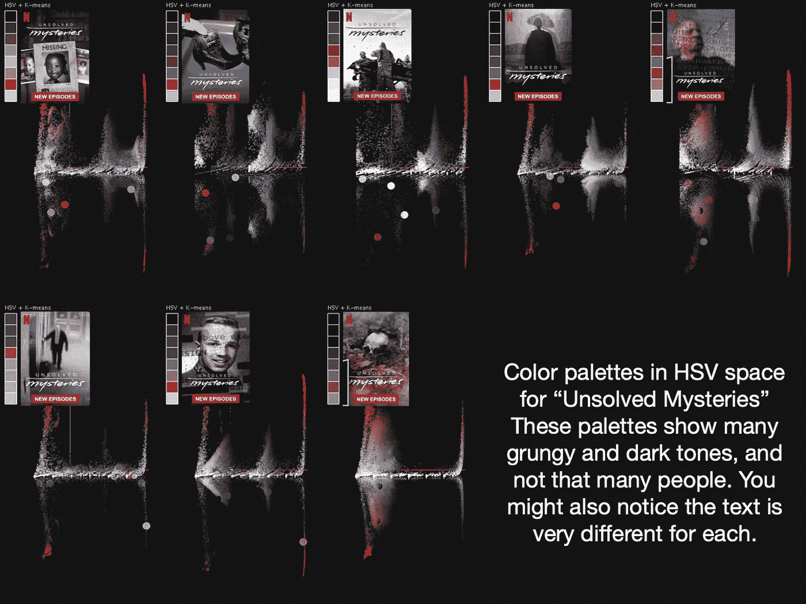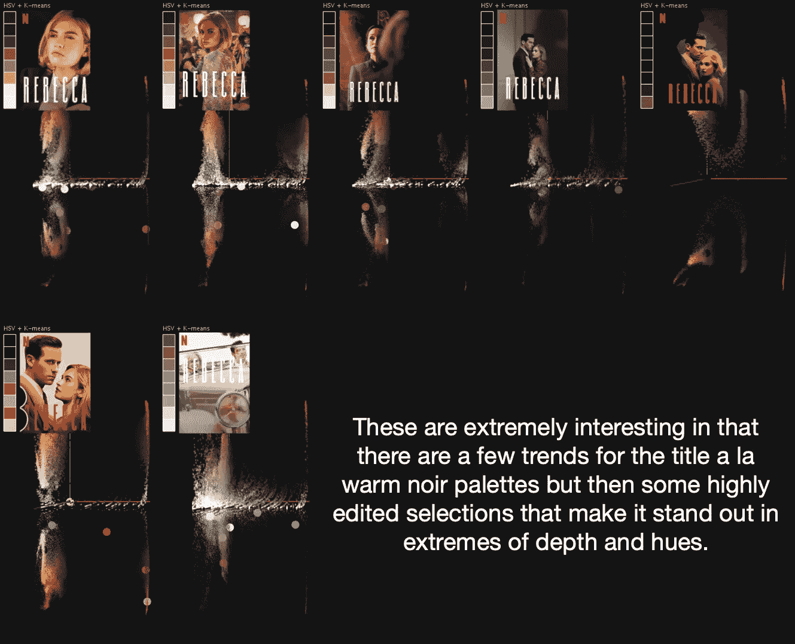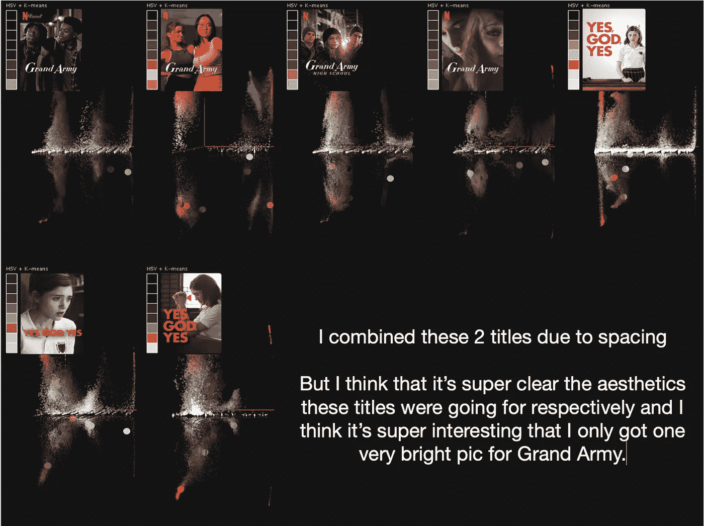

我认为值得注意的是，大多数照片都有很多色调，尤其是在自然光下，有很多人物的时候，因为肤色通常是几种色调的混合。与此同时，通常是照片经过了更多的编辑或以更专业的方式进行了照明，根据使用的灯光、完成的编辑等，导致了所有主题的反射、阴影和高光。

这些不同标题之间的风格决定非常有趣。颜色被用来突出主题或设置整个标题的风格。

## 2.查看器收藏中的调色板

我选择了下面的观众收集面和调色板，这样我们就可以看到空间。我发现结果既有趣又乏味。

所有的海报都是非常暗和柔和的暗色调，每个系列都有一两张非常鲜艳的海报。

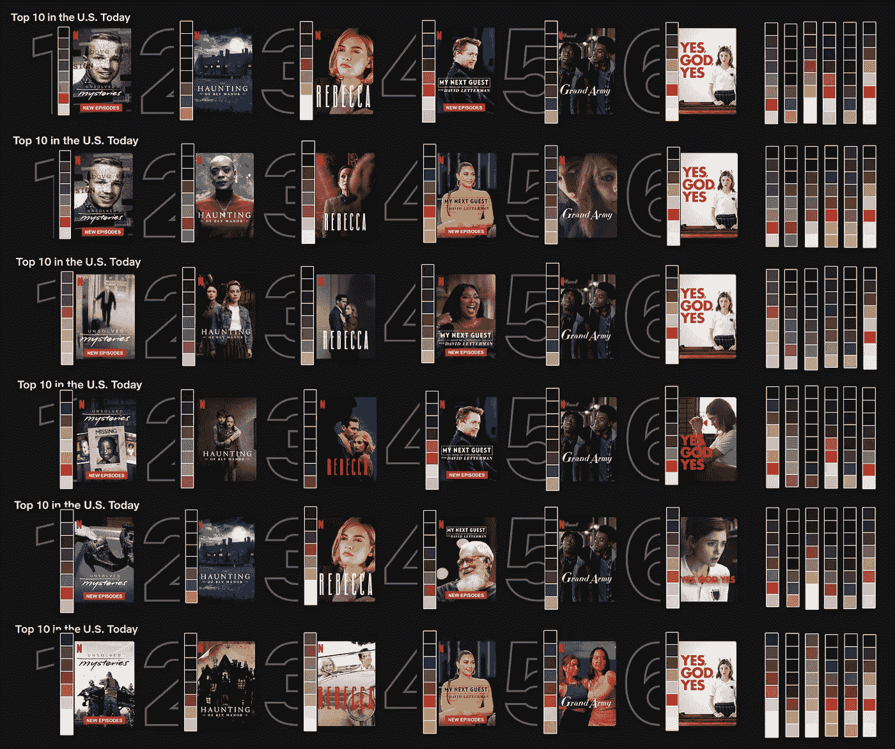

跨 6 个观众收藏的调色板，显示每个观众收藏有几个饱和调色板，但通常收藏不包括所有最大化的饱和度和彩色海报

## 4.标题集合的边缘

下面是“鬼入侵”每一件独特艺术品的锐利边缘。正如你所看到的，这种效果可能有点怪异，但当我们不被背景和颜色分散注意力时，我们可以看到一些趋势。


例如，我们可以看到这个集合倾向于集中主题，倾向于保持标题相当统一。总的来说，标题并不是图像结构的突出部分——它在主题——人物或庄园——上非常有条理。

这与“是的，上帝，是的”的艺术作品集有很大的不同，后者的特点是突出的文字，甚至是在更具主题性的图片上。

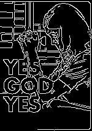

我还认为，edges 可以更大规模地用于理解许多图书促销和各种收藏的结构模式。对于这个样本大小，边缘可以非常整齐，但它们不会暴露很多我们无法通过直觉或更多手动方法分辨的洞察力。

# 第八步:思考背景，画出一些要点

这一周我没有前几篇文章那么多深刻的见解。这也是一个超级忙碌的一周，但我想在我进入不可避免的 11 月/12 月学期补习时间之前把这件事做完。总的来说，我认为这是一次超级有趣的探索。我认为重要的是要明白，这个样本量太小了，不足以得出任何有统计学意义的结论，但我希望人们能学到一些东西，让他们思考。

我想下一次我也会关注更少的标题和不轮换的标题。我也很想看看冬季假期和十月下旬的标题是什么样的，以及有什么视觉传达存在。

但是是的。如果有的话，我希望这能让你思考流媒体平台上的推广内容的目的性和可定制性。

我想我以后会更专注地研究人脸/肤色等。但是如果有人们想看的东西，我肯定会听取意见！欢迎给我发推特@ninalikespi 或电子邮件到 nlutz@mit.edu！

# 杂项常见问题

尼娜，你真的认为穿上这些就能找到工作吗？

*   我是说…也许？大概不会吧？我非常感激能够与网飞的一些人交谈，因为我真的真的很喜欢这个空间——它将我对视觉通信和数据科学的热爱结合得非常好！对于像我这样的技术/数据科学/艺术人士来说，这是一个进入流媒体世界的好时机。
*   但是我申请的范围很广。我学到了不要把所有的鸡蛋放在一个篮子里，所以我撒了一张大网。老实说，我愿意在许多不同类型的地方工作，所以喜欢…任何人都可以雇用我，请雇用我，哈哈。

**那么，你为什么写这些呢？**

*   老实说，这些文章对我来说非常有趣，在疫情期间我一直在精神上挣扎，所以我想我只是在做感觉良好的事情？尤其是在周末，当我做这些事情的时候，这是我感到(而且经常是)最孤独的时候。

**妮娜，你是怎么看待这些的？**

*   我要是知道就好了 lol。我只是尽力而为。我认为众包组件有所帮助，并且喜欢在我写作的时候发微博更新。这让我觉得人们对我有所期待，这让我的大脑变得活跃起来。

**尼娜，为什么图像不均匀/不好/不对齐？**

*   因为我选择使用页面，因为我一直认为它们只是图表和表格，然后它们会增长，我喜欢让我的生活变得艰难。是我的有毒人格特质。

[尼娜·m·卢茨](https://ninalutz.github.io)是麻省理工学院媒体实验室的学生，思考人类量化、美学和数据驱动的视觉交流。此前，她在麻省理工学院攻读计算机科学和设计专业。她目前正在为她的硕士论文创作关于手语的参与式数字艺术作品。

请在 2021 年 6 月后聘用她。她很容易被雇佣，会为你做代码、数学、写作和艺术，以获得报酬和健康保险。

她 2020 年最大的罪行就是喜欢佳得乐。喜欢它的味道。她目前被电视和威格曼的 S'mores 冰淇淋以及让她在红绿灯时随着音乐尖叫的朋友凯尔西联系在一起。