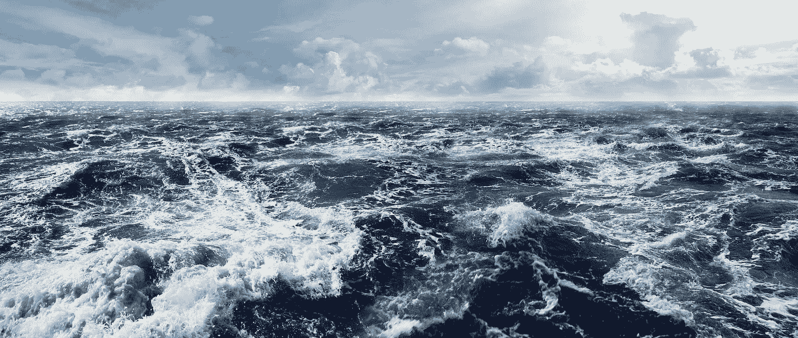
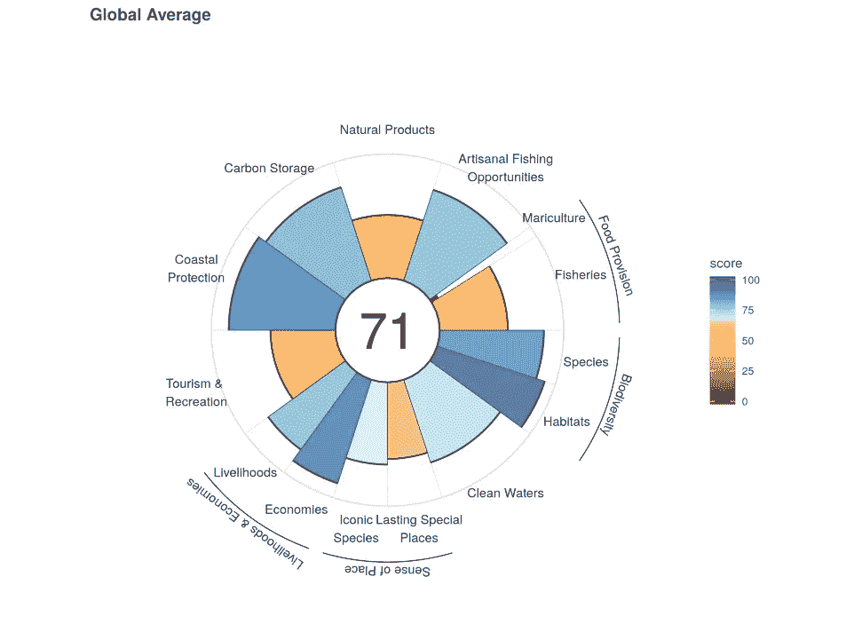
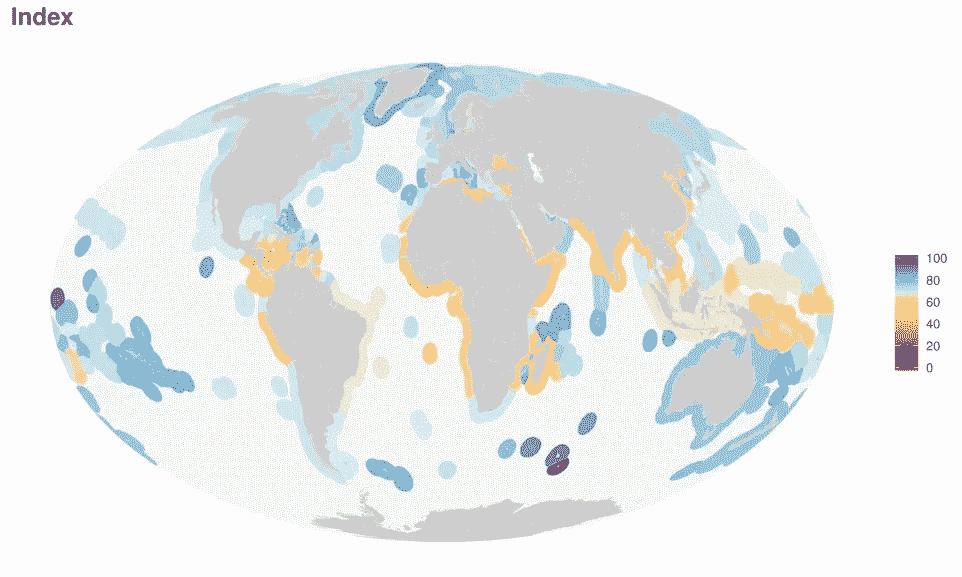

# 海量的数据

> 原文：<https://medium.com/analytics-vidhya/a-sea-of-data-39c4b3c94753?source=collection_archive---------26----------------------->

[https://www.nationalgeographic.org/encyclopedia/ocean/](https://www.nationalgeographic.org/encyclopedia/ocean/)

海洋覆盖了地球表面的 71%,它们在人类的生存和繁荣中扮演着各种各样的重要角色。海洋是世界上大约 50-80%的生物的家园，它为利用它的人们提供食物、经济和无限的其他好处。各种研究和组织积累了大量数据，并正在以新的方式用于改善世界海洋的健康，进而改善世界本身的健康。

海洋健康指数是一个通过使用公开数据编制的工具，用于评估世界海洋的健康状况。该指数是一项正在进行的工作，由一大群科学家以及国际和国内组织支持，如保护国际和国家生态分析和综合中心(NCEAS)。NCEAS 是一个隶属于加州大学圣巴巴拉分校的研究小组，致力于“将科学文化转变为更加开放、高效和协作的文化”(nceas.ucsb.edu)。NCEAS 创建数据科学工具包、协作空间和最佳实践，以推动环境数据科学向前发展。他们的工作对于提供用于 OHI 等项目的数据至关重要。

海洋健康指数是研究世界海洋不同方面的有趣和信息丰富的工具。OHI 的目标是，“提供一种手段来推进全面的海洋政策和比较未来的进展……为如何利用或保护海洋生态系统的决策提供信息”(oceanhealthindex.org)。该指数从独特的角度研究海洋生态，将人类作为海洋生态系统的一部分。他们的数据分析是由一群多学科的科学家(经济学家、环境科学家等)完成的。)对自然保护和人类利益都是有益的。

OHI 使用全球数据库来评估 221 个国际区域的海洋健康状况。他们通过观察 10 个不同的目标对该地区的海洋健康状况进行评分:

1.  食物供应——以可持续方式捕获或饲养的海产品数量。
2.  手工捕鱼的机会——需要在当地小规模捕鱼的人是否有机会这样做。
3.  天然产品——人们如何可持续地从海洋中收获非食品产品。
4.  碳储存——自然沿海生态系统的范围和条件，这些生态系统在其根、茎和叶中储存大量碳，并在沉积物中封存数十年或数百年。
5.  海岸保护——保护海岸免受风暴潮和洪水侵袭的几种生态栖息地的状况和范围。
6.  旅游业和娱乐业——从事沿海旅游业和旅游业的总劳动力比例，考虑到失业和可持续性。
7.  沿海生计和经济——工作的数量和质量以及海洋相关产业产生的收入。
8.  地方感——人们重视的作为其文化身份一部分的海岸和海洋系统的方面，通过测量两个子目标:标志性物种的状况和持久特殊地方的状况。
9.  清洁水域——被化学物质、过量营养物(富营养化)、人类病原体和垃圾污染。
10.  生物多样性——海洋生物的丰富性和多样性是如何成功地得以保持的。

每个目标从 1 到 100 分不等，OHI 还通过评估每个目标的“压力”和“弹性”来预测趋势。他们这样做是为了确定趋势是积极的(弹性>压力)还是消极的(压力>弹性)。

# 一些有趣的发现:

oceanhealthindex.org

*   德国是得分最高的地区，人口超过 100 万，得分超过 80。(86)
*   得分最低的 5 个国家是:尼加拉瓜(44)，塞拉利昂(46)，科特迪瓦(47)，叙利亚(47)，刚果民主共和国(48)。
*   “正如前几年所观察到的，治理稳定有效的地区往往比长期存在腐败、独裁、内乱、战争和贫困的地区得分高得多”(oceanhealthindex.org)。

oceanhealthindex.org

# 如你所见…

随着一种新的和集中的努力，将科学文化转变为一种更具协作性和开放性的数据方法，就像 NCEAS 和 OHI 那样，现代科学的速度和效率肯定会提高。更具体地说，与我们的生活相关，OHI 正在通过提供一个以数据为中心的统计和科学基础来帮助改善世界海洋，向决策者、科学家和公民通报我们世界海洋的重要状况。

**参考文献:**

 [## 美国国家生态分析与合成中心主页

### 加州大学圣巴巴拉分校的国家生态分析和合成中心是合成科学的先驱…

www.nceas.ucsb.edu](https://www.nceas.ucsb.edu)  [## 主页

### 健康的海洋可持续地为现在和未来的人们带来一系列好处。海洋健康指数是…

www.oceanhealthindex.org](http://www.oceanhealthindex.org)  [## 海洋

### 海洋是一个巨大的盐水体，覆盖了大约 71%的地球表面’。这个星球有一个…

www.nationalgeographic.org](https://www.nationalgeographic.org/encyclopedia/ocean/)