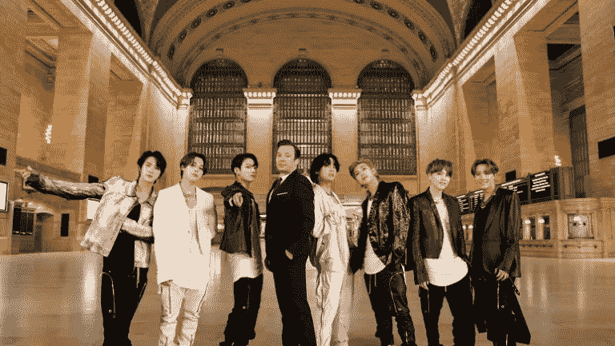
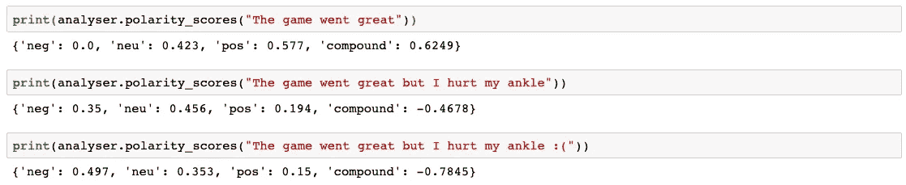
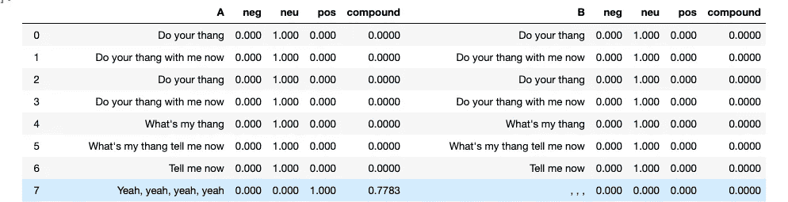
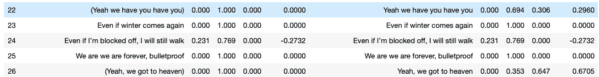

# BTS 歌曲的情感分析

> 原文：<https://medium.com/analytics-vidhya/a-sentiment-analysis-of-bts-songs-cb7970876447?source=collection_archive---------14----------------------->

在吉米·法伦主演的《今夜秀》特别节目中，法伦将 2/24/20 这一集献给了 BTS 和 NYC。这位七重奏在中央车站表演“ON”。

BTS 有如此热情的粉丝群的原因之一是因为他们的歌词包含了个人深度和普遍的信息，任何人，无论什么年龄，种族或性别，都可以涉及到。他们的歌曲关注心理健康，追求个人的梦想，管理来自社会的期望，也许最重要的是，来自你自己的期望。从一开始，他们的公司 Big Hit Entertainment 就鼓励 BTS 创作和制作反映他们情感和思想的歌曲。事实上，Big Hit 的座右铭是“音乐和艺术家的治疗”他们的方法不同于其他韩国娱乐公司，在这些公司中，内部制作人给他们的艺人提供歌曲来演唱和表演，这也是为什么“kpop”和偶像产业具有作为一个人造系统的负面含义。那是以后的事了。

由于我正在自学 python，我认为利用**(价感知词典和情感推理器)情感分析工具来分析 BTS 最新专辑[“灵魂之图:7”中的几首歌曲将是一个有趣的想法](https://open.spotify.com/user/spotify/playlist/37i9dQZF1DWZXJZz1quJMH?si=veT68CAoTNO5xIs5k9w1QA)**

**VADER 指出给定文本的负面或正面程度，并返回负面、中性、正面和复合得分。负面、中性和正面分数表明给定文本属于每个类别的百分比，并且总和为 1。复合分数> = 0.05 为正，分数< = -0.05 为负，分数在-0.05 和 0.05 之间为中性。**

**VADER 的伟大之处在于，它还将标点符号、修饰语、表情符号和在线缩写(即:lol、smh)纳入其情感评分，这使得它在分析社交媒体文本(如推文)时特别有用。**

****

**注意句子中的变化是如何影响复合分数的。附加的:(使复合得分更加负面，这表明负面情绪更强。**

**在我开始分析 Jupyter 笔记本中的歌曲之前，我有一个文件夹，将每首 BTS 歌曲作为 txt 文件。这些歌曲原本是韩语的，所以我从 Genius.com 得到了英语翻译，并将其复制到 Sublime 来制作 txt 文件。**

**在下面的 Jupyter 笔记本中，我分析了他们最近专辑中的以下歌曲: [***【黑天鹅】***](https://open.spotify.com/track/3bkkMZEAhx7rTVz1C0itRQ?context=spotify%3Auser%3Aspotify%3Aplaylist%3A37i9dQZF1DWZXJZz1quJMH&si=IPLMn82tQiOwmezHcQSL6Q)[***我们是防弹的:永恒的***](https://open.spotify.com/track/3bHKTyjnhkhCOpTDYTMZmN?context=spotify%3Auser%3Aspotify%3Aplaylist%3A37i9dQZF1DWZXJZz1quJMH&si=yF5-7THBS5Czhe2PktRBuA) *。***

**我的小练习中的一些要点:**

*   **填充词——歌词中有一些词与积极情绪密切相关，但实际上是填充词(例如:“是”)，由于其出现频率，极大地影响了平均复合得分。因此，我包含了一个正则表达式规则来从歌词中排除“yeah”以创建列 B。比较列 A(来自我的 txt 文件的歌词)和列 B(使用正则表达式规则的歌词)，注意第 7 行的复合分数现在是 0。**

****

**B 列中修改后的黑天鹅歌词的平均复合得分是-0.046799，这表明该歌曲具有总体负面情绪。相比之下，a 列的平均值为 0.050688。事实上，《黑天鹅》是一首关于人们如何害怕失去激情的歌曲。在[黑天鹅艺术电影](https://www.youtube.com/watch?v=vGbuUFRdYqU)的开头，这句话奠定了歌曲的基调和信息:**

> **“一个舞蹈演员会死两次——一次是当他们停止跳舞的时候，第一次死亡更令人痛苦。”—玛莎·葛莱姆**

****

*   **似乎 VADER 情绪没有考虑括号内的文本。请注意，在第 22 行和第 26 行中，复合得分分别从 0 变为 0.296 和 0.6705。**

**经过清理的歌词， [***我们防弹的平均复合得分:Eterna***](https://open.spotify.com/track/3bHKTyjnhkhCOpTDYTMZmN?context=spotify%3Auser%3Aspotify%3Aplaylist%3A37i9dQZF1DWZXJZz1quJMH&si=yF5-7THBS5Czhe2PktRBuA)***l***从-0.044214 变为 0.006068，说明歌曲整体情绪中性。有趣的是，复合得分落在中性范围，而不是积极的范围。BTS 写了这首歌，作为他们出道以来过去 7 年的反思，以及他们所面临的无数挑战和艰难的战斗。他们已经变得越来越强大，因为他们的全球粉丝群是军队，所以他们不再害怕。**

> **即使另一个冬天来了，即使有人阻止我，我也要向前走**
> 
> **我们永远刀枪不入**

**感谢阅读！**

**如果你对 VADER & BTS 感兴趣:**

** [## VADER 情绪分析解释-数据与媒体相遇

### VADER(情感推理的效价感知词典)是一个用于情感分析的模型

datameetsmedia.com](http://datameetsmedia.com/vader-sentiment-analysis-explained/)  [## 你的指南 BTS 和他们的音乐宇宙在 25 首歌曲

### 凭借多张排行榜冠军专辑和最近在周六夜现场的亮相，K-Pop royalty BTS 在此…

www.vulture.com](https://www.vulture.com/2019/04/bts-guide-25-essential-songs-to-know.html)**