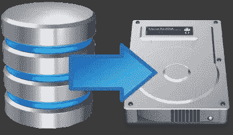

# 用于备份数据库的 Shell 脚本

> 原文：<https://medium.com/analytics-vidhya/a-shell-script-to-backup-your-database-737a565f3f2a?source=collection_archive---------10----------------------->



数据库后备

可能每天都有大量的数据被写入数据库，或者您的数据库被多年的数据淹没，变得非常大，维护成本非常高。保持数据库整洁高效的方法之一是备份日常事务中不再需要的旧记录，并将其从数据库中删除。你是怎么做到的？一种方法是编写一个 [shell 脚本](https://www.shellscript.sh/)，它获取数据库的备份，将备份存档并存储在本地或远程系统上。

准备好备份您的数据库了吗？然后，让我们编写我们的 shell 脚本。本教程解释了在 Linux 系统中备份 PostgreSQL 数据库中的表。您可以对其进行修改，以便用于其他系统和数据库。

我们脚本中的第一行将是:

```
#!/bin/sh
```

这就是所谓的**舍邦。**指向系统中已配置的 shell 之一。因此，如果你在你的脚本中使用了`#!/bin/sh`，那么你的脚本的行为将会根据哪个 shell `sh` 指向你的系统而有所不同。如果你用的是`#!/bin/bash`，它总是指向`bash`。

然后，我们将定义一个文件夹来保存备份的文件。

```
BACKUP_HOME='/opt/backup'
```

我们还必须定义要备份的数据。

```
if [ $# -ne 0 ]then LOGS_END_DATE=$1else LOGS_END_DATE=`date --date="yesterday -90 days" "+%Y-%m-%d"`fi
```

在上面我们定义了一个变量 **LOGS_END_DATE** 。我们将备份从昨天**起**超过 **90 天**的数据。你可能想知道什么是`[$# -ne 0 ]`。代表“*不等于零的参数数量*”。如果我们执行脚本文件为`filename.sh 04–07–2020`，那么 **LOGS_END_DATE** 将为`04–07–2020`。如果我们在没有日期参数的情况下执行， **LOGS_END_DATE** 将是从昨天**起 **90 天**之前的日期。**

**我们将把数据导出到 CSV 文件中。**

**`_export_csv_file=$BACKUP_HOME/data/Audit_Logs_Until_$LOGS_END_DATE.csv`**

**然后我们应该定义数据库连接和 SQL 查询。**

```
echo ‘’echo `date`’ :: CHATBOT AUDIT logs back up to csv started…..’echo ‘#############################################################’echo ‘End Date is ‘$LOGS_END_DATECONN=”/usr/bin/psql -w -U postgres -h localhost -d your_database”echo ‘’echo `date`” :: Export Query ….”QUERY_CSV=”SELECT * FROM cloud_schema.audit_log WHERE request_timestamp < ‘$LOGS_END_DATE’”echo “$QUERY_CSV”
```

**在我的服务器中，PostgreSQL 安装在`/usr/bin/psql`中。在基于 linux 的系统中，您可以通过`which psql`获得这个安装位置。用您的数据库用户名替换 **postgres** ，用您的数据库名称替换 **your_database** 。**

```
QUERY_CSV="SELECT * FROM cloud_schema.audit_log WHERE request_timestamp < '$LOGS_END_DATE'"
```

**我想备份来自 **audit_log** 表中比 **LOGS_END_DATE** 更老的记录。**

**现在，我们已经查询了需要备份的数据，我们必须将这些数据写入 csv 文件。我们将在脚本中使用`copy`命令。**

```
echo ‘’echo `date`” :: File Export Started..”echo “File : ${_export_csv_file}”echo “copy ($QUERY_CSV) to ‘$_export_csv_file’ with (FORMAT CSV, HEADER)” | $CONNecho ‘’echo `date`” :: File Export completed.”echo ‘#############################################################’
```

**这将把您的数据写入一个 csv 文件。如果您需要从数据库中删除这些数据，您可以按如下方式删除它们。**

```
if [ $? -eq 0 ];then echo `date`” :: Deleting Older Data..” $CONN -c “DELETE FROM cloud_schema.audit_log WHERE request_timestamp < ‘$LOGS_END_DATE’” echo `date`” :: Export Completed”else echo `date`” :: Export Failed”fi
```

**下面是完整的脚本。**

**用于备份数据库的 Shell 脚本**

**您可以以`./filename.sh`的身份运行这个脚本，或者以`./filename.sh 04–07–2020`的身份运行日期参数。**

**假设您必须在每周日凌晨 1:00 运行该脚本。周日晚上不睡觉？？绝对没有。您可以使用 [**cron**](https://en.wikipedia.org/wiki/Cron) 调度一个任务来运行脚本。**

**转到您的 Linux 终端，键入`crontab -e`。在一个新行上，插入以下内容，保存并退出。记得给你的正确路径。sh 文件。**

```
0 1 * * 0 path/to/your_sh_file/filename.sh
```

**这个作业会在你提到的时间内唤醒并运行你的脚本，同时你可以好好睡一觉。还要记住，您的服务器应该启动并运行，这样才能工作。**