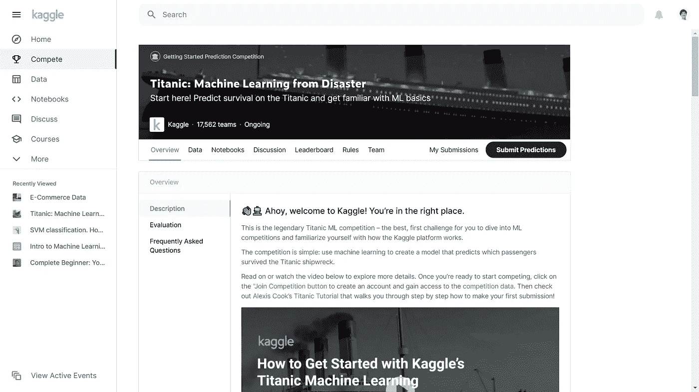
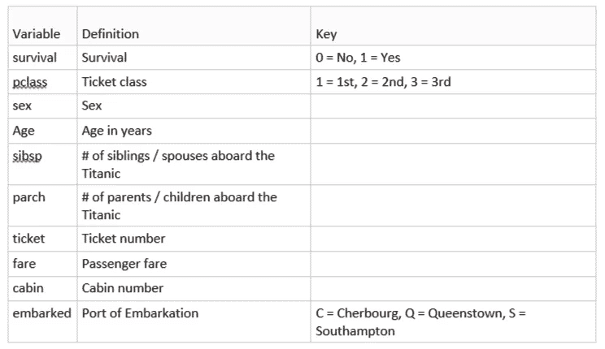
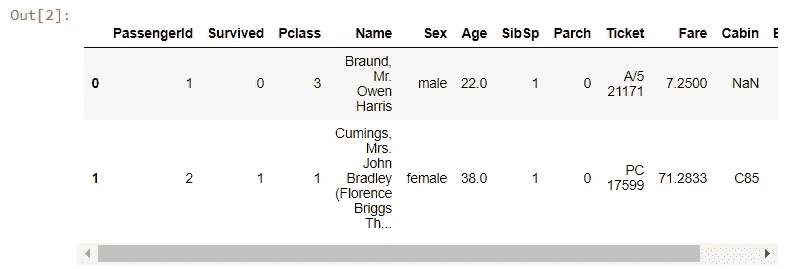
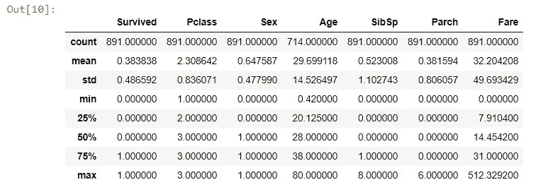
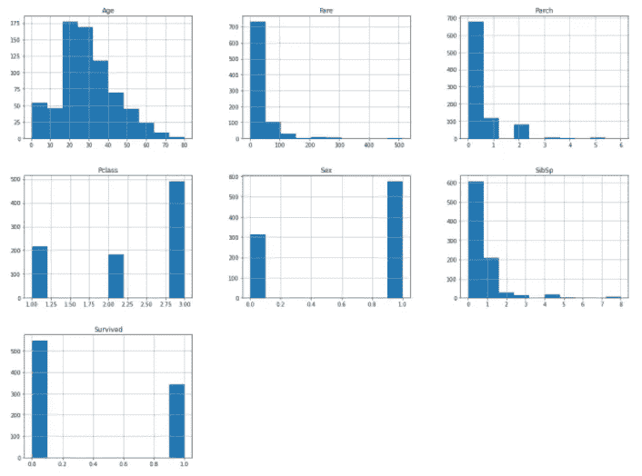
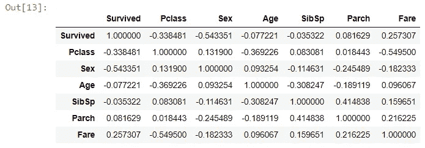
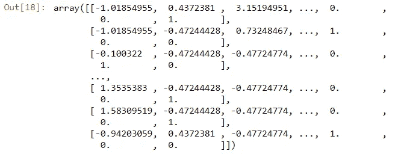

# 机器学习的简短实用介绍:预测泰坦尼克号上的生存！

> 原文：<https://medium.com/analytics-vidhya/a-short-practical-introduction-to-machine-learning-predicting-survival-on-the-titanic-4acd2809b523?source=collection_archive---------15----------------------->


安妮·斯普拉特在 [Unsplash](https://unsplash.com/s/photos/titanic-boat?utm_source=unsplash&utm_medium=referral&utm_content=creditCopyText) 上的照片

机器学习可能会令人生畏。我直接知道这件事。我第一次在工作中接受涉及机器学习的任务时，进展并不顺利。在没有任何相关背景知识的情况下，我一头扎进去，我的代码到处都是。我认为机器学习只是将数据插入模型，然后取回结果。是的，这些步骤是复杂的，但是还有更多的内容。

为了获得关于机器学习的背景知识，或者至少是关于如何正确完成的一些想法，我花了一些时间来学习更多关于。我给自己设定的挑战之一是第一次向 Kaggle 提交。在本文中，我将向您展示我是如何做到的(如果您愿意，也可以和我一起编写代码)，在这个过程中，如果您还不知道什么是机器学习，我希望它能向您介绍它。如果你现在没有理解下面的一些概念，不要担心，我也不指望你能理解(这很正常)。这篇文章的重点是给你一个机器学习的基本介绍。

## 什么是机器学习？

首先，我们从什么是机器学习开始。**机器学习**是一种创建程序的技术，这些程序可以从数据中学习，并提出自己的算法(通常称为**模型**)来解决问题。它不同于通常的程序设计，在通常的程序设计中，你要指定一系列的步骤让程序去执行。机器学习是一个更具挑战性的壮举，但如果做得好，它也可以给你广泛的灵活性和你的用户量身定制的体验。

## 什么是 Kaggle？

[**Kaggle**](https://www.kaggle.com/) 是探索机器学习的好地方。对于那些不知道它是什么的人来说，它是机器学习和数据科学爱好者和实践者的在线社区。你可以在上面找到成千上万的数据集和问题来练习机器学习。他们甚至有一个在线课程，你可以通过它学习 Python 和机器学习——如果你想进入机器学习领域，我强烈建议你去看看这个。

## 问题/目标

泰坦尼克号数据集有点像 Kaggle 的“你好，世界！”项目。它不太复杂，非常适合像我这样的初学者，这也是他们建议你开始做的事情。该项目的目标是建立一个模型，可以预测泰坦尼克号沉船的幸存者。这种问题被称为**【分类】**因为我们将对一个人是否幸存进行分类，而不是计算一个数值，这被称为**【回归】**。(好吧，我知道我们可以谷歌谁在泰坦尼克号上幸存了下来，但我们不会通过这样做学到任何东西，所以我们不会诉诸于此)。



[https://www.kaggle.com/c/titanic](https://www.kaggle.com/c/titanic)

## 数据收集

任何机器学习项目的第一步(问题框定后)都是**数据收集**。这是任何项目不可或缺的一部分——没有数据就没有什么可分析的。有时候，它甚至被认为是最难的部分。Kaggle 已经为我们提供了数据，节省了我们的时间和精力。你可以去他们的网站下载并亲自查看数据。

## 数据探索

得到数据后，我们可以开始**探索**它。Kaggle 为我们提供了 2 个文件，CSV 格式的“训练”和“测试”文件。我们可以使用任何电子表格工具检查数据。我在这里使用了 LibreOffice Calc。当您第一次阅读列名时，它似乎并不直观，Kaggle 为此提供了一个定义表。简化列名是为了以后更容易操作。


Kaggle 泰坦尼克号列车数据集



Kaggle Titanic 数据集定义表

电子表格中的每条记录代表一个人在泰坦尼克号上，以及这个人是否幸存。这两个文件的区别在于“幸存”列。“训练”数据告诉我们谁幸存了，而“测试”数据却没有。这被称为**“标签”**，这就是我们稍后将要预测的。其他列称为**“预测值”**，我们将使用它们来进行预测。基本上，我们的模型将通过从带有“答案”的数据(训练文件)中寻找模式来学习，它将使用它所学习的内容来尝试猜测它尚未看到的数据(测试文件)的答案。

现在我们对数据集有了一个概念，我们可以使用 [**Python**](https://www.python.org/) 和[**Jupyter 笔记本**](https://jupyter.org/) 进一步深入。Jupyter Notebook 为你提供了一个运行 Python 脚本的工作环境，你可以用 [**Anaconda**](https://www.anaconda.com/products/individual) 免费安装。第一次打开的时候，会是这个样子。


Jupyter 笔记本

我们将首先导入 [**Pandas**](https://pandas.pydata.org/) 模块，并使用它将数据加载为我们可以操作的 Python 对象。这些 Python 对象被称为**数据帧**。

```
import pandas as pdtitanic_train = pd.read_csv("train.csv")
titanic_test = pd.read_csv("test.csv") # Set aside for now, we will come back to it after we have our final model
```

我们可以使用下面的命令查看数据的前两条记录。它看起来应该和你的电子表格一样。

```
titanic = titanic_train
titanic.head(2)
```

输出:



数据集的前 2 行

有几个命令可以帮助您深入研究数据。让我们使用**“info”**命令。

```
titanic.info()
```

输出:

```
RangeIndex: 891 entries, 0 to 890
Data columns (total 12 columns):
 #   Column       Non-Null Count  Dtype  
---  ------       --------------  -----  
 0   PassengerId  891 non-null    int64  
 1   Survived     891 non-null    int64  
 2   Pclass       891 non-null    int64  
 3   Name         891 non-null    object 
 4   Sex          891 non-null    object 
 5   Age          714 non-null    float64
 6   SibSp        891 non-null    int64  
 7   Parch        891 non-null    int64  
 8   Ticket       891 non-null    object 
 9   Fare         891 non-null    float64
 10  Cabin        204 non-null    object 
 11  Embarked     889 non-null    object 
dtypes: float64(2), int64(5), object(5)
memory usage: 83.7+ KB
```

从表中，我们可以看到每一列是否有任何**缺失值**和**数据类型**。如果您注意到，我们缺少“年龄”和“客舱”列的值。当我们准备数据的时候，我们需要做一些事情。

如果你查看**“dtype”**列，你会看到有三种类型的值:int64，float，object。Int64 代表整数。在数据集中，int64 和 float 列都显示为**数值**，而 object 列显示为**分类值**。当我们开始训练我们的模型时，我们所有的列都必须是数字值，这样才能被理解。有几种方法可以将分类值转换为数值。让我们在“性”栏里试试吧。目前，它的值不是“男性”就是“女性”，我们实际上可以把它们表示为 1 和 0，这被称为**二进制数据**。这次我们将导入另一个名为 [**Scikit-learn(或 sklearn)**](https://scikit-learn.org/stable/index.html) 的模块来完成这项工作。键入以下命令。

```
from sklearn.preprocessing import LabelBinarizerlb = LabelBinarizer()
titanic["Sex"] = lb.fit_transform(titanic["Sex"])
```

当您回头看您的数据集时，您现在应该看到 1 和 0。

在制作模型时，我们实际上不需要使用所有的列。我们可以删除其中的一些，如“PassengerId”和“Name ”,因为它对模型没有任何影响。转换和删除数据最好留在数据准备部分。目前，我们更关心的是研究数据，以了解如何准备数据。

接下来，我们可以使用**“describe”**命令生成一些描述性统计数据。它将显示每列的**计数、平均值、标准偏差、最小值、最大值以及第 25、50、75 百分位**。一般来说，数据显示了您的值的范围以及大部分数据属于哪个范围。

```
titanic.describe()
```

输出:



数据的描述性概述

如果你有扎实的统计学背景，从表格中获取信息是小菜一碟。我不知道。我更喜欢将数据可视化来理解它，我们可以使用**“hist”**命令来绘制它们。

```
titanic.hist()
```

输出:



根据数据绘制的直方图

每个数值列被绘制成一个**直方图**，显示数值的分布。从图中我们可以看到，我们的大部分数据在图表的一侧倾斜，每列的值的范围是不同的(即“年龄”列显示从 0 到 80 的值，而“SibSp”列只有从 0 到 8 的值)。我们需要将每一列的值转换到一个相似的范围内，这样当我们稍后训练它时，没有一列可以过度影响整个模型。这叫**“标准化”。**

最后(在数据探索中)，让我们检查我们的列之间的**相关性**以及与我们的“标签”的相关性。相关性衡量两个变量相互之间的关联程度。我们可以通过使用以下命令绘制一个**相关矩阵**来观察这一点。如果你想形象化，你也可以使用**“热图”**来实现。

```
corr = titanic.corr()
corr
```

输出:



数据的相关矩阵

查看该表，我们可以看到“Fare”和“Pclass”列之间存在明显的关系。这是意料之中的，“Pclass”代表了人的社会经济地位。如果我们检查直方图，我们可以看到大多数“Pclass”落在值 3 上，这意味着较低的等级，而大多数“Fare”落在较便宜的一边。我们可以假设，经济地位较低的人往往有更便宜的机票。基于这一假设，我们实际上可以删除它们中的任何一个，因为对于我们的模型来说，包含两者都是多余的，因为它们都有相似的含义。有时候，在训练我们的模型时，越简单越好。

## 数据准备

一旦我们了解了我们将如何处理训练数据，我们现在就可以开始准备数据了。假设我们得到的任何未来数据都与我们现在的训练数据相似，除了“幸存”一栏。我们实际上可以通过制作所谓的**“管道”**来自动化数据准备部分，因此我们从数据探索部分得出的所有考虑因素都将在我们获得的任何未来数据中自动处理。

在准备培训时，我们需要留出一部分培训数据用于以后的测试。我们可以认为这与 Kaggle 提供的测试数据不同，因为我们实际上会用它来评估我们的模型的表现如何。稍后，当我们评估我们的模型时，它会更有意义。现在，我将分割我的训练数据。我将留出 10%作为额外的测试数据，我想确保我得到的“幸存”比率与整体数据相同。

```
from sklearn.model_selection import StratifiedShuffleSplitsplit = StratifiedShuffleSplit(n_splits=1, test_size=0.1, 
                               random_state=42)
for train_index, test_index in split.split(titanic, 
    titanic["Survived"]):
    strat_train_set = titanic.loc[train_index]
    strat_test_set = titanic.loc[test_index]
```

我们还希望将标签与训练数据上的预测值分开，因为我们将仅对预测值执行数据准备。

```
titanic = strat_train_set.drop("Survived", axis=1)
titanic_label = strat_train_set["Survived"].copy()
```

我们的数字数据将与我们的分类数据进行不同的处理。我们可以为两者创建一个单独的管道，然后合并这两个管道。

```
# numerical data
num_attribs = ["Age", "SibSp", "Parch", "Pclass"]
# categorical data
cat_attribs = ["Sex", "Embarked"]
```

我只包括了我感兴趣的列。我删除了“PassengerId”、“Name”和“Ticket”，因为这些信息似乎无关紧要。我删除了“Cabin ”,因为它缺少太多有用的值。我还删除了“Fare ”,因为我认为“Pclass”就足够了。

我们有两个步骤来处理我们的数字数据。首先，我们需要填充“年龄”列中缺少的值，然后我们需要对数据范围进行标准化。我们可以使用 sklearn 的**简单估算器**和**标准缩放器**。

```
# num pipeline
from sklearn.pipeline import Pipeline
from sklearn.impute import SimpleImputer
from sklearn.preprocessing import StandardScalernum_pipeline = Pipeline([
   ("imputer", SimpleImputer(strategy="median")),
   ("std_scaler", StandardScaler())
])
```

对于我们的分类数据，我们有“性别”和“上船”列。我们知道如何将“性别”列转换成二进制数据，但是“已装载”列呢？如果我们观察这个列，我们知道它有 3 个值可供选择。我们实际上可以为它创建 3 个不同的二进制数据列。为此，我们将使用 **OneHotEncoder。**在此之前,“已装船”列缺少我们需要填写的值。我们将只使用最频繁的值来填充它。

```
from sklearn.preprocessing import OneHotEncoderembarked_pipeline = Pipeline([
   ("imputer", SimpleImputer(strategy="most_frequent"),
   ("one_hot_encode", OneHotEncoder())
])
```

现在，我们可以将所有的管道组合起来，形成一个完整的管道。在对数据运行完整的管道后，您应该会看到它已经通过我们所有的调整进行了转换。

```
from sklearn.compose import ColumnTransformer
from sklearn.preprocessing import OrdinalEncoderfull_pipeline = ColumnTransformer([
   ("num", num_pipeline, num_attribs),
   ("sex", OrdinalEncoder(), ["Sex"]),
   ("embarked", embarked_pipeline, ["Embarked"])
])titanic_prepared = full_pipeline.fit_transform(titanic)
titanic_prepared
```

输出:



准备数据

## 培训和评估模型

在我们的数据准备好之后，现在的问题是训练不同的学习算法，并选择一个最终成为我们的模型。这是棘手的部分。为什么我们要训练不同的算法，为什么我们不能现在就选定一个呢？好吧，几个算法有不同的做事方式，虽然它们有相同的目标，但背后的数学服务于不同的目的。作为初学者，如果不逐一尝试，您不会立即知道哪种方法对您的数据效果最好。我甚至不认为专业人士不尝试不同的算法就能立刻知道。

我将尝试四种不同的算法 **SGDClassifier、RandomForestClassifier、SVC 和 KNeighborsClassifier。**这些都值得他们自己的文章，但现在你需要知道的是，他们每个人都可以预测分类。为了评估性能，我将使用一个名为**【准确性】**的指标。准确性决定了所有预测中正确预测的数量。还有其他指标可供选择，但目前我们可以满足于“准确性”。

当模型在我们用来训练它的数据上表现很好，而在看不见的数据上表现很差时，训练模型中的一个常见问题就会出现。这叫做 o **拟合模型**。我所能描述的最好的方式是记忆和理解。模型记住了答案，但它并不真正理解它，当给它新的数据来处理时，它很容易迷失。为了防止这种情况发生，我们将使用一种叫做**“交叉验证”**的技术。交叉验证的工作方式是在同一个数据集上多次训练模型，但每次都分离不同的数据子集来测试和改进模型。这样就避免了模型“记忆”答案。你会注意到，它输出 3 个不同的分数，这是因为它每个运行 3 次。

```
from sklearn.model_selection import cross_val_score
from sklearn.ensemble import RandomForestClassifier
from sklearn.svm import SVC
from sklearn.neighbors import KNeighborsClassifiersgd_clf = SGDClassifier(random_state=42)
cross_val_score(sgd_clf, titanic_prepared, 
                titanic_label, cv=3, scoring="accuracy")# OUTPUT SCORES: [0.75655431, 0.73033708, 0.68539326]forest_clf = RandomForestClassifier(random_state=42)
cross_val_score(forest_clf, titanic_prepared,
                titanic_label, cv=3, scoring="accuracy")# OUTPUT SCORES: [0.80524345, 0.77153558, 0.79026217]svm_clf = SVC(random_state=42)
cross_val_score(svm_clf, titanic_prepared, 
                titanic_label, cv=3, scoring="accuracy")# OUTPUT SCORES: [0.84269663, 0.81273408, 0.82397004]knn_clf = KNeighborsClassifier()
cross_val_score(knn_clf, titanic_prepared, 
                titanic_label, cv=3, scoring="accuracy")# OUTPUT SCORES: [0.82771536, 0.79775281, 0.80524345]
```

在四个模型中，SVC 的表现最好，所以我们将选择这一个，但让我们看看是否可以进一步改进模型。所有这些模型实际上给了我们一套**超参数，我们可以调整以某种方式控制学习过程。之前我们只是设置为默认，但是我们来看看调整后是否能进一步提高分数。让我们使用 **GridSearchCV** ，它基本上为我们搜索最佳超参数。**

```
from sklearn.model_selection import GridSearchCVparam_grid = [
   {'C': [1,10,100], 'gamma': [1,0.1,0.001], 'kernel': 
   ['linear','rbf']}
]svm_clf = SVC(random_state=42)grid_search = GridSearchCV(svm_clf, param_grid, cv=3, 
                           scoring="accuracy",
                           return_train_score=True, verbose=10)
grid_search.fit(titanic_prepared, titanic_label)cross_val_score(grid_search.best_estimator_, titanic_prepared, 
                titanic_label, cv=3, scoring="accuracy")# OUTPUT SCORES: [0.84644195, 0.8164794 , 0.82397004]
```

**一旦它完成搜索，我们可以继续下去，并再次评估它。好像比分还是一样。这仅仅意味着默认的超参数根据给定的超参数集为模型执行最好的。**

**在我们对 Kaggle 的测试数据进行分类之前，最后一件事是，让我们根据看不见的数据对模型进行评估。还记得我们之前放在一边的带有标签的数据吗？我们现在将使用模型对其进行分类，并与实际标签进行比较。**

```
from sklearn.metrics import accuracy_scorefinal_model = grid_search.best_estimator_unseen = strat_test_set.drop("Survived", axis=1)
unseen_label = strat_test_set["Survived"].copy()
unseen_prepared = full_pipeline.fit_transform(unseen)
predictions = final_model.predict(unseen_prepared)accuracy_score(unseen_label, predictions)# OUTPUT SCORE: 0.8
```

**我得到了 0.8 的分数，这还不错，而且还接近早先的分数，所以现在我们知道模型没有过度拟合数据！**

## **臣服于 Kaggle**

**我们可以继续将测试数据从 Kaggle 插入模型。我们还不能在 Jupyter 笔记本中知道我们的分数，因为数据没有标签。让我们将其保存为 CSV 文件，并提交到 Kaggle 站点。**

```
test = titanic_test
test_prepared = full_pipeline.fit_transform(test)
final_predictions = final_model.predict(test_prepared)test["Survived"] = final_predictions
test[["PassengerId", "Survived"]].to_csv("submission.csv", 
                                         index=False)
```

**一旦你上传你的提交，它会显示你的分数。我的最终分数是 0.78，我认为还不错，比预期的低一点，但仍然接近我们的 0.8，这是一个好的起点。Kaggle 允许您进一步改进您的模型，并多次提交条目以提高分数。如果您有兴趣进一步构建这里介绍的模型，我将把这个问题留给您，但是现在，如果您一直在使用自己的笔记本，请击掌庆祝，因为您刚刚提交了您的第一个 Kaggle 条目！**

****

**没有一种方法可以完成机器学习。我知道从中可以学到很多东西，但我希望这只会鼓励你进一步追求，如果这是你感兴趣的事情。如果你认为这对你来说太难了，我也经历过，我只能说一年前我从不知道这些。随着时间和努力，你也可以开始你的机器学习之旅！**

**干杯！**