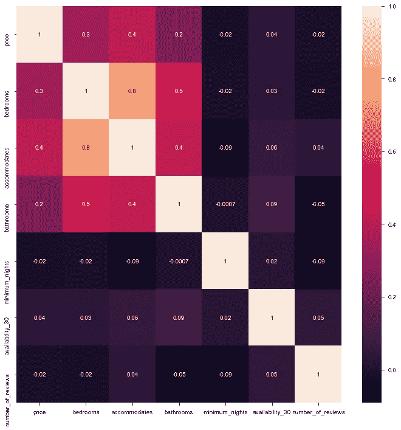
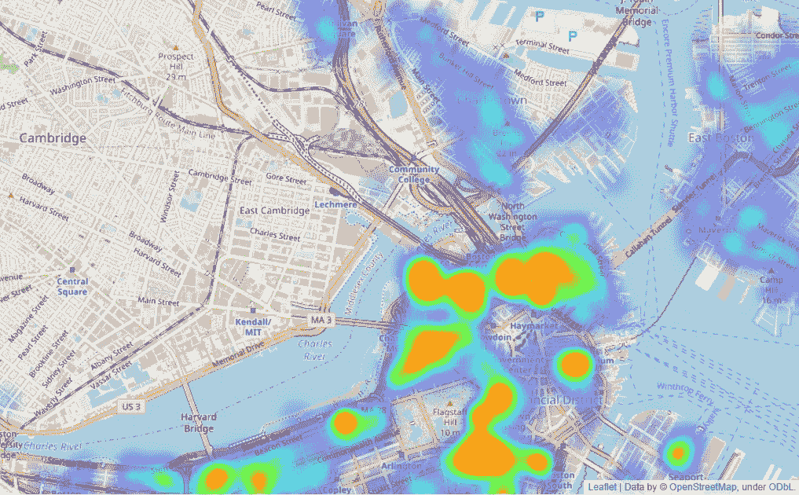
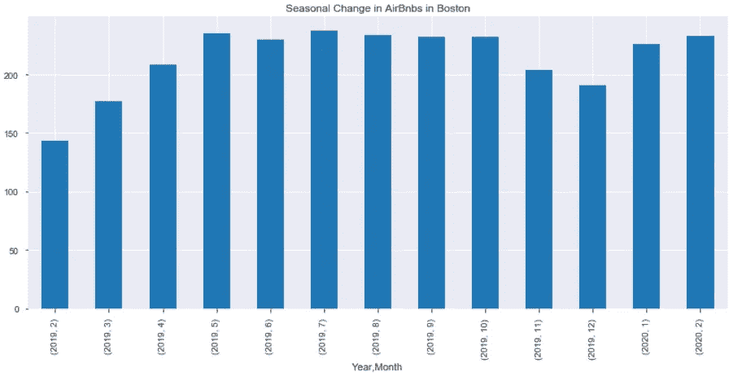
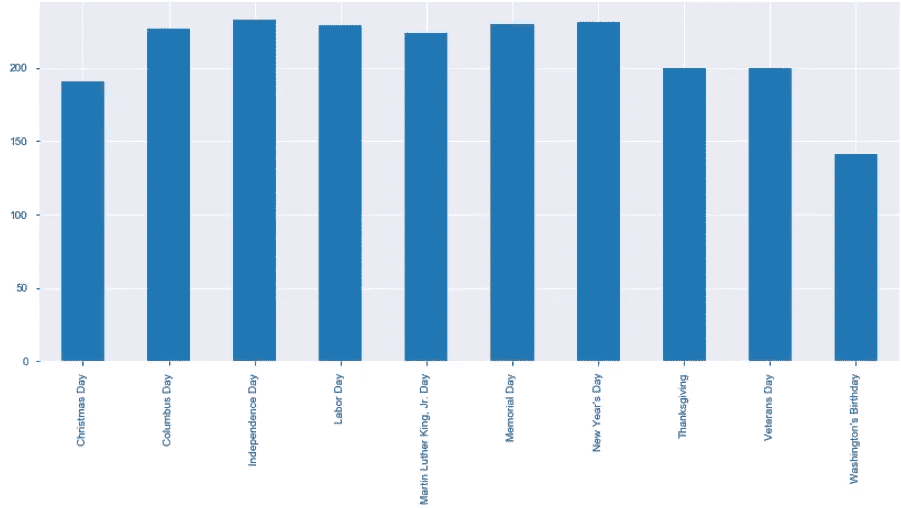

# 关于如何处理数据集的简短分步指南

> 原文：<https://medium.com/analytics-vidhya/a-short-step-by-step-guide-on-how-to-approach-a-dataset-333b9f56bebc?source=collection_archive---------31----------------------->


奥斯曼·拉纳在 [Unsplash](https://unsplash.com?utm_source=medium&utm_medium=referral) 上拍摄的照片

作为一个喜欢旅行的人，像 Airbnb、Tripadvisor 或 Hostelworld 这样的网站是完美的。除了提供关于您可以旅行的下一个目的地的信息，它们还收集无数的数据，这些数据可用于可视化、分析和无数其他与数据交互的方式。

在本帖中，我们将深入了解波士顿 Airbnb 房源数据。这一见解的数据来自 Airbnb 内部的[。我们将进一步研究数据集的列表和日历文件。](http://insideairbnb.com/get-the-data.html)

**清单**由 6155 行和 106 个关于主机不同清单的特性组成。

**日历**由 2246575 行和 7 列组成，具有不同日期不同价格的不同列表的特征。

简单浏览了一下数据后，我想到的第一个问题是:

*   波士顿的 Airbnbs 的主要价位是什么？
*   公共假期或季节性会影响价格吗？
*   有可能预测 Airbnb 的价格吗？

# 1.波士顿的 Airbnbs 的主要价位是什么？

回答第一个问题的第一步是好好看看数据。为此，我喜欢使用 *pandas profiling* ，它使用整个数据框架并创建一个关于一切的统计数据，从概述开始，后面是变量、相关性、缺失值和样本。

下面的 gif 展示了完整的报告。

在 pandas profiler 的帮助下获得了数据概览后，就该创建一些图表了。

第一张热图只显示了一些影响 Airbnb 每晚价格的栏目。价格和卧室、价格和可观赏性之间有轻微的正相关关系。



价格——卧室、价格——住宿之间的正相关是有道理的。卧室多的房产应该比卧室少的大。较大的房产通常更贵。提到的几点也适用于住宿和浴室。这些结论的一个问题是，邻域没有被计算在内。高收入地区的小公寓通常有较少的卧室，可以容纳较少的人。

为了解决上述问题，我们将更深入地研究邻近地区的价格差异。为此，我用 leav 创建了一个热图，这非常简单。您需要纬度、经度和一个想要用于可视化的参数。在这种情况下，我用了最高的价格。

```
import folium
from folium.plugins import HeatMap
#the max price will be used as indicator for the color of the heatmap
max_amount = float(boston_df['price'].max())
hmap = folium.Map(location=[42.36, -71.05], zoom_start=12, )
hm_wide = HeatMap( list(zip(boston_df.latitude.values, boston_df.longitude.values, boston_df.price.values)),
                   min_opacity=0.2,
                   max_val=max_amount,
                   radius=17, blur=15, 
                   max_zoom=1, 
                 )
hmap.add_child(hm_wide)
```

正如我们从地图上看到的，列表中最昂贵的房产类型是酒店式公寓、公寓和游艇。除了均价低于 250 美元的房子之外，普通公寓是最常见的上市房产类型。



# 2.公共假期或季节性会影响价格吗？

在看了波士顿房价最有影响力的特征之后，我们想看看日期是否影响价格。

要解决这个问题，我们需要按照月份和年份对每天的列表数据进行分组。分组后，我们用一个简单的柱状图来描绘我们的发现。



从图表中我们可以看出，2019 年 2 月、3 月和 12 月的冬季月份存在季节性，平均价格低于 200 美元。该图还显示平均价格在一月和二月开始上升。对于问题的下一部分，我们想知道公众假期对 Airbnb 价格的影响。为了回答这个问题，我们使用假日套餐。



正如我们所看到的，大多数节日的价格都在 200 美元以上，除了圣诞节约为 190 美元，唯一真正的“异常值”是华盛顿的生日，平均价格为 140 美元。

# 3.有可能预测 Airbnb 的价格吗？

关于最后一个问题，我们还想在 Crisp-DM 流程中更进一步。第一个问题回答了业务和数据理解部分，第二个问题让我们更深入地了解数据，并从数据准备流程开始。现在是建模过程和更多数据清理的时候了。

我们要做的第一件事是使用 pandas 让假人将我们的分类数据编码成数值，以便在建模过程中使用。完成这个过程后，我们可以开始建模。
我们用 sklearns train_test_split。我们将数据分为 80%的训练数据和 20%的测试数据。作为模型性能的衡量标准，我将使用 MAE，它将很好地概述我们平均离目标衡量标准有多远。

对于建模，我们将创建一个简单的线性回归模型和一个决策树回归器。

```
from sklearn import tree
from sklearn import metricsdectree = tree.DecisionTreeRegressor(max_depth=5,random_state=0)
dectree= dectree.fit(X_train, y_train)

tree_err = metrics.median_absolute_error(y_test, dectree.predict(X_test))
```

我们将得到 44.2 的 MAE，这意味着我们有 44 美元的平均差额。

# 结论

让我们简要总结一下我们的发现

让我们简要总结一下我们的发现。
波士顿海港或水边的航空旅馆比远离水边的住宿贵。
Airbnb 能容纳的浴室、卧室和人越多，成本就越高。
不需要太多预处理和特征选择就可以创建一个模型，其成本非常接近 Airbnb。
要找到更多关于代码和其他图表的信息，你可以查看 [jupyter 笔记本](https://github.com/Lukas-Forst/Boston_Airbnb_simple)。

从[http://insideairbnb.com/get-the-data.html](http://insideairbnb.com/get-the-data.html)获取数据