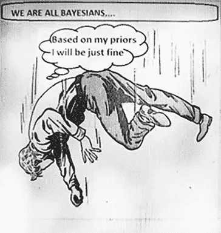
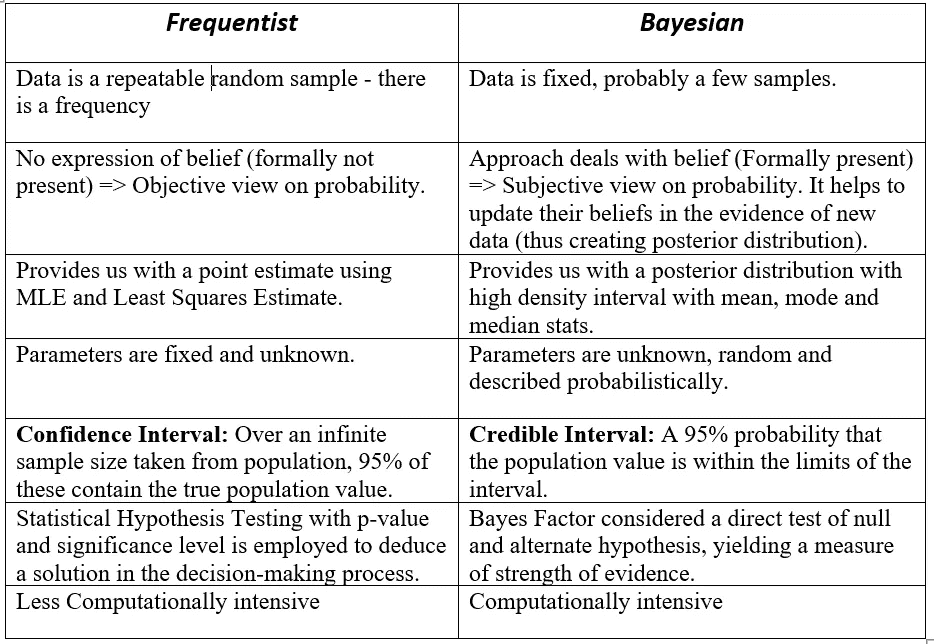
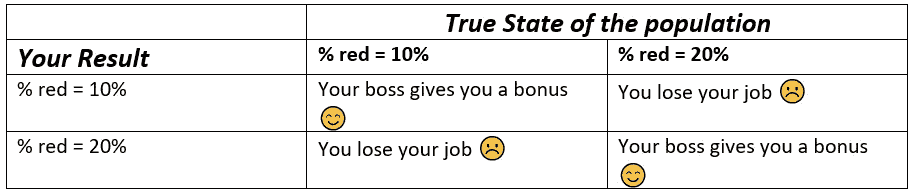
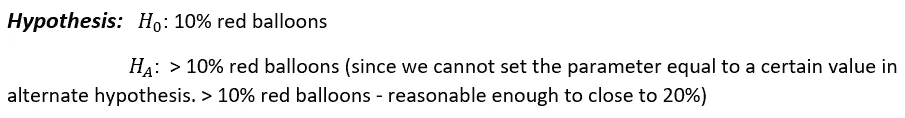
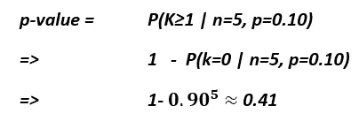
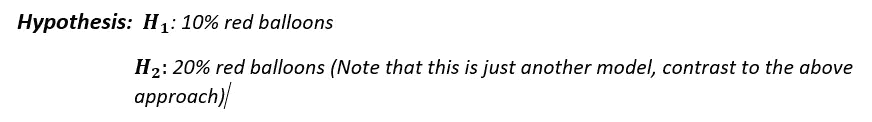
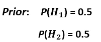
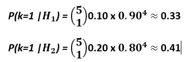
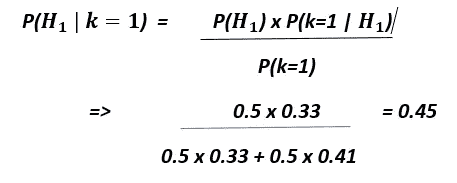
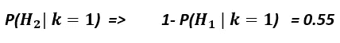

# 贝叶斯统计与频率统计的一个小故事

> 原文：<https://medium.com/analytics-vidhya/a-short-story-on-bayesian-vs-frequentist-statistics-27f55ae56253?source=collection_archive---------1----------------------->

> 贝叶斯主义者是这样一个人，他模糊地期待一匹马，瞥见一头驴，强烈地相信他看到了一头骡子。

ref:[https://www . invespcro . com/blog/Bayesian-vs-frequentist-a-b-testing-what-the-difference/](https://www.invespcro.com/blog/bayesian-vs-frequentist-a-b-testing-whats-the-difference/)

在这篇博文中，我们将探讨贝叶斯和频率主义方法的概念，它们的区别以及它们如何思考的数学解决方案。贝叶斯统计学家和频率统计学家的本质区别在于概率的使用方式。

频率主义者只使用概率来模拟某些被广泛描述为“抽样”的过程。他们通常看 P(数据|参数)，注意参数是固定的，数据是随机的。

贝叶斯更广泛地使用概率来模拟抽样和其他类型的不确定性。贝叶斯着眼于 P(参数|数据)参数是随机的，数据是固定的。

## **举例:**

如果我们想知道一个国家男性的平均身高-

> **贝叶斯:“**我觉得身高在 60 到 84 英寸之间，我们把这个信息传递给模特吧。”

在收集了一些数据后，贝叶斯将考虑这些数据来更新先验分布，以获得新的高度概率分布，称为后验分布。后验分布反映了我们收集数据后对身高的认识状态。

> **Frequentist: "** 身高是未知值，可能在[70，74]之间，也可能不在[70，74]之间。我们继续采集样本，确定高度。

**对于频率主义者来说，上面的概率陈述是没有意义的。常客只允许关于抽样的概率陈述。**

****

**频率主义者与贝叶斯的区别简述**

# ****数学解释:****

**我们将使用频率论和贝叶斯方法解决一个简单的推理问题。稍后比较基于两种方法得出的决策的结果。让我们以光和氦气球为例。**

****

**只是一堆气球(示例)**

## ****目标:****

**氦气球的数量**

**在人群中，确定红色氦气球的百分比是 10%还是 20%。**

**你被聘为统计顾问，决定红氦气球的真实百分比是 10%还是 20%。**

**根据你的结果，公司会给你加薪或解雇你。**

**让我们以交叉表的形式列出结果-**

****

## ****数据收集:****

**我们可以从人群中随机购买氦气球样本(我们的数据)。**

**每个气球将花费你 20 美元(也许是昂贵的东西)，记住数据收集可能相当昂贵。**

**您为每个气球支付 20 美元，并且必须以 100 美元为增量购买。一次 5 个气球。**

**你总共有 400 美元可以花，所以你可以买 5 个、10 个、15 个或 20 个气球。费用是多少？或者买少买多气球的好处。**

**随着样本量的增加，决策将变得更加可信，而做出错误决策的代价可能会让你丢掉工作。由于数据收集过程是昂贵的，如果我们可以使用较小的样本量来得出我们的结论，我们不想为比我们需要的更大的样本付费，从而节省资金和资源。**

**大胆地说，让我们用一个更小的样本量 5。然而，我们也将对更大样本的结果进行分析。**

## ****频率法:****

**宣布无效和替代假设。**

**计算 p 值，并与所需的显著性水平进行比较。**

**确定有效的假设。**

****

**假设检验声明**

****显著性水平— 0.05****

**如果计算出的 P 值最终小于我们的显著性水平，我们拒绝我们的零假设，支持替代假设，并得出结论，数据为替代假设提供了令人信服的证据。**

****样本量:n = 5；k=1****

****

**气球颜色**

**因为样本大小为 5，并且有一个红色气球(k=1)**

## ****计算 p 值:****

**p 值是假设零假设为真时观察到的或更极端结果的概率。我们的测试统计是这个样本中红色气球的数量。在这种情况下，p 值是五个气球的随机样本中一个或多个红色气球的概率。假设红色气球的真实比例为 0.10，我们可以将此概率计算为五次试验中没有成功的恭维。**

****计算:****

****

**p 值计算**

**在有五次试验的样本空间中，我们可能有零次成功、一次成功、两次成功、三次成功、四次成功或五次成功。由于我们正在评估大于或等于 1 的结果，我们可以使用结果的补码来获得结果，即五次试验中的成功次数等于零。**

**五次试验不成功的概率为 0.1，每次试验成功的概率为 0.90 的 5 次方。因此，至少一次成功的总概率为 0.41。**

**与显著性水平相比，P 值如此之高，我们将无法拒绝零假设，并得出结论，数据(5 个样本)没有提供令人信服的证据证明红色气球的比例大于 10%。**

**因此，如果我们必须选择 10%到 20%之间的红气球比例，即使这个假设检验程序实际上没有确认零假设，我们也可能坚持 10%，因为我们找不到红气球比例大于 10%的证据。**

## *****贝叶斯方法*****

****

**在贝叶斯方法中，我们评估这两个模型的概率，而不是必须选择其中一个作为我们的零，并最终围绕它定制我们的替代假设。**

****

**定义先验的**

****Obs。数据: *k=1，n = 5*****

**因为我们没有理由相信一个比另一个更有可能，我们的先验概率是相等的。**

****可能性:****

**给定 5 个气球和一个红色气球的数据集，每个模型(假设)五次试验中有一次成功。**

**使用二项式分布-**

****

**在 p 等于 0.10 的情况下，五次试验中有一次成功的概率大约是 0.33。类似地，对于第二个模型，在 p 等于 0.20 的情况下，五次试验中一次成功的概率大约是 0.41。**

****后验:****

**最后，我们可以使用贝叶斯规则计算每个假设的后验概率。**

****

**h1 的后验计算**

*****后验的第二个假设将被恭维，*****

****

**氢的后验计算**

**假设 1 的后验概率为 0.45，由于我们考虑的唯一模型是假设 2，该假设的后验概率就是这个值的补数，0.55。**

**这些值彼此非常接近。因此，在两个模型的先验相同且样本量较低的情况下，根据观察到的数据，很难确定哪一个模型更有可能。如果我们必须做出决定，并且假设 2 比假设 1 具有更高的后验概率，我们会选择假设 2，即红色气球的比例是 20%。**

**请注意，这一决定与基于频率主义方法的决定相矛盾。**

**随着样本数量的增加，总结结果-**

****

**更多样本**

**在每一种情况下，frequentist 方法产生的 P 值都比我们的显著性水平高，所以我们无法拒绝这些样本的零假设。**

**另一方面，对于 P 等于 0.20 的第二个模型，贝叶斯方法总是产生较高的后验概率。因此，我们做出的决定是相互矛盾的。**

**有趣的是，如果我们在 frequentist 方法中以不同的方式设置我们的框架，将我们的零假设设置为 P 等于 0.20，而我们的备选项 P 小于 0.20，我们将获得不同的结果。这表明 frequentist 方法对零假设高度敏感，而在 Bayesian 方法中，无论我们以何种顺序评估模型，我们的结果都是相同的。**

**频率主义者的措施主导着研究，尤其是在生命科学领域。然而，在当前强大的计算机和大数据时代，贝叶斯方法在机器学习和遗传学等领域经历了巨大的复兴。**

**这是我的第一篇博文，当我开始写这篇博文时，我真的没有想到它会这么长，所以非常感谢你能坚持这么久。我真的很感激。一如既往，如果有任何不清楚的地方，或者我在上面犯了一些错误，请随时留下评论。**

****参考文献:****

**贝叶斯统计—杜克大学— Coursera**

**[https://www . quora . com/Bayesian-and-frequency ist-统计员之间的区别是什么](https://www.quora.com/What-is-the-difference-between-Bayesian-and-frequentist-statisticians)**

**[https://stats . stack exchange . com/questions/22/Bayesian-and-frequentist-in-plain-English 推理](https://stats.stackexchange.com/questions/22/bayesian-and-frequentist-reasoning-in-plain-english)**