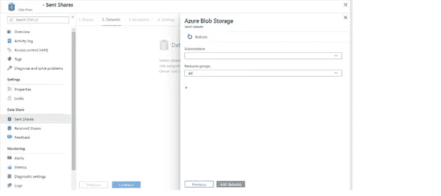

# 一个简单安全的大数据共享服务:Azure 数据共享

> 原文：<https://medium.com/analytics-vidhya/a-simple-and-safe-service-for-sharing-big-data-azure-data-share-d28bcec02360?source=collection_archive---------7----------------------->

在当今世界，数据是一种资产，任何组织都需要以简单安全的方式共享。今天我们已经有几种方法可以做到这一点，包括电子邮件、FTP 或不同的 API。提到的一些方法并不安全，但是管理起来很昂贵。

Azure 数据共享提供了一种简单而安全的方式来与合作伙伴或客户共享数据。只需几次点击，您就可以调配数据共享帐户、数据集并向您的客户发送邀请。这个完整的流程很容易管理和监控共享了哪些数据、何时共享以及由谁共享。

# Azure 数据共享如何工作:

目前，Azure 数据共享提供基于快照的共享。Azure Data Share 也提供就地共享功能，但仅限于预览版。在基于快照的共享中，数据提供者向数据消费者发送邀请，消费者接受邀请并触发快照。Azure 数据共享引入了一些与数据共享相关的新术语:

**数据提供者:**希望与数据消费者共享数据的数据所有者。

**数据消费者:**消费者是那些想要接收数据的人。

**数据共享:**作为单个实体共享的一组数据集。

**快照:**快照是消费者生成快照时的数据副本。有两种类型的快照可用:完整快照和增量快照。

**邀请:**是数据提供者发送给消费者的请求。他们可以通过将收件人的电子邮件添加到数据共享中来做到这一点。

**接收方:**收到邀请的就是数据共享的接收方。接收者可以批准或拒绝数据共享的请求。

Azure 数据共享中可用的连接器:

1.Azure Blob 存储。

2.Azure 数据湖存储第一代

3.Azure 数据湖存储第二代

4.Azure SQL 数据仓库

5.Azure SQL 数据库

在这篇博客中，我们将使用完整的增量快照来处理 Azure Blob 存储，并发送共享请求。

1.  登录 Azure 门户并在搜索框中搜索数据共享:

2.在 Azure 中打开数据共享服务，然后单击“添加”以创建数据共享。

3.点击“添加”后，提供数据共享的名称。选择您的订阅和资源组以及位置。最后，点击“创建”。

4.现在，打开您通过上述步骤创建的数据共享，并单击“开始共享您的数据”。

5.点击上面的链接后，点击“创建”创建一个共享。提供共享的名称(必填)、描述(可选)和使用条款(可选)。最后，点击“继续”。

6.现在，在“数据集”选项卡中，选择“添加数据集”选项卡，并选择 Azure blob 存储作为数据集类型，然后单击“下一步”。

7.在下一个选项卡中，选择您的订阅和资源组。它将提供所选订阅中可用的 blob 容器列表。选择要发送的容器和文件夹，然后单击“添加数据集”。

8.上述过程将在数据共享中创建数据集。点击“继续”。

9.点击“添加收件人”添加收件人。您可以输入电子邮件发送邀请。提供电子邮件 id 后，单击“继续”。

10.在下一个选项卡中，您可以设置要触发的快照的计划。您可以选择开始时间和重复。

11.最后，单击“创建”向收件人发送共享邀请。数据消费者将通过电子邮件得到通知。

在下一篇博客中，我们将致力于接收邀请并触发快照以接收数据。

## [第二部分→](/@ashish13336/a-simple-and-safe-service-for-sharing-big-data-part-2-azure-data-share-b59c19588ddb)

**鸣谢**:所有图片均取自 Azure 门户和微软 Azure 数据共享官方文档。