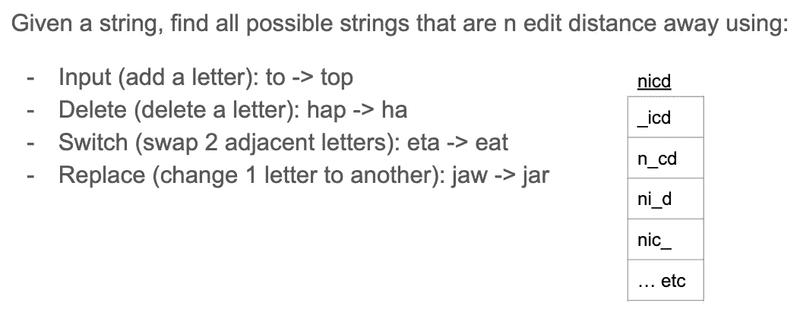

# 一个简单的自动更正系统

> 原文：<https://medium.com/analytics-vidhya/a-simple-autocorrect-system-36d75c32b5f3?source=collection_archive---------18----------------------->

您是否想知道当我们在智能手机上拼错一个单词或写电子邮件时，自动更正是如何工作的？在这篇文章中，我将讨论两个关于自动更正系统如何工作的话题:

1.  如何建立一个简单的自动更正系统？
2.  什么是最小编辑距离，它有什么作用。

这篇文章是我在深度学习 NLP 上的继续发展之路，基于 Coursera 上的概率模型自然语言处理课程的第一周。

**在这里查看我的最终项目** : [点击链接](https://github.com/KarenJF/deeplearing_nlp/tree/master/c2_nlp_with_probabilistic_models/week1/assignment1)

# 第 1 部分:如何构建一个简单的自动更正系统

在使用概率模型的自然语言处理的第一周，我学习并构建了一个简单但足够好的自动更正系统来更正拼写错误的单词。

这是一个将拼写错误的单词转换成正确单词的应用程序。

在**的高级总结**，这个简单的自动更正系统包括以下 4 个步骤。稍后我将详细介绍它们。

1.  识别拼写错误的单词。
2.  查找 n-编辑距离以外的字符串。
3.  过滤候选单词。
4.  计算剩余候选单词的单词概率，并选择最可能的单词来替换拼写错误的单词。


# 第一步:识别拼写错误的单词

识别拼写错误的单词的一种方法是**在字典中检查单词**。如果找不到该单词，它可能是一个拼写错误的单词。

```
if word not in vocab:
    misspelled = True
```


例如， ***nicd*** 是拼错的单词， **nick** 是正确的单词

# 步骤 2:查找任意 n 个编辑距离(1，2，3 等)的字符串

目标是创建一个候选单词列表，用于替换拼写错误的单词。直觉告诉我们，如果一个字符串与您键入的字符串相距一个编辑距离，那么与相距两个编辑距离的字符串相比，它与您的字符串更相似。

这里，**“edit”**是对一个字符串执行的一种操作，将它改变成另一个字符串。

“编辑”距离计算这些操作的次数。例如，**n-编辑距离**告诉你从一个字符串到另一个字符串有多少次操作。一些常见的编辑操作包括:

*   插入(添加一个字母):到->顶部
*   删除(去掉一个字母):rat -> at
*   交换(交换两个相邻的字母，但不包括相距两步或更远的字母):eta -> eat
*   替换(将一个字母改为另一个):jaw -> jar

对于自动更正问题，通常只需要 1 到 3 次编辑。



# 步骤 3:从字符串中筛选拼写正确的真实单词。

*   将步骤 2 中的候选字符串与已知字典进行比较。如果找不到该字符串，则删除它们。
*   那么你只剩下一个实际单词的列表。

# 第四步:计算单词概率

这将告诉您每个单词在上下文中出现的可能性，并选择最有可能的候选词作为替换。

*   统计语料库中的总字数
*   计算这个单词出现的次数
*   一个单词在句子中的概率等于该单词在语料库中出现的次数/语料库中的单词总数。
*   对于来自步骤 3 的所有最终候选项，**我们找到概率最高的单词候选项，并选择该单词作为拼错单词的替换。**

例如，对于句子:“我很高兴，因为我在学习”:

*   语料库中的总字数是 7
*   “am”出现的次数是 2
*   句子中“am”的概率等于 2/7

# 第 2 部分:最小编辑距离

## 1.什么是最小编辑距离，它的用途是什么？

*   最小编辑距离是评估两个单词、字符串甚至整个文档的相似程度。例如:“whah”和“what”
*   还有，你如何有效地找到从“whah”到“what”的最短路径？对于给定的字符串，最小编辑距离是将一个字符串(“whah”)转换为另一个字符串(“what”)所需的最少操作数。
*   应用:拼写校正、文档相似性、机器翻译、DNA 测序等等。

## 2.如何计算最小编辑距离？强力法

我们使用 3 种类型的编辑操作来计算最小编辑距离。

*   插入(添加一个字母)，编辑成本= 1
*   删除(删除一个字母)，编辑成本= 1
*   替换(将一个字母改为另一个)，编辑成本= 2

然后，我们合计将一个字符串更改为另一个字符串所需的全部操作，这就是最小编辑距离。**然而，如果你从一个字符到另一个字符，对于一个更长的字符串，这将需要大量的计算资源。因此，通常情况下，我们可以使用动态规划来解决这个问题。**

**3。计算最小编辑距离的动态规划。**

示例:

*   来源:播放->目标:停留
*   成本:插入= 1，删除= 1，替换= 2

请遵循以下步骤:

*   填满矩阵的第一列


*   填充矩阵的第一行


*   通用术语如下:


*原载于*[*https://github.com*](https://github.com/KarenJF/deeplearing_nlp/blob/master/c2_nlp_with_probabilistic_models/week1/README.md)*。*