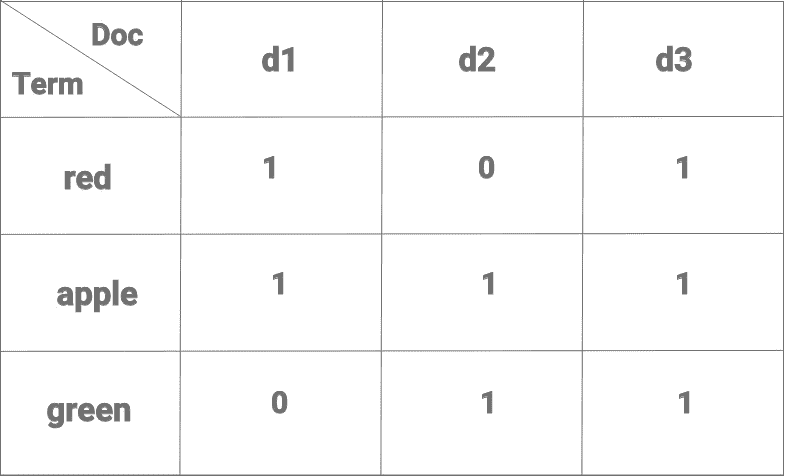
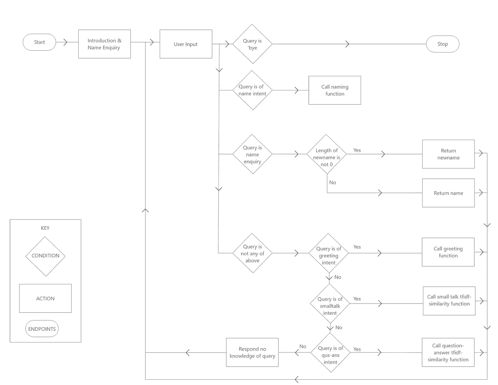
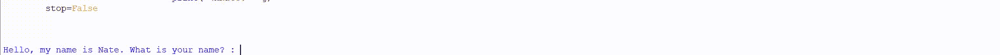

# 一个使用 Python 和 NLTK 的简单聊天机器人

> 原文：<https://medium.com/analytics-vidhya/a-simple-chatbot-using-python-and-nltk-c413b40e9441?source=collection_archive---------2----------------------->


聊天机器人是一种人工智能软件，它可以根据自然语言处理(NLP)原则，用自然语言模拟人类与其用户的对话。对话可以基于文本、语音界面或两者的组合。目前聊天机器人几乎被用于所有领域，如电子商务、新闻、生产力、娱乐、教育等。第一个自然语言处理聊天机器人是由 Joseph Weizenbaum 在 1966 年创建的，名为“Eliza”。今天，世界各地使用的最流行的语音聊天机器人是智能音箱，如 Alexa、谷歌助手、Siri 等。

> 全球聊天机器人市场规模预计将从 2019 年的 26 亿美元增长到 2024 年的 94 亿美元，全球智能扬声器市场预计将在 2021 年达到 1.63 亿台；不包括 Mainland China 将达到 9000 万。

**什么是自然语言处理？**

自然语言是那些随着时间的推移而自然进化的语言，是人类多年来为了相互交流而说和重复的语言，如英语、法语、西班牙语、印地语等。它是一个融合了语言学、计算机科学和人工智能的跨学科领域。NLP 有两个部分，即:自然语言理解(NLU)和自然语言生成(NLG)。NLU 是对人类和机器生成的自然语言的阅读和理解，例如，这条评论是正面的还是负面的，人们对产品的感觉如何，这条推文是关于什么的，用户想从这条特定的查询中获得什么，等等。NLG 是机器响应人类生成的输入而生成的自然语言，例如聊天机器人的响应、数据中的天气预报、自动字幕生成等。两者一起帮助自然语言的处理，并且是在所有基于自然语言处理的应用中使用的原则，例如问题回答(Alexa，Google Assistant，Siri 等。)、信息检索(谷歌搜索引擎、Spotify 音乐搜索等。)、聊天机器人(电子商务、银行等。)、情感分析(决定特定产品评论是正面的还是负面的等等。)、自动摘要(为一长段文本生成摘要)、语音识别等。

## 创建聊天机器人的前奏

**预处理管道**

符号化

文档由任意长度的标记组成。它是将文本分割成更小的单元，每个单元称为一个令牌。标记可以是短语、单词、音节或字符。最常用的拆分是拆分成单词的标记。

注释(词性)

注释或词性标注，用它们的语法功能来标记每个单词，从而使算法更容易根据上下文将诸如“saw”之类的单词识别为动词(单词 see 的过去式)或名词(伐木工具)。

文字标准化

词语在使用时被修饰以表达不同的语法意义。但是，每当机器遇到单词 see and saw 或 cat and cats 时，它应该能够将其映射到相同的标记和含义。为此，有两种方法可以解决这个问题；

1.  引理满足:每个术语都有其字典含义。所以，单词'猫'，'猫'，'猫'，'猫'都对应着'猫'这个单词。同样，单词“see”、“saw”也将以“see”的形式出现在词典中。这种方法可能会慢一些，但会产生更一致的内容。它利用了词性标注。
2.  词干:每个术语都被归结为它的词干。这种方法要快得多，也健壮得多。所以像'唱歌'、'歌手'这些词都源于'唱歌'。

过滤

删除被认为是干扰词和停用词的不必要的词。诸如“一个”、“一个”等词。不要给句子的意思增加太多分量，被过滤掉。停用词移除还包括根据单词的频率移除单词。在文档中出现非常频繁的单词以及在文档中只出现一次或两次的单词实际上并不具有区分性。它们对文档的意义没有贡献，因此被过滤掉。

作为预处理的一部分，单词也可以全部小写。根据需要选择性地采用上述预处理步骤，有时可以全部采用。

**单词袋模型**

机器不能像我们人类一样理解单词或可变大小的输入。他们需要将文本分解成数字格式进行处理。因此，在预处理之后，语料库(大文档文本)被展平成固定大小的向量，即单词袋模型。文本的单词包表示法抛弃了文本中单词的顺序或结构，并且只关心两件事； ***已知单词的词汇和这些已知单词存在的度量。***

考虑三个文档 d1:“红苹果”，d2:“青苹果。”d3:“红绿苹果。”

词汇(术语) :红色、苹果色、绿色

维度(术语)x(文档)的术语-文档矩阵可以构建如下:



想象一下这样一个拥有 500+文档和术语的向量！

**TF-IDF 加权(词频-逆文档频)**

使用原始频率来衡量单词有问题。大文档变得离短文档很远，即使它们在内容上可能非常相似。因此，诸如 TF-IDF 的加权函数被应用于单词。术语频率-逆文档频率，是反映一个词对集合或语料库中的文档有多重要的统计量。

*术语频率(TF)* 是术语在特定文档中出现的次数的度量。

TF =(术语 t 在文档中出现的次数)/(文档中的术语数)

上述示例 d1 中“红色”项的 TF 将是 1/3=0.3。

*逆文档频率* *(IDF)* 是衡量一个术语在文档中的重要性或稀有程度的指标。罕见术语的 IDF 可能很高，而频繁术语的 IDF 可能很低。

IDF = log(N/N)；其中 N 是文档的数量，N 是包含术语 t 的文档的数量。

上例中术语“红色”的 IDF 将是 log(3/2)=0.17。

因此，d1 中“红色”项的 TF-IDF 应为 0.3*0.17=0.05。类似地，所有三个文档中术语“苹果”的 TF-IDF 都是 0，因为术语“苹果”的 IDF 是 log(3/3)=0。

**余弦相似度**

相似性是一种度量标准，用于衡量两个文档向量的相似程度，而不考虑它们的大小。它是信息检索、推荐系统等许多算法的核心。本质上，它与两个文档之间的距离度量有关。

*余弦相似度*是一种常用的相似度度量，它度量多维空间中两个文档向量 d1 和 d2 之间的夹角余弦。两个向量的点积除以它们的范数的乘积。

余弦相似度(d1，d2) = ( |d1。d2| ) / ( ||d1|| * ||d2||)

## 聊天机器人的创建

现在创建一个简单的信息检索聊天机器人，我命名为'内特'。Nate 能够进行基本的闲聊和问候，询问、存储和回忆用户的姓名，并回答所提的问题，如果这些问题与 Nate 可以访问的数据集相似。用户甚至可以要求 Nate 更改用户希望被称呼的名字。如果 Nate 不知道任何问题的答案，它可以礼貌地拒绝用户的回答。所以让我们开始吧！



聊天机器人 Nate 用户流程图

**导入库和模块**

从 scikit learn library 导入 TfidfVectorizer 和 cosine_similarity，将原始文档集合转换为 TF-IDF 特征矩阵，并分别查找用户输入的查询和语料库中的文档之间的相似性。导入 PorterStemmer，用于词干处理。

```
import csv
import random
from nltk.corpus import stopwords
from sklearn.feature_extraction.text import TfidfVectorizer
from sklearn.metrics.pairwise import cosine_similarity
from nltk.stem.porter import PorterStemmer
```

**问候模块**

当用户输入问候时，Nate 从问候输出组中选择一个随机的问候，以响应用户。

```
greet_in = ('hey', 'sup', 'waddup', 'wassup', 'hi', 'hello', 'good day','ola', 'bonjour', 'namastay', 'hola', 'heya', 'hiya', 'howdy',
'greetings', 'yo', 'ahoy')
greet_out = ['hey', 'hello', 'hi there', 'hi', 'heya', 'hiya', 'howdy', 'greetings', '*nods*', 'ola', 'bonjour', 'namastay']def greeting(sent):
   for word in sent.split():
      if word.lower() in greet_in:
         return random.choice(greet_out)
```

**闲聊区**

闲聊使用余弦相似度函数，基于一个小型数据集，该数据集由一组基本的闲聊问答对组成。当用户试图闲聊时，Nate 会给出与查询最相似的问题的相应答案。在数据集和查询的闲聊预处理中，没有停用词移除和词干化，因为决定用于闲聊的查询和数据集太小而不能进行进一步过滤。它们都被制成矩阵向量，并计算余弦相似度。与用户的闲聊查询最相似的问题的答案作为响应返回。

```
small_talk_responses = {
'how are you': 'I am fine. Thankyou for asking ',
'how are you doing': 'I am fine. Thankyou for asking ',
'how do you do': 'I am great. Thanks for asking ',
'how are you holding up': 'I am fine. Thankyou for asking ',
'how is it going': 'It is going great. Thankyou for asking ',
'goodmorning': 'Good Morning ',
'goodafternoon': 'Good Afternoon ',
'goodevening': 'Good Evening ',
'good day': 'Good day to you too ',
'whats up': 'The sky ',
'sup': 'The sky ',
'thanks': 'Dont mention it. You are welcome ',
'thankyou': 'Dont mention it. You are welcome ',
'thank you': 'Dont mention it. You are welcome '
}small_talk = small_talk_responses.values()
small_talk = [str (item) for item in small_talk]def tfidf_cosim_smalltalk(doc, query):
   query = [query]
   tf = TfidfVectorizer(use_idf=True, sublinear_tf=True)
   tf_doc = tf.fit_transform(doc)
   tf_query = tf.transform(query)
   cosineSimilarities = cosine_similarity(tf_doc,tf_query).flatten()
   related_docs_indices = cosineSimilarities.argsort()[:-2:-1]
   if (cosineSimilarities[related_docs_indices] > 0.7):
      ans = [small_talk[i] for i in related_docs_indices[:1]]
      return ans[0]
```

**名称管理**

一开始会询问用户名并将其存储在一个变量中。随后，如果用户的输入意图改变他/她的名字，则先前存储的名字被新名字覆盖到新变量中。今后，在所有闲聊和问候中，新名称将用于称呼用户。一旦新名字被覆盖，当内特被要求
回忆用户的名字，并询问“我的名字是什么？”。指示改变用户姓名的意图的输入语句将是包含“我的姓名是”或“呼叫我”或“将我的姓名改为”或“将姓名改为”的子字符串的那些字符串。

```
def naming(name):
   a = name.split()
   if('my name is' in name):
      for j in a:
         if(j!='my' and j!= 'name' and j!='is'):
            return j
   elif('call me' in name):
      for j in a:
         if(j!='call' and j!= 'me'):
            return j
   elif('name is' in name):
      for j in a:
         if(j!= 'name' and j!='is'):
            return j
   elif('change my name to' in name):
      for j in a:
         if(j!= 'change' and j!='my' and j!= 'name' and j!='to'):
            return j
   elif('change name to' in name):
      for j in a:
         if(j!= 'name' and j!= 'name' and j!='to'):
            return j
   else:
      return name
```

**问答板块**

从语料库所在的位置打开并阅读语料库。基于我的数据，我已经将语料库转换成{question:answer}格式的词典。你可以随意转换你的数据。当用户输入被检测为问题回答意图的查询时，在主循环中，查询和数据集首先被小写，去除其标点符号，并被传递给使用 porter 词干分析器执行词干分析的函数。然后，使用 tfidfvectorizer 过滤掉两者的停用词，将其标记化并制成向量矩阵，其中计算出 tfidf 值。计算数据集和查询矩阵的余弦相似性，并且将来自数据集的与查询具有最高相似性的问题的答案作为响应返回给用户。

```
f = open('Dataset.csv', 'r', encoding='utf-8')
reader = csv.reader(f)
corpus = {}
for row in reader:
   corpus[row[0]] = {row[1]: row[2]}

all_text = corpus.values()
all_text = [str (item) for item in all_text]def stem_tfidf(doc, query):
   query = [query]
   p_stemmer = PorterStemmer()
   tf = TfidfVectorizer(use_idf=True, sublinear_tf=True, stop_words=stopwords.words('english'))
   stemmed_doc = [p_stemmer.stem(w) for w in doc]
   stemmed_query = [p_stemmer.stem(w) for w in query]
   tf_doc = tf.fit_transform(stemmed_doc)
   tf_query = tf.transform(stemmed_query)
   return tf_doc, tf_querydef cos_sim(a, b):
   cosineSimilarities = cosine_similarity(a, b).flatten()
   related_docs_indices = cosineSimilarities.argsort()[:-2:-1]
   if (cosineSimilarities[related_docs_indices] > 0.5):
      ans = [all_text[i] for i in related_docs_indices[:1]]
      for item in ans:
         c, d = item.split(':')
         return d
   else:
      k = 'I am sorry, I cannot help you with this one. Hope to in the future. Cheers :)'
      return k
```

**意图匹配的主循环**

这是聊天机器人的主循环，它问候用户，询问他/她的名字，理解用户查询的意图，并相应地指导响应。

```
stop=True
while(stop==True):
   n = input('\nHello, my name is Nate. What is your name? : ')
   n = n.lower()
   name = naming(n)
   newname = ''
   stop1=True
   while(stop1==True):
      query = input('\nHi '+(newname if len(newname)!=0 else name)+', I am Nate. How can I help you? If you want to exit, type Bye. :')
      query = query.lower()
      query = query.strip("!@#$%^&*()<>,;?")
      if(query=='bye'):
         stop1=False
         print('\nNate: This is Nate signing off. Bye, take care'+(newname if len(newname)!=0 else name))

      elif('my name is' in query or 'call me' in query or 'name is' in query or 'change my name to' in query or 'change name to' in query):
         newname = naming(query)
         print('\nNate: Your name is '+newname)

      elif(query=='what is my name?' or query=='what is my name' or query=='whats my name?' or query=='whats my name'):
         if(len(newname)!=0):
            print('\nNate: Your name is '+newname)
         else:
            print('\nNate: Your name is '+name) else:
         if(greeting(query)!=None):
            print('\nNate: '+greeting(query)+' '+(newname if len(newname)!=0 else name))
         elif(tfidf_cosim_smalltalk(small_talk_responses, query)!=None):
            x = tfidf_cosim_smalltalk(small_talk_responses, query)
            print('\nNate: '+x+(newname if len(newname)!=0 else name))
         else:
            a, b = stem_tfidf(all_text, query)
            g = cos_sim(a, b)
            print('\nNate: '+g) stop=False
```

让我们来看看它是如何工作的。



行动中的聊天机器人 Nate

## 结论

尽管这不是一个具有高认知技能的聊天机器人，并且可以做进一步的工作来使它更有效，但这是一个简单、好的进入 NLP 和聊天机器人领域的方法。这是我在硕士期间必须完成的项目之一，主题是人机交互。我要感谢我的教授 Joel Fischer 博士和 Jeremie Clos 博士的支持。如果你读到这里，也谢谢你:)欢迎在下面留下你的评论或通过电子邮件联系 irisjestin@gmail.com。干杯！