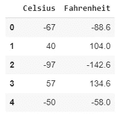
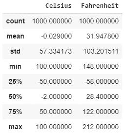
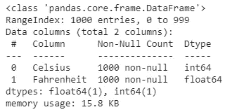
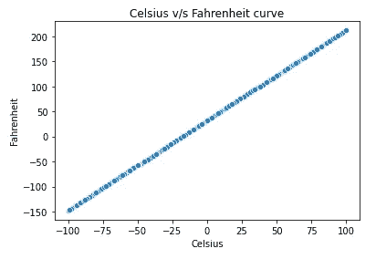
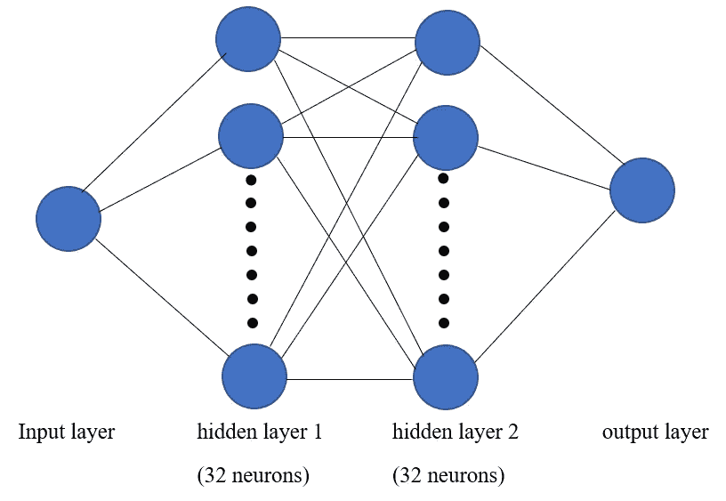
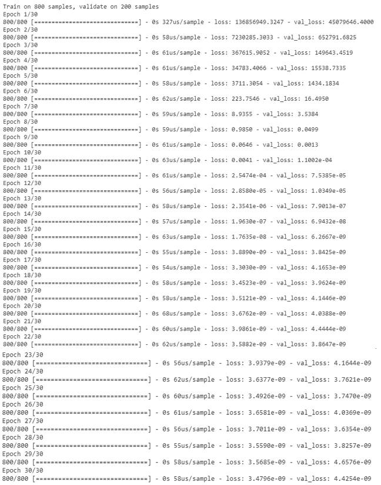
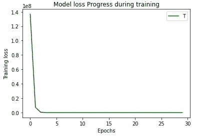
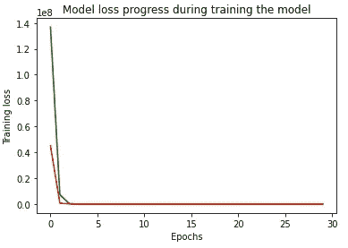

# 一个简单的深度学习模型，使用 Tensorflow + Python 和 Google Colab 将摄氏转换为华氏

> 原文：<https://medium.com/analytics-vidhya/a-simple-deep-learning-model-to-convert-celcius-to-fahrenheit-using-tensorflow-python-with-22cf2387890a?source=collection_archive---------10----------------------->

# 介绍

目标是使用简单的深度学习模型基于另一个变量 X 来预测一个变量 Y 的值。这里的 x 是自变量，Y 是因变量，与 x 线性相关。

# 挑战

这项挑战是基于使用深度学习方法将不同的温度值从摄氏度转换为华氏度。

# 深度学习完整项目

> ***导入数据集***

在这种情况下，使用一个非常基本的自创建数据集名称 Celsius _ Fahrenheit _ dataset _ 1000 . CSV，包含 1000 个值。这个数据集可以从链接[https://drive . Google . com/file/d/19 laj 9 jrennmwlpqr 1 tmrnyscnsquuonf/view 下载？usp =分享](https://drive.google.com/file/d/19Laj9jreNnMWLpqR1tMrnyscnsQUUONF/view?usp=sharing)。或者完整的数据集也可以从[https://github . com/sushantkumar-estech/Celsius-to-Fahrenheit-using-ANN/blob/master/Celsius _ Fahrenheit _ dataset _ 1000 . CSV](https://github.com/sushantkumar-estech/Celsius-to-Fahrenheit-using-ANN/blob/master/Celsius_Fahrenheit_dataset_1000.csv)

数据集的顶行如下所示:

导入数据集的前 5 行

以及数据集的最后五行:

同一数据集的最后 5 行

还有一些关于数据集的更多信息

关于数据集的详细信息

还有一些。

关于数据集中数据类型的详细信息

下面显示的是摄氏和华氏之间的曲线。通过斜率(m) = 9/5 的关系 **" *华氏温度= 9/5 *摄氏温度+ 32"*** ，华氏温度与摄氏温度成线性关系。

摄氏温度对华氏温度曲线

对于此项目，整个数据集用于训练模型，而模型的测试是通过传递随机值并通过将模型输出与从摄氏到华氏转换公式获得的实际输出进行比较来检查正确性。

> ***创建模型***

如上所述，该模型是深度神经网络，总共包括一个输入层、两个隐含层和一个输出层。由于在本项目中有一个值，即 X(摄氏),要转换为另一个值，即 Y(华氏),这就是为什么该模型在输入层和输出层只有一个神经元。每个隐藏层包含 32 个神经元。所有的层都是完全相互连接的。

模型结构

创建的模型摘要如下。

模型摘要

如上所述，模型中有 1153 个参数需要训练。

> ***训练模型***

为了训练模型，格式化的数据集需要通过，或者换句话说，模型需要适合数据集。在训练时，参数如优化函数、时期数、验证分割等。需要决定。这些值对模型的训练有影响。必须始终防止模型过度拟合或拟合不足。

对于这个项目“Adam”优化器，选择了 30 个时期和验证分割= 0.2。该模型根据数据集中的 800 个值进行训练，同时针对 200 个值进行验证。

随着模型开始被训练，一个时代接一个时代，模型变得更好，损失开始减少。在 30 个时期内对训练和验证数据进行训练时模型的性能总结如下:

培训期间的绩效总结模型

模型损失 v/s 历元图显示了训练损失如何随着历元数量的增加而减少。

训练损失 v/s 历元曲线

验证损失也显示了同样的行为。从下图中可以看出，它们也会随着历元数的增加而减少。绿线表示培训损失，红线表示验证损失。

模型损失(训练和验证损失)v/s 历元曲线

> ***测试模型***

对于测试，以摄氏度= 12 为单位的温度值传入模型，模型预测的温度值为华氏= 53.60002。从摄氏到华氏的公式( ***华氏温度= 9/5 *摄氏温度+ 32*** )，实际值应该是 53.6。神经网络模型的输出与实际值相差 0.00002，可以忽略不计。

# 结论

因此，神经网络能够做出非常接近的预测。这是机器学习中的一个强有力的领域。

# 参考

数据集的完整代码可以从下面的 Git 下载

此外，如果你是机器学习的初学者，并且热衷于了解更多，那么你可以搜索 GitHub 帐户 **sushantkumar-estech** 或者可以使用链接[https://github.com/sushantkumar-estech](https://github.com/sushantkumar-estech)来了解有趣的项目

从你的练习愿望中选择任何项目，如果有任何问题，你可以写信给我。我很乐意帮忙。

享受阅读，快乐学习！！