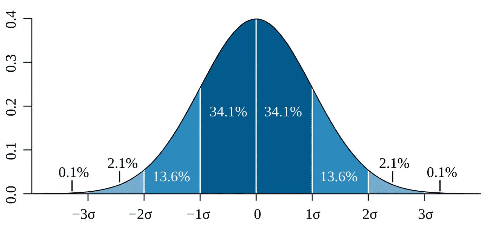

# 布莱克·斯科尔斯的简单推导——从一开始就预测股票和期权价格

> 原文：<https://medium.com/analytics-vidhya/a-simple-derivation-of-black-scholes-predicting-stock-and-option-prices-from-the-beginning-6a3d03b98a71?source=collection_archive---------8----------------------->

我是一名数学专业的学生，是一名技术分析师，但我一直在挖掘期权交易背后的潜在统计数据，发现这些数据非常不直观，令人困惑。尤其是布莱克·斯科尔斯(Black Scholes)——真是一个乱七八糟的公式。

我想整理一个*常识*概述期权交易背后的统计和数学，预测股票价格，以及为什么期权交易可以让你赚钱。

解释为什么 Black Scholes 期权价格公式有意义，回顾一下*和希腊*，让你在期权交易中占据优势，假设你只受过高中数学教育。

**数学先决条件**

*   欧拉数( *e* ) &自然对数( *ln* )
*   正态分布—均值、标准差和方差
*   基础代数

# *日志返回初学者指南*

假设我们投资了 100 美元，日回报率为 2%，没有风险。我们的回报率是 102%。

*   在第 0 天，我们有 100 美元
*   第一天我们有 102 美元
*   在第二天，我们已经投资了 102 美元，回报率为 2%，所以计算结果是 102 * 1.02 = 104.04

这给了我们一般公式:

```
Investment on Day *n* = *Initial Investment* * (*Return Rate*)^*n*
```

还有另一种方式来写这个，这在以后会很有用

```
= ***Initial Investment* * exp(*n* * ln(*Return Rate*))**Since 
 exp(ln(X)) = X 
and 
 ln(X^2) = 2 * ln(X)we can write the return rate to the power of n as:(Return Rate ^ *n*) = exp(ln(*Return Rate* ^ *n*))
                  = exp(*n* * ln(*Return Rate*))Note: 
  exp(X) = euler number (*e)* to the power X
  ln(X) = natural logarithm of X aka. inverse of exp
```

> ln(回报率)被称为*日志回报率*

仅仅为了强调一点，你可以添加对数回报，同时你需要乘以回报

```
If a investment gains 10%, then gains another 10% Returns Rate = 1.1 * 1.1 = 1.21 Log Returns = ln(1.1) + ln(1.1) = ln(1.1 * 1.1) = ln(1.21)
```

这很重要，因为这意味着我们可以用平均值来计算对数回报率，而我们不能用平均值来计算回报率。

# 为什么记录退货？

如果你 100 美元的投资上涨了 10%到 110 美元，第二天下跌了 10%，你现在的投资是 99 美元
= >平均回报率是 0%但是你实际上损失了 1 美元

在上面的场景中，如果我们希望我们的回报是 0 美元，我们需要我们在第二天的回报是 1/1.1 = 90.90..%

但是现在我们的平均回报率=(1.10+1/1.1)/2 =1.00454545这似乎很难跟踪，有了日志回报，这就变得容易多了

```
Since ln(x) = -ln(1/x) Average of log returns: 
  (ln(1.1) + ln(1/1.1))/2 = 0
```

**要记住的要点**

当你有可变的*回报率*(相对于固定的*回报率*)，平均*回报率*是你实际回报的误导指标。

对数回报是一个更好的指标，因为如果是正数，你赚了钱，如果是负数，你就亏了钱。

# 预测股票价格

好了，现在你明白了*对数收益*是一件好事，让我们来谈谈预测股票价格。

> 第一个假设是，股市是一个赌场

这意味着股票价格根据某种可测量的概率随机上下波动。

> 第二个假设是股票市场的回报是对数正态分布的

意味着…

```
ln(Stock Price Later/ Stock Price Now) has a normal distribution
```

这不是一个可怕的假设..
**这里有一个去年开放价格$SPY 的例子**


“$SPY 的日志返回直方图

看起来很正常地分布在右边…除了最左边的那个离群值。

**等等，为什么股票的对数收益率是正态分布的？** 基本上，这验证了我们最初的假设，即股票市场是一个赌场，股票在平均水平上下波动的概率是相等的...

> 最后一个假设，股票的平均*收益率*是无风险利率

A *无风险利率*，就像你把钱存入银行得到的利率一样，我们假设股票回报应该是一样的。

我们之前看到，对于可变收益率，平均*收益率*略高于*对数收益率的平均值。*

结果为对数正态分布*收益率*

```
Average Returns = exp(U + V/2)Where
  U = average of log returns
  V = variance of log returns 
    = square of the standard deviation of log returns
```

假设我们希望我们的平均回报是*无风险率*，我们可以算出满足这个假设所需的日志回报的平均值。

```
Risk Free Rate = exp(U + V/2)
ln(Risk Free Rate) = U + V/2 
ln(Risk Free Rate) - V/2 = UWe want our average (mean) of log returns to be 
=> ln(Risk Free Rate) - V/2
=> ln(r) - std²/2
```

# **股票上涨> 4%的概率是多少？**

假设一只股票的交易价格为 100 美元，我们想知道这只股票明天的交易价格低于 104 美元的概率

我们查看股票的历史日志收益率，看到是每日*日志收益率*，标准差为 2%，我们假设无风险率为 1%。

由于*日志返回*是正态分布的，我们使用累积正态分布函数(CDF)来得到我们的概率。

CDF 实质上是测量正态分布曲线下的面积



作者 m . w . Toews——自己的工作，基于(概念上)杰瑞米·坎普 2005 年 2 月 9 日的数据，CC BY 2.5，[https://commons.wikimedia.org/w/index.php?curid=1903871](https://commons.wikimedia.org/w/index.php?curid=1903871)

```
Probability that a normal distribution is below a *value:
* 
CDF(z) = Probability that normal distribution is below a value zwhere
z = (value - mean) / std
and
std = standard deviation
```

因为上面的图是关于 0 对称的

```
CDF(-z) = Probability that normal distribution is above value z
```

回到我们明天的股价超过 104 美元…

```
P(Stock being > $104 tomorrow)
= P(log returns > ln(104/100)) 
= CDF(-z) where 
z = (value - mean) / std

stock above $104 tomorrow from $100 today gives us
value = ln(104/100) from historical data we have
std = 2% from stock growing at risk free rate we get 
mean = ln(1.01) - std²/2
```

我们得到的股票在 S 交易的概率比 X 高一点的结论由下式给出

```
P(S > X) 
= CDF(-z)
= CDF(1/std * (-value + mean))
= CDF(1/*σ* * (-ln(X/S) + ln(r) - *σ*²/2))Note: I'll use *σ* for standard deviation 
```

# 预测未来的股票价格

好吧，我们着眼于预测明天的股价，但是明年呢，还是 5 天之后？

这实际上很容易，我们只需玩弄我们的标准差和无风险利率。

## **计算挥发性 Log 报酬的标准差**

假设我们有一个间谍的每日股价列表，我们用计算每日*日志回报*

```
ln(day n stock price / day n-1 stock price) 
```

这些值的标准偏差给出了每日日志回报的标准偏差，但是如果我们想要 5 天周期的标准偏差呢？

我们可以做一些非常简单的事情，我们只要乘以天数的平方根

```
Daily Standard Deviation * **√**(N Days) = N days Standard Deviation
```

为什么会这样？
快速回答是，我们可以为独立事件添加方差，我喜欢把它想象成抛一枚理论上正态分布的硬币。

如果抛一次硬币的值的方差是 X，那么抛两次硬币的值的方差是 X + X。

当然，方差就是标准差的平方

```
the standard deviation of 2 flips of our coin
= **√**(X + X) 
= **√**(2 * X) 
= **√**2 * **√**X
= **√**2 * standard deviation of 1 coin flip
```

> 股票的**波动率**是对数收益的年标准差

这通常通过使用过去 N 天的每日日志回报的标准偏差并乘以 **√** 252 来计算，因为一只股票一年中通常有 252 个交易日。

如果给你一个*波动率*，你想计算 5 天内的标准差，你可以

```
5 days standard deviation = Volatility * **√**TT = 5/252 since you are looking for 5 days out of 252
```

## **计算无风险利率**

你可以自己查找或设置，它通常是按年计算的。要获得 5 天的无风险利率，你会怎么做

```
5 day risk free log returns = ln(Risk Free Rate) * T T = 5/252 since you are looking for 5 days out of 252 trading days
```

## **绑起来**

计算一支股票明天上涨的概率和计算它明年上涨的概率是一样的，只是标准偏差和无风险利率不同。

在我们之前的公式中，如果我们使用标准偏差和无风险利率的年度值，我们可以用 r * T 和σ * **√** T 代替 r 和 *σ* 来概括任何时间。这让我们想到..

# 预测未来股票价格的一般形式

给定波动率 *σ* 和 *r* 年无风险利率的对数，我们有了所有的构建模块来提供一个通用公式，用于预测在 *S* 的股票交易是否高于未来 *t* 的某个值 *X* 。

```
P(Stock Trading at S today is above X at time t) 
= CDF(-z)
= CDF((1/std) * (-value + mean))
= CDF((1 / *σ***√**T) * (-ln(X/S) + rT - (σ**√**T)²/2))cleaning that up a bit is**= CDF((1 / *σ*√T) * (ln(S/X) + (r - σ²/2)T)**Remember that -ln(X) = ln(1/X)
```

> 你们中的一些人可能知道布莱克·斯科尔斯的这个公式，上面的公式和 N(d1)是一样的

*重要提示* : r = ln(年无风险率)
所以如果你的年无风险率是 102%(收益 2%)，那么 r = ln(1.02)～= 0.02

# 购股选择权

期权是在未来*到期*时以某个价格*执行价格*购买或出售股票的合同

合同的价格被称为*溢价*，当期权合同被*执行*时，标的股票被买入或卖出。

> ***称*** 给予持有者在未来以一定价格购买股票的选择权
> 
> ***看跌期权*** 给予持有者在未来以一定价格出售股票的选择权

作为期权的购买者，你可以决定不行使它。也就是说，如果事情没有按照你的方式发展，你可以失去溢价，不买/卖股票。

但是如果买方愿意，期权的卖方有义务购买/出售股票。

# 期权定价:布莱克-斯科尔斯简单推导

市场动力学 101，你需要一个买方和一个卖方，在期权的情况下，双方都想赚钱。

让我们以下面的看涨期权为例..

**看涨期权** 的买方希望从股票中赚钱，并希望确保股票的价值超过行使价和他们为期权支付的任何溢价。

```
Call Premium < E(Stock price at expiration) - E(Strike Price)
```

这里的 E(X)是一个期望函数，意思是在无限的期权交易中，X 的平均值是多少。

有时买家会完全失去溢价，而其他时候股价会飙升，让他们赚钱。买方希望买入溢价低于他们在这些无限交易中以执行价获得的收益。我们取所有这些无限交易的概率加权平均值来得到期望值。

**看涨期权** 的卖方希望从*溢价中赚钱，*这意味着他们要么希望股票在到期时不高于执行价，要么如果高于执行价，那么溢价应该可以弥补任何损失。

```
Call Premium > E(Stock price at expiration) - E(Strike Price)
```

## **市场均衡**

在一个有很多买家和卖家的有效市场中，这意味着

```
Call Premium = E(Stock price at expiration) - E(Strike Price)
```

## **支付履约价格的预期**

```
Expectation of paying strike price 
  = Strike Price * P(Stock > Strike Price)
```

从我们之前的工作中，我们已经知道如何得到股票高于某个价格的概率！

```
P(Stock > Strike Price)
  = P(S > X) 
  = CDF(-z) 
  = CDF((1 / *σ*√T) * (ln(S/X) + (r - σ²/2)T)Expectation of paying the strike price 
  = Strike Price * CDF((1 / *σ*√T) * (ln(S/X) + (r - σ²/2)T)
```

> 但是..明天的一美元不如今天的一美元值钱。

如果我们只是把钱存在银行，它会以我们的*无风险利率、*的利率增长，所以我们需要贴现我们的执行价格，以找到今天的金额，它会以无风险利率增长到到期时的执行价格。

```
Strike Price value today = Strike Price * exp(-rT)Giving us 
Expectation of paying the strike price 
  = Strike Price * exp(-rT) 
    * CDF((1 / *σ*√T) * (ln(S/X) + (r - σ²/2)T))
```

## **到期时股价的预期**

如果期权到期，股票没有达到执行价，我们显然什么也得不到，但是如果股票高于执行价，我们想知道我们可以预期的价格是多少。

```
E(Stock Price at expiration) = Expected Price of the stock given it's above the strike * Probability the Stock > Strike Price
```

对于对数正态分布，给定值高于分布 X 的期望值为

```
E(X given X > A) 
  = E(X) * CDF(-z + std) / CDF(-z)where 
  z = (value - mean) / std
  and 
  value = ln(A)
  and
  std *=* standard deviation
```

插上电源，我们得到

```
E(Stock Price at expiration) = 
  E(Stock Price) * CDF(-z + std) / CDF(-z) 
  * 
  P(stock > strike price)
```

你可能记得 CDF(-z)只是股票高于执行价格的概率，这就抵消了我们的 P(股票>执行价格)项。

我们的 E(股票价格)就是我们的股票价格乘以我们在 T 时间段的无风险利率，因为这是我们对股票预期增长的核心假设

```
E(Stock Price at expiration) =
 Stock Price * exp(rT) * CDF(-z + std)Note: 
- CDF(-z) is the probability that the stock is > strike price 
- E(Stock Price) is future expected price = Stock Price * exp(rT)
```

与我们之前对执行价格所做的类似，我们希望将股票价格转换为今天的货币，因为明天的货币不值得今天的货币。我们通过乘以 exp(-rT)来实现这一点。这抵消了我们的经验(rT)

```
E(Stock Price at expiration) 
= Stock Price * exp(rT) * CDF(-z + std) * exp(-rT)
= Stock Price * CDF(-z + std) 
```

现在我们只是想用我们之前算出的来扩展我们的 CDF(-z + std)项

```
From our previous work 
CDF(-z) = CDF((1 / *σ*√T) * (ln(S/X) + (r - σ²/2)T))SoCDF(-z + std) 
= CDF((1 / σ√T) * (ln(S/X) + (r - σ²/2)T) + σ√T)
= **CDF((1 / *σ*√T) * (ln(S/X) + (r + σ²/2)T))**Remember std = σ√T
```

> 你可能会认出这是布莱克·斯科尔斯的 N(d1)

## **将所有这些放在一起**

```
Call Premium = E(Stock price at expiration) - E(Strike Price)
= S * CDF((1 / σ√T) * (ln(S/X) + (r + σ²/2)T))
  - 
  X * exp(-rT) * CDF((1 / *σ*√T) * (ln(S/X) + (r - σ²/2)T))orCall Premium = S * CDF(d1) - X * exp(-rT) * CDF(d2) where
d1 = (1 / σ√T) * (ln(S/X) + (r + σ²/2)T)
d2 = (1 / *σ*√T) * (ln(S/X) + (r - σ²/2)T)S = Stock Price today
X = Strike Price 
T = Time to expiration in years (num days / 252)
CDF = Cumulative Normal Distribution function 
σ = Stock volatility 
```

> 这正是计算看涨期权溢价的布莱克-斯科尔斯公式

## 看跌期权呢？

看跌期权基本相同，但方向相反。因为您希望溢价能够解释执行价格和低于执行价格的股票预期价值之间的差异。

```
Put Premium = E(Strike Price) - E(Stock price at expiration)
= X * exp(-rT) * CDF(-d1) - S * CDF(-d2)
```

我们想看 P(股票>罢工)而不是 P(股票< Strike), Due to the nature of the CDF, if CDF(x) gives us the P(> x)，然后 CDF(-z)给我们 P(

# Volatility is the edge to making money with Options

With our formula Time, Stock Price, Strike Price & Risk Free Rate are *已知*，但是未来的波动性是*未知的。(*我们只能从历史波动率 *)*

买入和卖出价格是由市场买卖它们的**决定的，而不是由公式**决定的，这意味着当将这个公式应用于当前期权价格时，波动率是我们可以改变以匹配当前市场价格的唯一输入。

从当前期权价格中减去一只股票的波动率被称为*隐含波动率*

> 隐含波动率是市场对未来波动率的预期，基于使用当前期权价格取消布莱克-斯科尔斯公式的标准差

你可能会问自己，隐含波动率与实际波动率相比如何，这是去年的 SPY 值图


来自[iVolatility.com](https://www.ivolatility.com/options.j?ticker=SPY:NYSEArca&R=1&period=12&chart=2&vct=)的过去一年的美元 SPY 历史波动率(HV)与隐含波动率(IV)的对比图

在“正常时期”,历史波动率通常低于隐含波动率，在不太正常的时期(如 COVID ),历史波动率高于隐含波动率。

> 这意味着期权费通常过于昂贵，**这给了你一个优势**

## **期权交易的优势**

由于期权费通常太贵，这意味着你买期权赚不到钱，你卖期权赚钱！

但了解历史波动率如何落后于隐含波动率总是好的。

> 当隐含波动率低于历史波动率时买入期权
> 
> 当历史波动率高于隐含波动率时卖出期权。

# **希腊人——预测未来期权价格**

我们有一个期权价格的公式，它依赖于股票价格、波动性、时间和无风险利率的人工输入。

在购买期权之前，聪明的做法可能是根据这些因素，画出期权价格的变化图。

你可能听说过期权交易中的*、希腊*,这是一套衡量标准。

## 股票价格变化— Delta 和 Gamma

*Delta* 衡量股票价格每上涨 1 美元期权溢价的理论变化。

*Gamma* 衡量股票价格第二次上涨的额外溢价变化(高于 *delta*

一只股票期权溢价 2 美元=当前期权溢价+*delta*+*delta*+*gamma*


在 105 美元的罢工到期前 5 天，股票价格的买入溢价的变化

*Delta* 本质上就是这条线的这个梯度， *gamma* 就是 *delta* 的梯度。

你可以看到我们的期权价格是如何随着股票价格的变化呈指数增长的，gamma 在执行价附近最高。

## 时间变化—θ

*Theta* 衡量到期前 1 天期权费的变化。当你接近到期日时，溢价开始下降得更快，因为股票没有足够的时间超过你的执行价。


## 波动性变化—织女星

维加衡量波动率 1%的溢价变化。另一个指数图


股票期权费为 100 美元，执行价为 110 美元，还有 5 天到期

请记住，波动性是市场对股票标准差的预期，这就是为什么在收益电话会议后会出现 **IV 碾压**的原因。随着市场对股价变化可能性的预期下降，波动性显著下降，你的期权价值也下降。

记住你的优势，在上面的例子中，一个隐含波动率为 60%的看涨期权定价为 0.58 美元，如果你的股票实际波动率为 50%，溢价应该为 0.30 美元，这意味着如果你无限次出售该期权，你可以预期获得 0.28 美元。

## 无风险利率变化—Rho

*Rho* 衡量无风险利率变化 1%时期权溢价的变化。这是最无聊的希腊文，只和像 LEAPs 这样的超长期期权相关。

在短时间内，不会产生任何影响。


# 我如何开始交易期权

Robinhood 是一个很好的入门平台，但是你需要额外的步骤来解锁期权交易，但是当你注册时，你会得到一个随机的免费股票，如果你通过上面的链接注册，我也一样。

# 以一些警告的话结束

你知道布莱克·斯科尔斯如何工作，了解希腊人，在期权交易中有优势，所以你可以赚钱！

只要记住几件事

*   你需要做大量的期权交易才能理解这些，这些公式适用于大量数据，相同交易的无限重复的预期回报。单笔交易很容易亏损。确保你做了很多风险很小的交易，这样平均来说他们赚了钱，少数的失败不会让你失败。
*   小心股息，它们会让你面临被提前分配的风险。

祝你好运，交易愉快