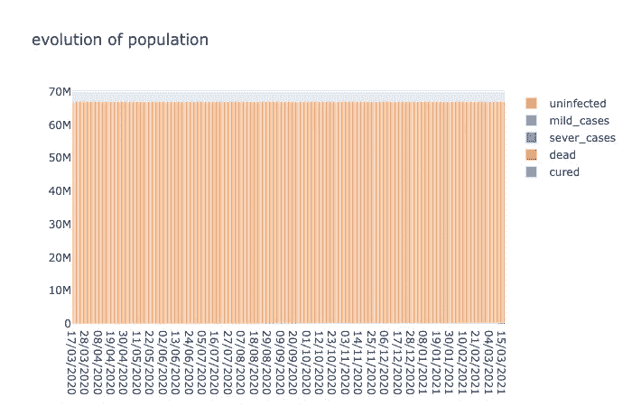
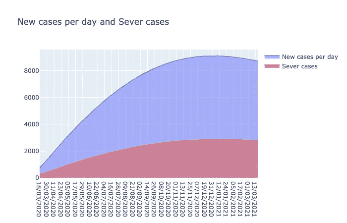
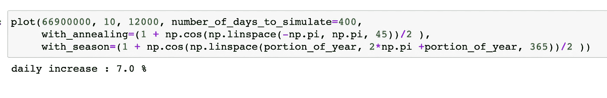

# 模拟冠状病毒流行并理解 SIR 模型

> 原文：<https://medium.com/analytics-vidhya/a-simple-epidemiological-model-applied-to-the-coronavirus-covid-19-244a8e3ca608?source=collection_archive---------6----------------------->


由 [Unsplash](https://unsplash.com/s/photos/coronavirus?utm_source=unsplash&utm_medium=referral&utm_content=creditCopyText) 上的[融合医学动画](https://unsplash.com/@fusion_medical_animation?utm_source=unsplash&utm_medium=referral&utm_content=creditCopyText)拍摄的照片

# 一个简单的流行病学模型应用于冠状病毒新冠肺炎

#冠状病毒，#新冠肺炎，#数据科学，#数据可视化，#流行病学，

随着最近新型冠状病毒在世界各地的传播，尝试了解病毒如何传播并进行一些模拟以尝试想象情况如何演变似乎是有趣的。

我是一名程序员和机器学习工程师，对数据科学充满热情。当我们面对指数级增长时，即使稍微修改一些参数，结果也会完全不同。我不是流行病学家，所以这本笔记本的目的更多的是说明病毒传播的机制，给出指数和逻辑增长的高级理解，而不是给出准确的预测，即使它们是我的最佳猜测。

## 模型直觉

我们将使用的模型是受 HW Hethcote 在《基础流行病学》T [中的无生命动力学 SIR 模型的启发。没有生命动力学意味着我们不考虑自然死亡和婴儿出生，因为传播的时间尺度允许我们忽略这些方面。SIR 代表“可接受的”、“有传染性的”、“被清除的”,我们认为人获得了免疫力，这是病毒通常的情况。](https://link.springer.com/chapter/10.1007/978-3-642-61317-3_5)


SIR 模型插图

在这个模型中，人口分为 3 个主要类别

*   *未感染的或健康的；*代表未受病毒感染的人群，
*   *传染性:*目前被感染的人
*   和*以前感染的*(治愈或死亡)

在疫情期间，一些人从一个类别转移到另一个类别，主要有两种类型:

*   腐烂:生病的人被治愈或死亡。被感染但在 **X** 天后好转的人从传染性转为治愈。
*   **δ(**δ):有传染性的人将病毒传播给健康的个体，这意味着我们将这些人从健康的桶转移到有传染性的桶

一旦人们被治愈，我们认为他们已经获得了免疫力，不能再被感染。下面是描述转换的一组等式:


我们应用的算法

**其中 r** 为增长率。

实际上，我们使用稍微修改的版本来计算**δ(**n)。这将使我们能够考虑到传播的浪潮或限制政策的变化，也更加现实:


**敏**

这里的最小值是不超过没有意义的总人口。

**物流因素**

我们添加了一个逻辑因素，这只是为了考虑到这样一个事实，即人口不是无限的，病毒只能在剩余的健康人群中传播，而且，如果 80%的人口已经被感染，只有 1 名 5 岁以上的人会被感染。

这就是为什么逻辑因素=保持健康/总人口。

**振荡**

为了考虑到增长率的变化，我们将一个包含系数的数组作为参数传递，我们将定期使用该数组来改变增长率(更多细节见下文)。

# 改进的衰变估计

我们可以使用正态分布来移除平均数周围的一些病例，而不是简单地移除前 15 天的病例。这允许模拟一些人在不到 15 天内痊愈，而一些人需要更多时间。我们使用下图中的分布来提高对治愈患者的估计


在模拟的第一天之前估计新病例的数量

当我们运行一个模拟时，它从今天开始，用今天在这个国家观察到的病例数。但是我们需要最近 20 天关于新病例的数据来正确估计衰减。不幸的是，这些数据并不总是可用的，而且输入起来也很困难，相反，我们可以估计每天的新增病例数，因为在疫情开始时，我们观察到呈指数增长。

实际上，u(n) = r**(从流行病开始的 nb _ 天)，

所以 u(n-5) = r**(从流行病开始的 nb _ 天-5)

我们可以用 ln(u(n))/ ln(r)找到自流行病开始以来的 nb _ 天

您可以在这里找到这两个实用程序功能:

对这种流行病进行建模的另一个重要因素是掌握关于这种病毒的信息:

## 新冠肺炎不同常数的估计

*   **症状持续天数** : [15 天](https://www.worldometers.info/coronavirus/coronavirus-symptoms/#duration)大多数情况下
*   **死亡率**:这里等于 1%。你可以用*死亡人数的 nb/病例数的 nb*来计算，虽然有些国家检测的比其他国家多，这就是为什么我根据检测最多的国家(韩国和德国) [*世界计量表*](https://www.worldometers.info/coronavirus/country/south-korea/) 来确定死亡率
*   严重程度比率 = 2%，也是基于世界气象指数
*   **增长率:**根据 [Max Roser，Hannah Ritchie 和 Esteban Ortiz-OS pina(2020)——《冠状病毒疾病(新冠肺炎)——统计与研究》](https://ourworldindata.org/coronavirus)，看每个国家的增长率更有意义。我们用倍增时间来表示增长率。倍增时间是使感染群体乘以 2:

根据这篇论文:

中国 35 天翻番
意大利 5 天翻番
伊朗 6 天翻番
韩国 15 天翻番
西班牙 3 天翻番
法国 4 天翻番
德国 3 天翻番
美国 5 天翻番
英国 3 天翻番

我们可以用下面的公式将倍增时间(Td)表示为恒定增长率 *r%* ， [source](https://en.wikipedia.org/wiki/Doubling_time) :


## 型号代码

该函数计算病毒传播时人口中未感染、感染、治愈、死亡人口比例的演变，参数为:

*   人口的数量
*   倍增时间(感染人数倍增的天数)
*   今天的感染人数(活跃病例)
*   当前治愈人数
*   目前死亡人数
*   今天的新病例数
*   死亡率(默认自[世界统计数据](https://www.worldometers.info/coronavirus/country/south-korea/)死亡人数/病例数)，
*   住院率(默认为 0.01 [世界计量单位](https://www.worldometers.info/coronavirus/country/south-korea/)
*   感染时间。治愈或死亡的平均天数
*   运行模拟的天数
*   退火是为了模拟渐进锁定，并返回到更自由的移动

绘图功能

## 封锁前观察到增长率的法国

拥有 6700 万人口，每 4 天翻一番，大约有 18000 例感染病例(根据该国的死亡人数和韩国的死亡率计算)，因为大多数病例在该国没有被发现，所以我们无法使用官方数字。

```
plot(66900000, 4, 12000, number_of_days_to_simulate**=**150)
```


**分析与评论**

*   6 月初感染人数达到流行的 80%。我们可以观察到群体免疫现象，其中一部分人没有被感染，因为太多人已经免疫(因为他们以前被感染过)，病毒停止传播。达到这一目标所需的人口百分比取决于病毒的增长率。
*   新案件的选择是 14/05
*   5 月下旬，严重病例的数量上升到 60 万，将会使医院人满为患
*   受害者人数上升到 60 万
*   我们可以观察到人口的转变非常快，一些感染者在人口中占很大一部分

## 封锁后的法国

让我们想象一下，封锁的效率比中国低一点点，倍增时间大约是 20 分钟

plot(66900000，20，12000，模拟天数=365)



**分析和评论**

我们可以看到，随着病例数量保持在非常低的水平，这种流行病现在的危险性大大降低了

我认为这两种情况之间的差异解释了欧洲目前采用的政策…我戏剧性地改变了结果，将一场超级危险的流行病转变为一场更容易控制的流行病。

现在，让我们试着超越一级防范禁闭和非一级防范禁闭。对于下一个场景，我们不会保持增长率不变。相反，我们将适用于它的变化。

## 季节性

西班牙流感有 3 波，冠状病毒也可能对季节敏感，你可能听说它有很好的机会在夏天停止。我们将使用以下函数来调节病毒感染新人类的概率。该函数在夏季月份中为 0，在冬季月份中为 1。我们用这个函数乘以增长率 **r** 。在 365 天之后，我们重新开始一个新的循环，并重新使用初始值。


plot(66900000，5，12000，number_of_days_to_simulate=400，with _ season =(1+NP . cos(NP . Lin space(part _ of _ year，2 * NP . pi+part _ of _ year，365))/2)


我们可以观察 2 次采摘，第二次发生在秋季，最有力。当然，那时我们可能会准备得更充分，也许在测试和治疗方面会有巨大的进步。

## 模拟锁定严重性的周期性变化

我们将使用以下函数来描述锁定解除。3 个月后，病例数量减少，经济看起来不好，政府逐步取消社会隔离措施，不幸的是，病例数量没有真正下降到 0，所以疾病再次传播，所以检疫再次被重新引入等等。


以下场景试图模拟在完全锁定和半打开状态之间摆动的锁定效果。从完全没有增长到 10 天翻一番，这高于韩国，但低于所有欧洲国家和伊朗，因为他们的行动自由实际上是有限的。
棘手的是，改变这个最大增长率会对结果产生相当大的影响，如果你下载了笔记本，你将会看到 10 倍时间和 9 倍时间之间的结果差异，这是巨大的...

plot(66900000，10，12000，模拟天数=400，with _ annealing =(1+NP . cos(NP . Lin space(-np.pi，NP . pi，90))/2))


这种情况比不限制人口流动的情况要好得多，但我们仍然会有几个选择，有几天医院可能会饱和。随着 8000 人出现严重症状，封锁后病例数量减少。1 年内死亡 38k。这说明，只要病毒能够以实际速度传播，就需要保持社会距离。

## 带有锁定振荡的季节性

在这里，我们试图应用季节变化和政策的变化。我们加快了适应政治决策的速度，这样我们在明年冬天至少有一个选择。因为我们有两个波，它们可以是同步的，也可以是异步的。我们希望至少有一段时间我们使用 7%的完全增长率(10 天的倍增时间)



在这种情况下，我们可以看到最糟糕的是明年冬天。

# 乐观和最有可能的情况，或者从研究进展中可以期待什么

# 测试的改进:

更快、更便宜的测试可以让我们保持很低的加倍率，而不必封锁整个国家。并达到减缓最小经济成本的进展

# 可以应用于这种病毒的现有药物

它可以很快准备好，它将降低死亡率和严重率，我们将避免医院饱和和生命损失

# 一种新疫苗

在 12 到 24 个月内，所以它与我们的模型无关

```
plot(66900000, 15, 12000, 
     mortality_rate=0.001,
     hospitalization_rate=0.005,
     number_of_days_to_simulate=400, 
     with_annealing=(1 + np.cos(np.linspace(-np.pi, np.pi, 45))/2 ), 
     with_season=(1 + np.cos(np.linspace(portion_of_year, 2*np.pi +portion_of_year, 365))/2 )
)
```


这里我们可以看到，需要特殊护理的人数和受害者人数微不足道

我希望你对流行病的机制有一些直觉，逻辑增长有多惊人。我希望你也学到了一两件事，并喜欢这本书，不要犹豫给一些掌声；)

## 继续

您可以在 [google colab](https://colab.research.google.com/drive/1Ncs76AuhUDH5LbTikQXMZTkBDQE6EDSj#scrollTo=PcMdxgkJt0Vy) 上访问笔记本，在那里您可以访问图表的交互式版本，更改不同的参数或对您的国家应用不同的模拟。

源代码在 [github](https://github.com/gringParis/coronavirus-simulation/blob/master/Coronavirus%20Covi19%20simulation.ipynb) 上，如果你想扩展的话可以随意分叉。

请不要犹豫，给我你自己的意见，或者如果你想让我完成笔记本，例如与其他国家或其他场景。

如果你读到这句话，恭喜你，谢谢你:)