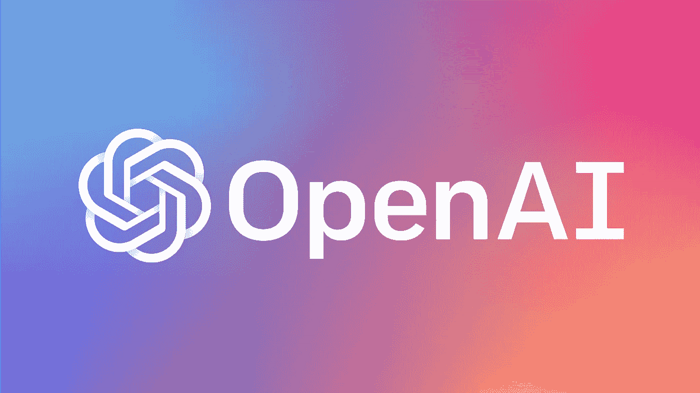

# GPT-3 概述:未来的人工智能

> 原文：<https://medium.com/analytics-vidhya/a-simple-explanation-of-gpt-3-571aca61208c?source=collection_archive---------10----------------------->

照片由 [Unsplash](https://unsplash.com?utm_source=medium&utm_medium=referral) 上的 [Azharul Islam](https://unsplash.com/@azhar93?utm_source=medium&utm_medium=referral) 拍摄

我最近注意到在我的推特时间线上到处都是关于 [OpenAI 的](https://openai.com/) GPT-3 的非常酷的推文。GPT TLDR-3 是开创性的基于变形金刚的人工智能模型的下一个迭代，它用来自互联网各地的文本进行训练，你可以在这里找到完整的论文。我花了整整一个晚上通读它，它令人着迷，提出了许多关于人工智能模型及其能力的未来的问题。

还可以看看谢里夫·沙米姆的推文——它们令人兴奋不已！他创建了一个 [GPT-3 代码生成器](https://debuild.co/)，任何用户都可以描述他们想要构建什么样的应用，GPT-3 为其生成代码。Sharif 通过展示 GPT 3 如何创建 UI 组件并为全功能应用程序生成实际代码，虚拟化了它的一些功能。但是这些是精选的例子，还是它们准确地代表了 GPT-3 的能力？更紧迫的是，GPT 3 号正在可靠地编码吗？

文本生成模型是如何工作的？前提很简单。

1.  处理从提示符给出的输入。
2.  使用训练数据，预测下一个文本块。
3.  从包含最新位的文本聚合块中，做出另一个预测。
4.  重复步骤 3，直到达到所需的文本长度。

这个过程适用于多种语言，甚至是*编程语言*，这就是为什么 GPT-3 知道如何生成代码。

**关键想法**

如果你熟悉机器学习，你可能听说过传统的微调。这是使用大量示例任务通过重复梯度更新*来训练模型的地方。请注意，这不是 GPT-3 的学习方式。因为它是在大规模语料库(基本上是整个互联网)上训练的， **GPT-3 是一个少量学习者**，不需要被灌输许多示例任务。假设 GPT-3 可以从其训练数据中提取模式并建立联系。以下是本文评估 GPT-3 的三种设置:*

让我们回顾一下 GPT 的前任 GPT-2。在发布时，GPT-2 是其前身的大规模升级版本，输入参数比最初的 GPT 增加了 10 倍。

人工智能研究实验室

当建立这样的人工智能模型时，一个重要的问题是**收益递减**——也就是说，你不能简单地永远扩大模型。在某种程度上，模型的某些因素将趋于平稳，无论是生成的信息、数据集大小、训练机制等。然而，在 GPT-2 的水平上，没有迹象表明已经达到这一稳定水平。因此,“更大更好”的策略继续着，给我们带来了 GPT-3。

下面是 GPT 3 号和它之前的 GPT 2 号的对比:

*   2020 年 5 月发布对比 2019 年 2 月发布(仅一年多一点！)
*   1750 亿个输入参数对 15 亿个输入参数(增加了**117 倍**
*   计算量大，而只能在单台机器上运行

因为 GPT-3 计算量大且成本高，它需要一个分布式集群来运行。它目前作为 OpenAI API 的一部分公开提供，并处于仅限邀请的测试阶段，随后将很快发布一个盈利性版本。疯狂的事情是，图表仍然表明，在 GPT-3 之后还有改进的空间！我们仍然没有达到前面提到的稳定期。

OpenAI 的论文描述了 GPT 3 号可以完成的许多令人难以置信的任务。

**任务:新闻文章生成**

例如，给定一些文本输入，它可以惊人地预测接下来会发生什么。在一项研究中，测试对象被要求区分人类写的 500 字长的文章或 GTP-3 写的文章。当 GPT-3 与 1750 亿个参数一起使用时，他们只能以 52%的比率正确识别来自其他人的文本。这意味着 GPT-3 在最大容量下几乎可以复制人类写的文章！

区分人类和 GPT-3 写作

下面是一篇 GPT-3 生成的文章，人类很难从人类文章中区分出来，准确率只有 12%。

**任务:算术**

GPT 3 并不像算术那样擅长写作……好吧，这是个问题。下图显示了 GPT-3 在位数较少时的表现，“两位数加法的准确率达到 100%，两位数减法的准确率达到 98.9%，三位数加法的准确率达到 80.2%，三位数减法的准确率达到 94.2%。”当位数增加时，它会挣扎，但仍然保持一定程度的准确性，“这表明至少有一些能力概括更多的位数。”(语言模型是很少使用的学习器，OpenAI)

GPT 3 承担算术

与文本不同，算术更多的是一组确定的问题。想想你小时候所有的加减乘除表。如果这些问题是馈入 GPT-3 的训练数据的一部分(例如互联网上某处的一系列算术问题)，模型可以使用它们以直接的方式回答问题，但随着位数的增加，训练数据不太可能包含所有可能的算术问题。一种选择是记住所有这些问题，但这似乎不可行，因为这是对计算和空间的有效利用。那么，这里到底发生了什么来实现这些级别的准确性呢？

言下之意是，GPT-3 正在从其训练数据中建立联系，并从本质上进行学习！OpenAI 的研究人员通过在训练数据的测试集中搜索所有 3 位数的算术问题，抽查了人工智能是否正在记忆特定的算术问题:“在 2000 个加法问题中，我们只找到了 17 个匹配项(0.8%)，在 2000 个减法问题中，我们只找到了 2 个匹配项(0.1%)，这表明只有一小部分正确答案可能被记住了。”此外，在检查错误时，似乎该模型犯了类似人类的错误，例如忘记携带“1”，这表明该模型实际上*正在*尝试学习！*插入心智成熟的表情符号*(语言模型是一次性学习工具，OpenAI)

**任务:用造词造句**

我最喜欢的一项研究是，研究人员为模型引入造词，并要求它用新词造句。这里有一个任务的例子，要求模型用“yalubalu”造一个句子:

这是作为输入输入的

> “yalubalu”是一种看起来像大南瓜的蔬菜。使用单词 yalubalu 的句子的一个例子是:

模型对此做出了响应

> 我去非洲旅行的时候，尝了尝这种生长在那里一个花园里的蔬菜。味道很好。

这句话不仅有意义，而且 GPT-3 还为它添加了上下文(非洲之旅)!这项任务的其他输出显示，该模型甚至可以结合新词并以适当的语法使用它们，这表明 GPT-3 至少在这项任务中是熟练的。

**其他**

还有一些额外的研究，我在这篇文章中没有提到，但我建议也阅读一下！

但是当然，这种模式也有缺点。本文开头提到的沙里夫的演示令人惊叹，但并不一定准确地描绘了 GPT-3。我相信 Twitter 上的大肆宣传表明了对 GPT-3 *和*工作良好的例子的选择偏见，但还有同样多(如果不是更多)的例子没有被报道。

最明显的弱点是 GPT-3 的**高延迟**，正如 1750 亿参数模型所预期的那样。当您向 GPT-3 提供输入时，可能需要大量时间来生成输出。当在需要快速响应的环境中使用时，这可能会导致糟糕的用户体验。

GPT-3 需要**强大的基础设施**，很难用自己的数据定制或训练。使用 beta 版本的人群很可能都使用 OpenAI 提供的相同版本的模型。

像许多神经网络一样，GPT-3 是一个**黑盒**，用户并不真正理解它为什么做出某些决定。我们只能观察输入和输出，这限制了我们更好地理解它的内部工作。

归根结底，GPT-3 是一个令人印象深刻的人工智能模型，它的预测基于数量多得离谱的训练数据，甚至没有针对特定任务进行微调。然而，它不是魔法，也不会引发一场人工智能革命。人工智能模型即服务产品仍然有许多典型的问题和缺点。GPT-3 无疑是人工智能研究的一个飞跃，但也有缺点，如高延迟(当 API 公开发布时，可能成本也很高)和黑盒特性等问题。我们还有很多事情要弄清楚，但我们正朝着正确的方向前进。

有趣的事实:GPT-3 是根据 2019 年 10 月的测试数据进行训练的，所以它不知道新冠肺炎或 2020 年发生的所有混乱。多美好的时光。

**其他酷读**

 [## 与 GPT 的对话-3

### 我花了太多时间玩 OpenAI 的 GPT 3 测试版 API。这种语言给我留下了深刻的印象…

medium.com](/@kirkouimet/my-mind-blowing-conversations-openais-latest-ai-gpt-3-235ba5fb9453)  [## 让我们来谈谈 GPT-3 的人工智能推文，它从根本上震撼了设计师

### 拥抱人工智能和自动化

uxdesign.cc](https://uxdesign.cc/lets-talk-about-that-gpt-3-ai-tweet-that-shook-designers-to-the-core-d2b31ad3d63b)