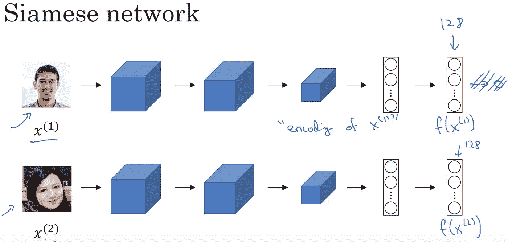
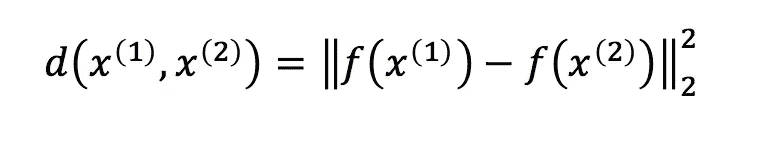
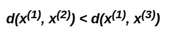
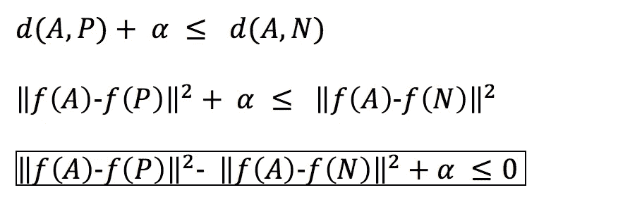
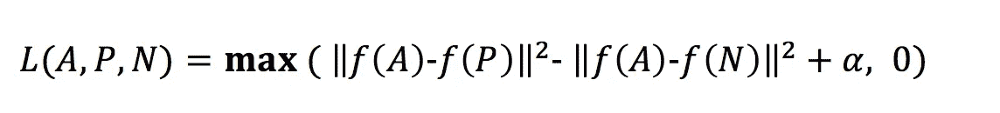

# 基于 Keras 和 OpenCV 的简单人脸验证系统

> 原文：<https://medium.com/analytics-vidhya/a-simple-face-verification-system-using-keras-and-opencv-894495bcf202?source=collection_archive---------4----------------------->

你肯定遇到过“人脸验证”这个术语，或者可能遇到过使用这种新技术的系统。但是，有没有想过在这些奇妙的系统里发生了什么？好吧，让我来谈谈这个想法。

你一定见过生物计量系统，它捕捉人们的照片，并试图确定他们是否属于预先定义的一组人。这样一个系统所做的是试图找到一个匹配的人，他的脸被捕获，和一个人已经存在于它的数据库中作为一个授权用户。

## **什么是人脸验证？**

它可以被认为是一个分类问题，其中使用匹配分数来验证人的身份。因此，如果两幅图像是同一个人的，则它们应该具有高匹配分数，如果两幅图像是两个不同的人的，则匹配应该较低。

你可能想到的第一件事是，为什么不将捕捉到的图片与另一张图片**逐像素匹配**？如果捕获图像的像素值和另一个图像的像素值之间的距离(均方或绝对)很小，则它们一定对应于同一个人。但是由于即使光线、位置或方向有微小的变化，图像中的像素值也会发生显著的变化，所以这种方法可能不会，事实上也不会很好地工作。

那么，我们现在做什么？这就是卷积神经网络，更好地称为 CNN，帮助我们的地方。这种网络可以帮助我们通过将每个图像嵌入到 d 维向量空间中来更好地表示图像。然后评估图像嵌入的相似性。

## 解决这个问题的一些方法

1.  **样本支持向量机:**这里的想法是为训练集中的每个样本训练一个线性 [SVM 分类器](/machine-learning-101/chapter-2-svm-support-vector-machine-theory-f0812effc72)，这样在每种情况下，我们都以一个正面实例和许多负面实例结束。要了解更多关于样本支持向量机的信息，请参考[本](https://www.cs.cmu.edu/~tmalisie/projects/iccv11/)。
2.  **DeepID:** 在这里，验证的任务被认为是人脸识别的子问题(给每个人分配一个标签)。这是基于这样的想法，即训练一个神经网络来解决更困难的识别问题，原则上可以给出非常好的验证描述符。据观察，这是为了学习考虑人脸的多个视图的特征变换。要了解更多关于 DeepID 的信息，请参考[本](http://mmlab.ie.cuhk.edu.hk/pdf/YiSun_CVPR14.pdf)。
3.  **暹罗网:**这是基于个人内部距离应该比人际距离小很多的想法。这就是我们在这里详细讨论的方法。

在深入研究连体网络之前，让我们首先讨论一个非常重要的概念，连体网络是基于。这就是一次性学习。

**一次性学习**是一个对象分类问题，主要出现在计算机视觉中，它试图从一个或几个训练样本中学习关于对象类别的信息。通常，在深度学习中，我们需要大量的数据，并且我们可以访问的数据越多越好。但在人脸验证的情况下，在学习实际开始之前，不太可能获得一个人的数千张图像。其次，我们的大脑不需要成千上万张一个人的照片来识别他/她。因此，使用大脑建模的深度学习和神经网络也应该不需要大量的例子来完成任务。

对于人脸验证任务，我们期望系统能够从单张/几张图像中判断一个人的身份。

正如我前面提到的，CNN 有助于图像的矢量化表示。但是 CNN 确实需要大量的例子来训练。此外，每次在数据库中添加一个新人的图像时训练一个模型是不方便的。那么，为什么不建立一个模型来学习两个不同的人之间的距离，同时相似地表现同一个人的两个图像。这正是暹罗网络所做的。

图片来源:[deep learning . ai 的卷积神经网络](https://www.youtube.com/watch?v=6jfw8MuKwpI)

图像 x(1)被馈送到 CNN，由[卷积层](https://machinelearningmastery.com/convolutional-layers-for-deep-learning-neural-networks/)和[全连接层](https://leonardoaraujosantos.gitbooks.io/artificial-inteligence/fc_layer.html)组成。卷积层提供了一个有意义的、低维的、稍微不变的特征空间，而附加到卷积层的全连接层在该空间中学习一个函数(主要是非线性的)。我们最终得到的是一个特征向量(没有 softmax 激活被添加到特征向量，因为它在这个阶段不会被用于分类)。图像 x(2)被传送到与上图完全相同的 CNN。在我们的例子中，我们有第三个图像 x(3)提供给同一个 CNN。

我们选择 x(1)作为我的锚点图像，x(2)作为我的正面图像，x(3)作为负面图像。锚和正图像属于同一个人，而负图像是其他人的。因此，我们的目标将是最小化正图像和锚之间的距离，同时最大化锚和负图像之间的距离。

d 是距离函数，a 的平方 [L2 范数](http://mathworld.wolfram.com/L2-Norm.html)。

目标可以写成:

然而，这有可能为正图像和负图像学习相同的(或几乎相同的)编码，这确实可以满足上面的等式。这就是为什么我们需要增加一个小的 margin alpha(一个超参数)来保证 d(x(1)，x(2))和 d(x(1)，x(3))之间总有一些空隙。

对方程式所做的修改。这里 A=x(1)，P=x(2)，N=x(3)

现在，我们如何把它框定为损失函数。

这就是所谓的 [**三重态损失函数**](https://en.wikipedia.org/wiki/Triplet_loss) 。如我们所见，这个损失函数确保 max 函数中的第一项不超过 0，否则会导致误差。

好了，现在我们深入研究了很多理论。

让我们看看期待已久的代码。

# 代码

## 创建数据

这是创建数据集的代码。它使用一个预先训练好的分类器，称为[哈尔正面人脸分类器](https://docs.opencv.org/trunk/db/d28/tutorial_cascade_classifier.html)，以级联方式识别人脸。下面的代码存储了使用网络摄像头拍摄的 20 张人脸图像，并将其存储在文件夹< username >中。此类文件夹存储在*数据集*文件夹中。

文件的链接可以在[这里](https://github.com/Debapriya-Tula/Face-Verification/blob/master/create_data.py)找到

## 创建模型并对其进行训练

在创建数据集时，您可以看到我已经用一些值填充了现有的图像(这里宽度方向为 22，高度方向为 12)。这是因为我使用了在 ImageNet 数据集上预训练的 VGG16 模型，该数据集期望输入图像具有维度(224，224，3)，并且我使用的数据集对于每个图像具有维度(200，180，3)。

三元组被形成并存储在*三元组*列表中(在下面附加的代码中)。对于每个人(由数据集*文件夹*中的文件夹标识的人)，我们存储 5 个三元组(A，P，N)。然后在模型上对它们进行训练，该模型本身由三个 VGG16 模型组成，通过实现三重损失函数的 Lambda 层连接。

代码非常直观，易于理解。

> 为了训练由大约 420，000，000 个参数组成的模型，使用了英特尔的 dev cloud**I**[**，它为您提供了 **200 GBs** 的存储和 **RAM** 的高达 **92 GBs** 。其次，针对 Tensorflow、Pytorch、Caffe 等框架进行优化。我花了大约 3-4 个小时来训练我的网络，然后我将它存储在“model.h5”中。**](https://software.intel.com/en-us/devcloud)

该文件的链接可以在[这里](https://github.com/Debapriya-Tula/Face-Verification/blob/master/Siamese_train_store.ipynb)找到

## 使用模型进行验证

*detect_face* 功能接收图像， *img* (使用网络摄像头捕捉的人物图像)找到人脸并将其裁剪出来。用户还在验证他/她的面部时输入用户名。然后，现在裁剪的面被验证如下:

a)我们在我们的*数据集*文件夹中找到名为<username>的文件夹。我们从该文件夹中选择一幅图像。</username>

b)我们随机选择其他三个文件夹，并从每个文件夹中选择一张图片。这些将作为负像。

c)我们找到每个图像的编码，一个由 *detect_face* 返回，一个从步骤 a)找到，三个从步骤 b)找到。

d)我们发现从步骤 a)和 b)获得的每个图像的编码的均方误差与由 *detect_face* 返回的图像的均方误差。

e)如果从步骤 b)获得的任何图像具有比从步骤 a)获得的图像更小的误差，则我们说该人被授权，否则不被授权。

文件的链接可以在这里找到

这就是我们如何实现一个简单的人脸识别工具。上述实现的代码可以在这里找到。

 [## 德巴普里亚-图拉/面部验证

github.com](https://github.com/Debapriya-Tula/Face-Verification) 

这篇博文是英特尔学生大使竞赛的一部分。

## 参考资料:

 [## 一次性学习-特殊应用:人脸识别和神经类型转移

### deeplearning.ai 为课程“卷积神经网络”创建的视频。了解 CNN 如何应用于…

www.coursera.org](https://www.coursera.org/learn/convolutional-neural-networks/lecture/gjckG/one-shot-learning)  [## FaceNet:人脸识别和聚类的统一嵌入

### 尽管最近在人脸识别领域取得了重大进展，但实现人脸验证和识别…

arxiv.org](https://arxiv.org/abs/1503.03832)  [## DeepID

### 假设我们想实现一个生物识别系统，在这个系统中，给定一张…

Joao Lula . github . io](https://joaoloula.github.io/face-verification.html)  [## 人脸识别:学习从零开始创建人脸识别系统

### 人工智能正在彻底改变世界。人脸识别就是其中之一。让我们了解一下这些系统是如何学习的…

medium.com](/datadriveninvestor/face-recognition-929464856b86)