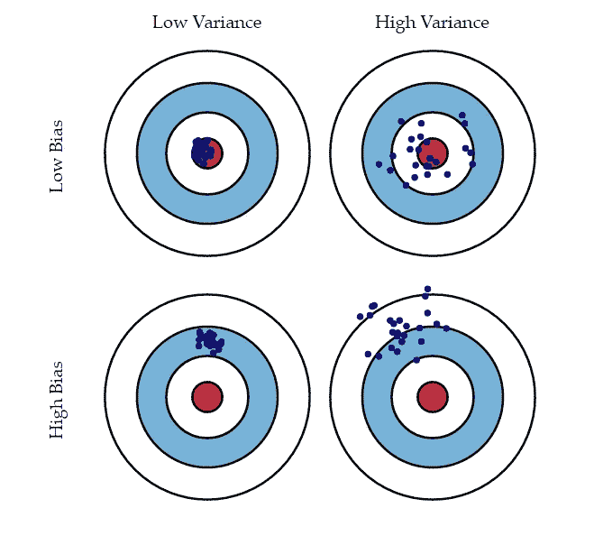
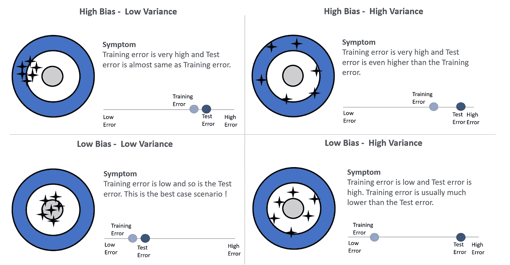
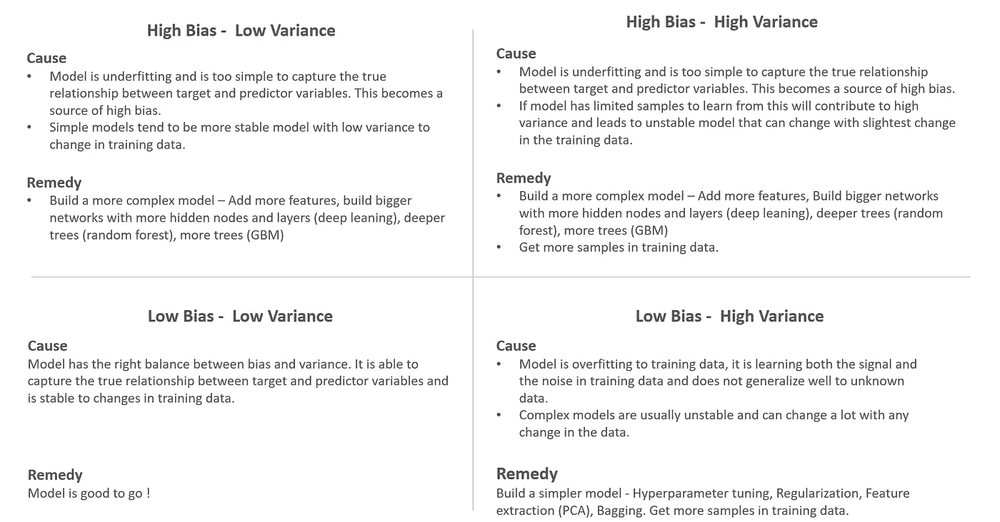
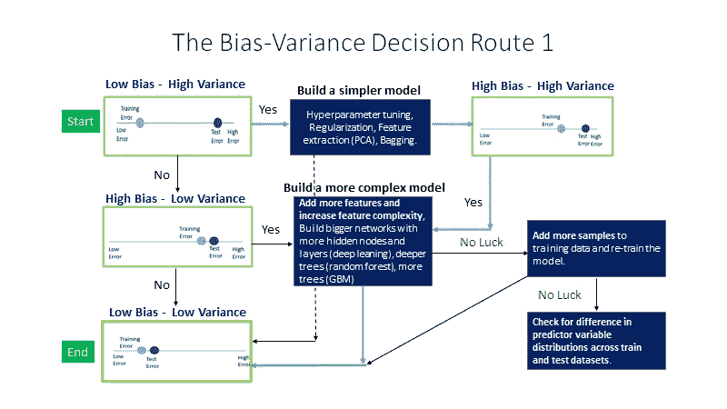
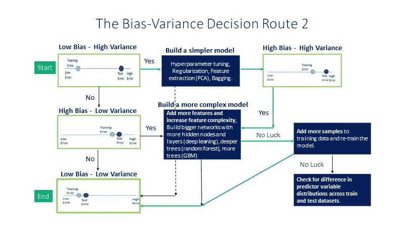
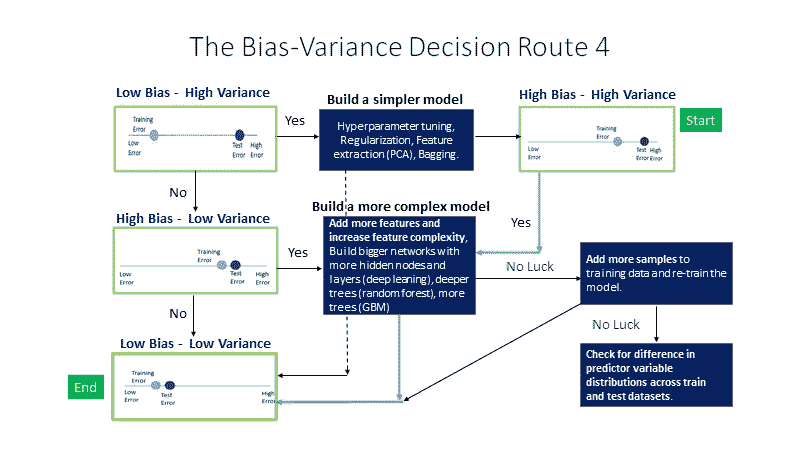
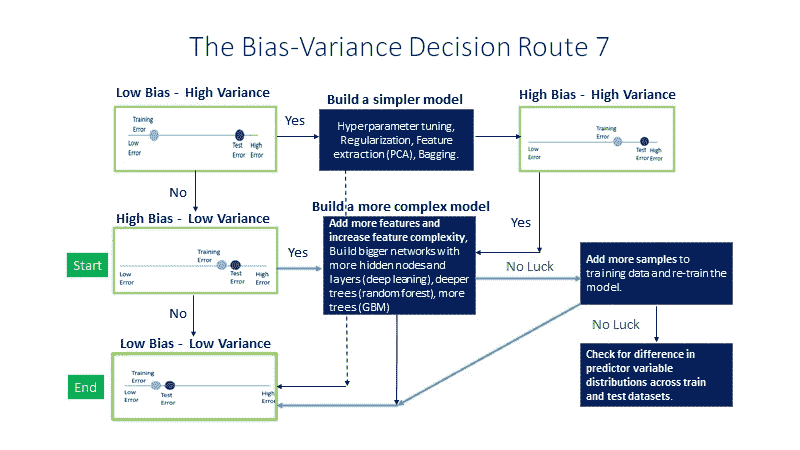

# 偏差-方差权衡的简单指南—第 1 部分

> 原文：<https://medium.com/analytics-vidhya/a-simple-guide-to-bias-variance-trade-off-part-1-2418229c78e0?source=collection_archive---------15----------------------->

## 快速更新模型构建中偏差-方差权衡的主要概念。

上图显示了偏差方差混合的 4 种情况，这在试图解释偏差方差权衡时非常常见。

# 但是什么是偏差和方差呢？

一个好模型的目标是具有低偏差和低方差。如果我们能够知道我们的模型受到哪种情况的影响，那么我们就可以应用适当的解决方案来达到低偏差和低方差象限。

对这些概念的解释通常是高度技术性的，但在这里我们将只坚持直觉。

B **ias** 量化目标变量和预测变量之间的**平均模型拟合**与目标变量和预测变量之间的**真实关系**之间的差距。

这就是为什么缺少模型的重要特征或考虑功能简单的模型通常会导致高偏差模型，因为**平均模型**拟合最终与真实关系不同。这也被称为**欠装配。**

**平均模型拟合度** —如果我们从所有观察值的总体中抽取大量训练样本(让这个数字用 S 表示)并获得每个训练样本的模型拟合度，我们将获得总体中每个观察值的 S 个模型拟合度和 S 个拟合值。S 拟合值的平均值称为平均模型拟合。

V 因此，如果模型拟合度在训练样本的平均模型拟合度**附近变化很大，这表明我们有一个高方差模型。**

复杂的模型，尤其是小样本的模型，通常会导致高方差模型。这也被称为**过度配合**。

# 症状和补救措施

**在构建机器学习模型时，我们将无法计算偏差和方差值来诊断我们属于哪个象限**。我们只能通过分析我们的模型训练和测试错误来检测这一点。

> 在构建机器学习模型时，让我们试着理解以下 4 种场景中的每一种:
> 
> 1.检测每个场景的症状是什么？
> 
> 2.是什么原因造成的，解决方法是什么？

# 症状

# 原因和补救措施

# 偏差-方差权衡决策路线

在我们建立的第一个模型和最终模型之间，我们遍历不同的决策路线，直到我们在偏差和方差之间达到正确的平衡。

下面是从**低偏差-高方差到低偏差-低方差的不同偏差-方差权衡路线:**

下面是从**高偏差-高方差到低偏差-低方差的不同偏差-方差权衡路线:**

以下是从**高偏差-低方差到低偏差-低方差的不同偏差-方差权衡路线:**

这就是第 1 部分的全部内容。在本文的下一部分，我们将探讨训练误差、测试误差和模型复杂性、训练样本大小之间的关系。

# **感谢您阅读本文！**

## 参考资料:

1.  [Coursera 上华盛顿大学机器学习专业的回归课程。](https://www.coursera.org/learn/ml-regression)
2.  [了解偏差-方差权衡](http://scott.fortmann-roe.com/docs/BiasVariance.html)
3.  [第 12 讲:偏差-方差权衡](https://www.cs.cornell.edu/courses/cs4780/2018fa/lectures/lecturenote12.html)