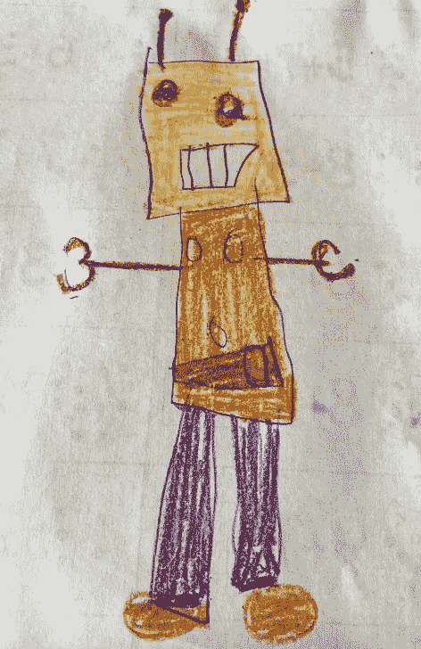
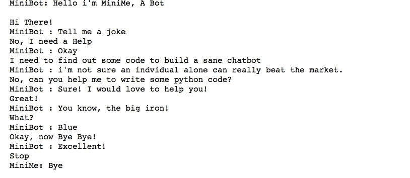

# 使用 Python 构建第一个聊天机器人的简单指南

> 原文：<https://medium.com/analytics-vidhya/a-simple-guide-to-build-your-first-chatbot-using-python-f70bfba051a?source=collection_archive---------29----------------------->



你见过聊天机器人或聊天机器人吗？当然，你有！如今到处都是。我遇到过讨厌的，聪明的，甚至善良的。所以，让我们从头开始，从那里一步一步地建立一个简单的愚蠢的。

# 什么是聊天机器人？

我是这样定义的:

> *A* ***聊天机器人*** *是一种无人化的解决方案，用于回答问题或解决投诉或与品牌沟通，或者只是一个没有身体的私人助理。*

wiki 是这样定义的:

> *一个* ***聊天机器人*** *是一个软件应用程序，用于通过文本或文本到语音进行在线聊天对话，代替提供与真人代理的直接联系。*

因此，结合我个人的想法和维基的见解，我们可以说聊天机器人是一个由人工智能驱动的软件程序，其目的是通过文本或语音与用户进行对话。

# 它是如何工作的？

聊天机器人被训练来回答用自然语言向它提出的问题，并像真人一样做出反应。现在，大多数组织都有一个聊天机器人来维护以前讨论的日志。然后开发人员使用这些日志来分析客户想要问什么。使用机器学习工具和模型，然后开发人员组织客户查询，并以最合适的答案进行回复。

因此，当聊天机器人被问到一个问题时，它会根据当时可用的知识数据库做出回应。现在，如果对话引入了一个新概念或一个新问题呢？这就是我称聊天机器人为聪明机器人或愚蠢机器人的地方，这就是编程的美妙之处。

有时，它们被编程为转移话题，或者潜在地将通信传递给人类操作员，或者回答一些机智的问题。无论哪种方式，它都将从那次交互中学习类似的未来交互。因此，聊天机器人将逐渐扩大范围，并从以前的经验中学习，从而获得相关性。

# 用在什么地方？

我 5 岁的女儿和 Alexa 聊了很多。一个简单的对话是这样的:

艾丽克丝，你今天感觉怎么样？

我感觉自己像个巫师。如果你想挑战，问我一个小测验。

这是个聪明的回答，对吧？我很喜欢听他们的对话，我女儿认为一位甜美善良的女士真的在听她说话并回答她所有的问题。

除了 Alexa 和 Siri，聊天机器人还广泛用于客户协助。当你打开一个网站，下面会弹出一个聊天窗口，上面写着“你好！今天我能为你做些什么？”尽管看起来你在和一个真人交谈，但在大多数情况下，它是一个聊天机器人。

现在，关于聊天机器人的定义和故事已经足够了。让我们写一些代码。

# 建立你自己的第一个傻瓜聊天机器人

让我们按照这一步一步的方法，建立我们自己的简单聊天机器人。随着时间的推移，我们将尽力随机应变。

## 安装库

```
pip install chatterbot
```

所以，我开始安装“聊天机器人”库，但在第一步就被卡住了。我得到一个如下所示的错误:

*错误:无法卸载“PyYAML”。这是一个 distutils 安装的项目，因此我们不能准确地确定哪些文件属于它，这将导致只有部分卸载。*

经过一些挖掘，下面的工作区对我来说很好。

```
pip install chatterbot==1.0.4
python -m chatterbot --version
```

## 导入库

```
from chatterbot import ChatBot
from chatterbot.trainers import ListTrainer
from chatterbot.trainers import ChatterBotCorpusTrainer
Hide warnings
import warnings
warnings.filterwarnings('ignore')
```

## 用语料库数据训练聊天机器人

ChatterBot 附带了一个语料库数据和实用程序模块，可以轻松训练机器人进行交流。我想用英语训练我的聊天机器人。

## 和我的第一个聊天机器人聊天

好了，我的第一个聊天机器人已经准备好接受训练了。所以，我们调用上面的函数来训练我的名为“MiniMe”的聊天机器人，我们来聊聊吧！

嗯，我真的很惭愧分享我和我的迷你米的第一次谈话。我需要在这方面多下功夫。但是，它让我今天笑了。这就是为什么我分享它是为了开怀大笑。



这有什么意义吗？不要！但是它在和我说话，这就是我今天的计划。此外，我有一系列更愚蠢的对话，这真的很有趣。哦！我不能停止和 MiniMe 聊天！

顺便说一句，如果上面的任何代码对你不起作用，你可以在我的 [Github](https://github.com/Oindrila-Sen/Python-Projects/tree/master/ChatBots) 中检查我的 Jupyter 笔记本。

现在，我要去我的聊天机器人了。分享一下你们的第一次对话，让我们一起笑一笑。

继续编码，继续享受乐趣，继续阅读。

谢谢大家！

十年收集、清理和可视化数据的经验。但是现在我正在学习和实践新的工具和不同的技术。让我们挖掘一下，看看那些数据背后有什么故事。让我们一起做吧！让我们解决，失败，然后再试一次，因为发现新事物总是有趣的。

*原载于 2020 年 6 月 25 日 https://oindrilasen.com*[](https://oindrilasen.com/2020/06/a-simple-guide-to-build-your-first-chatbot-using-python/)**。**