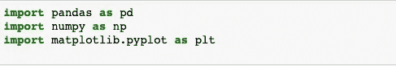

# Python 数据可视化简单指南

> 原文：<https://medium.com/analytics-vidhya/a-simple-guide-to-data-visualization-with-python-part-1-49c88c3a5ac?source=collection_archive---------14----------------------->

## 第 1 部分:基本情节及其定制

> 任何数据科学项目都涉及一系列步骤来执行某些任务，以便从数据中提取有意义的信息来提供商业价值。下图描述了数据科学项目团队中负责执行这些特定步骤的各种角色。可视化是指以图形形式表示数据。数据可视化是任何数据科学项目的一个重要方面。

Python 有两个用于创建可视化的流行库，即 Matplotlib 和 Sea-born。在这篇文章中，我将讨论一些可以使用 Matplotlib 库创建的基本绘图，在这篇文章的最后，我将讨论一些使用 Matplotlib 的图形定制技术。

所以让我们开始吧…

在我们开始编写任何 Python 代码之前，我们必须进行一些必要的导入…

既然我们现在有了导入，我们就可以用 Python 导入数据集了。

在上面的代码中， **read_csv** 是一个读取任意**的 Python 函数。csv** 文件和**数据**是存储文件数据的 Python 数据帧。

现在让我们检查一下，我们的数据集实际上包含了什么。为此，让我们使用 Python 的 **head** 函数打印出数据集的前 5 行:

这主要是一个干净的数据集，但可能涉及一些其他的数据预处理步骤，但这不是本文的重点。现在让我们开始使用 Python 的 Matplotlib 库中的一些图来可视化这些数据。

# **散点图 **

> 散点图将数据显示为点的集合，是用于检测数据中异常值(即数据中的异常观察值)的图之一。由观察数据的个人来定义他/她认为的异常观察。

让我们来看看这个函数的参数:

**x** —在 x 轴上绘制的变量/尺寸

**y** —绘制在 y 轴上的变量/尺寸

**数据**-数据集导入到的 Python 数据框。

散布函数中有许多其他参数可用于自定义图。但是在我们进入下一个图之前，让我们设置 x 和 y 轴的标签。下面这几行代码将帮助我们实现这一目标..

上面的可视化展示了**评论/月**和**评论总数**之间的散点图。

现在，我们将进入下一个图表——直方图。

# ***直方图***

> 直方图用于可视化数据中某些变量的频率。这是另一个常用于检测数据异常值的图。

首先，我们将改变 x 和 y 轴的范围，以便我们能够更好地可视化绘图..这几行代码将允许我们更改轴的范围并绘制直方图。

**xlim** 函数取下 x 值和上 x 值设置为 x 轴的范围，同样， **ylim** 函数取下 y 值和上 y 值设置为 y 轴的范围。

hist Matplotlib 函数允许我们创建一个直方图，我们有各种选项来定制这个图。同样，如上所述，我们为 x 和 y 轴设置标签。

这个直方图为我们提供了变量**最小夜数**的频率。

# ***条形图***

> 条形图使用矩形条来表示分类数据。这些矩形条的高度与它们所代表的值成比例。

下面是一些创建条形图的 python 代码..

让我们回顾一下上面的代码:

**人物** —由三个不同人物的名字组成的 python 列表。

**Heights** —同样，这是一个 python 列表，由人的数字高度组成，构成矩形条的高度。

bar 函数允许我们用 python 创建条形图。

# ***线图***

> 折线图将数据显示为由线段连接的一系列点。我们可以绘制任意两个数值变量来创建一个折线图。下面是一些创建折线图的 python 代码..

xcoord 和 ycoord 都是数字 python 列表。**绘图**功能用于创建折线图。

# ***箱形图/须状图***

> 最常用于检测数据中异常值的图是箱线图，也称为须线图。它用于绘制数字数据组，由三个四分位数组成——Q1(下四分位数——代表 25%的数据)、Q2(中值——代表 50%的数据)和 Q3(上四分位数——代表 75%的数据)。

它被称为'**盒式图'**，因为数据和三个四分位数被表示在一个盒子里。从盒子两端延伸出来的两条垂直线被称为胡须，因此它的名字为'**胡须图**'。

位于两个须外部的点被认为是“**异常值**”。这几行代码将创建一个方框图。

在 python 中创建箱线图的函数是 **boxplot** ，这里我们将一个 python 列表作为参数传递给它。从上图可以看出，值为 10000 的数据点将被视为异常值。

# ***一些定制技巧***

有许多方法可以定制我们的 Python 图。我将在本节中讨论其中的一些..

假设我们要绘制散点图和直方图，但不是在同一轴范围内。下面的代码将帮助我们实现这一点..

既然我们现在有了想要的输出，现在让我们回顾一下上面的代码。

**axes** 函数采用一个 python 列表，包含以下四个参数:

**第一个参数** —轴的下 x 值。

**第二参数** —轴的 y 值下限。

**第三个参数** —轴的宽度。

**第四个参数** —轴的高度。

并且所使用的其余函数如以上章节中所讨论的。

另一个采用 python 元组并可用于设置 x 和 y 轴的最小和最大范围的函数是 ***plt.axis( (min。最大 x 值。x 值，最小值。最大 y 值。y 值))***

**每次手动指定轴的参数是大量的手动任务😒不是吗？？**

不在话下😊Python 为我们提供了另一种选择..下面我们来看看:

python **支线剧情**函数来拯救我们了…

这是代码..

subplot 函数基本上创建一个**网格**并接受 3 个参数:

**第一个参数** —网格中的行数

**第二个参数** —网格中的列数

**第三个参数** —要剧情的支线剧情的序号。(编号从网格的左上角开始)

因此， ***plt.subplot(2，1，1)*** 语句创建网格中的第一个子 plot。

最后一个语句***PLT . tight _ layout()***语句确保绘图之间保持一致的间距。

现在，假设我们想给直方图一个颜色**和一个图例**和一个图例，指定这些语句将有助于我们做到这一点..

hist 功能中的 ***颜色*** 参数允许我们指定颜色，而 ***标签*** 参数允许我们指定图例的文本。

要指定图例在图形中的位置，我们可以使用 ***图例*** 功能和 ***loc*** 参数。loc 参数可以取各种值，如 ***右上、右下、左上*** 等等…

最后，为了保存我们的 Python 绘图，我们可以使用 ***plt.savefig("完整路径")*** *函数* ***，*** *将绘图保存为图像。*

***最后一个注意事项* —一些 python 编辑器要求我们显式地指定一个调用来显示 Matplotlib 函数，以使我们的图可见，因此，如果您正在使用任何编辑器，而您在编写代码后无法查看您的图，请指定 plt.show()语句。**

这就是这篇文章的全部内容。在下一篇文章中，我们将看到如何使用 Matplotlib 创建一些高级绘图，以及如何使用 Python 的海生库创建一些交互式可视化..