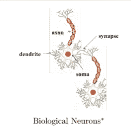
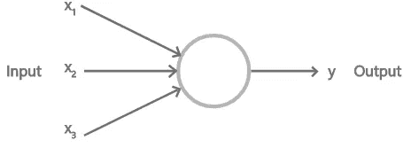
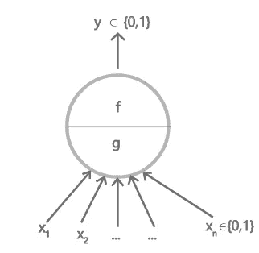
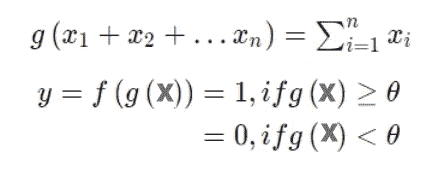
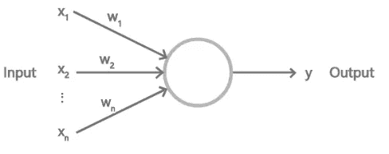
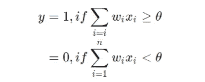
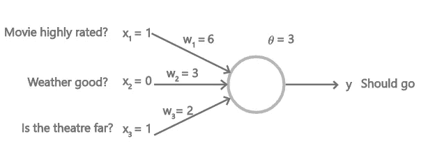
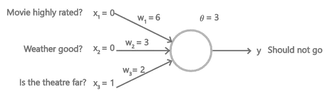

# 深度学习主题的简单指南— 1(神经元、麦卡洛克坑神经元、感知器)

> 原文：<https://medium.com/analytics-vidhya/a-simple-guide-to-deep-learning-topics-1-neuron-macculloch-pits-neuron-perceptron-bef18eded324?source=collection_archive---------20----------------------->

## 初学者的去处，了解核心深度学习主题的概述。

在当前时代见证大量关于深度学习的文章并不奇怪。深度学习是人工智能的一部分，目前正被用于提供图像识别、语音识别等领域的最佳解决方案。本系列侧重于以有序的方式简要介绍深度学习的主题，供该领域的初学者或只是为了牢固理解核心基本原则而了解深度学习基础的人使用。

戴维·范·迪克在 [Unsplash](https://unsplash.com?utm_source=medium&utm_medium=referral) 上拍摄的照片

在开始之前，我们首先需要了解神经网络。受人类生物神经元功能的启发，神经网络是有史以来最令人惊叹的编程范例之一。与传统的编程方法不同，在传统的编程方法中，我们习惯于定义问题的静态解决方案并将其输入计算机，神经网络会查看数据，学习并自行找出解决方案。听起来很酷！

但是，直到最近，我们还不知道如何训练神经网络来有效地理解问题。自 2006 年以来，已经发现了许多在这些深度神经网络中进行有效学习的技术。这些技术共同定义了深度学习。目前，深度学习能够解决图像识别、语音识别和文本处理等领域的所有主要问题，并正在被谷歌、脸书和微软等公司大规模使用。

## **生物神经元**

让我们从理解一个生物神经元开始，它看起来像这样。

图片由 CS7015(深度学习)NPTEL 讲座幻灯片提供

一个神经元的**树突**通过**突触——两个神经元之间的交互点**从另一个神经元获得信号。**细胞体**处理信息，而**轴突**传递神经元的输出。

我们的感觉器官向神经元输入信息，并产生适当的反应。例如，当你触摸非常热的东西时，这一信息被传递到一个巨大的相互连接的神经元平行网络，并产生反应，即移开你的手。

人造神经元。(图片由作者提供)

从中获得灵感后，创造了一个人工神经元，这是一个深度神经网络的最基本单元。人工神经元也像生物神经元一样，接受输入，处理输入并输出。

## **麦卡洛克皮茨神经元**

1943 年，麦卡洛克(神经科学家)和皮茨(逻辑学家)提出了一个非常简单的神经元计算模型。

麦卡洛克·皮茨神经元(图片由作者提供)

这里，g 对所有输入进行聚合。f 给出了一个基于决策的输出。

如果所有输入的总和(由 g 完成)超过一个阈值，f 显示 1，否则输出 0。这个神经元可以用来表示线性可分的布尔函数。

阈值逻辑(图片由作者提供)

## 感知器

由美国心理学家 Frank Rosenblatt 于 1958 年提出，感知机引入了权重以及学习权重的方法。与麦卡洛克·皮茨神经元不同，输入可以是真实值，阈值可以学习，而不是手动编码。

一个基本的感知器(作者图片)

这种计算非常类似于麦卡洛克皮茨神经元的计算，只是现在权重也乘以相应的输入来确定输出。

(图片由作者提供)

感知器允许根据您的需要，通过改变与输入相关的权重值来赋予输入不同的重要性。

让我们用一个例子来理解，你想去看电影，你需要一个感知器来帮助你做决定。你有三个主要问题要问自己——

1.  电影的评分是否超过 8/10。
2.  天气好吗？
3.  电影院远吗？

让这三个成为你决策的输入。电影评分大于 8 可以设置 x1 = 1，天气不好可以设置 x2 = 0，影院远可以设置 x3 = 1。

一个基本的感知器(作者图片)

现在让我们说，你欣赏好的作品，所以不管天气好坏或距离远近，如果电影评价很高，你都会去看。所以你把 w1 设置的比别人高，比如 w1 = 6。为其他值设置较低的值，比如 w2 = 3 和 w3 = 2。现在选择一个阈值，比如说 3。现在如果电影评价很高，x1*w1 = 6。这意味着即使天气不好，电影院很远，你还是会去看电影。

一个基本的感知器(作者图片)

现在考虑电影评级不高的情况，即 x1 = 0。现在一切都取决于天气和距离。如果天气不好，x2 = 0，那么即使剧院在附近，阈值为 3，感知器也会要求你不要去。但是如果阈值是 1，感知器会推荐你去。

这表明，通过改变权重和阈值，您可以创建相应的决策系统。感知器可以根据你的需要自己决定最佳的权重和阈值(例如，通过过去的数据进行训练)。

感知器网络能够解决任何布尔函数。

感谢您的阅读！

如果您有兴趣了解更多这样的核心主题，请随时关注并保持更新。