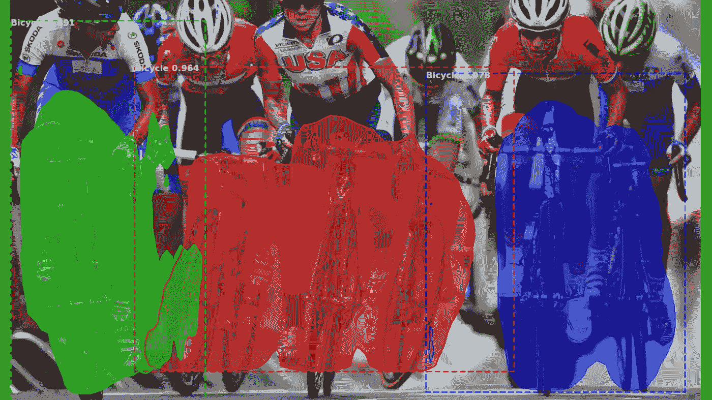
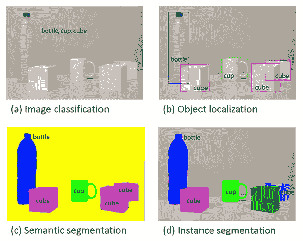
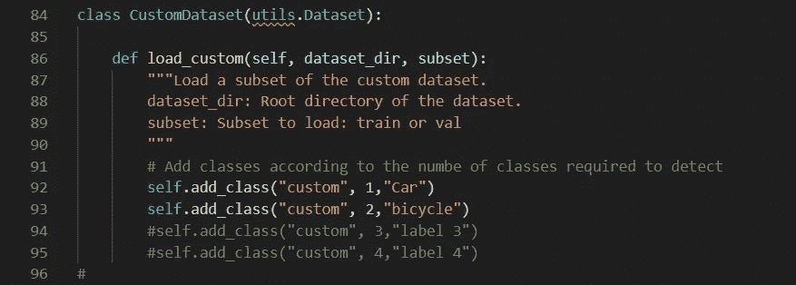
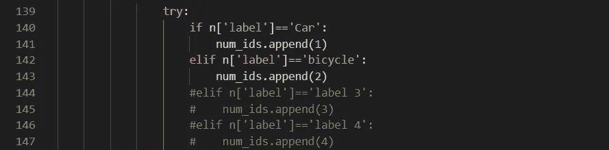
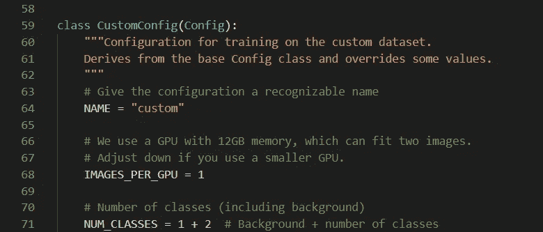
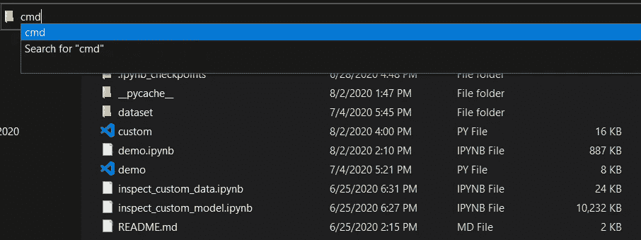
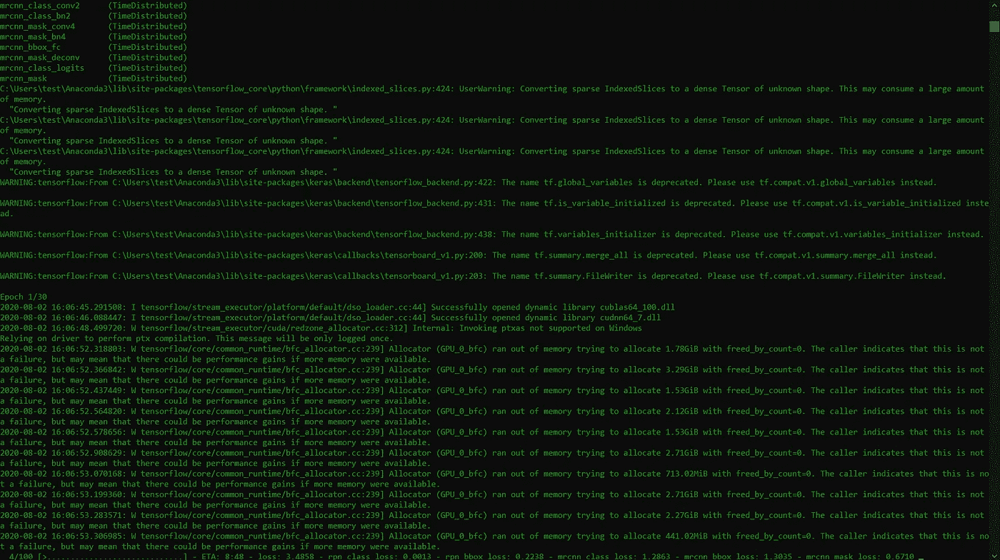
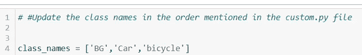
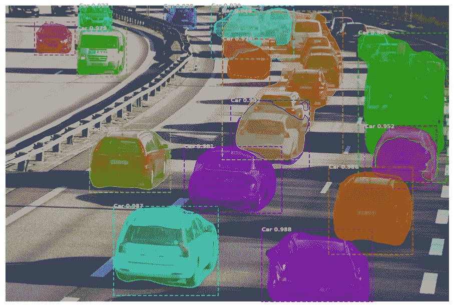

# 在自定义数据集上屏蔽 R-CNN 实现的简单指南。

> 原文：<https://medium.com/analytics-vidhya/a-simple-guide-to-maskrcnn-custom-dataset-implementation-27f7eab381f2?source=collection_archive---------1----------------------->

## 在您自己的数据集上训练多类对象检测模型的分步教程。



**MaskRCNN**输出物体检测结果。([来源](https://i.insider.com/55f212bdbd86ef16008b9942)

在
这篇文章中，我们将简明地理解物体检测的不同方法，然后通过简单的步骤来训练你自己的模型。



**对象定位、语义分割和实例分割的比较**。([来源](https://arxiv.org/abs/1704.06857))

对象检测可以大致分为三大类:
(a)对象定位
(b)语义分割
(c)实例分割

对象定位指的是检测图像中的对象，并进一步为这些对象分配单个边界框。语义分割是最近开发的一种对象检测方法，其中每个像素被分配一个类别。如上图所示，瓶子标有一种颜色，立方体标有另一种颜色。该方法将相似类型的对象归入一个类别。在这一类别中，有各种先进的算法正在开发中。
第三种类型的检测是实例分割，它涉及检测图像中的每个单独对象并为其分配单独的身份。

在这里描述的所有三种方法中，实例分割是计算机视觉领域中最具挑战性的任务。它在自动驾驶和感知领域有着广泛的用途，这使得它更加有趣。

# 代码:

简单介绍了对象检测之后，让我们开始 MaskRCNN 的简单实现。请按照下面提到的**一步一步地执行**程序。

## 步骤 1:克隆存储库。

请复制下面给出的自定义 MaskRCNN 存储库:

[](https://github.com/soumyaiitkgp/Custom_MaskRCNN) [## soumyaitkgp/Custom _ MaskRCNN

### 这是一个基于 Matterport Maskrcnn 知识库的知识库，用于将自定义 Maskrcnn 应用到自定义…

github.com](https://github.com/soumyaiitkgp/Custom_MaskRCNN) 

请确保安装了自述文件中给出的所有依赖项。

## 第二步:准备资料。

使用以下步骤准备数据:

1.将所有图像收集到一个单独的文件夹中，用于培训。
2。将数据集大致分成 90:10 的比例，用于训练和验证
3。将训练图像添加到以下名为“train”的文件夹中

```
D:\..\CustomMask_RCNN\samples\custom\dataset\train
```

4.将训练图像添加到以下名为“val”的文件夹中

```
D:\..\CustomMask_RCNN\samples\custom\dataset\val
```

5.使用图像注释软件注释图像。有许多[工具](https://lionbridge.ai/articles/image-annotation-tools-for-computer-vision/)可用于图像注释。我通常更喜欢 [Makesense.ai](https://www.makesense.ai/) ，因为不需要下载/安装。此外，它不在自己的服务器上存储任何图像。
6。注释后，将文件保存到“train”文件夹中，命名为“annotations.json”。
7。验证图像注释后，将文件以“annotations.json”的名称保存到“val”文件夹

## 第三步:准备模型。

批注后，打开中给出的“custom.py”文件

```
*D:\..\CustomMask_RCNN\samples\custom*
```

现在遵循给定的步骤:

1.  ( **Line 91** )根据你的要求添加类别名称。我在这里使用两个类别来训练我的模型，自行车和汽车。请根据您的需要随时做进一步的更改。 ***记住按照你在注释中提到的方式输入类名(甚至空格)***



**Custom.py 文件。**(图片作者提供)

2.( **Line 140** )以与上一步相同的方式添加分类标签，将标签名称与分类编号对应起来。



**Custom.py 文件。**(图片作者提供)

3.(**第 71 行**)在加号后面加上班级数。例如，这里我的类的数量是 2(汽车和自行车)。



**Custom.py 文件。**(图片作者提供)

## 有了这三个小步骤，你就准备好训练模型了！

## 第四步:训练模型。

如果你是 windows 用户，进入文件浏览器的“自定义”文件夹，在上面的地址栏中输入“ *cmd* ”，然后按回车键，如图所示。



**Custom_MaskRCNN 文件夹下的文件。**(图片作者提供)

打开命令提示符后粘贴以下命令

```
python custom.py train — dataset=D:/../CustomMask_RCNN/samples/custom/dataset — weights=coco
```

**将路径粘贴到'*数据集=* '和' *—权重* '** 之间的数据集，然后按回车键。如果你是第一次训练，那么根据你的网速下载 coco 重量需要一些时间。模型开始训练后，你的屏幕应该是这样的。



**MaksRCNN 培训。**(图片作者提供)

## 第五步:结果

模型训练完成后，通过打开自定义文件夹中的 python 笔记本开始测试。

1.  通过在自定义文件夹的地址栏中键入“jupyter notebook”来打开“demo.ipynb”。
2.  转到主 CustomMask_RCNN 文件夹中的 logs 文件夹，并找到最近的文件夹。文件夹名称应以“自定义”开头，后跟一个唯一的数字。示例-“客户 0001293487”。将最近文件夹的名称更改为“自定义”。
3.  在根目录下的“images”文件夹中插入测试模型所需的图像。
4.  在 4 号单元格中添加你训练你的模型的班级名称。请按照您在“custom.py”文件中输入的顺序添加类名。**不要删除类别“BG”。在它后面添加您的类名，如下所示。**



**阶级名称。**(图片作者提供)

5.运行所有单元格以生成最终输出。



**MaskRCNN**物体检测输出结果。([来源](https://www.motopfohe.bg/en/about-us/news/view/volvo-to-unload-100-self-driving-cars-onto-city-streets-of-gothenburg))

我希望这将被证明是 MaskRCNN 实现的有益指南。我发现的最令人兴奋的事情是它的应用水平，从自动驾驶到农民的杂草检测。

如果你有任何疑问，请在下面留下评论或者去我的知识库提出问题。

**Github 链接:**

[](https://github.com/soumyaiitkgp/Custom_MaskRCNN) [## soumyaitkgp/Custom _ MaskRCNN

### 这是一个基于 Matterport Maskrcnn 知识库的知识库，用于将自定义 Maskrcnn 应用到自定义…

github.com](https://github.com/soumyaiitkgp/Custom_MaskRCNN) 

**参考文献**

[](https://github.com/matterport/Mask_RCNN) [## matterport/Mask_RCNN

### 这是 Mask R-CNN 在 Python 3、Keras 和 TensorFlow 上的实现。该模型生成边界框和…

github.com](https://github.com/matterport/Mask_RCNN) [](https://github.com/matterport/Mask_RCNN/issues/372) [## 气球样本:如果我们想为一个以上的班级进行培训，该怎么办？

### 解散 GitHub 是超过 5000 万开发者的家园，他们一起工作来托管和审查代码，管理项目，以及…

github.com](https://github.com/matterport/Mask_RCNN/issues/372) [](https://github.com/matterport/Mask_RCNN/issues/1006) [## MakRCNN 用多个类实现问题#1006 matterport/Mask_RCNN

### 我的 json 文件看起来像这样…

github.com](https://github.com/matterport/Mask_RCNN/issues/1006) 

# 谢谢大家！